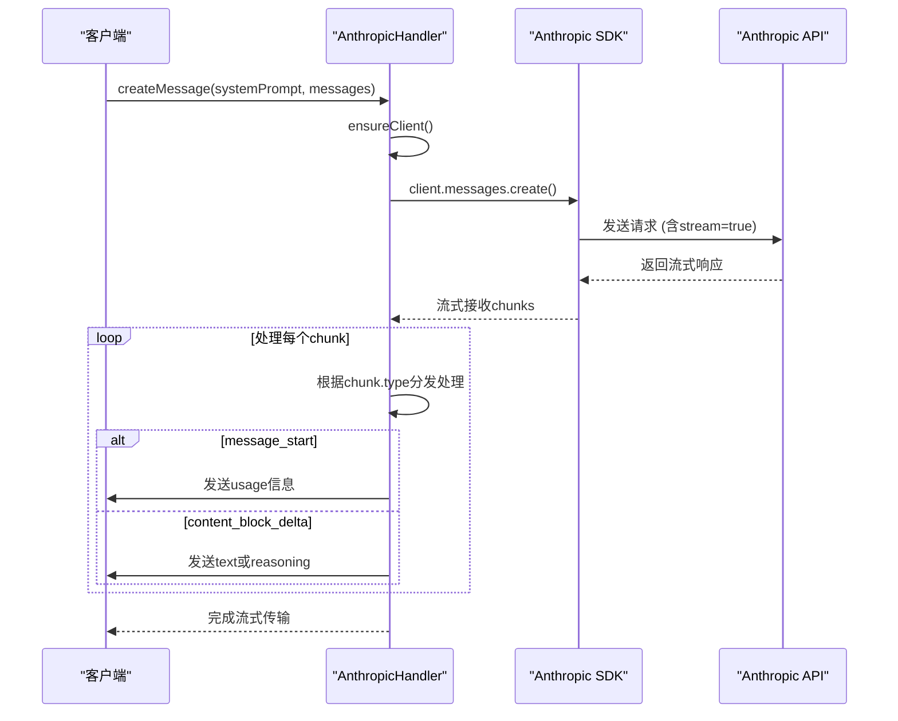

# Anthropic API

<cite>
**本文档中引用的文件**  
- [anthropic.ts](file://src/core/api/providers/anthropic.ts)
- [index.ts](file://src/core/api/index.ts)
- [api.ts](file://src/shared/api.ts)
</cite>

## 目录
1. [配置指南](#配置指南)
2. [实现细节](#实现细节)
3. [支持的模型](#支持的模型)
4. [代码示例](#代码示例)
5. [统一API抽象层](#统一api抽象层)
6. [错误处理与限制](#错误处理与限制)

## 配置指南

要集成Anthropic API，必须在环境配置中设置以下参数：

- **`CLINE_ANTHROPIC_API_KEY`**：这是必需的API密钥，用于认证对Anthropic服务的访问。如果未提供此密钥，系统将抛出错误：“Anthropic API key is required”。
- **`anthropicBaseUrl`**：这是一个可选的基础URL，允许用户自定义API端点。如果不指定，则使用默认的 `https://api.anthropic.com`。

这些配置通过 `AnthropicHandlerOptions` 接口进行管理，并在创建 `AnthropicHandler` 实例时传入。该处理程序负责确保客户端正确初始化并使用提供的API密钥和基础URL。

**Section sources**
- [anthropic.ts](file://src/core/api/providers/anthropic.ts#L10-L25)

## 实现细节

Cline通过 `@anthropic-ai/sdk` SDK与Anthropic API进行交互。核心功能封装在 `AnthropicHandler` 类中，其实现遵循统一的 `ApiHandler` 接口。

### 参数处理

- **`max_tokens`**：由模型的最大令牌数（`model.info.maxTokens`）决定，默认为8192。
- **`stop_sequences`**：当前实现中未显式设置停止序列。
- **`temperature`**：固定为0，以确保输出的一致性和确定性。
- **`thinkingBudgetTokens`**：用于启用扩展思考（Extended Thinking）功能。当模型ID包含 "3-7" 或 "4-" 且预算令牌大于0时，会激活此功能。
- **缓存控制（Cache Control）**：对于特定模型（如Claude Sonnet 4），系统会在系统提示和用户消息中插入临时缓存断点，以优化后续请求的性能。

### 流式响应

API调用返回一个异步生成器（`ApiStream`），支持流式传输响应。流中的每个块根据其类型（如 `message_start`, `content_block_delta`, `text_delta` 等）进行处理，并生成相应的输出事件，包括文本流、推理过程和使用情况统计。

**Section sources**
- [anthropic.ts](file://src/core/api/providers/anthropic.ts#L50-L246)

## 支持的模型

Cline支持多种Anthropic模型，定义在 `anthropicModels` 常量中。以下是主要支持的模型列表：

| 模型ID | 上下文窗口 | 最大输出令牌 | 图像支持 | 说明 |
|--------|------------|-------------|----------|------|
| `claude-sonnet-4-20250514` | 200K | 8192 | 是 | 默认模型，支持图像输入 |
| `claude-sonnet-4-20250514:1m` | 1M | 8192 | 是 | 支持100万上下文窗口的扩展版本 |
| `claude-opus-4-1-20250805` | 200K | 8192 | 是 | 高性能模型，适用于复杂任务 |
| `claude-3-7-sonnet-20250219` | 200K | 8192 | 是 | 第三代Sonnet模型 |
| `claude-3-5-sonnet-20241022` | 200K | 8192 | 是 | 广泛使用的稳定版本 |
| `claude-3-5-haiku-20241022` | 200K | 8192 | 否 | 轻量级快速响应模型 |
| `claude-3-opus-20240229` | 200K | 4096 | 是 | 最强大的Claude模型 |
| `claude-3-haiku-20240307` | 200K | 4096 | 是 | 快速、经济的轻量级模型 |

模型选择通过 `getModel()` 方法实现，优先使用配置中指定的 `apiModelId`，若未指定则使用默认模型 `claude-sonnet-4-20250514`。

**Section sources**
- [api.ts](file://src/shared/api.ts#L300-L400)

## 代码示例

以下展示了 `anthropic.ts` 文件中 `createChatCompletion` 方法的内部调用流程（即 `createMessage` 方法）：

**Diagram sources**
- [anthropic.ts](file://src/core/api/providers/anthropic.ts#L70-L246)

## 统一API抽象层

Cline通过 `index.ts` 中的 `ApiHandler` 接口实现了统一的API抽象层，确保所有提供商（如Anthropic、OpenAI、Bedrock等）具有相同的调用接口。

### 接口一致性

- 所有提供商都实现 `ApiHandler` 接口，提供 `createMessage` 和 `getModel` 方法。
- `createHandlerForProvider` 工厂函数根据配置动态创建对应提供商的处理程序。
- `buildApiHandler` 函数负责验证和构建最终的API处理器，包括对 `thinkingBudgetTokens` 的有效性检查。

### 配置映射

不同提供商的配置参数被统一映射到 `ApiConfiguration` 接口，使得切换提供商时无需修改核心逻辑。例如，`apiKey` 对应Anthropic，`openAiApiKey` 对应OpenAI，但在运行时通过模式（plan/act）和提供商类型自动选择。

**Section sources**
- [index.ts](file://src/core/api/index.ts#L100-L420)

## 错误处理与限制

### 错误处理

- **缺少API密钥**：如果未提供 `apiKey`，`ensureClient()` 方法将抛出 `"Anthropic API key is required"` 错误。
- **客户端创建失败**：捕获SDK初始化异常，并包装为更具描述性的错误信息。
- **流式处理异常**：使用 `@withRetry()` 装饰器实现自动重试机制，增强稳定性。

### 特定限制

- **扩展思考（Extended Thinking）**：仅支持特定模型（如包含 "3-7" 或 "4-" 的模型ID），且不兼容 `temperature`, `top_p`, `top_k` 等参数修改。
- **1M上下文窗口**：通过 `anthropic-beta: context-1m-2025-08-07` 请求头启用，仅适用于特定模型变体（如 `:1m` 后缀）。
- **缓存断点**：系统和用户消息中的缓存断点用于优化性能，但需注意其对提示结构的影响。

**Section sources**
- [anthropic.ts](file://src/core/api/providers/anthropic.ts#L55-L70)
- [anthropic.ts](file://src/core/api/providers/anthropic.ts#L120-L150)