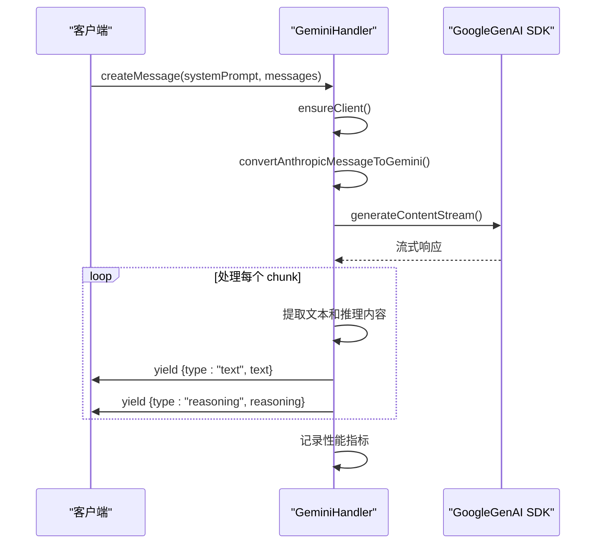
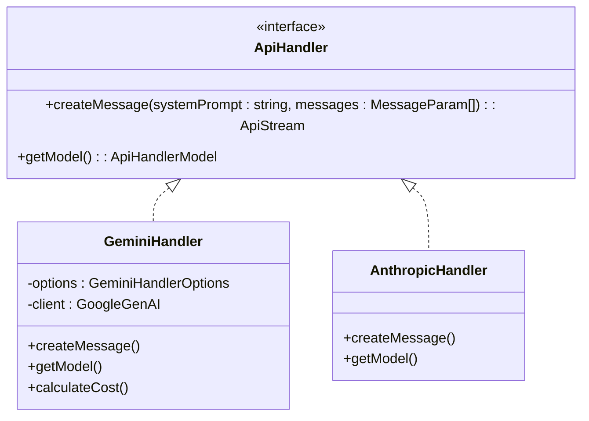

# Google Gemini API

<cite>
**本文档中引用的文件**  
- [gemini.ts](file://src/core/api/providers/gemini.ts)
- [index.ts](file://src/core/api/index.ts)
- [api.ts](file://src/shared/api.ts)
- [GeminiProvider.tsx](file://webview-ui/src/components/settings/providers/GeminiProvider.tsx)
- [gemini-format.ts](file://src/core/api/transform/gemini-format.ts)
</cite>

## 目录
1. [配置指南](#配置指南)
2. [实现细节](#实现细节)
3. [支持的模型](#支持的模型)
4. [代码示例](#代码示例)
5. [统一API抽象层](#统一api抽象层)
6. [错误处理与限制](#错误处理与限制)

## 配置指南

Google Gemini API 的集成需要通过环境变量和配置选项进行设置。核心配置包括必需的 API 密钥和可选的基础 URL。

- **`CLINE_GEMINI_API_KEY`**: 必需的环境变量，用于认证 Gemini API 请求。若未使用 Vertex AI，则必须提供此密钥。
- **`geminiBaseUrl`**: 可选配置，允许用户指定自定义的基础 URL。默认值为 `https://generativelanguage.googleapis.com`。

在配置界面中，用户可通过输入框设置 `geminiApiKey` 和 `geminiBaseUrl`。当使用 Vertex AI 时，系统会优先使用 `vertexProjectId` 和 `vertexRegion` 进行客户端初始化。

**Section sources**
- [GeminiProvider.tsx](file://webview-ui/src/components/settings/providers/GeminiProvider.tsx#L30-L73)
- [gemini.ts](file://src/core/api/providers/gemini.ts#L55-L87)

## 实现细节

Gemini API 的调用通过 `@google/generative-ai` SDK 实现，封装在 `GeminiHandler` 类中。该类负责管理客户端实例、生成内容、计算成本和处理流式响应。

### 安全设置
- 客户端初始化时会检查 `geminiApiKey` 是否存在，若未提供且未启用 Vertex AI，则抛出错误。
- 支持通过 `vertexai: true` 配置启用 Vertex AI 模式，并结合 `project` 和 `location` 参数进行初始化。

### 生成配置
- 生成请求支持 `systemInstruction`、`temperature` 和 `thinkingConfig` 等参数。
- 若启用了思考模式（reasoning mode），则会设置 `thinkingBudget` 和 `includeThoughts`。
- 响应流通过 `generateContentStream` 方法处理，支持实时接收文本和推理内容。

**Section sources**
- [gemini.ts](file://src/core/api/providers/gemini.ts#L130-L174)
- [gemini.ts](file://src/core/api/providers/gemini.ts#L55-L87)

## 支持的模型

Cline 支持多种 Gemini 模型，包括：

- `gemini-2.5-pro`
- `gemini-2.5-flash`
- `gemini-2.5-flash-lite-preview-06-17`
- `gemini-2.0-flash-001`
- `gemini-1.5-pro-002`

这些模型在 `src/shared/api.ts` 中定义，包含详细的元信息，如最大 token 数、上下文窗口、是否支持图像和缓存等。部分模型支持分层定价（tiered pricing），根据输入 token 数量调整价格。

**Section sources**
- [api.ts](file://src/shared/api.ts#L919-L978)
- [GeminiProvider.tsx](file://webview-ui/src/components/settings/providers/GeminiProvider.tsx#L30-L73)

## 代码示例

`createChatCompletion` 方法的内部调用流程如下：

1. 调用 `ensureClient()` 确保 Gemini 客户端已初始化。
2. 将 Anthropic 格式的消息转换为 Gemini 格式，使用 `convertAnthropicMessageToGemini` 函数。
3. 构建生成请求配置，包括系统指令、温度和思考预算。
4. 调用 `client.models.generateContentStream` 发起流式请求。
5. 遍历响应流，提取文本和推理内容，并通过 `yield` 返回。
6. 在 `finally` 块中记录性能指标，如首字节时间（TTFT）、总耗时和 token 使用情况。

**Diagram sources**
- [gemini.ts](file://src/core/api/providers/gemini.ts#L130-L291)

## 统一API抽象层

Gemini 的实现通过 `index.ts` 中的 `buildApiHandler` 函数与其他提供商保持接口一致。所有 API 处理器均实现 `ApiHandler` 接口，提供统一的 `createMessage` 方法。

**Diagram sources**
- [index.ts](file://src/core/api/index.ts#L400-L420)
- [gemini.ts](file://src/core/api/providers/gemini.ts#L364-L415)

## 错误处理与限制

### 错误处理
- 当 API 返回 429 状态码时，系统会解析重试延迟信息，并抛出 `RetriableError`。
- 对于未明确返回 429 但包含速率限制信息的错误，通过正则表达式匹配（如 "rate limit exceeded"）进行识别并重试。
- 所有错误均通过 `telemetryService` 记录，便于后续分析。

### 流式响应格式
Gemini 的流式响应格式包含 `text` 和 `reasoning` 两种类型：
- `text`: 普通文本响应。
- `reasoning`: 思考过程内容，通过 `thought` 字段提取。

响应中还包含 `usageMetadata`，用于计算输入、输出和缓存 token 数量。

**Section sources**
- [gemini.ts](file://src/core/api/providers/gemini.ts#L226-L291)
- [gemini-format.ts](file://src/core/api/transform/gemini-format.ts#L41-L82)