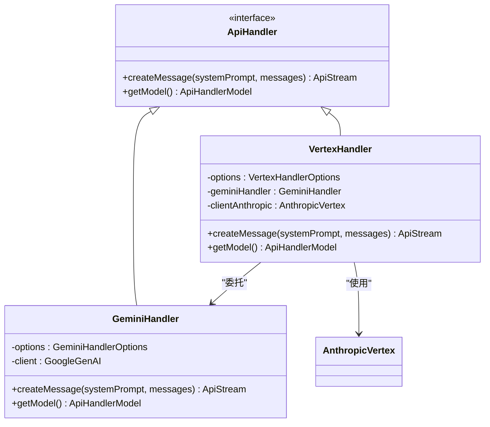

# Google Vertex AI API

<cite>
**本文档中引用的文件**  
- [vertex.ts](file://src/core/api/providers/vertex.ts)
- [index.ts](file://src/core/api/index.ts)
- [gemini.ts](file://src/core/api/providers/gemini.ts)
- [api.ts](file://src/shared/api.ts)
</cite>

## 目录
1. [简介](#简介)
2. [配置指南](#配置指南)
3. [实现细节](#实现细节)
4. [支持的模型列表](#支持的模型列表)
5. [代码示例：createChatCompletion 内部调用流程](#代码示例createchatcompletion-内部调用流程)
6. [统一API抽象层集成](#统一api抽象层集成)
7. [错误处理与限制](#错误处理与限制)
8. [与标准Gemini API的区别](#与标准gemini-api的区别)
9. [结论](#结论)

## 简介
本文档详细介绍了Cline中Google Vertex AI API的集成机制。Vertex AI作为Google Cloud的机器学习平台，支持多种大型语言模型，包括PaLM 2、Gemini for Vertex以及通过Vertex AI托管的Anthropic Claude模型。Cline通过`vertex.ts`中的`VertexHandler`类实现了对这些模型的统一访问，并通过`index.ts`中的`buildApiHandler`函数与系统的其他提供商保持接口一致性。本文档将深入解析其配置、实现、模型支持、调用流程及错误处理机制。

## 配置指南
要成功配置并使用Cline中的Google Vertex AI API，必须正确设置以下环境变量和配置项：

- **Vertex AI 项目ID (`vertexProjectId`)**：这是Google Cloud项目中Vertex AI服务的唯一标识符。必须在配置中明确指定，否则初始化将失败。
- **Vertex AI 区域 (`vertexRegion`)**：指定Vertex AI服务所在的地理区域（如`us-central1`）。该区域必须支持所选模型。
- **认证方式**：使用Google Cloud的服务账户密钥文件进行认证。该密钥文件通常以JSON格式提供，并通过环境变量或配置文件加载。代码中通过`@anthropic-ai/vertex-sdk`的`AnthropicVertex`客户端自动处理Google Cloud的认证流程。
- **可选参数**：
  - `geminiApiKey`：如果需要直接访问标准Gemini API（非Vertex托管），可提供API密钥。
  - `geminiBaseUrl`：用于指定自定义的Gemini API端点。
  - `thinkingBudgetTokens`：为支持“思考”功能的模型（如Claude 3.7 Sonnet）设置思考预算令牌数。

这些配置通过`ApiConfiguration`对象传递给`buildApiHandler`函数，最终由`VertexHandler`使用。

**Section sources**
- [vertex.ts](file://src/core/api/providers/vertex.ts#L1-L278)
- [index.ts](file://src/core/api/index.ts#L390-L419)

## 实现细节
Cline通过`VertexHandler`类与Google Cloud SDK进行交互，其实现细节如下：

`VertexHandler`根据请求的模型类型，动态选择底层客户端：
- **对于Gemini模型**：内部创建一个`GeminiHandler`实例，并设置`isVertex: true`标志。`GeminiHandler`使用`@google/genai` SDK，通过`GoogleGenAI`类初始化Vertex AI客户端，配置`vertexai: true`、`project`和`location`参数。
- **对于Anthropic Claude模型**：使用`@anthropic-ai/vertex-sdk`的`AnthropicVertex`客户端。该客户端在初始化时需要`projectId`和`region`，它会自动处理Google Cloud的认证和API调用。

API端点的使用通过SDK封装，开发者无需直接构造HTTP请求。例如，`createMessage`方法会根据模型ID调用相应的SDK方法（`generateContentStream`用于Gemini，`beta.messages.create`用于Claude），并处理流式响应。

**Section sources**
- [vertex.ts](file://src/core/api/providers/vertex.ts#L1-L278)
- [gemini.ts](file://src/core/api/providers/gemini.ts#L1-L472)

## 支持的模型列表
Cline通过`@shared/api`中的`vertexModels`常量定义了对Vertex AI上可用模型的支持。主要模型包括：

- **Anthropic Claude 系列**：
  - `claude-sonnet-4@20250514`
  - `claude-opus-4-1@20250805`
  - `claude-3-5-sonnet-v2@20241022`
  - `claude-3-haiku@20240307`
- **Google Gemini 系列**：
  - `gemini-2.5-pro`
  - `gemini-2.5-flash`
  - `gemini-1.5-flash-002`
  - `gemini-1.5-pro-002`

在Cline中使用这些模型时，用户只需在配置中指定相应的`apiModelId`。`VertexHandler`的`getModel`方法会根据配置的ID查找模型信息，若未指定则使用默认模型`claude-sonnet-4@20250514`。

**Section sources**
- [api.ts](file://src/shared/api.ts#L590-L789)
- [vertex.ts](file://src/core/api/providers/vertex.ts#L1-L278)

## 代码示例：createChatCompletion 内部调用流程
`createChatCompletion`方法的内部调用流程在`VertexHandler`的`createMessage`方法中实现。以下是其核心流程：

1.  **模型识别**：调用`getModel()`获取当前配置的模型信息。
2.  **路由决策**：检查模型ID是否包含`"claude"`。如果不包含，则认为是Gemini模型，调用`ensureGeminiHandler()`获取`GeminiHandler`实例，并委托其`createMessage`方法处理。
3.  **Claude模型处理**：
    - 调用`ensureAnthropicClient()`确保`AnthropicVertex`客户端已初始化。
    - 根据模型ID和`thinkingBudgetTokens`配置，构建`beta.messages.create`的请求参数。
    - 对于支持缓存的模型，为最后两条用户消息添加`cache_control`指令以优化性能。
    - 发起流式API调用。
4.  **流式响应处理**：遍历API返回的流式`chunk`，将其转换为Cline内部的`ApiStream`格式（如`text`、`reasoning`、`usage`等）并逐个`yield`。

```mermaid
flowchart TD
A[开始 createMessage] --> B{模型ID包含 "claude"?}
B --> |否| C[调用 ensureGeminiHandler]
C --> D[委托给 GeminiHandler.createMessage]
D --> M[结束]
B --> |是| E[调用 ensureAnthropicClient]
E --> F[构建 Anthropic API 请求参数]
F --> G[添加缓存控制]
G --> H[调用 clientAnthropic.beta.messages.create]
H --> I[遍历流式响应 chunk]
I --> J{处理 chunk 类型}
J --> K[转换为 ApiStream 格式]
K --> L[yield 结果]
L --> I
I --> M
```

**Diagram sources**
- [vertex.ts](file://src/core/api/providers/vertex.ts#L1-L278)

**Section sources**
- [vertex.ts](file://src/core/api/providers/vertex.ts#L1-L278)

## 统一API抽象层集成
Cline通过`index.ts`中的`ApiHandler`接口和`buildApiHandler`工厂函数实现了统一的API抽象层。

- **`ApiHandler` 接口**：定义了所有提供商必须实现的公共接口，核心是`createMessage`方法，它接受系统提示和消息列表，并返回一个`ApiStream`异步生成器。
- **`buildApiHandler` 工厂函数**：根据配置中的`apiProvider`（如`"vertex"`）创建相应的处理器实例（如`VertexHandler`）。
- **接口一致性**：`VertexHandler`实现了`ApiHandler`接口，其`createMessage`方法的签名与其他提供商（如`AnthropicHandler`、`OpenAiHandler`）完全一致。这使得上层业务逻辑无需关心底层是哪个AI提供商，只需调用统一的`createMessage`方法即可。

这种设计模式确保了Cline可以轻松地集成和切换不同的AI服务提供商，而不会影响核心业务逻辑。



**Diagram sources**
- [index.ts](file://src/core/api/index.ts#L1-L420)
- [vertex.ts](file://src/core/api/providers/vertex.ts#L1-L278)

## 错误处理与限制
`VertexHandler`实现了健壮的错误处理机制：

- **初始化错误**：如果`vertexProjectId`或`vertexRegion`缺失，`ensureAnthropicClient`会抛出明确的错误。
- **客户端创建错误**：在`ensureGeminiHandler`和`ensureAnthropicClient`中，使用`try-catch`捕获SDK初始化错误，并包装成更具可读性的错误信息。
- **API调用错误**：`createMessage`方法上的`@withRetry`装饰器会自动处理可重试的错误（如网络超时、429速率限制），并进行指数退避重试。
- **特定于Vertex AI的限制**：
  - **区域限制**：并非所有模型在所有区域都可用，必须确保`vertexRegion`与所选模型兼容。
  - **认证依赖**：必须正确配置Google Cloud服务账户，否则所有API调用都会失败。
  - **模型ID格式**：Vertex AI上的模型ID有特定格式（如`model-name@version`），必须严格匹配。

**Section sources**
- [vertex.ts](file://src/core/api/providers/vertex.ts#L1-L278)
- [gemini.ts](file://src/core/api/providers/gemini.ts#L1-L472)

## 与标准Gemini API的区别
尽管`VertexHandler`可以处理Gemini模型，但它与直接使用标准Gemini API有显著区别：

- **认证方式**：Vertex AI集成使用Google Cloud项目和服务账户进行认证，而标准Gemini API通常使用简单的API密钥。
- **客户端SDK**：Vertex AI使用`@anthropic-ai/vertex-sdk`和`@google/genai`的Vertex特定配置，而标准Gemini API可能使用更通用的`@google/generative-ai` SDK。
- **功能范围**：`VertexHandler`是一个统一入口，既能访问Vertex托管的Gemini模型，也能访问Vertex托管的Anthropic Claude模型。相比之下，标准Gemini API仅限于Google的Gemini模型。
- **配置参数**：Vertex AI需要`vertexProjectId`和`vertexRegion`，而标准Gemini API只需要`geminiApiKey`。

在Cline中，当`isVertex: true`时，`GeminiHandler`会使用Vertex AI的配置，从而实现了与标准Gemini API的区分。

**Section sources**
- [vertex.ts](file://src/core/api/providers/vertex.ts#L1-L278)
- [gemini.ts](file://src/core/api/providers/gemini.ts#L1-L472)

## 结论
Cline对Google Vertex AI API的集成提供了一个强大且灵活的接口，支持多种先进的语言模型。通过清晰的配置、统一的API抽象层和健壮的错误处理，开发者可以轻松地在项目中利用Vertex AI的强大功能。`VertexHandler`的设计巧妙地桥接了Gemini和Claude模型，并通过`buildApiHandler`与整个系统无缝集成，体现了良好的架构设计。