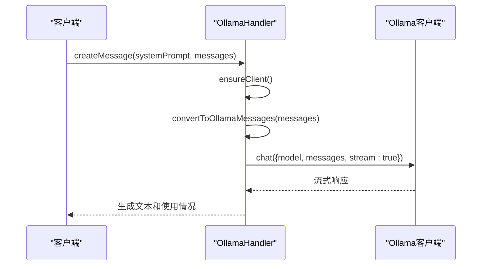

# Ollama API

<cite>
**本文档中引用的文件**  
- [ollama.ts](file://src/core/api/providers/ollama.ts)
- [index.ts](file://src/core/api/index.ts)
- [ollama-format.ts](file://src/core/api/transform/ollama-format.ts)
</cite>

## 目录
1. [配置指南](#配置指南)
2. [实现细节](#实现细节)
3. [支持的模型列表](#支持的模型列表)
4. [代码示例](#代码示例)
5. [统一API抽象层](#统一api抽象层)
6. [本地运行模型的特殊考虑](#本地运行模型的特殊考虑)

## 配置指南

Ollama API集成需要配置基础URL，其默认值为`http://localhost:11434`。通常情况下，Ollama不需要API密钥。如果使用Ollama云服务或经过身份验证的实例，则可以通过设置`ollamaApiKey`来提供API密钥。

**Section sources**
- [ollama.ts](file://src/core/api/providers/ollama.ts#L18-L121)

## 实现细节

OllamaHandler类实现了与Ollama本地API的交互。它通过`ensureClient`方法创建和管理Ollama客户端实例，该方法使用配置的主机地址和可选的API密钥来初始化客户端。模型的加载和卸载由Ollama服务本身管理，Cline通过指定模型ID来请求特定模型。

`createMessage`方法负责处理聊天完成请求。它将系统提示和消息转换为Ollama格式，然后通过流式API发送请求。该实现包括超时处理和重试机制，以确保请求的可靠性。请求的上下文窗口大小可以通过`ollamaApiOptionsCtxNum`选项进行配置，默认值为32768。

**Section sources**
- [ollama.ts](file://src/core/api/providers/ollama.ts#L18-L121)

## 支持的模型列表

Ollama支持任何可以在本地运行的模型，包括但不限于`llama2`、`mistral`、`phi`等。用户可以在Ollama服务中拉取和管理这些模型，然后通过指定模型ID来使用它们。模型ID在配置中通过`ollamaModelId`选项指定。

**Section sources**
- [ollama.ts](file://src/core/api/providers/ollama.ts#L114-L121)

## 代码示例

`createChatCompletion`方法的内部调用流程如下：首先，`ensureClient`方法确保Ollama客户端已正确初始化。然后，`createMessage`方法将输入消息转换为Ollama格式，使用`convertToOllamaMessages`函数处理消息内容。接着，它创建一个带有超时机制的API请求，通过`client.chat`方法发送流式请求。最后，它处理响应流，逐块生成文本和使用情况信息。

**Diagram sources**
- [ollama.ts](file://src/core/api/providers/ollama.ts#L18-L121)
- [ollama-format.ts](file://src/core/api/transform/ollama-format.ts#L3-L108)

**Section sources**
- [ollama.ts](file://src/core/api/providers/ollama.ts#L18-L121)
- [ollama-format.ts](file://src/core/api/transform/ollama-format.ts#L3-L108)

## 统一API抽象层

Ollama实现通过`index.ts`中的统一API抽象层与其他提供商保持接口一致。`createHandlerForProvider`函数根据配置的API提供程序创建相应的处理程序实例。所有处理程序都实现`ApiHandler`接口，该接口定义了`createMessage`和`getModel`方法。这种设计允许Cline在不同提供商之间无缝切换，同时保持一致的调用模式。

**Section sources**
- [index.ts](file://src/core/api/index.ts#L45-L46)

## 本地运行模型的特殊考虑

作为本地运行的模型，Ollama的性能和资源消耗受到本地硬件的限制。较大的模型可能需要大量的内存和较长的加载时间。建议根据可用硬件资源选择合适的模型。此外，由于请求在本地处理，因此不需要考虑网络延迟，但需要监控本地资源使用情况以避免系统过载。

**Section sources**
- [ollama.ts](file://src/core/api/providers/ollama.ts#L18-L121)