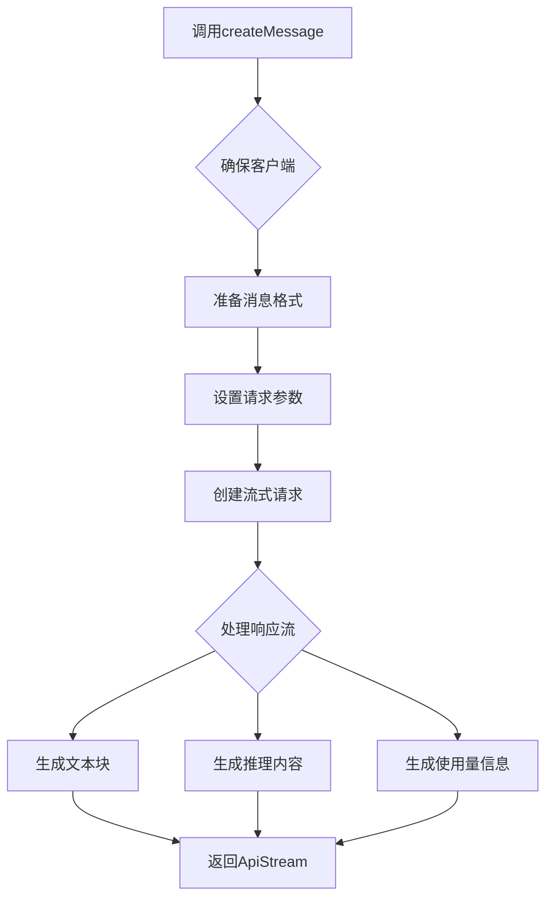
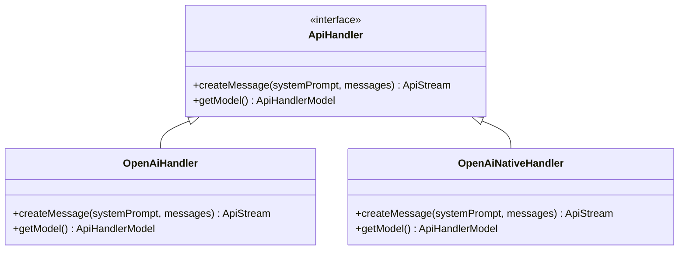

# OpenAI API

<cite>
**本文档中引用的文件**  
- [openai.ts](file://src/core/api/providers/openai.ts)
- [openai-native.ts](file://src/core/api/providers/openai-native.ts)
- [index.ts](file://src/core/api/index.ts)
- [env.ts](file://src/utils/env.ts)
</cite>

## 目录
1. [简介](#简介)
2. [配置指南](#配置指南)
3. [实现细节](#实现细节)
4. [支持的模型列表](#支持的模型列表)
5. [代码示例与调用流程](#代码示例与调用流程)
6. [统一API抽象层](#统一api抽象层)
7. [错误处理与限制](#错误处理与限制)
8. [结论](#结论)

## 简介
本文档为Cline项目中OpenAI API集成提供详细的API参考文档。文档涵盖配置、实现机制、支持的模型、调用流程、统一接口设计以及错误处理等关键方面，旨在为开发者提供全面的技术指导。

## 配置指南
要使用OpenAI API，必须设置环境变量`CLINE_OPENAI_API_KEY`以提供有效的API密钥。此外，可选地可以通过`openAiBaseUrl`参数指定自定义的基础URL，用于连接非标准OpenAI兼容端点（如Azure OpenAI服务）。对于Azure部署，还需配置`azureApiVersion`以指定API版本。

**Section sources**
- [openai.ts](file://src/core/api/providers/openai.ts#L10-L30)

## 实现细节
Cline通过`openai` SDK实现对OpenAI API的调用。系统提供了两种处理程序：`OpenAiHandler`用于标准OpenAI API及兼容接口（如Azure），而`OpenAiNativeHandler`专为原生OpenAI模型设计。两者均实现了统一的`ApiHandler`接口，确保行为一致性。

`OpenAiHandler`支持通过`openAiBaseUrl`配置自定义端点，并能自动识别Azure端点。它将内部消息格式转换为OpenAI兼容格式，并支持流式响应和使用量追踪。

`OpenAiNativeHandler`则针对特定模型家族（如o1、o3、o4系列）进行优化，采用不同的系统角色（如"developer"）并根据模型特性调整参数（如禁用temperature）。

**Section sources**
- [openai.ts](file://src/core/api/providers/openai.ts#L32-L140)
- [openai-native.ts](file://src/core/api/providers/openai-native.ts#L32-L171)

## 支持的模型列表
Cline支持多种OpenAI模型，包括但不限于：
- `gpt-4-turbo`
- `gpt-3.5-turbo`
- `o1`, `o1-preview`, `o1-mini`
- `o4-mini`, `o3`, `o3-mini`
- `gpt-5-2025-08-07`系列

这些模型通过`apiModelId`参数在配置中指定。不同模型具有不同的行为特征，例如o1系列不支持流式传输和系统提示，而o3/o4系列支持推理努力度（reasoning_effort）设置。

**Section sources**
- [openai-native.ts](file://src/core/api/providers/openai-native.ts#L60-L150)

## 代码示例与调用流程
`createMessage`方法是核心调用入口，其内部流程如下：
1. 调用`ensureClient()`确保OpenAI客户端已初始化
2. 根据模型类型确定消息格式（标准系统消息或R1格式）
3. 设置温度、最大令牌数等参数
4. 创建流式完成请求
5. 迭代处理响应流，生成文本、推理内容和使用量信息

流式响应通过`ApiStream`异步生成器返回，允许逐块处理输出。使用量信息在流的末尾或每个块中包含。

**Diagram sources**
- [openai.ts](file://src/core/api/providers/openai.ts#L70-L130)

**Section sources**
- [openai.ts](file://src/core/api/providers/openai.ts#L70-L130)

## 统一API抽象层
所有API提供者（包括OpenAI）都通过`ApiHandler`接口进行抽象。`index.ts`中的`buildApiHandler`函数根据配置动态创建相应的处理程序实例。这种设计确保了不同提供商之间的接口一致性，使上层逻辑无需关心具体实现细节。

`ApiHandler`接口定义了`createMessage`和`getModel`方法，所有提供者必须实现。这种统一的抽象层简化了扩展新提供商的过程，并保证了调用模式的一致性。

**Diagram sources**
- [index.ts](file://src/core/api/index.ts#L20-L40)
- [openai.ts](file://src/core/api/providers/openai.ts#L32-L140)
- [openai-native.ts](file://src/core/api/providers/openai-native.ts#L32-L171)

**Section sources**
- [index.ts](file://src/core/api/index.ts#L20-L420)

## 错误处理与限制
OpenAI实现包含以下错误处理机制：
- 客户端初始化失败时抛出明确错误
- 缺少API密钥时抛出验证错误
- 使用`@withRetry`装饰器自动重试失败的请求
- 对模型的思维预算令牌进行验证，防止超出模型限制

特定限制包括：
- o1系列模型不支持流式传输
- 某些模型家族不支持temperature参数
- 必须正确配置Azure API版本才能使用Azure端点

**Section sources**
- [openai.ts](file://src/core/api/providers/openai.ts#L40-L50)
- [openai-native.ts](file://src/core/api/providers/openai-native.ts#L40-L50)

## 结论
Cline的OpenAI API集成提供了灵活、可扩展且一致的接口。通过支持标准和原生实现、多种模型以及统一的抽象层，系统能够适应不同的使用场景和部署需求。详细的错误处理和流式支持确保了可靠性和响应性。