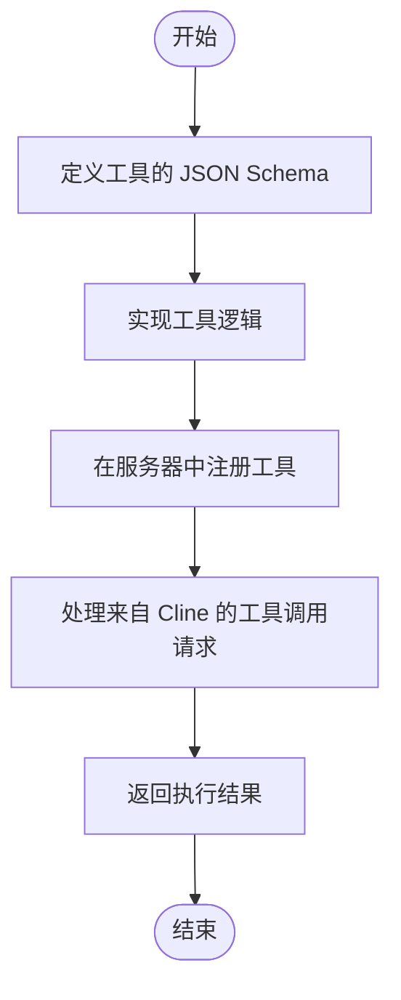
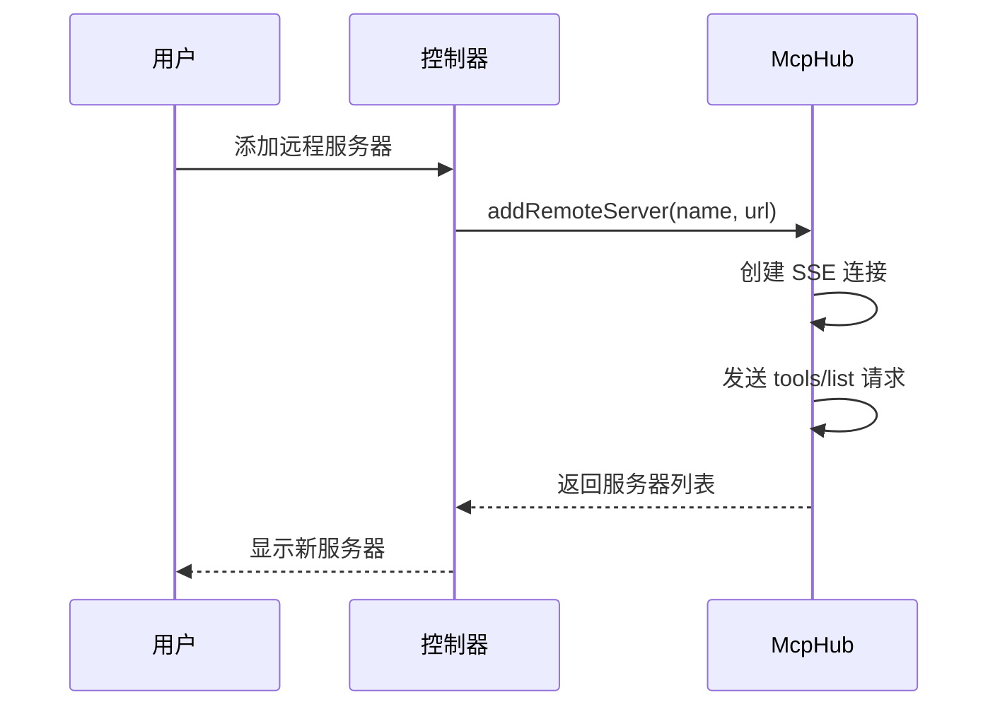
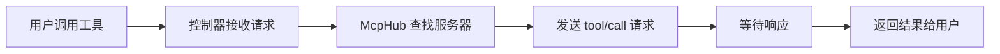

# MCP API

<cite>
**本文档中引用的文件**  
- [McpHub.ts](file://src/services/mcp/McpHub.ts)
- [schemas.ts](file://src/services/mcp/schemas.ts)
- [types.ts](file://src/services/mcp/types.ts)
- [toggleToolAutoApprove.ts](file://src/core/controller/mcp/toggleToolAutoApprove.ts)
- [getLatestMcpServers.ts](file://src/core/controller/mcp/getLatestMcpServers.ts)
- [addRemoteMcpServer.ts](file://src/core/controller/mcp/addRemoteMcpServer.ts)
</cite>

## 目录
1. [引言](#引言)
2. [MCP总体架构与目的](#mcp总体架构与目的)
3. [协议规范](#协议规范)
4. [定义新的MCP工具](#定义新的mcp工具)
5. [MCP服务器的注册与发现](#mcp服务器的注册与发现)
6. [创建MCP服务器的完整示例](#创建mcp服务器的完整示例)
7. [Cline端控制器逻辑](#cline端控制器逻辑)
8. [工具自动批准功能与安全考虑](#工具自动批准功能与安全考虑)

## 引言
Model Context Protocol (MCP) 是一种允许Cline通过外部工具扩展其功能的协议。本规范文档详细描述了MCP的架构、通信协议、工具定义方式、服务器注册机制以及内部处理流程，旨在为开发者提供全面的集成指南。

## MCP总体架构与目的
MCP 的核心目的是通过标准化的协议，使 Cline 能够与外部工具服务器进行通信，从而动态扩展其功能。这些工具可以是代码分析器、天气查询服务、数据库接口等。MCP 采用客户端-服务器模型，其中 Cline 作为客户端，通过不同的传输方式（如 stdio、SSE、Streamable HTTP）与 MCP 服务器建立连接。每个服务器提供一组工具（Tools）、资源（Resources）和资源模板（Resource Templates），Cline 可以调用这些工具来执行特定任务。

MCP 架构的关键组件包括：
- **McpHub**：负责管理所有 MCP 服务器连接的中心枢纽。
- **Transport**：支持多种传输协议（stdio、SSE、Streamable HTTP）以适应不同类型的服务器。
- **Client SDK**：基于 `@modelcontextprotocol/sdk` 实现，用于与服务器进行通信。
- **配置系统**：通过 JSON 配置文件管理服务器设置和自动批准规则。

**Section sources**
- [McpHub.ts](file://src/services/mcp/McpHub.ts#L1-L50)

## 协议规范
MCP 服务器与 Cline 之间的通信基于 Model Context Protocol SDK，支持三种主要的传输方式：

1. **Stdio**：适用于本地运行的工具服务器，通过标准输入输出进行通信。
2. **SSE (Server-Sent Events)**：适用于通过 HTTP 长连接接收事件的服务器。
3. **Streamable HTTP**：适用于支持流式 HTTP 请求的服务器。

通信流程如下：
1. Cline 根据配置文件中的 `type` 字段选择相应的传输方式。
2. 建立连接后，Cline 发送 `tools/list`、`resources/list` 和 `resources/templates/list` 请求以获取服务器提供的功能列表。
3. 当用户调用某个工具时，Cline 发送 `tool/call` 请求并等待响应。
4. 服务器可通过 `notifications/message` 方法向 Cline 发送实时通知。

所有请求和响应均遵循 MCP SDK 定义的 JSON Schema，确保数据格式的一致性。

**Section sources**
- [McpHub.ts](file://src/services/mcp/McpHub.ts#L100-L200)
- [types.ts](file://src/services/mcp/types.ts#L1-L20)

## 定义新的MCP工具
要定义一个新的 MCP 工具，需在 MCP 服务器端实现以下步骤：

1. **工具的 JSON Schema 定义**：每个工具的输入参数必须符合 JSON Schema 格式。例如，在 `schemas.ts` 中定义了基础配置模式，包括 `autoApprove`、`disabled` 和 `timeout` 等字段。

2. **工具的输入/输出参数格式**：
   - 输入参数通过 `CallToolParamsSchema` 定义，包含工具名称和参数对象。
   - 输出结果通过 `CallToolResultSchema` 定义，包含执行结果或错误信息。

3. **注册工具**：在服务器启动时，通过 MCP SDK 注册工具列表，并响应 `tools/list` 请求返回可用工具。



**Diagram sources**
- [schemas.ts](file://src/services/mcp/schemas.ts#L1-L50)

**Section sources**
- [schemas.ts](file://src/services/mcp/schemas.ts#L1-L94)

## MCP服务器的注册与发现
MCP 服务器的注册与发现由 `McpHub` 类统一管理。具体流程如下：

1. **配置文件驱动**：所有 MCP 服务器的配置存储在 `mcpSettings.json` 文件中，结构为 `mcpServers` 对象，键为服务器名称，值为服务器配置。

2. **动态加载**：`McpHub` 监听配置文件的变化，当文件被修改时，自动更新服务器连接状态。

3. **注册远程服务器**：通过 `addRemoteMcpServer` 控制器方法，可以动态添加远程 MCP 服务器。该方法接收服务器名称和 URL，创建相应的 SSE 或 Streamable HTTP 连接。

4. **获取最新服务器列表**：`getLatestMcpServers` 方法返回当前所有已连接的 MCP 服务器列表，按配置文件中的顺序排序。



**Diagram sources**
- [addRemoteMcpServer.ts](file://src/core/controller/mcp/addRemoteMcpServer.ts#L1-L34)
- [getLatestMcpServers.ts](file://src/core/controller/mcp/getLatestMcpServers.ts#L1-L26)

**Section sources**
- [McpHub.ts](file://src/services/mcp/McpHub.ts#L300-L400)
- [addRemoteMcpServer.ts](file://src/core/controller/mcp/addRemoteMcpServer.ts#L1-L34)

## 创建MCP服务器的完整示例
以下是一个简单的天气查询 MCP 服务器的创建示例：

1. **项目结构**：
   ```
   weather-mcp-server/
   ├── build/index.js
   ├── package.json
   └── src/index.ts
   ```

2. **实现代码**（`src/index.ts`）：
   ```ts
   import { Server } from "@modelcontextprotocol/sdk/server/index.js"
   import { StdioServerTransport } from "@modelcontextprotocol/sdk/server/stdio.js"

   const server = new Server({
     name: "Weather MCP Server",
     version: "1.0.0"
   })

   server.addTool({
     name: "getWeather",
     description: "获取指定城市的天气",
     inputSchema: {
       type: "object",
       properties: {
         city: { type: "string" }
       },
       required: ["city"]
     },
     handler: async (params) => {
       // 模拟天气数据
       return { temperature: 25, condition: "Sunny" }
     }
   })

   const transport = new StdioServerTransport()
   server.listen(transport)
   ```

3. **配置 Cline**：
   在 `mcpSettings.json` 中添加：
   ```json
   {
     "mcpServers": {
       "weather-server": {
         "type": "stdio",
         "command": "node",
         "args": ["build/index.js"],
         "cwd": "/path/to/weather-mcp-server"
       }
     }
   }
   ```

4. **集成到 Cline**：重启 Cline 或调用 `restartMcpServer`，即可在界面中看到并使用该工具。

**Section sources**
- [McpHub.ts](file://src/services/mcp/McpHub.ts#L500-L600)

## Cline端控制器逻辑
当用户调用一个 MCP 工具时，Cline 内部的处理流程如下：

1. **控制器接收请求**：`addRemoteMcpServer`、`getLatestMcpServers` 等控制器方法接收 gRPC 请求。
2. **转发至 McpHub**：控制器将请求转发给 `McpHub` 实例进行处理。
3. **执行工具调用**：`McpHub` 通过已建立的连接发送 `tool/call` 请求，并等待响应。
4. **返回结果**：将工具执行结果转换为 proto 格式后返回给前端。

关键控制器包括：
- `addRemoteMcpServer`：添加远程服务器
- `getLatestMcpServers`：获取服务器列表
- `toggleToolAutoApprove`：切换工具自动批准状态



**Diagram sources**
- [getLatestMcpServers.ts](file://src/core/controller/mcp/getLatestMcpServers.ts#L1-L26)
- [toggleToolAutoApprove.ts](file://src/core/controller/mcp/toggleToolAutoApprove.ts#L1-L25)

**Section sources**
- [getLatestMcpServers.ts](file://src/core/controller/mcp/getLatestMcpServers.ts#L1-L26)
- [toggleToolAutoApprove.ts](file://src/core/controller/mcp/toggleToolAutoApprove.ts#L1-L25)

## 工具自动批准功能与安全考虑
工具自动批准功能允许用户预先设定某些工具在调用时无需手动确认。该功能通过 `autoApprove` 配置项实现，存储在每个服务器的配置中。

### 功能说明
- 在 `schemas.ts` 中定义了 `AutoApproveSchema`，类型为字符串数组，表示自动批准的工具名称列表。
- 当用户调用工具时，`McpHub` 会检查该工具是否在 `autoApprove` 列表中，若存在则直接执行。

### 安全考虑
1. **权限控制**：仅允许受信任的工具加入自动批准列表。
2. **配置保护**：`mcpSettings.json` 文件应防止未授权修改。
3. **运行时验证**：每次调用前仍需验证工具参数的合法性。
4. **日志记录**：所有自动批准的调用应记录日志以便审计。

通过 `toggleToolAutoApprove` 方法可动态切换工具的自动批准状态，确保灵活性与安全性兼顾。

**Section sources**
- [schemas.ts](file://src/services/mcp/schemas.ts#L1-L10)
- [toggleToolAutoApprove.ts](file://src/core/controller/mcp/toggleToolAutoApprove.ts#L1-L25)