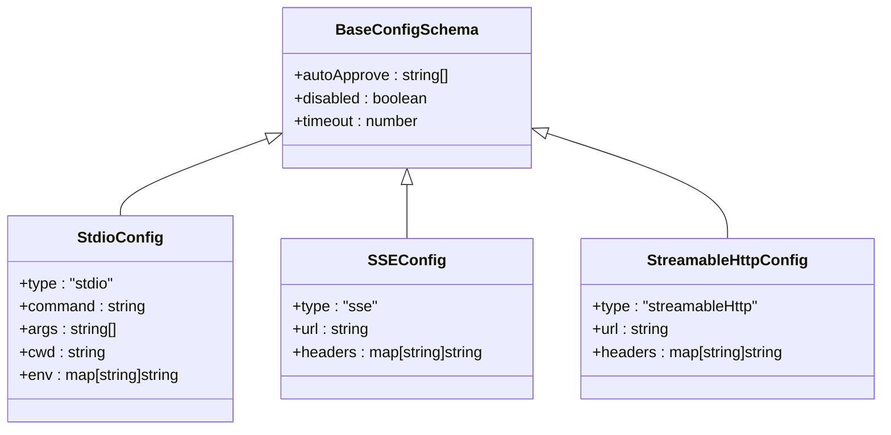
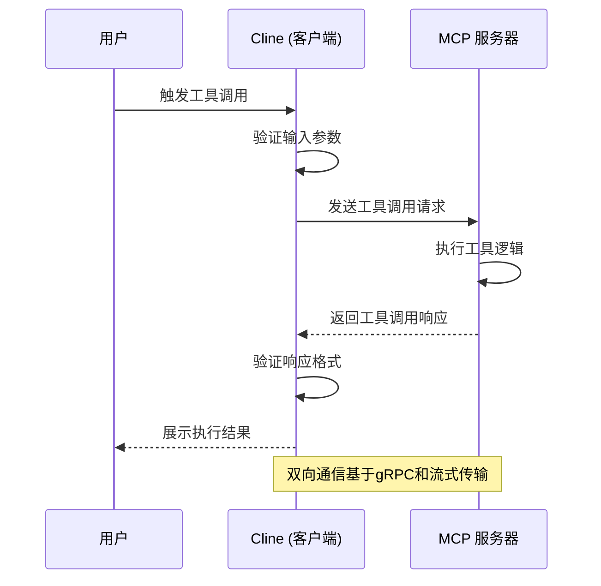

# MCP 协议规范

<cite>
**本文档引用的文件**  
- [mcp.proto](file://proto/cline/mcp.proto)
- [types.ts](file://src/services/mcp/types.ts)
- [schemas.ts](file://src/services/mcp/schemas.ts)
- [mcp.ts](file://src/shared/mcp.ts)
</cite>

## 目录
1. [引言](#引言)
2. [MCP 架构设计](#mcp-架构设计)
3. [gRPC 服务定义](#grpc-服务定义)
4. [消息格式与数据类型](#消息格式与数据类型)
5. [JSON Schema 输入输出验证](#json-schema-输入输出验证)
6. [双向通信流程](#双向通信流程)
7. [工具调用序列图](#工具调用序列图)
8. [安全设计](#安全设计)
9. [附录：消息字段定义表](#附录消息字段定义表)

## 引言

Model Context Protocol (MCP) 是 Cline 扩展功能的核心通信协议，旨在实现 Cline 与外部工具服务器之间的标准化交互。该协议基于 gRPC 构建，支持动态工具发现、能力声明、资源访问和工具执行请求。MCP 允许集成多种外部服务（如代码分析、文档生成、测试执行等），并通过统一接口进行调用与管理。

本规范详细描述了 MCP 的协议架构、消息格式、服务接口、验证机制及安全设计，为开发者提供完整的协议参考。

**Section sources**
- [mcp.proto](file://proto/cline/mcp.proto#L1-L132)
- [mcp.ts](file://src/shared/mcp.ts#L1-L114)

## MCP 架构设计

MCP 采用客户端-服务器模型，其中 Cline 作为 MCP 客户端，外部工具服务作为 MCP 服务器。Cline 通过 gRPC 接口管理 MCP 服务器的生命周期（启动、停止、配置更新），并通过订阅机制实时获取服务器状态和工具能力变化。

核心组件包括：
- **McpService**：gRPC 服务接口，提供服务器管理与状态订阅
- **McpServer**：表示一个 MCP 服务器实例，包含其名称、配置、状态及可用工具
- **McpTool**：描述一个可调用的工具，包括名称、描述、输入模式及自动批准策略
- **McpResource**：表示服务器可提供的资源（如文件、数据流）
- **Transport Layer**：支持 stdio、SSE 和 Streamable HTTP 三种传输方式

该架构支持热插拔式工具集成，允许用户在运行时添加、删除或重启 MCP 服务器。

**Section sources**
- [mcp.proto](file://proto/cline/mcp.proto#L10-L132)
- [types.ts](file://src/services/mcp/types.ts#L1-L20)
- [mcp.ts](file://src/shared/mcp.ts#L1-L114)

## gRPC 服务定义

MCP 的 gRPC 接口定义在 `mcp.proto` 中，主要提供以下两类操作：

1. **管理操作**：用于控制 MCP 服务器的配置与状态
2. **订阅操作**：用于监听 MCP 服务器和市场目录的实时更新

```mermaid
serviceDiagram
service McpService {
+toggleMcpServer(ToggleMcpServerRequest) returns (McpServers)
+updateMcpTimeout(UpdateMcpTimeoutRequest) returns (McpServers)
+addRemoteMcpServer(AddRemoteMcpServerRequest) returns (McpServers)
+downloadMcp(StringRequest) returns (McpDownloadResponse)
+restartMcpServer(StringRequest) returns (McpServers)
+deleteMcpServer(StringRequest) returns (McpServers)
+toggleToolAutoApprove(ToggleToolAutoApproveRequest) returns (McpServers)
+refreshMcpMarketplace(EmptyRequest) returns (McpMarketplaceCatalog)
+openMcpSettings(EmptyRequest) returns (Empty)
+subscribeToMcpMarketplaceCatalog(EmptyRequest) returns (stream McpMarketplaceCatalog)
+getLatestMcpServers(Empty) returns (McpServers)
+subscribeToMcpServers(EmptyRequest) returns (stream McpServers)
}
```

**Diagram sources**
- [mcp.proto](file://proto/cline/mcp.proto#L10-L30)

**Section sources**
- [mcp.proto](file://proto/cline/mcp.proto#L10-L30)

## 消息格式与数据类型

MCP 协议定义了丰富的消息类型，用于描述服务器状态、工具能力、资源模板等信息。

### 核心消息类型

| 消息类型 | 描述 |
|--------|------|
| `McpServer` | 表示一个 MCP 服务器实例 |
| `McpTool` | 表示一个可执行的工具 |
| `McpResource` | 表示服务器可提供的静态资源 |
| `McpResourceTemplate` | 表示资源的 URI 模板 |
| `McpServers` | 包含多个 MCP 服务器的集合 |
| `McpMarketplaceItem` | 市场中一个 MCP 插件的元数据 |

### 枚举类型

`McpServerStatus` 枚举定义了服务器的连接状态：
- `MCP_SERVER_STATUS_DISCONNECTED`：已断开（默认）
- `MCP_SERVER_STATUS_CONNECTED`：已连接
- `MCP_SERVER_STATUS_CONNECTING`：连接中

**Section sources**
- [mcp.proto](file://proto/cline/mcp.proto#L32-L132)
- [mcp.ts](file://src/shared/mcp.ts#L6-L114)

## JSON Schema 输入输出验证

MCP 使用 Zod 库定义的 JSON Schema 对工具输入输出进行验证。相关模式定义在 `schemas.ts` 文件中。

### 服务器配置验证

`ServerConfigSchema` 支持三种传输类型，并为每种类型定义了特定字段：



**Diagram sources**
- [schemas.ts](file://src/services/mcp/schemas.ts#L10-L93)

**Section sources**
- [schemas.ts](file://src/services/mcp/schemas.ts#L1-L93)

## 双向通信流程

Cline 与 MCP 服务器之间的通信分为两个层面：

1. **控制通道**：通过 gRPC 与 Cline 核心通信，管理服务器生命周期
2. **数据通道**：通过 stdio、SSE 或 HTTP 与 MCP 服务器直接通信，执行工具调用

### 通信流程步骤

1. **工具发现**：Cline 调用 `subscribeToMcpServers` 获取当前所有 MCP 服务器及其工具列表
2. **能力声明**：MCP 服务器在启动时向 Cline 报告其支持的工具和资源
3. **执行请求**：当用户触发工具调用时，Cline 将请求转发给对应 MCP 服务器
4. **响应处理**：MCP 服务器返回结构化响应，Cline 解析并展示结果

该设计实现了松耦合的插件系统，允许独立开发和部署 MCP 服务器。

**Section sources**
- [types.ts](file://src/services/mcp/types.ts#L1-L20)
- [mcp.ts](file://src/shared/mcp.ts#L1-L114)

## 工具调用序列图

以下序列图描述了一次完整的 MCP 工具调用过程：



**Diagram sources**
- [types.ts](file://src/services/mcp/types.ts#L1-L20)
- [mcp.ts](file://src/shared/mcp.ts#L1-L114)

## 安全设计

MCP 协议在设计上考虑了多项安全机制：

### 服务器验证

- 所有 MCP 服务器必须通过 `name` 和 `config` 字段进行唯一标识
- 配置中的 `url` 字段需通过 Zod 的 `.url()` 验证器确保格式正确
- 支持通过 `headers` 字段传递认证信息（如 API Key）

### 数据隔离

- 每个 MCP 服务器运行在独立的进程中，避免内存共享
- 工具调用的输入输出均通过结构化消息传递，防止任意代码执行
- 自动批准机制 (`auto_approve`) 可配置，防止未经授权的工具执行

### 超时控制

- 默认超时时间为 60 秒（`DEFAULT_MCP_TIMEOUT_SECONDS`）
- 最小超时时间为 1 秒，防止无限等待
- 可通过 `updateMcpTimeout` 动态调整超时值

**Section sources**
- [schemas.ts](file://src/services/mcp/schemas.ts#L1-L93)
- [mcp.ts](file://src/shared/mcp.ts#L1-L114)

## 附录：消息字段定义表

### McpTool
| 字段 | 类型 | 必需 | 描述 |
|------|------|------|------|
| name | string | 是 | 工具名称 |
| description | string | 否 | 工具描述 |
| input_schema | string | 否 | 输入 JSON Schema |
| auto_approve | bool | 否 | 是否自动批准调用 |

### McpServer
| 字段 | 类型 | 必需 | 描述 |
|------|------|------|------|
| name | string | 是 | 服务器名称 |
| config | string | 是 | 服务器配置（JSON 字符串） |
| status | enum | 是 | 连接状态 |
| error | string | 否 | 错误信息 |
| tools | McpTool[] | 否 | 支持的工具列表 |
| resources | McpResource[] | 否 | 可提供资源列表 |
| resource_templates | McpResourceTemplate[] | 否 | 资源模板列表 |
| disabled | bool | 否 | 是否禁用 |
| timeout | int32 | 否 | 超时时间（秒） |

### McpResource
| 字段 | 类型 | 必需 | 描述 |
|------|------|------|------|
| uri | string | 是 | 资源 URI |
| name | string | 是 | 资源名称 |
| mime_type | string | 否 | MIME 类型 |
| description | string | 否 | 资源描述 |

### McpResourceTemplate
| 字段 | 类型 | 必需 | 描述 |
|------|------|------|------|
| uri_template | string | 是 | URI 模板（支持变量） |
| name | string | 是 | 模板名称 |
| mime_type | string | 否 | 预期 MIME 类型 |
| description | string | 否 | 模板描述 |

**Section sources**
- [mcp.proto](file://proto/cline/mcp.proto#L50-L132)
- [mcp.ts](file://src/shared/mcp.ts#L6-L114)