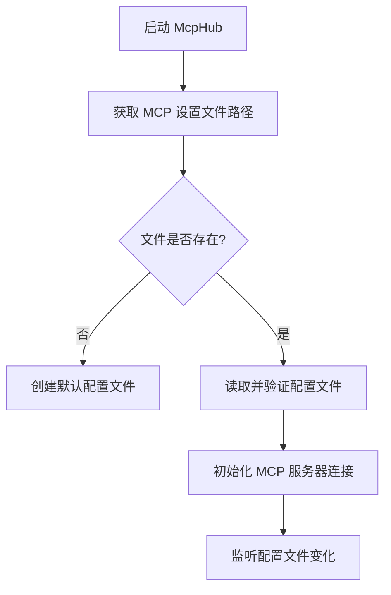
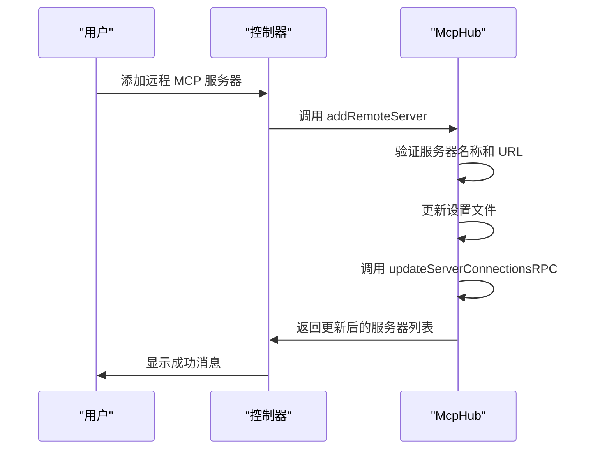
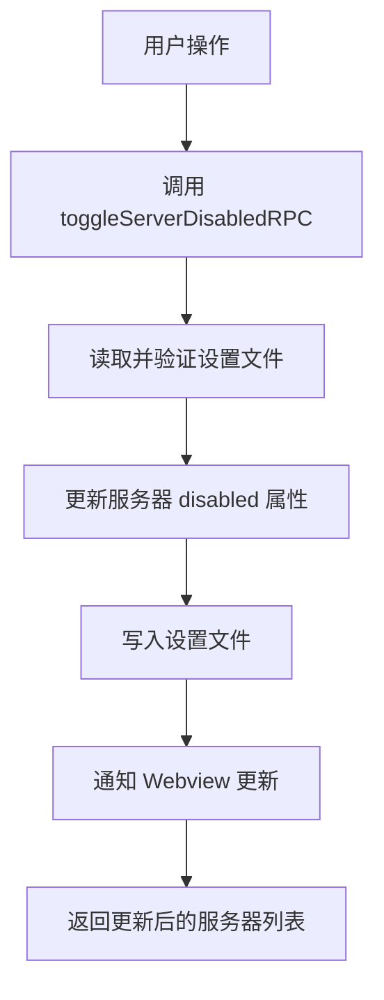
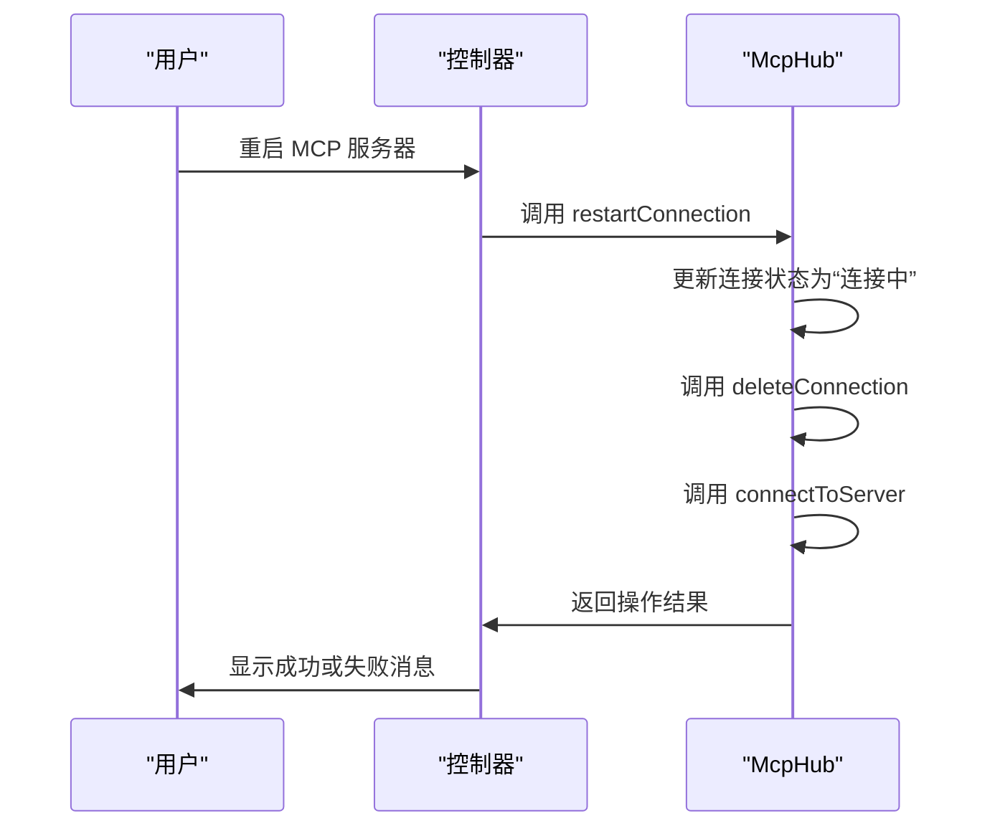

# MCP 集成指南

<cite>
**本文档中引用的文件**  
- [McpHub.ts](file://src/services/mcp/McpHub.ts)
- [toggleToolAutoApprove.ts](file://src/core/controller/mcp/toggleToolAutoApprove.ts)
- [addRemoteMcpServer.ts](file://src/core/controller/mcp/addRemoteMcpServer.ts)
- [toggleMcpServer.ts](file://src/core/controller/mcp/toggleMcpServer.ts)
- [restartMcpServer.ts](file://src/core/controller/mcp/restartMcpServer.ts)
- [schemas.ts](file://src/services/mcp/schemas.ts)
- [types.ts](file://src/services/mcp/types.ts)
- [mcp.ts](file://src/shared/mcp.ts)
</cite>

## 目录
1. [简介](#简介)
2. [MCP 服务器注册与发现机制](#mcp-服务器注册与发现机制)
3. [MCP 控制器功能分析](#mcp-控制器功能分析)
4. [构建 MCP 服务器分步教程](#构建-mcp-服务器分步教程)
5. [工具自动批准策略配置](#工具自动批准策略配置)
6. [结论](#结论)

## 简介

本指南旨在为开发者提供创建和集成自定义 MCP（Model Context Protocol）工具的全面指导。通过深入分析 Cline 项目中的 `McpHub.ts` 实现，我们将详细解释 MCP 服务器的注册、发现和生命周期管理机制。同时，本指南将涵盖 `src/core/controller/mcp/` 目录下控制器函数如何处理用户操作，如添加服务器、启用/禁用工具和执行工具调用。此外，还将提供一个从零开始使用 Node.js 构建 MCP 服务器的分步教程，并指导开发者如何配置工具的自动批准策略以平衡便利性和安全性。

**MCP 集成指南** 的核心目标是帮助开发者理解并实现与 Cline 的 MCP 集成，从而扩展其功能并提升开发效率。

## MCP 服务器注册与发现机制

MCP 服务器的注册与发现机制主要由 `McpHub` 类实现，该类负责管理所有 MCP 服务器的连接和状态。`McpHub` 通过监听配置文件的变化来动态更新服务器列表，并根据配置文件中的定义自动连接或断开服务器。

### 服务器配置与初始化

MCP 服务器的配置存储在 JSON 格式的设置文件中，文件路径由 `getMcpSettingsFilePath` 方法确定。如果文件不存在，`McpHub` 会创建一个默认的空配置文件。配置文件的结构遵循 `McpSettingsSchema` 模式，其中包含一个名为 `mcpServers` 的对象，该对象的键是服务器名称，值是服务器配置。



**Diagram sources**
- [McpHub.ts](file://src/services/mcp/McpHub.ts#L120-L150)

**Section sources**
- [McpHub.ts](file://src/services/mcp/McpHub.ts#L120-L150)
- [schemas.ts](file://src/services/mcp/schemas.ts#L70-L93)

### 服务器连接与通信

`McpHub` 支持三种传输类型：`stdio`、`sse` 和 `streamableHttp`。每种类型对应不同的连接方式和配置参数。当配置文件发生变化时，`McpHub` 会调用 `updateServerConnections` 方法来同步服务器连接状态。

```mermaid
classDiagram
class McpHub {
+getMcpServersPath : () => Promise<string>
+getSettingsDirectoryPath : () => Promise<string>
+clientVersion : string
+telemetryService : TelemetryService
+connections : McpConnection[]
+isConnecting : boolean
+pendingNotifications : Array<{serverName : string, level : string, message : string, timestamp : number}>
+notificationCallback? : (serverName : string, level : string, message : string) => void
+constructor(getMcpServersPath : () => Promise<string>, getSettingsDirectoryPath : () => Promise<string>, clientVersion : string, telemetryService : TelemetryService)
+getServers() : McpServer[]
+getMcpSettingsFilePath() : Promise<string>
+readAndValidateMcpSettingsFile() : Promise<z.infer<typeof McpSettingsSchema> | undefined>
+watchMcpSettingsFile() : Promise<void>
+initializeMcpServers() : Promise<void>
+findConnection(name : string, _source : "rpc" | "internal") : McpConnection | undefined
+connectToServer(name : string, config : z.infer<typeof ServerConfigSchema>, source : "rpc" | "internal") : Promise<void>
+appendErrorMessage(connection : McpConnection, error : string)
+fetchToolsList(serverName : string) : Promise<McpTool[]>
+fetchResourcesList(serverName : string) : Promise<McpResource[]>
+fetchResourceTemplatesList(serverName : string) : Promise<McpResourceTemplate[]>
+deleteConnection(name : string) : Promise<void>
+updateServerConnectionsRPC(newServers : Record<string, McpServerConfig>) : Promise<void>
+updateServerConnections(newServers : Record<string, McpServerConfig>) : Promise<void>
+setupFileWatcher(name : string, config : Extract<McpServerConfig, { type : "stdio" }>)
+removeAllFileWatchers()
+restartConnectionRPC(serverName : string) : Promise<McpServer[]>
+restartConnection(serverName : string) : Promise<void>
+getSortedMcpServers(serverOrder : string[]) : McpServer[]
+notifyWebviewOfServerChanges() : Promise<void>
+sendLatestMcpServers()
+getLatestMcpServersRPC() : Promise<McpServer[]>
+toggleServerDisabledRPC(serverName : string, disabled : boolean) : Promise<McpServer[]>
+readResource(serverName : string, uri : string) : Promise<McpResourceResponse>
+callTool(serverName : string, toolName : string, toolArguments : Record<string, unknown> | undefined, ulid : string) : Promise<McpToolCallResponse>
+toggleToolAutoApproveRPC(serverName : string, toolNames : string[], shouldAllow : boolean) : Promise<McpServer[]>
+toggleToolAutoApprove(serverName : string, toolNames : string[], shouldAllow : boolean) : Promise<void>
+addRemoteServer(serverName : string, serverUrl : string) : Promise<McpServer[]>
+deleteServerRPC(serverName : string) : Promise<McpServer[]>
+updateServerTimeoutRPC(serverName : string, timeout : number) : Promise<McpServer[]>
+getPendingNotifications() : Array<{serverName : string, level : string, message : string, timestamp : number}>
+setNotificationCallback(callback : (serverName : string, level : string, message : string) => void) : void
+clearNotificationCallback() : void
+dispose() : Promise<void>
}
class McpConnection {
+server : McpServer
+client : Client
+transport : Transport
}
class McpServer {
+name : string
+config : string
+status : "connected" | "connecting" | "disconnected"
+error? : string
+tools? : McpTool[]
+resources? : McpResource[]
+resourceTemplates? : McpResourceTemplate[]
+disabled? : boolean
+timeout? : number
}
class McpTool {
+name : string
+description? : string
+inputSchema? : object
+autoApprove? : boolean
}
class McpResource {
+uri : string
+name : string
+mimeType? : string
+description? : string
}
class McpResourceTemplate {
+uriTemplate : string
+name : string
+description? : string
+mimeType? : string
}
class McpResourceResponse {
+_meta? : Record<string, any>
+contents : Array<{uri : string, mimeType? : string, text? : string, blob? : string}>
}
class McpToolCallResponse {
+_meta? : Record<string, any>
+content : Array<{type : "text", text : string} | {type : "image", data : string, mimeType : string} | {type : "audio", data : string, mimeType : string} | {type : "resource", resource : {uri : string, mimeType? : string, text? : string, blob? : string}}>
+isError? : boolean
}
McpHub --> McpConnection : "包含"
McpConnection --> McpServer : "关联"
McpServer --> McpTool : "包含"
McpServer --> McpResource : "包含"
McpServer --> McpResourceTemplate : "包含"
```

**Diagram sources**
- [McpHub.ts](file://src/services/mcp/McpHub.ts#L39-L1154)
- [types.ts](file://src/services/mcp/types.ts#L1-L20)
- [mcp.ts](file://src/shared/mcp.ts#L0-L114)

**Section sources**
- [McpHub.ts](file://src/services/mcp/McpHub.ts#L39-L1154)
- [types.ts](file://src/services/mcp/types.ts#L1-L20)
- [mcp.ts](file://src/shared/mcp.ts#L0-L114)

## MCP 控制器功能分析

`src/core/controller/mcp/` 目录下的控制器函数负责处理与 MCP 相关的用户操作。这些函数通过调用 `McpHub` 的方法来实现对 MCP 服务器的管理。

### 添加远程 MCP 服务器

`addRemoteMcpServer.ts` 文件中的 `addRemoteServer` 函数允许用户添加一个新的远程 MCP 服务器。该函数首先验证服务器名称是否已存在，然后验证服务器 URL 是否有效。如果验证通过，函数会将新的服务器配置添加到设置文件中，并调用 `updateServerConnectionsRPC` 方法来更新服务器连接状态。



**Diagram sources**
- [addRemoteMcpServer.ts](file://src/core/controller/mcp/addRemoteMcpServer.ts)
- [McpHub.ts](file://src/services/mcp/McpHub.ts#L1000-L1050)

**Section sources**
- [addRemoteMcpServer.ts](file://src/core/controller/mcp/addRemoteMcpServer.ts)
- [McpHub.ts](file://src/services/mcp/McpHub.ts#L1000-L1050)

### 启用/禁用 MCP 服务器

`toggleMcpServer.ts` 文件中的 `toggleServerDisabledRPC` 函数允许用户启用或禁用一个 MCP 服务器。该函数首先读取并验证设置文件，然后更新指定服务器的 `disabled` 属性。更新完成后，函数会将更改写入设置文件，并调用 `notifyWebviewOfServerChanges` 方法来通知 Webview 更新服务器状态。



**Diagram sources**
- [toggleMcpServer.ts](file://src/core/controller/mcp/toggleMcpServer.ts)
- [McpHub.ts](file://src/services/mcp/McpHub.ts#L900-L950)

**Section sources**
- [toggleMcpServer.ts](file://src/core/controller/mcp/toggleMcpServer.ts)
- [McpHub.ts](file://src/services/mcp/McpHub.ts#L900-L950)

### 重启 MCP 服务器

`restartMcpServer.ts` 文件中的 `restartConnection` 函数允许用户重启一个 MCP 服务器。该函数首先获取现有连接并更新其状态为“连接中”，然后调用 `deleteConnection` 方法断开现有连接，最后调用 `connectToServer` 方法重新建立连接。



**Diagram sources**
- [restartMcpServer.ts](file://src/core/controller/mcp/restartMcpServer.ts)
- [McpHub.ts](file://src/services/mcp/McpHub.ts#L800-L850)

**Section sources**
- [restartMcpServer.ts](file://src/core/controller/mcp/restartMcpServer.ts)
- [McpHub.ts](file://src/services/mcp/McpHub.ts#L800-L850)

## 构建 MCP 服务器分步教程

本节将指导开发者如何使用 Node.js 从零开始构建一个 MCP 服务器，例如一个 GitHub 仓库信息查询工具。

### 项目设置

1. 创建一个新的 Node.js 项目：
   ```bash
   mkdir github-mcp-server
   cd github-mcp-server
   npm init -y
   ```

2. 安装必要的依赖：
   ```bash
   npm install @modelcontextprotocol/sdk axios
   ```

### 代码实现

1. 创建 `src/index.ts` 文件：
   ```typescript
   import { Server } from "@modelcontextprotocol/sdk/server/index.js"
   import { StdioServerTransport } from "@modelcontextprotocol/sdk/server/stdio.js"
   import axios from "axios"

   const server = new Server({
     name: "GitHub MCP Server",
     version: "1.0.0",
   })

   server.addTool({
     name: "getRepoInfo",
     description: "获取 GitHub 仓库的信息",
     inputSchema: {
       type: "object",
       properties: {
         owner: { type: "string" },
         repo: { type: "string" },
       },
       required: ["owner", "repo"],
     },
     async execute(params) {
       const { owner, repo } = params
       try {
         const response = await axios.get(`https://api.github.com/repos/${owner}/${repo}`)
         return {
           content: [
             {
               type: "text",
               text: JSON.stringify(response.data, null, 2),
             },
           ],
         }
       } catch (error) {
         return {
           content: [
             {
               type: "text",
               text: `Error: ${error.message}`,
             },
           ],
           isError: true,
         }
       }
     },
   })

   const transport = new StdioServerTransport()
   server.connect(transport)
   ```

2. 编译 TypeScript 代码：
   ```bash
   npx tsc
   ```

3. 在 Cline 中添加服务器：
   - 打开 Cline 的 MCP 设置页面
   - 点击“添加远程服务器”
   - 输入服务器名称（如 `GitHub MCP Server`）
   - 输入服务器命令（如 `node dist/index.js`）
   - 保存设置

### 测试服务器

1. 在 Cline 中启用新添加的服务器
2. 使用 MCP 工具调用 `getRepoInfo` 方法，传入 GitHub 仓库的所有者和名称
3. 查看返回的仓库信息

## 工具自动批准策略配置

`toggleToolAutoApprove.ts` 文件中的 `toggleToolAutoApprove` 函数允许开发者配置工具的自动批准策略。该函数通过修改设置文件中的 `autoApprove` 数组来实现对工具的自动批准或取消批准。

### 自动批准策略

自动批准策略允许某些工具在调用时无需用户确认。这可以提高开发效率，但也可能带来安全风险。因此，开发者需要根据工具的用途和风险级别来决定是否启用自动批准。

### 配置步骤

1. 打开 Cline 的 MCP 设置页面
2. 选择要配置的 MCP 服务器
3. 找到要配置的工具
4. 点击“自动批准”按钮来启用或禁用自动批准

### 代码实现

```typescript
import type { ToggleToolAutoApproveRequest } from "@shared/proto/cline/mcp"
import { McpServers } from "@shared/proto/cline/mcp"
import { convertMcpServersToProtoMcpServers } from "@shared/proto-conversions/mcp/mcp-server-conversion"
import type { Controller } from "../index"

/**
 * 切换 MCP 服务器工具的自动批准设置
 * @param controller 控制器实例
 * @param request 切换工具自动批准请求
 * @returns 更新后的 MCP 服务器列表
 */
export async function toggleToolAutoApprove(controller: Controller, request: ToggleToolAutoApproveRequest): Promise<McpServers> {
	try {
		// 调用返回服务器列表的 RPC 变体
		const mcpServers =
			(await controller.mcpHub?.toggleToolAutoApproveRPC(request.serverName, request.toolNames, request.autoApprove)) || []

		// 将应用类型转换为 proto 类型
		return McpServers.create({ mcpServers: convertMcpServersToProtoMcpServers(mcpServers) })
	} catch (error) {
		console.error(`Failed to toggle tool auto-approve for ${request.serverName}:`, error)
		throw error
	}
}
```

**Section sources**
- [toggleToolAutoApprove.ts](file://src/core/controller/mcp/toggleToolAutoApprove.ts)

## 结论

本指南详细介绍了如何为 Cline 创建和集成自定义 MCP 工具。通过分析 `McpHub.ts` 的实现，我们了解了 MCP 服务器的注册、发现和生命周期管理机制。同时，我们也学习了 `src/core/controller/mcp/` 目录下控制器函数如何处理用户操作。最后，我们提供了一个从零开始构建 MCP 服务器的分步教程，并指导开发者如何配置工具的自动批准策略以平衡便利性和安全性。希望本指南能帮助开发者更好地理解和使用 MCP 集成，从而提升开发效率和体验。