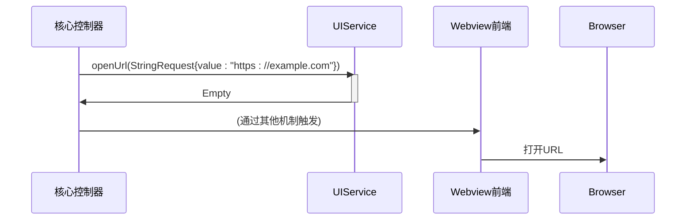
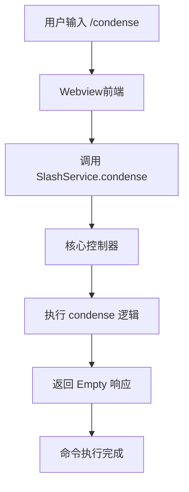
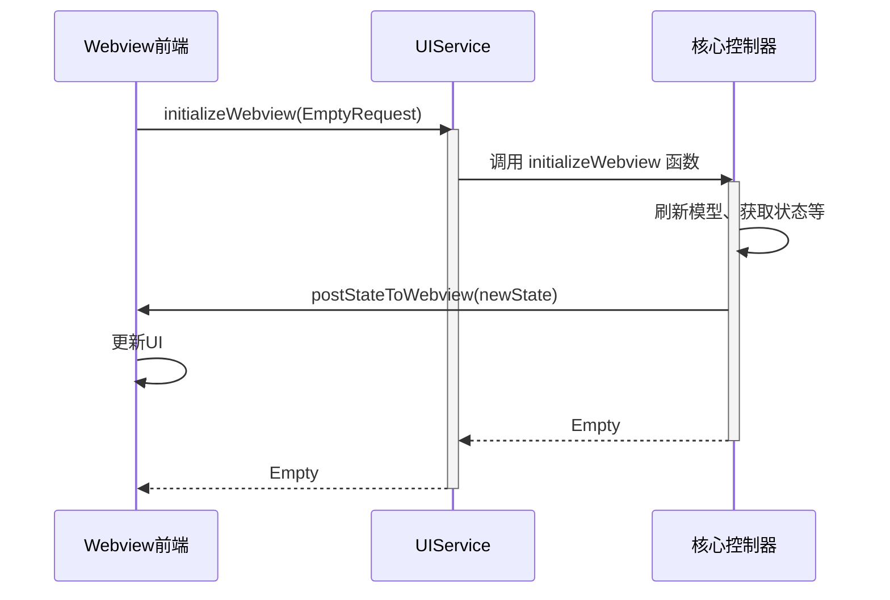

# UI与斜杠命令服务

<cite>
**本文档中引用的文件**  
- [ui.proto](file://proto/cline/ui.proto)
- [slash.proto](file://proto/cline/slash.proto)
- [initializeWebview.ts](file://src/core/controller/ui/initializeWebview.ts)
- [openUrl.ts](file://src/core/controller/ui/openUrl.ts)
- [condense.ts](file://src/core/controller/slash/condense.ts)
</cite>

## 目录
1. [简介](#简介)
2. [UIService 服务详解](#uiservice-服务详解)
3. [SlashCommandService 服务详解](#slashcommandservic-服务详解)
4. [核心控制器调用示例](#核心控制器调用示例)
5. [Webview UI 更新机制](#webview-ui-更新机制)

## 简介
本文档详细说明了 Cline 系统中 `UIService` 和 `SlashCommandService` 两个 gRPC 服务的 API 接口。`UIService` 负责管理用户界面交互，包括显示消息、获取用户输入和打开 URL 等功能。`SlashCommandService` 则处理斜杠命令的执行。文档将深入解析每个方法的请求/响应格式、参数选项和使用场景，并提供从核心控制器调用这些服务的实际代码示例。

## UIService 服务详解

`UIService` 服务定义在 `ui.proto` 文件中，提供了管理 UI 交互的一系列方法。

### ShowMessage 方法
`UIService` 通过 `ClineMessage` 消息类型来传递不同类型的消息。`ClineMessage` 的 `type` 字段为 `ClineMessageType` 枚举，其值为 `SAY` 时表示向用户显示消息。`say` 字段的 `ClineSay` 枚举定义了消息的具体类型，例如 `TASK`（任务信息）、`ERROR`（错误信息）、`TEXT`（普通文本）等。消息内容通过 `text` 字段传递。

### ShowInputBox 方法
`UIService` 通过订阅 `subscribeToPartialMessage` 流来接收用户输入。当需要获取用户文本输入时，系统会发送一个 `ClineMessage`，其 `type` 为 `ASK`，`ask` 字段为 `COMMAND` 或其他需要用户响应的类型。用户在 Webview 中的输入框输入内容后，前端会通过流将输入内容作为 `String` 消息发送回后端。

### OpenUrl 方法
`OpenUrl` 方法用于在默认浏览器中打开指定的 URL。

**请求消息**: `StringRequest`，其中 `value` 字段包含要打开的 URL。
**响应消息**: `Empty`，表示操作成功。
**使用场景**: 当系统需要引导用户查看外部文档、报告问题或查看在线资源时调用此方法。



**Diagram sources**
- [ui.proto](file://proto/cline/ui.proto#L248-L250)
- [openUrl.ts](file://src/core/controller/ui/openUrl.ts#L1-L20)

**Section sources**
- [ui.proto](file://proto/cline/ui.proto#L1-L272)
- [openUrl.ts](file://src/core/controller/ui/openUrl.ts#L1-L20)

## SlashCommandService 服务详解

`SlashCommandService` 服务定义在 `slash.proto` 文件中，目前提供对斜杠命令的处理。

### ExecuteCommand 方法
`SlashCommandService` 的 `ExecuteCommand` 方法通过两个具体的 RPC 方法来实现：`reportBug` 和 `condense`。每个方法对应一个特定的斜杠命令。

**命令ID与参数传递**:
- `reportBug`: 命令ID为 `/reportBug`，其 `StringRequest` 参数可能包含预填充的错误报告内容。
- `condense`: 命令ID为 `/condense`，其 `StringRequest` 参数在当前实现中未被使用。

**执行流程**:
1.  用户在聊天输入框中输入斜杠命令（如 `/condense`）并执行。
2.  前端识别出斜杠命令，并调用相应的 gRPC 方法。
3.  gRPC 请求被发送到核心控制器。
4.  核心控制器执行相应的业务逻辑。
5.  返回 `Empty` 响应表示命令执行成功。



**Diagram sources**
- [slash.proto](file://proto/cline/slash.proto#L1-L12)
- [condense.ts](file://src/core/controller/slash/condense.ts#L1-L10)

**Section sources**
- [slash.proto](file://proto/cline/slash.proto#L1-L12)
- [condense.ts](file://src/core/controller/slash/condense.ts#L1-L10)

## 核心控制器调用示例

以下代码片段展示了核心控制器如何实现 `condense` 斜杠命令。

```typescript
/**
 * Command slash command logic
 */
export async function condense(controller: Controller, _request: StringRequest): Promise<Empty> {
    await controller.task?.handleWebviewAskResponse("yesButtonClicked")
    return Empty.create()
}
```

**代码说明**:
- 该函数定义在 `src/core/controller/slash/condense.ts`。
- 它接收一个 `Controller` 实例和一个 `StringRequest` 请求。
- 函数体内部调用了 `controller.task` 的 `handleWebviewAskResponse` 方法，并传入 `"yesButtonClicked"` 作为响应。
- 这表明 `/condense` 命令的执行逻辑是模拟用户点击了 Webview 中的“是”按钮，通常用于确认或继续某个流程。
- 最后，函数返回一个空的 `Empty` 响应。

**Section sources**
- [condense.ts](file://src/core/controller/slash/condense.ts#L1-L10)

## Webview UI 更新机制

`UIService` 中的 `initializeWebview` 方法在 Webview 启动时被调用，负责初始化前端状态。

**执行流程**:
1.  Webview 加载时，调用 `initializeWebview` RPC。
2.  核心控制器执行 `initializeWebview` 函数。
3.  函数内部会触发一系列操作，如刷新模型列表、发送 MCP 市场目录、更新遥测状态等。
4.  通过调用 `controller.postStateToWebview()` 方法，将最新的应用状态推送到 Webview。
5.  Webview 接收到新的状态后，会重新渲染 UI，从而实现界面的更新。



**Diagram sources**
- [ui.proto](file://proto/cline/ui.proto#L246-L247)
- [initializeWebview.ts](file://src/core/controller/ui/initializeWebview.ts#L1-L249)

**Section sources**
- [initializeWebview.ts](file://src/core/controller/ui/initializeWebview.ts#L1-L249)