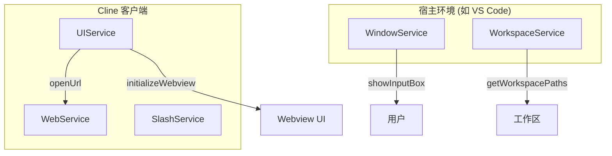

# UI交互服务

<cite>
**本文档中引用的文件**  
- [ui.proto](file://proto/cline/ui.proto)
- [web.proto](file://proto/cline/web.proto)
- [slash.proto](file://proto/cline/slash.proto)
- [window.proto](file://proto/host/window.proto)
- [workspace.proto](file://proto/host/workspace.proto)
</cite>

## 目录
1. [简介](#简介)
2. [核心服务概览](#核心服务概览)
3. [UIService 详细说明](#uiservice-详细说明)
4. [WebBrowserService 功能解析](#webbrowserservice-功能解析)
5. [SlashCommandService 接口文档](#slashcommandservice-接口文档)
6. [宿主环境服务（Host Services）](#宿主环境服务host-services)
7. [Webview UI 更新机制示例](#webview-ui-更新机制示例)
8. [总结](#总结)

## 简介
本文档旨在为 Cline 的 UI 交互相关 gRPC 服务提供完整的 API 文档。重点描述了 `ui.proto` 中定义的 `UIService`，用于与用户进行图形界面交互；`web.proto` 中的 `WebService`，用于处理网页内容；`slash.proto` 中的 `SlashService`，用于执行斜杠命令；以及由宿主环境（如 VS Code）实现的 `WindowService` 和 `WorkspaceService`，这些服务允许客户端查询编辑器状态和工作区信息。通过这些服务，Cline 能够实现丰富的用户交互和动态 UI 更新。

## 核心服务概览
Cline 的 UI 交互体系由多个 gRPC 服务构成，分为客户端可调用的服务和宿主环境实现的服务两大类。客户端服务主要用于发起 UI 操作请求，而宿主服务则提供环境信息和状态查询能力。



**Diagram sources**
- [ui.proto](file://proto/cline/ui.proto)
- [web.proto](file://proto/cline/web.proto)
- [slash.proto](file://proto/cline/slash.proto)
- [window.proto](file://proto/host/window.proto)
- [workspace.proto](file://proto/host/workspace.proto)

**Section sources**
- [ui.proto](file://proto/cline/ui.proto#L1-L272)
- [web.proto](file://proto/cline/web.proto#L1-L26)
- [slash.proto](file://proto/cline/slash.proto#L1-L13)
- [window.proto](file://proto/host/window.proto#L1-L163)
- [workspace.proto](file://proto/host/workspace.proto#L1-L93)

## UIService 详细说明
`UIService` 是 Cline 客户端用于管理用户界面交互的核心服务，定义在 `ui.proto` 文件中。它提供了多种方法来控制 Webview 的行为和触发 UI 事件。

### ShowMessage 方法
`UIService` 本身不直接提供 `ShowMessage` 方法。该功能由宿主环境的 `WindowService` 提供。`UIService` 通过订阅机制与其他 UI 事件进行交互。

### ShowInputBox 方法
与 `ShowMessage` 类似，`ShowInputBox` 方法也由宿主环境实现。`UIService` 不直接提供此功能，而是通过 `WindowService` 的 `showInputBox` RPC 调用实现。

### OpenUrl 方法
`UIService` 提供了 `openUrl` 方法，用于在默认浏览器中打开指定的 URL。

```protobuf
rpc openUrl(StringRequest) returns (Empty);
```

此方法接收一个包含 URL 字符串的 `StringRequest` 消息，并在系统默认浏览器中打开该链接。它不返回任何数据，仅表示操作已发起。

**Section sources**
- [ui.proto](file://proto/cline/ui.proto#L250-L253)

## WebBrowserService 功能解析
在 `web.proto` 文件中定义的服务名为 `WebService`，而非 `WebBrowserService`。该服务提供了与网页内容交互的功能。

### Navigate 方法
`WebService` 提供了 `openInBrowser` 方法，用于在浏览器中打开指定的 URL。

```protobuf
rpc openInBrowser(StringRequest) returns (Empty);
```

此方法接收一个包含目标 URL 的 `StringRequest` 消息，并在外部浏览器中导航至该地址。

### GetCurrentUrl 方法
`WebService` 本身不提供获取当前 URL 的方法。此功能可能需要通过其他机制（如浏览器扩展或调试协议）实现。`WebService` 提供了 `fetchOpenGraphData` 方法，可以获取指定 URL 的 Open Graph 数据，间接获取页面信息。

```protobuf
rpc fetchOpenGraphData(StringRequest) returns (OpenGraphData);
```

`OpenGraphData` 消息包含页面的标题、描述、图片、URL 等信息。

**Section sources**
- [web.proto](file://proto/cline/web.proto#L1-L26)

## SlashCommandService 接口文档
在 `slash.proto` 文件中定义的服务名为 `SlashService`，用于处理斜杠命令。

### ExecuteCommand 方法
`SlashService` 提供了两个方法来执行特定的斜杠命令：

- `reportBug`: 用于报告 Bug，接收一个包含 Bug 描述的 `StringRequest`。
- `condense`: 用于压缩内容，接收一个包含待压缩文本的 `StringRequest`。

```protobuf
service SlashService {
  rpc reportBug(StringRequest) returns (Empty);
  rpc condense(StringRequest) returns (Empty);
}
```

这两个方法都返回 `Empty`，表示命令已成功提交处理。

**Section sources**
- [slash.proto](file://proto/cline/slash.proto#L1-L13)

## 宿主环境服务（Host Services）
这些服务由宿主环境（如 VS Code）实现，供 Cline 客户端调用，以获取环境信息和执行环境特定操作。

### WindowService
`WindowService` 提供了与 IDE 窗口和编辑器交互的方法。

#### GetActiveEditor
```protobuf
rpc getActiveEditor(GetActiveEditorRequest) returns (GetActiveEditorResponse);
```
此方法返回当前激活的编辑器文件路径。`GetActiveEditorResponse` 消息中包含可选的 `file_path` 字段。

#### ShowMessage 和 ShowInputBox
- `showMessage`: 显示一个消息对话框，可包含多个选项供用户选择。
- `showInputBox`: 显示一个输入框，提示用户输入文本。

```protobuf
rpc showMessage(ShowMessageRequest) returns (SelectedResponse);
rpc showInputBox(ShowInputBoxRequest) returns (ShowInputBoxResponse);
```

**Section sources**
- [window.proto](file://proto/host/window.proto#L1-L163)

### WorkspaceService
`WorkspaceService` 提供了与工作区交互的方法。

#### GetWorkspacePaths
```protobuf
rpc getWorkspacePaths(GetWorkspacePathsRequest) returns (GetWorkspacePathsResponse);
```
此方法返回工作区的顶级目录路径列表。`GetWorkspacePathsResponse` 消息包含 `paths` 字段，是一个字符串数组。

#### 其他方法
- `saveOpenDocumentIfDirty`: 保存指定的脏文档。
- `getDiagnostics`: 获取工作区诊断信息。
- `openProblemsPanel`: 打开问题面板。
- `openInFileExplorerPanel`: 在文件资源管理器中打开并选中指定路径。

**Section sources**
- [workspace.proto](file://proto/host/workspace.proto#L1-L93)

## Webview UI 更新机制示例
Cline 通过 `UIService` 的订阅方法与 Webview UI 进行实时通信，驱动 UI 更新。

### 订阅消息流
客户端可以调用 `subscribeToPartialMessage` 方法来订阅 Cline 消息流：

```protobuf
rpc subscribeToPartialMessage(EmptyRequest) returns (stream ClineMessage);
```

每当 Cline 生成新的消息片段时，服务器会通过流式响应推送 `ClineMessage` 对象。Webview 可以监听此流，并实时更新 UI 显示。

### 初始化 Webview
`initializeWebview` 方法用于在 Webview 启动时进行初始化：

```protobuf
rpc initializeWebview(EmptyRequest) returns (Empty);
```

### 获取 Webview HTML
`getWebviewHtml` 方法返回 Webview 页面的 HTML 内容，主要用于外部客户端：

```protobuf
rpc getWebviewHtml(EmptyRequest) returns (String);
```

这些机制共同构成了 Cline 动态更新 Webview UI 的基础。

**Section sources**
- [ui.proto](file://proto/cline/ui.proto#L230-L250)

## 总结
本文档详细描述了 Cline 的 UI 交互 gRPC 服务。`UIService` 和 `WebService` 提供了客户端主动发起 UI 操作的能力，而 `WindowService` 和 `WorkspaceService` 则允许客户端查询宿主环境的状态。通过这些服务的协同工作，Cline 实现了与用户的深度交互和动态的 UI 响应。开发者可以利用这些 API 构建更加智能和响应式的开发辅助功能。