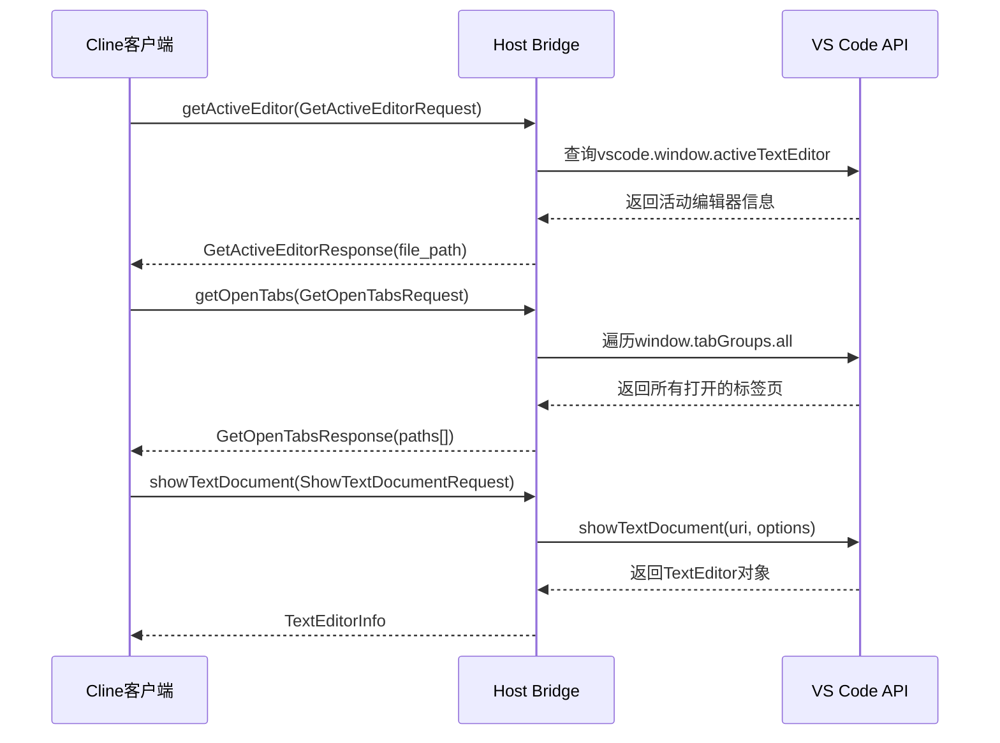

# 宿主窗口与工作区服务

<cite>
**本文档中引用的文件**  
- [window.proto](file://proto/host/window.proto)
- [workspace.proto](file://proto/host/workspace.proto)
- [getActiveEditor.ts](file://src/hosts/vscode/hostbridge/window/getActiveEditor.ts)
- [getOpenTabs.ts](file://src/hosts/vscode/hostbridge/window/getOpenTabs.ts)
- [showTextDocument.ts](file://src/hosts/vscode/hostbridge/window/showTextDocument.ts)
- [getWorkspacePaths.ts](file://src/hosts/vscode/hostbridge/workspace/getWorkspacePaths.ts)
- [ExternalHostBridgeClientManager.ts](file://src/hosts/external/host-bridge-client-manager.ts)
</cite>

## 目录
1. [简介](#简介)
2. [宿主窗口服务](#宿主窗口服务)
3. [宿主工作区服务](#宿主工作区服务)
4. [客户端调用机制](#客户端调用机制)
5. [服务调用序列图](#服务调用序列图)
6. [错误处理策略](#错误处理策略)
7. [上下文管理中的作用](#上下文管理中的作用)

## 简介
本文档详细描述了Cline客户端通过Host Bridge与宿主环境（如VS Code）进行交互的gRPC服务接口。重点涵盖`host/window.proto`中定义的`WindowService`和`host/workspace.proto`中的`WorkspaceService`，说明其在文件操作、编辑器控制和上下文管理中的关键作用。文档还解释了Cline客户端如何通过gRPC调用这些服务，并提供调用流程和错误处理的完整说明。

## 宿主窗口服务

`WindowService` 提供了与IDE窗口和编辑器交互的核心方法，使Cline能够控制编辑器行为、获取用户界面状态并执行UI操作。

### GetActiveEditor（获取当前活动编辑器）

该方法返回当前处于焦点状态的文本编辑器的文件路径。当Cline需要了解用户正在编辑的文件时，此接口至关重要。

- **请求类型**: `GetActiveEditorRequest`（空消息）
- **响应类型**: `GetActiveEditorResponse`
  - `file_path`: 当前活动编辑器的文件系统路径（可选）

此方法的实现通过VS Code的`vscode.window.activeTextEditor` API获取活动编辑器的文档URI，并将其转换为文件系统路径返回。

**Section sources**
- [window.proto](file://proto/host/window.proto#L148-L163)
- [getActiveEditor.ts](file://src/hosts/vscode/hostbridge/window/getActiveEditor.ts#L1-L7)

### GetOpenTabs（获取所有打开的标签页）

该方法返回当前在IDE中所有打开的文本文件标签页的路径列表，包括非活动和后台标签页。

- **请求类型**: `GetOpenTabsRequest`（空消息）
- **响应类型**: `GetOpenTabsResponse`
  - `paths`: 所有打开标签页的文件路径数组

实现通过遍历`vscode.window.tabGroups.all`中的所有标签组和标签，提取`TabInputText`类型的标签所关联的文件路径。

**Section sources**
- [window.proto](file://proto/host/window.proto#L138-L147)
- [getOpenTabs.ts](file://src/hosts/vscode/hostbridge/window/getOpenTabs.ts#L1-L10)

### ShowTextDocument（在编辑器中显示文件）

该方法用于在IDE编辑器中打开或显示指定文件，是Cline引导用户查看特定代码文件的主要方式。

- **请求类型**: `ShowTextDocumentRequest`
  - `path`: 要打开的文件路径（必需）
  - `options`: 显示选项（可选）
    - `preview`: 是否以预览模式打开
    - `preserve_focus`: 是否保留当前焦点
    - `view_column`: 指定在哪个编辑器列中打开
- **响应类型**: `TextEditorInfo`
  - `document_path`: 实际打开的文档路径
  - `view_column`: 编辑器所在列
  - `is_active`: 是否为当前活动编辑器

实现使用`vscode.window.showTextDocument` API，并在打开前检查是否存在重复标签，避免在不同列中打开同一文件。

**Section sources**
- [window.proto](file://proto/host/window.proto#L10-L15)
- [showTextDocument.ts](file://src/hosts/vscode/hostbridge/window/showTextDocument.ts#L1-L45)

## 宿主工作区服务

`WorkspaceService` 提供了与项目工作区交互的功能，使Cline能够获取项目结构信息和代码诊断。

### GetWorkspacePaths（获取工作区根路径）

该方法返回当前工作区的所有顶级目录路径，支持多根工作区配置。

- **请求类型**: `GetWorkspacePathsRequest`
  - `id`: 工作区唯一标识符（可选）
- **响应类型**: `GetWorkspacePathsResponse`
  - `id`: 工作区标识符（可选）
  - `paths`: 工作区根目录路径数组

在VS Code中，该方法通过`vscode.workspace.workspaceFolders`获取所有工作区文件夹的文件系统路径。

**Section sources**
- [workspace.proto](file://proto/host/workspace.proto#L10-L15)
- [getWorkspacePaths.ts](file://src/hosts/vscode/hostbridge/workspace/getWorkspacePaths.ts#L1-L5)

### GetDiagnostics（获取代码诊断信息）

该方法从工作区获取代码诊断信息（如错误、警告），帮助Cline理解代码质量和问题。

- **请求类型**: `GetDiagnosticsRequest`
  - `metadata`: 附加元数据（可选）
- **响应类型**: `GetDiagnosticsResponse`
  - `file_diagnostics`: 按文件分组的诊断信息数组

此功能允许Cline在生成代码建议时考虑现有的编译错误和代码问题，提供更准确的修复方案。

**Section sources**
- [workspace.proto](file://proto/host/workspace.proto#L22-L24)

## 客户端调用机制

Cline客户端通过Host Bridge的gRPC服务调用宿主环境功能。客户端使用预生成的gRPC存根通过TCP连接与Host Bridge通信。

### 客户端管理

`ExternalHostBridgeClientManager` 类负责管理所有gRPC客户端实例，确保连接复用，避免为每次调用创建新的TCP连接。

- **连接地址**: 默认为 `localhost:26041`，可通过 `HOST_BRIDGE_ADDRESS` 环境变量覆盖
- **客户端类型**: 包括 `WorkspaceServiceClient`、`WindowServiceClient` 等
- **连接管理**: 客户端实例在管理器生命周期内被复用

### 调用流程
1. Cline客户端创建相应的请求对象
2. 通过gRPC客户端调用远程方法
3. 接收并解析响应
4. 在客户端中处理结果

**Section sources**
- [host-bridge-client-manager.ts](file://src/hosts/external/host-bridge-client-manager.ts#L1-L33)

## 服务调用序列图

**Diagram sources**
- [getActiveEditor.ts](file://src/hosts/vscode/hostbridge/window/getActiveEditor.ts)
- [getOpenTabs.ts](file://src/hosts/vscode/hostbridge/window/getOpenTabs.ts)
- [showTextDocument.ts](file://src/hosts/vscode/hostbridge/window/showTextDocument.ts)

## 错误处理策略

宿主服务采用一致的错误处理模式，确保客户端能够可靠地处理各种异常情况。

### 常见错误场景
- **连接失败**: Host Bridge未运行或端口被占用
- **文件不存在**: 请求打开的文件路径无效
- **权限不足**: 无法访问特定文件或目录
- **API调用限制**: 宿主环境限制了频繁的UI操作

### 客户端处理
- 所有gRPC调用都应使用`try-catch`包裹
- 对于连接错误，实现重试机制
- 对于文件操作错误，提供用户友好的错误消息
- 记录详细的错误日志用于调试

### 健康检查
客户端在启动时会执行健康检查，通过`waitForHostBridgeReady`函数确认Host Bridge服务是否可用，最多等待60秒。

**Section sources**
- [host-bridge-client-manager.ts](file://src/hosts/external/host-bridge-client-manager.ts)
- [hostbridge-client.ts](file://src/standalone/hostbridge-client.ts)

## 上下文管理中的作用

这些宿主服务在Cline的上下文管理中扮演着核心角色：

### 编辑器上下文感知
- `GetActiveEditor` 提供当前用户焦点，使Cline能理解用户正在处理的代码
- `GetOpenTabs` 提供更广泛的上下文视图，了解用户正在关注的文件集合

### 工作区上下文构建
- `GetWorkspacePaths` 帮助Cline建立项目结构认知，支持跨文件操作
- `GetDiagnostics` 提供代码质量上下文，指导Cline优先修复关键问题

### 用户交互闭环
- `ShowTextDocument` 实现了从建议到行动的闭环，Cline可以主动引导用户查看相关代码
- 这些服务共同构成了Cline与开发者协同工作的基础，实现了智能助手与IDE的深度集成

**Section sources**
- [window.proto](file://proto/host/window.proto)
- [workspace.proto](file://proto/host/workspace.proto)
- [WebviewProvider.ts](file://src/core/webview/WebviewProvider.ts)