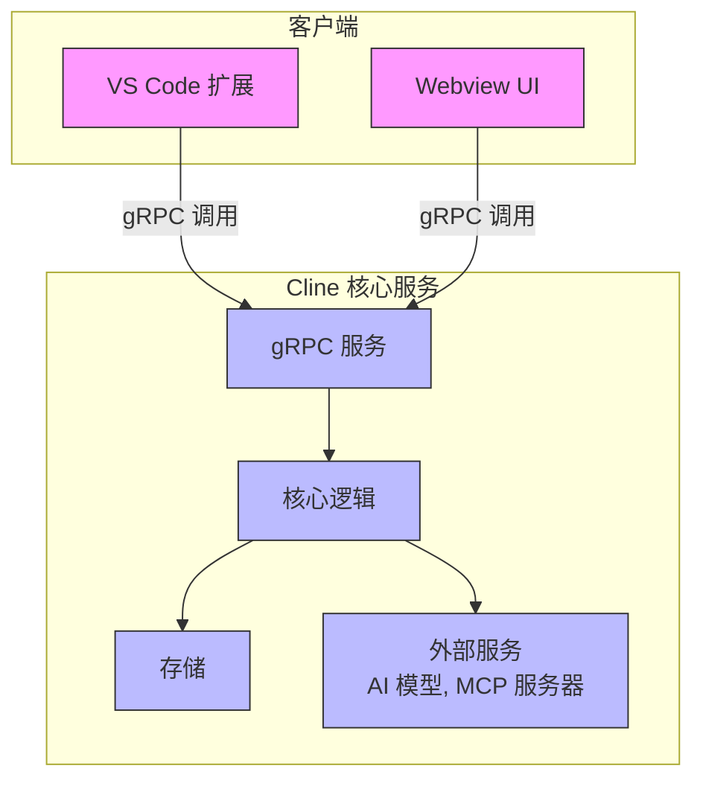

# gRPC API

<cite>
**本文档中引用的文件**  
- [account.proto](file://proto/cline/account.proto)
- [browser.proto](file://proto/cline/browser.proto)
- [checkpoints.proto](file://proto/cline/checkpoints.proto)
- [commands.proto](file://proto/cline/commands.proto)
- [common.proto](file://proto/cline/common.proto)
- [file.proto](file://proto/cline/file.proto)
- [mcp.proto](file://proto/cline/mcp.proto)
- [models.proto](file://proto/cline/models.proto)
- [slash.proto](file://proto/cline/slash.proto)
- [state.proto](file://proto/cline/state.proto)
- [task.proto](file://proto/cline/task.proto)
- [ui.proto](file://proto/cline/ui.proto)
- [web.proto](file://proto/cline/web.proto)
</cite>

## 目录
1. [引言](#引言)
2. [服务概览](#服务概览)
3. [AccountService](#accountservice)
4. [BrowserService](#browserservice)
5. [CheckpointsService](#checkpointsservice)
6. [CommandsService](#commandsservice)
7. [FileService](#fileservice)
8. [McpService](#mcpservice)
9. [ModelsService](#modelsservice)
10. [SlashService](#slashservice)
11. [StateService](#stateservice)
12. [TaskService](#taskservice)
13. [UIService](#uiservice)
14. [WebService](#webservice)
15. [流式传输模式](#流式传输模式)
16. [错误处理机制](#错误处理机制)
17. [系统上下文图](#系统上下文图)
18. [TypeScript调用示例](#typescript调用示例)

## 引言
本文档为Cline的gRPC API提供详尽的参考说明。基于`proto/`目录下的所有`.proto`文件，详细描述了每个gRPC服务的功能、方法、消息结构以及使用方式。文档旨在帮助开发者理解如何与Cline后端服务进行交互，包括账户管理、文件操作、模型配置、任务执行等核心功能。

## 服务概览
Cline的gRPC API由多个服务组成，每个服务负责特定的功能领域。以下是所有服务的简要说明：

- **AccountService**：处理用户账户相关的操作，如登录、登出、认证状态管理及信用额度查询。
- **BrowserService**：管理浏览器连接和调试模式，支持本地或远程浏览器实例。
- **CheckpointsService**：用于管理代码检查点的创建与恢复。
- **CommandsService**：执行IDE命令，如“使用Cline修复”、“解释代码”等上下文菜单操作。
- **FileService**：提供文件系统操作，包括打开文件、搜索文件、管理规则文件等。
- **McpService**：管理MCP（Model Control Protocol）服务器，支持添加、删除、重启远程MCP服务。
- **ModelsService**：处理AI模型相关的操作，如获取模型列表、刷新模型、更新API配置。
- **SlashService**：处理斜杠命令，如报告Bug、内容压缩等。
- **StateService**：管理应用状态，包括设置更新、终端配置、欢迎界面状态等。
- **TaskService**：管理任务生命周期，包括创建任务、取消任务、获取历史记录等。
- **UIService**：处理UI相关的操作，如初始化Webview、打开URL、订阅按钮点击事件。
- **WebService**：处理网页内容抓取和链接预览。

**Section sources**
- [account.proto](file://proto/cline/account.proto)
- [browser.proto](file://proto/cline/browser.proto)
- [checkpoints.proto](file://proto/cline/checkpoints.proto)
- [commands.proto](file://proto/cline/commands.proto)
- [file.proto](file://proto/cline/file.proto)
- [mcp.proto](file://proto/cline/mcp.proto)
- [models.proto](file://proto/cline/models.proto)
- [slash.proto](file://proto/cline/slash.proto)
- [state.proto](file://proto/cline/state.proto)
- [task.proto](file://proto/cline/task.proto)
- [ui.proto](file://proto/cline/ui.proto)
- [web.proto](file://proto/cline/web.proto)

## AccountService
`AccountService` 用于管理用户账户相关的操作，包括登录、登出、认证状态监听、信用额度查询等。

### RPC方法
| 方法名 | 请求消息类型 | 响应消息类型 | 描述 |
|-------|-------------|-------------|------|
| `accountLoginClicked` | EmptyRequest | String | 处理用户点击登录链接，生成nonce并打开认证URL |
| `accountLogoutClicked` | EmptyRequest | Empty | 处理用户点击登出按钮，清除API密钥和用户状态 |
| `subscribeToAuthStatusUpdate` | EmptyRequest | stream AuthState | 订阅认证状态变更事件 |
| `authStateChanged` | AuthStateChangedRequest | AuthState | 处理Firebase上下文中的认证状态变更 |
| `getUserCredits` | EmptyRequest | UserCreditsData | 获取用户信用数据（余额、使用记录、支付记录） |
| `getOrganizationCredits` | GetOrganizationCreditsRequest | OrganizationCreditsData | 获取组织信用数据 |
| `getUserOrganizations` | EmptyRequest | UserOrganizationsResponse | 获取用户所属的所有组织 |
| `setUserOrganization` | UserOrganizationUpdateRequest | Empty | 设置当前用户组织 |
| `openrouterAuthClicked` | EmptyRequest | Empty | 处理OpenRouter认证点击事件 |

### 消息结构
#### AuthStateChangedRequest
- `metadata` (Metadata): 元数据
- `user` (UserInfo): 用户信息

#### UserInfo
- `uid` (string): 用户唯一标识
- `display_name` (string, 可选): 显示名称
- `email` (string, 可选): 邮箱
- `photo_url` (string, 可选): 头像URL
- `app_base_url` (string, 可选): Cline应用基础URL

#### UserCreditsData
- `balance` (UserCreditsBalance): 当前余额
- `usage_transactions` (repeated UsageTransaction): 使用记录
- `payment_transactions` (repeated PaymentTransaction): 支付记录

#### UsageTransaction
- `ai_inference_provider_name` (string): AI提供商名称
- `ai_model_name` (string): 模型名称
- `ai_model_type_name` (string): 模型类型
- `completion_tokens` (int32): 完成token数
- `cost_usd` (double): 成本（美元）
- `created_at` (string): 创建时间
- `credits_used` (double): 使用的积分
- `generation_id` (string): 生成ID
- `organization_id` (string): 组织ID
- `prompt_tokens` (int32): 提示token数
- `total_tokens` (int32): 总token数
- `user_id` (string): 用户ID

**Section sources**
- [account.proto](file://proto/cline/account.proto#L1-L132)

## BrowserService
`BrowserService` 用于管理浏览器连接，支持Chrome调试模式的自动启动和连接测试。

### RPC方法
| 方法名 | 请求消息类型 | 响应消息类型 | 描述 |
|-------|-------------|-------------|------|
| `getBrowserConnectionInfo` | EmptyRequest | BrowserConnectionInfo | 获取当前浏览器连接信息 |
| `testBrowserConnection` | StringRequest | BrowserConnection | 测试指定端点的浏览器连接 |
| `discoverBrowser` | EmptyRequest | BrowserConnection | 自动发现可用的浏览器实例 |
| `getDetectedChromePath` | EmptyRequest | ChromePath | 获取检测到的Chrome可执行文件路径 |
| `relaunchChromeDebugMode` | EmptyRequest | String | 重启Chrome并启用调试模式 |

### 消息结构
#### BrowserConnectionInfo
- `is_connected` (bool): 是否已连接
- `is_remote` (bool): 是否为远程连接
- `host` (string, 可选): 远程主机地址

#### BrowserConnection
- `success` (bool): 连接是否成功
- `message` (string): 结果消息
- `endpoint` (string, 可选): WebSocket端点

#### ChromePath
- `path` (string): Chrome可执行文件路径
- `is_bundled` (bool): 是否为捆绑版本

**Section sources**
- [browser.proto](file://proto/cline/browser.proto#L1-L51)

## CheckpointsService
`CheckpointsService` 用于管理代码检查点，支持差异比较和恢复操作。

### RPC方法
| 方法名 | 请求消息类型 | 响应消息类型 | 描述 |
|-------|-------------|-------------|------|
| `checkpointDiff` | Int64Request | Empty | 比较指定检查点与当前状态的差异 |
| `checkpointRestore` | CheckpointRestoreRequest | Empty | 恢复到指定检查点 |

### 消息结构
#### CheckpointRestoreRequest
- `metadata` (Metadata): 元数据
- `number` (int64): 检查点编号
- `restore_type` (string): 恢复类型（如"full", "code_only"）
- `offset` (int64, 可选): 偏移量

**Section sources**
- [checkpoints.proto](file://proto/cline/checkpoints.proto#L1-L18)

## CommandsService
`CommandsService` 用于执行IDE中的上下文命令，如“使用Cline修复”、“解释代码”等。

### RPC方法
| 方法名 | 请求消息类型 | 响应消息类型 | 描述 |
|-------|-------------|-------------|------|
| `addToCline` | CommandContext | Empty | 将选中内容添加到Cline上下文 |
| `fixWithCline` | CommandContext | Empty | 使用Cline修复当前文件或选中代码 |
| `explainWithCline` | CommandContext | Empty | 使用Cline解释当前文件或选中代码 |
| `improveWithCline` | CommandContext | Empty | 使用Cline改进当前文件或选中代码 |

### 消息结构
#### CommandContext
- `file_path` (string, 可选): 当前文件绝对路径
- `selected_text` (string, 可选): 选中的文本
- `language` (string, 可选): 文件语言标识符
- `diagnostics` (repeated Diagnostic): 当前文件的诊断问题

**Section sources**
- [commands.proto](file://proto/cline/commands.proto#L1-L29)

## FileService
`FileService` 提供文件系统操作，包括文件打开、搜索、规则管理等功能。

### RPC方法
| 方法名 | 请求消息类型 | 响应消息类型 | 描述 |
|-------|-------------|-------------|------|
| `copyToClipboard` | StringRequest | Empty | 将文本复制到剪贴板 |
| `openFile` | StringRequest | Empty | 在编辑器中打开文件 |
| `openImage` | StringRequest | Empty | 在系统查看器中打开图片 |
| `openMention` | StringRequest | Empty | 打开提及的内容（文件、URL等） |
| `deleteRuleFile` | RuleFileRequest | RuleFile | 删除规则文件 |
| `createRuleFile` | RuleFileRequest | RuleFile | 创建规则文件 |
| `searchCommits` | StringRequest | GitCommits | 搜索Git提交记录 |
| `selectFiles` | BooleanRequest | StringArrays | 选择文件或图片 |
| `getRelativePaths` | RelativePathsRequest | RelativePaths | 将URI转换为工作区相对路径 |
| `searchFiles` | FileSearchRequest | FileSearchResults | 模糊搜索工作区文件 |
| `toggleClineRule` | ToggleClineRuleRequest | ToggleClineRules | 切换Cline规则启用状态 |
| `toggleCursorRule` | ToggleCursorRuleRequest | ClineRulesToggles | 切换Cursor规则启用状态 |
| `toggleWindsurfRule` | ToggleWindsurfRuleRequest | ClineRulesToggles | 切换Windsurf规则启用状态 |
| `refreshRules` | EmptyRequest | RefreshedRules | 刷新所有规则状态 |
| `openTaskHistory` | StringRequest | Empty | 打开任务历史文件 |
| `toggleWorkflow` | ToggleWorkflowRequest | ClineRulesToggles | 切换工作流启用状态 |
| `ifFileExistsRelativePath` | StringRequest | BooleanResponse | 检查相对路径文件是否存在 |
| `openFileRelativePath` | StringRequest | Empty | 通过相对路径打开文件 |
| `openFocusChainFile` | StringRequest | Empty | 打开或创建焦点链检查清单文件 |

### 消息结构
#### FileSearchRequest
- `metadata` (Metadata): 元数据
- `query` (string): 搜索查询
- `mentions_request_id` (string, 可选): 请求ID
- `limit` (int32, 可选): 结果数量限制
- `selected_type` (FileSearchType, 可选): 文件类型过滤

#### FileInfo
- `path` (string): 相对于工作区根目录的路径
- `type` (string): "file" 或 "folder"
- `label` (string, 可选): 显示名称

**Section sources**
- [file.proto](file://proto/cline/file.proto#L1-L186)

## McpService
`McpService` 用于管理MCP（Model Control Protocol）服务器，支持远程工具集成。

### RPC方法
| 方法名 | 请求消息类型 | 响应消息类型 | 描述 |
|-------|-------------|-------------|------|
| `toggleMcpServer` | ToggleMcpServerRequest | McpServers | 启用/禁用MCP服务器 |
| `updateMcpTimeout` | UpdateMcpTimeoutRequest | McpServers | 更新MCP服务器超时时间 |
| `addRemoteMcpServer` | AddRemoteMcpServerRequest | McpServers | 添加远程MCP服务器 |
| `downloadMcp` | StringRequest | McpDownloadResponse | 下载MCP服务器 |
| `restartMcpServer` | StringRequest | McpServers | 重启MCP服务器 |
| `deleteMcpServer` | StringRequest | McpServers | 删除MCP服务器 |
| `toggleToolAutoApprove` | ToggleToolAutoApproveRequest | McpServers | 切换工具自动批准状态 |
| `refreshMcpMarketplace` | EmptyRequest | McpMarketplaceCatalog | 刷新MCP市场目录 |
| `openMcpSettings` | EmptyRequest | Empty | 打开MCP设置界面 |
| `subscribeToMcpMarketplaceCatalog` | EmptyRequest | stream McpMarketplaceCatalog | 订阅MCP市场目录更新 |
| `getLatestMcpServers` | Empty | McpServers | 获取最新的MCP服务器列表 |
| `subscribeToMcpServers` | EmptyRequest | stream McpServers | 订阅MCP服务器状态更新 |

### 消息结构
#### McpServer
- `name` (string): 服务器名称
- `config` (string): 配置信息
- `status` (McpServerStatus): 服务器状态
- `error` (string, 可选): 错误信息
- `tools` (repeated McpTool): 工具列表
- `resources` (repeated McpResource): 资源列表
- `resource_templates` (repeated McpResourceTemplate): 资源模板
- `disabled` (bool, 可选): 是否禁用
- `timeout` (int32, 可选): 超时时间（秒）

#### McpServerStatus (enum)
- `MCP_SERVER_STATUS_DISCONNECTED` = 0
- `MCP_SERVER_STATUS_CONNECTED` = 1
- `MCP_SERVER_STATUS_CONNECTING` = 2

**Section sources**
- [mcp.proto](file://proto/cline/mcp.proto#L1-L132)

## ModelsService
`ModelsService` 用于管理AI模型配置和API设置。

### RPC方法
| 方法名 | 请求消息类型 | 响应消息类型 | 描述 |
|-------|-------------|-------------|------|
| `getLmStudioModels` | EmptyRequest | StringArray | 获取LmStudio模型列表 |
| `getOllamaModels` | EmptyRequest | StringArray | 获取Ollama模型列表 |
| `getSapAiCoreModels` | EmptyRequest | StringArray | 获取SAP AI Core模型列表 |
| `getVsCodeLmModels` | EmptyRequest | StringArray | 获取VS Code语言模型列表 |
| `refreshBasetenModels` | EmptyRequest | Empty | 刷新Baseten模型列表 |
| `refreshGroqModels` | EmptyRequest | Empty | 刷新Groq模型列表 |
| `refreshHuggingFaceModels` | EmptyRequest | Empty | 刷新Hugging Face模型列表 |
| `refreshOpenAiModels` | EmptyRequest | Empty | 刷新OpenAI模型列表 |
| `refreshOpenRouterModels` | EmptyRequest | Empty | 刷新OpenRouter模型列表 |
| `refreshRequestyModels` | EmptyRequest | Empty | 刷新Requesty模型列表 |
| `refreshVercelAiGatewayModels` | EmptyRequest | Empty | 刷新Vercel AI Gateway模型列表 |
| `subscribeToOpenRouterModels` | EmptyRequest | stream StringArray | 订阅OpenRouter模型更新 |
| `updateApiConfigurationProto` | ApiConfigurationRequest | Empty | 更新API配置 |

**Section sources**
- [models.proto](file://proto/cline/models.proto)

## SlashService
`SlashService` 处理斜杠命令相关的操作。

### RPC方法
| 方法名 | 请求消息类型 | 响应消息类型 | 描述 |
|-------|-------------|-------------|------|
| `condense` | StringRequest | Empty | 压缩内容 |
| `reportBug` | StringRequest | Empty | 报告Bug |

**Section sources**
- [slash.proto](file://proto/cline/slash.proto)

## StateService
`StateService` 管理应用状态和用户设置。

### RPC方法
| 方法名 | 请求消息类型 | 响应消息类型 | 描述 |
|-------|-------------|-------------|------|
| `getAvailableTerminalProfiles` | EmptyRequest | StringArray | 获取可用终端配置文件 |
| `getLatestState` | EmptyRequest | AppState | 获取最新应用状态 |
| `resetState` | EmptyRequest | Empty | 重置应用状态 |
| `setWelcomeViewCompleted` | EmptyRequest | Empty | 设置欢迎视图已完成 |
| `subscribeToState` | EmptyRequest | stream AppState | 订阅应用状态更新 |
| `toggleFavoriteModel` | StringRequest | Empty | 切换收藏模型 |
| `togglePlanActModeProto` | BooleanRequest | Empty | 切换计划/执行模式 |
| `updateAutoApprovalSettings` | AutoApprovalSettingsRequest | Empty | 更新自动批准设置 |
| `updateSettings` | SettingsRequest | Empty | 更新设置 |
| `updateTelemetrySetting` | TelemetrySettingRequest | Empty | 更新遥测设置 |
| `updateTerminalConnectionTimeout` | Int64Request | Empty | 更新终端连接超时时间 |
| `updateTerminalReuseEnabled` | BooleanRequest | Empty | 更新终端复用启用状态 |

**Section sources**
- [state.proto](file://proto/cline/state.proto)

## TaskService
`TaskService` 管理任务的创建、执行和历史记录。

### RPC方法
| 方法名 | 请求消息类型 | 响应消息类型 | 描述 |
|-------|-------------|-------------|------|
| `askResponse` | AskResponseRequest | Empty | 处理任务响应 |
| `cancelTask` | StringRequest | Empty | 取消任务 |
| `clearTask` | StringRequest | Empty | 清除任务 |
| `deleteAllTaskHistory` | EmptyRequest | Empty | 删除所有任务历史 |
| `deleteTasksWithIds` | StringArrayRequest | Empty | 删除指定ID的任务 |
| `executeQuickWin` | QuickWinRequest | Empty | 执行快速胜利任务 |
| `exportTaskWithId` | StringRequest | Bytes | 导出指定ID的任务 |
| `getTaskHistory` | EmptyRequest | TaskHistoryResponse | 获取任务历史 |
| `getTotalTasksSize` | EmptyRequest | Int64 | 获取任务总大小 |
| `newTask` | NewTaskRequest | Empty | 创建新任务 |
| `showTaskWithId` | StringRequest | Empty | 显示指定ID的任务 |
| `taskCompletionViewChanges` | TaskCompletionViewRequest | Empty | 任务完成视图变更 |
| `taskFeedback` | TaskFeedbackRequest | Empty | 提交任务反馈 |
| `toggleTaskFavorite` | StringRequest | Empty | 切换任务收藏状态 |

### 流式方法
- `ExecuteTask` (TaskRequest) returns (stream TaskResponse): 执行任务并流式返回响应

**Section sources**
- [task.proto](file://proto/cline/task.proto)

## UIService
`UIService` 处理UI相关的操作和事件订阅。

### RPC方法
| 方法名 | 请求消息类型 | 响应消息类型 | 描述 |
|-------|-------------|-------------|------|
| `getWebviewHtml` | WebviewHtmlRequest | String | 获取Webview HTML内容 |
| `initializeWebview` | InitializeWebviewRequest | Empty | 初始化Webview |
| `onDidShowAnnouncement` | AnnouncementRequest | Empty | 处理公告显示事件 |
| `openUrl` | StringRequest | Empty | 打开URL |
| `openWalkthrough` | EmptyRequest | Empty | 打开引导流程 |
| `scrollToSettings` | EmptyRequest | Empty | 滚动到设置区域 |
| `subscribeToAccountButtonClicked` | EmptyRequest | stream Empty | 订阅账户按钮点击事件 |
| `subscribeToAddToInput` | EmptyRequest | stream String | 订阅添加到输入事件 |
| `subscribeToChatButtonClicked` | EmptyRequest | stream Empty | 订阅聊天按钮点击事件 |
| `subscribeToDidBecomeVisible` | EmptyRequest | stream Empty | 订阅可见性变更事件 |
| `subscribeToFocusChatInput` | EmptyRequest | stream Empty | 订阅聚焦聊天输入事件 |
| `subscribeToHistoryButtonClicked` | EmptyRequest | stream Empty | 订阅历史按钮点击事件 |
| `subscribeToMcpButtonClicked` | EmptyRequest | stream Empty | 订阅MCP按钮点击事件 |
| `subscribeToPartialMessage` | EmptyRequest | stream String | 订阅部分消息事件 |
| `subscribeToRelinquishControl` | EmptyRequest | stream Empty | 订阅放弃控制权事件 |
| `subscribeToSettingsButtonClicked` | EmptyRequest | stream Empty | 订阅设置按钮点击事件 |

**Section sources**
- [ui.proto](file://proto/cline/ui.proto)

## WebService
`WebService` 处理网页内容抓取和链接预览。

### RPC方法
| 方法名 | 请求消息类型 | 响应消息类型 | 描述 |
|-------|-------------|-------------|------|
| `checkIsImageUrl` | StringRequest | BooleanResponse | 检查URL是否为图片 |
| `fetchOpenGraphData` | StringRequest | OpenGraphData | 获取Open Graph数据 |
| `openInBrowser` | StringRequest | Empty | 在浏览器中打开链接 |

### 消息结构
#### OpenGraphData
- `title` (string): 页面标题
- `description` (string): 页面描述
- `image` (string): 预览图片URL
- `url` (string): 原始URL

**Section sources**
- [web.proto](file://proto/cline/web.proto)

## 流式传输模式
Cline的gRPC API支持流式传输，用于实时更新和长时任务。主要流式方法包括：

- `AccountService.subscribeToAuthStatusUpdate`: 认证状态变更的服务器流
- `McpService.subscribeToMcpMarketplaceCatalog`: MCP市场目录更新的服务器流
- `McpService.subscribeToMcpServers`: MCP服务器状态更新的服务器流
- `StateService.subscribeToState`: 应用状态更新的服务器流
- `UIService` 中的多个 `subscribeTo*` 方法：UI事件的服务器流
- `TaskService.ExecuteTask`: 任务执行结果的服务器流

这些流式方法允许客户端实时接收服务器端的状态更新，无需轮询。

**Section sources**
- [account.proto](file://proto/cline/account.proto#L10-L11)
- [mcp.proto](file://proto/cline/mcp.proto#L50-L52)
- [state.proto](file://proto/cline/state.proto)
- [ui.proto](file://proto/cline/ui.proto)

## 错误处理机制
gRPC API遵循标准的gRPC状态码进行错误处理。常见的状态码及其含义包括：

- **OK (0)**: 操作成功
- **CANCELLED (1)**: 操作被取消
- **UNKNOWN (2)**: 未知错误
- **INVALID_ARGUMENT (3)**: 请求参数无效
- **DEADLINE_EXCEEDED (4)**: 操作超时
- **NOT_FOUND (5)**: 请求资源未找到
- **ALREADY_EXISTS (6)**: 资源已存在
- **PERMISSION_DENIED (7)**: 权限不足
- **UNAUTHENTICATED (16)**: 未认证
- **FAILED_PRECONDITION (9)**: 前提条件失败
- **ABORTED (10)**: 操作被中止
- **OUT_OF_RANGE (11)**: 请求范围无效
- **UNIMPLEMENTED (12)**: 方法未实现
- **INTERNAL (13)**: 内部错误
- **UNAVAILABLE (14)**: 服务不可用
- **DATA_LOSS (15)**: 数据丢失

客户端应根据这些状态码实现相应的错误处理逻辑，如重试、用户提示或日志记录。

**Section sources**
- [common.proto](file://proto/cline/common.proto)

## 系统上下文图
以下图表展示了gRPC服务在Cline架构中的位置以及客户端如何与服务端通信。



**Diagram sources**
- [account.proto](file://proto/cline/account.proto)
- [browser.proto](file://proto/cline/browser.proto)
- [task.proto](file://proto/cline/task.proto)

## TypeScript调用示例
以下是如何使用TypeScript调用Cline gRPC API的示例：

```typescript
// 示例：调用AccountService获取用户信用
async function getUserCredits() {
  const client = new AccountServiceClient('localhost:50051');
  const request = new EmptyRequest();

  try {
    const response = await client.getUserCredits(request);
    console.log('用户信用:', response.getBalance()?.getCurrentBalance());
    response.getUsageTransactionsList().forEach(tx => {
      console.log(`模型: ${tx.getAiModelName()}, 成本: $${tx.getCostUsd()}`);
    });
  } catch (error) {
    console.error('获取信用失败:', error);
  }
}

// 示例：订阅认证状态更新
function subscribeToAuth() {
  const client = new AccountServiceClient('localhost:50051');
  const request = new EmptyRequest();
  
  const call = client.subscribeToAuthStatusUpdate(request);
  
  call.on('data', (authState: AuthState) => {
    if (authState.getUser()) {
      console.log('用户已登录:', authState.getUser()?.getEmail());
    } else {
      console.log('用户已登出');
    }
  });
  
  call.on('error', (error) => {
    console.error('订阅错误:', error);
  });
}
```

**Section sources**
- [account.proto](file://proto/cline/account.proto)
- [common.proto](file://proto/cline/common.proto)