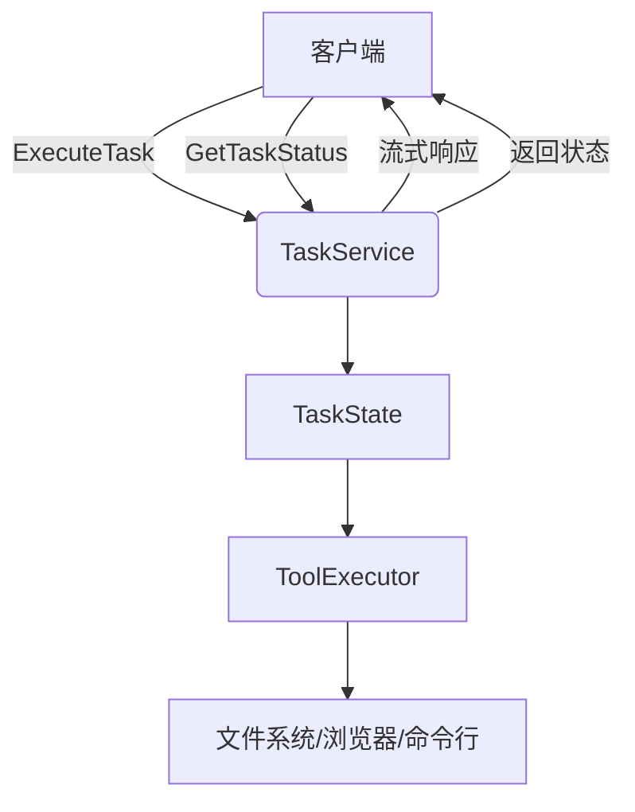
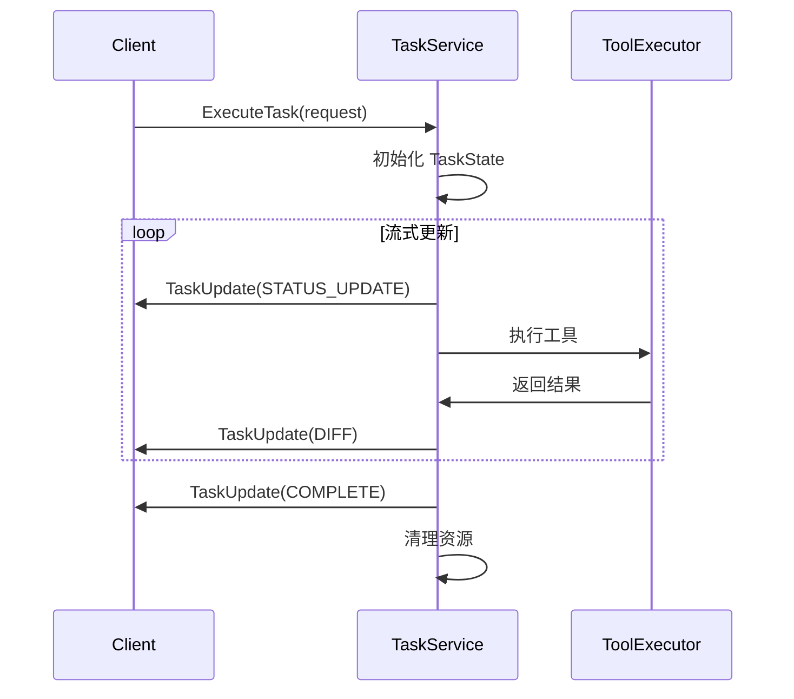
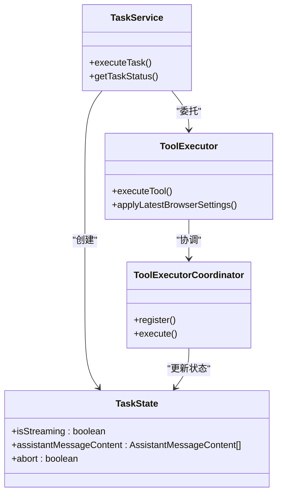

# 任务服务

<cite>
**本文档中引用的文件**  
- [task.proto](file://proto/cline/task.proto)
- [TaskState.ts](file://src/core/task/TaskState.ts)
- [ToolExecutor.ts](file://src/core/task/ToolExecutor.ts)
- [grpc-handler.ts](file://src/core/controller/grpc-handler.ts)
- [grpc-service.ts](file://src/core/controller/grpc-service.ts)
</cite>

## 目录
1. [简介](#简介)
2. [核心组件](#核心组件)
3. [API 方法详解](#api-方法详解)
4. [请求与响应消息结构](#请求与响应消息结构)
5. [流式响应生命周期](#流式响应生命周期)
6. [TypeScript 客户端示例](#typescript-客户端示例)
7. [服务内部交互机制](#服务内部交互机制)
8. [错误处理与超时机制](#错误处理与超时机制)
9. [结论](#结论)

## 简介
`TaskService` 是 Cline 系统中的核心服务之一，负责管理开发任务的执行、状态查询和生命周期控制。该服务通过 gRPC 接口暴露功能，支持流式通信，能够实时推送任务更新。本文档深入解析 `task.proto` 中定义的 `ExecuteTask`（流式）和 `GetTaskStatus` 方法，详细说明请求与响应的消息结构、流式更新的生命周期，并提供 TypeScript 客户端示例，帮助开发者理解如何与该服务进行交互。

**Section sources**
- [task.proto](file://proto/cline/task.proto)

## 核心组件
`TaskService` 的实现依赖于多个核心组件，包括 `TaskState`、`ToolExecutor` 和 gRPC 处理层。`TaskState` 类管理任务的运行时状态，如流式传输标志、内容处理索引和错误跟踪。`ToolExecutor` 负责执行由 AI 模型生成的工具调用，协调文件操作、命令执行等复杂任务。gRPC 处理层（`grpc-handler.ts` 和 `grpc-service.ts`）则负责接收客户端请求，调用相应的服务方法，并处理流式响应的发送。

**Section sources**
- [TaskState.ts](file://src/core/task/TaskState.ts#L1-L65)
- [ToolExecutor.ts](file://src/core/task/ToolExecutor.ts#L1-L390)
- [grpc-handler.ts](file://src/core/controller/grpc-handler.ts#L1-L202)
- [grpc-service.ts](file://src/core/controller/grpc-service.ts#L1-L153)

## API 方法详解
`TaskService` 提供了多个 RPC 方法来管理任务。其中，`ExecuteTask` 是一个流式方法，用于启动一个新任务并持续接收任务更新。`GetTaskStatus` 方法则用于查询特定任务的当前状态。此外，服务还提供了 `cancelTask`、`clearTask`、`getTaskHistory` 等辅助方法，以支持完整的任务管理功能。



**Diagram sources**
- [task.proto](file://proto/cline/task.proto#L15-L35)
- [TaskState.ts](file://src/core/task/TaskState.ts#L1-L65)
- [ToolExecutor.ts](file://src/core/task/ToolExecutor.ts#L1-L390)

## 请求与响应消息结构
### ExecuteTaskRequest
`ExecuteTaskRequest` 消息包含启动任务所需的所有信息：
- `task_id`: 任务的唯一标识符，用于后续的状态查询和管理。
- `prompt`: 用户输入的指令或问题，作为任务的初始输入。
- `context`: 任务执行所需的上下文信息，可能包括当前打开的文件、项目结构等。

### TaskUpdate
`TaskUpdate` 是 `ExecuteTask` 方法的流式响应消息，其生命周期包括多个阶段：
- `STATUS_UPDATE`: 任务状态更新，如“正在分析代码”、“准备修改文件”。
- `DIFF`: 文件差异信息，表示 AI 模型建议的代码变更。
- `COMPLETE`: 任务完成，包含最终结果和统计信息。

**Section sources**
- [task.proto](file://proto/cline/task.proto#L40-L116)

## 流式响应生命周期
当客户端调用 `ExecuteTask` 时，服务会启动一个异步任务，并通过流式通道持续发送 `TaskUpdate` 消息。生命周期如下：
1. **初始化**: 服务创建 `TaskState` 实例，设置 `isStreaming = true`。
2. **状态更新**: 服务通过 `STATUS_UPDATE` 事件通知客户端任务的当前阶段。
3. **工具执行**: `ToolExecutor` 根据 AI 模型的指令执行相应操作，如读取文件、执行命令，并通过 `DIFF` 事件发送变更。
4. **完成**: 任务成功完成后，发送 `COMPLETE` 事件，并关闭流。



**Diagram sources**
- [TaskState.ts](file://src/core/task/TaskState.ts#L1-L65)
- [ToolExecutor.ts](file://src/core/task/ToolExecutor.ts#L1-L390)

## TypeScript 客户端示例
以下示例展示了如何使用 gRPC 客户端启动一个任务并处理流式更新：

```typescript
const client = new TaskServiceClient(address, credentials);

const request = ExecuteTaskRequest.create({
  taskId: "task-123",
  prompt: "修复登录页面的样式问题",
  context: getContext()
});

const stream = client.executeTask(request);

stream.on('data', (update: TaskUpdate) => {
  switch (update.type) {
    case TaskUpdateType.STATUS_UPDATE:
      console.log(`状态: ${update.status}`);
      break;
    case TaskUpdateType.DIFF:
      console.log(`差异: ${update.diff}`);
      break;
    case TaskUpdateType.COMPLETE:
      console.log(`任务完成: ${update.result}`);
      stream.cancel();
      break;
  }
});

stream.on('error', (err) => {
  console.error('任务执行出错:', err);
});
```

**Section sources**
- [grpc-handler.ts](file://src/core/controller/grpc-handler.ts#L1-L202)

## 服务内部交互机制
`TaskService` 通过 `ToolExecutor` 与核心任务状态机 `TaskState` 进行交互。当收到 `ExecuteTask` 请求时，服务会创建一个 `TaskState` 实例来跟踪任务状态，并将请求委托给 `ToolExecutor`。`ToolExecutor` 使用 `ToolExecutorCoordinator` 来注册和执行各种工具处理器，如 `ReadFileToolHandler`、`WriteToFileToolHandler` 等。每个工具执行的结果都会更新 `TaskState`，并通过流式响应发送给客户端。



**Diagram sources**
- [TaskState.ts](file://src/core/task/TaskState.ts#L1-L65)
- [ToolExecutor.ts](file://src/core/task/ToolExecutor.ts#L1-L390)
- [grpc-service.ts](file://src/core/controller/grpc-service.ts#L1-L153)

## 错误处理与超时机制
`TaskService` 实现了完善的错误处理机制。当工具执行失败时，`ToolExecutor` 会捕获异常，通过 `say("error", errorMessage)` 发送错误信息，并将错误结果推送到 `userMessageContent`。`TaskState` 中的 `consecutiveMistakeCount` 用于跟踪连续错误次数，可能触发自动重试或任务中止。对于超时，虽然 `task.proto` 中未直接定义超时字段，但 `grpc-handler.ts` 中的 `GrpcRequestRegistry` 可以用于跟踪和取消长时间运行的请求。

**Section sources**
- [ToolExecutor.ts](file://src/core/task/ToolExecutor.ts#L1-L390)
- [TaskState.ts](file://src/core/task/TaskState.ts#L1-L65)
- [grpc-handler.ts](file://src/core/controller/grpc-handler.ts#L1-L202)

## 结论
`TaskService` 是一个功能强大且设计精良的 gRPC 服务，它通过流式通信实现了与 AI 模型的实时交互。通过 `TaskState` 和 `ToolExecutor` 的紧密协作，服务能够管理复杂的多步骤开发任务，提供详细的进度更新，并妥善处理错误和异常情况。开发者可以利用提供的 TypeScript 示例快速集成该服务，构建高效的自动化开发工具。