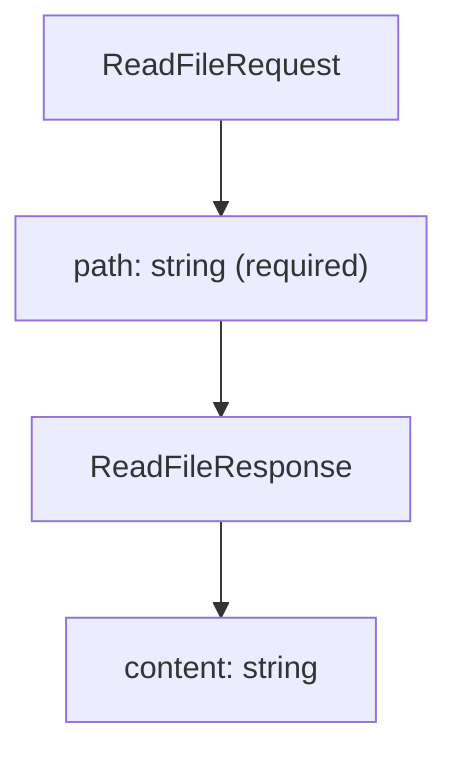
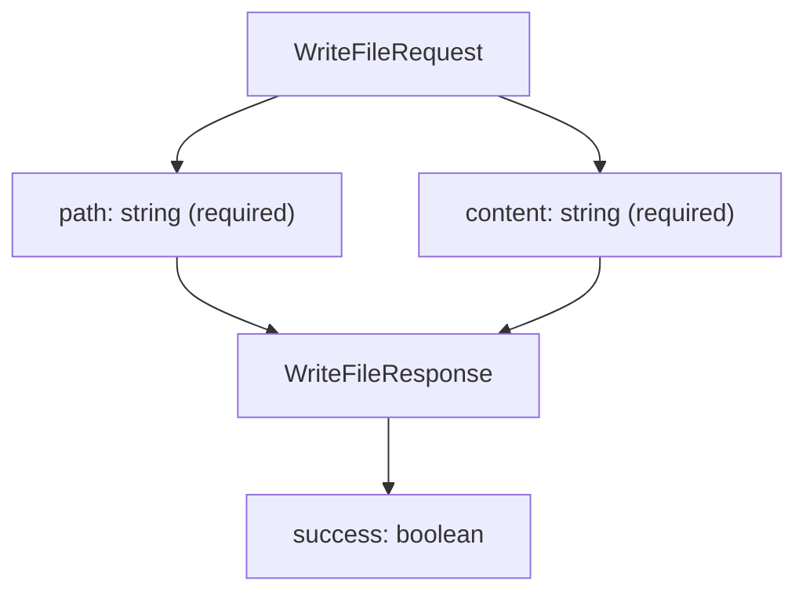
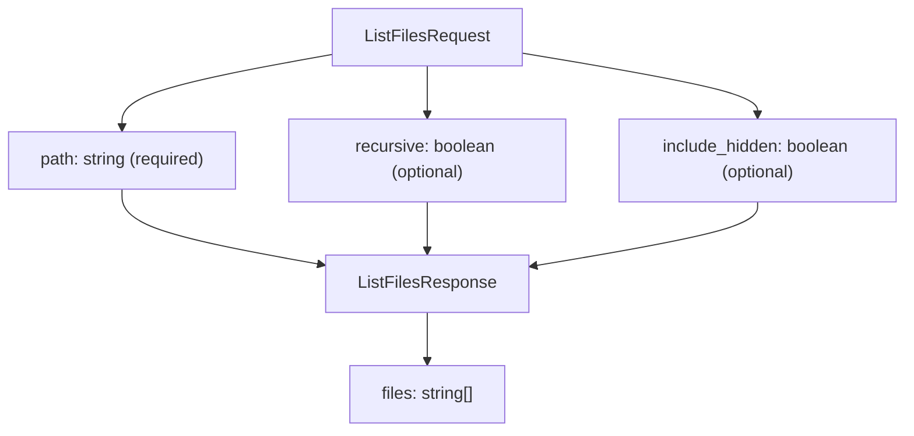
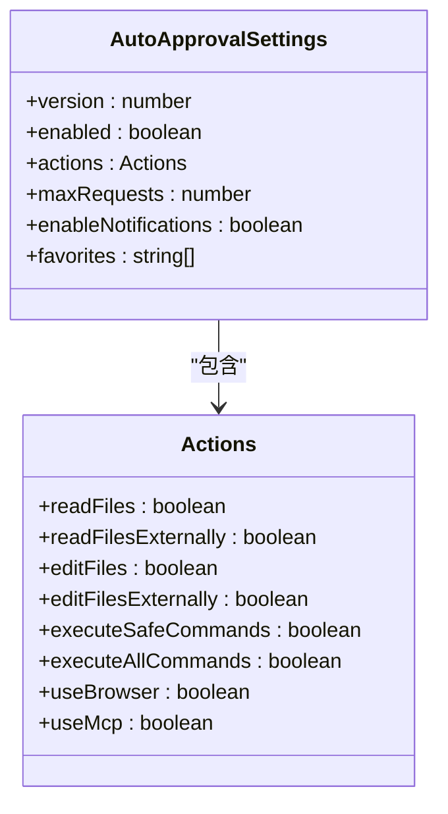
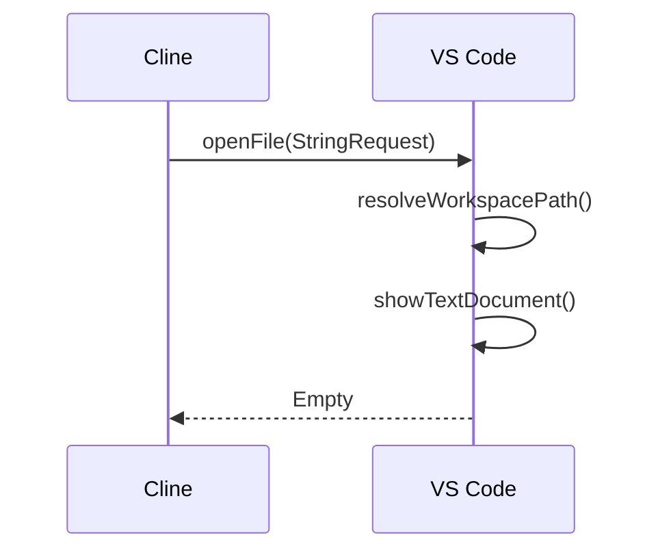

# 文件服务

<cite>
**本文档中引用的文件**  
- [file.proto](file://proto/cline/file.proto)
- [WriteToFileToolHandler.ts](file://src/core/task/tools/handlers/WriteToFileToolHandler.ts)
- [ReadFileToolHandler.ts](file://src/core/task/tools/handlers/ReadFileToolHandler.ts)
- [AutoApprovalSettings.ts](file://src/shared/AutoApprovalSettings.ts)
- [openFile.ts](file://src/core/controller/file/openFile.ts)
- [openFileRelativePath.ts](file://src/core/controller/file/openFileRelativePath.ts)
- [list-files.ts](file://src/services/glob/list-files.ts)
- [read_file.ts](file://src/core/prompts/system-prompt/tools/read_file.ts)
- [write_to_file.ts](file://src/core/prompts/system-prompt/tools/write_to_file.ts)
- [list_files.ts](file://src/core/prompts/system-prompt/tools/list_files.ts)
</cite>

## 目录
1. [简介](#简介)
2. [核心方法](#核心方法)
3. [请求/响应模式](#请求响应模式)
4. [安全模型](#安全模型)
5. [与VS Code集成](#与vs-code集成)
6. [TypeScript示例](#typescript示例)
7. [结论](#结论)

## 简介
Cline的文件服务提供了一套完整的文件系统操作API，支持读取、写入和列出文件等核心功能。该服务通过gRPC协议与前端组件通信，确保了跨平台的一致性和高性能。文件服务的设计重点在于安全性、原子性和用户体验，所有写入操作都必须经过用户明确批准，同时提供了丰富的工具来支持复杂的开发任务。

**Section sources**
- [file.proto](file://proto/cline/file.proto#L15-L186)

## 核心方法
文件服务包含三个核心方法：`ReadFile`、`WriteFile`和`ListFiles`。这些方法构成了Cline与文件系统交互的基础，支持从简单的文件读取到复杂的多文件编辑操作。

### ReadFile方法
`ReadFile`方法允许Cline读取指定路径的文件内容。该方法在分析现有代码、审查文本文件或提取配置信息时非常有用。它支持自动从PDF和DOCX文件中提取原始文本，但对于其他二进制文件可能不适用，因为它会将原始内容作为字符串返回。

**Section sources**
- [ReadFileToolHandler.ts](file://src/core/task/tools/handlers/ReadFileToolHandler.ts#L0-L90)
- [read_file.ts](file://src/core/prompts/system-prompt/tools/read_file.ts#L0-L28)

### WriteFile方法
`WriteFile`方法用于将内容写入指定路径的文件。如果文件已存在，则会被提供的内容覆盖；如果文件不存在，则会创建新文件。此方法会自动创建写入文件所需的任何目录，确保操作的原子性。

**Section sources**
- [WriteToFileToolHandler.ts](file://src/core/task/tools/handlers/WriteToFileToolHandler.ts#L0-L59)
- [write_to_file.ts](file://src/core/prompts/system-prompt/tools/write_to_file.ts#L24-L50)

### ListFiles方法
`ListFiles`方法用于列出指定目录中的文件和子目录。通过`recursive`参数，可以控制是否递归地列出所有子目录的内容。`include_hidden`参数则决定了是否包含隐藏文件和目录。

**Section sources**
- [list-files.ts](file://src/services/glob/list-files.ts#L56-L89)
- [list_files.ts](file://src/core/prompts/system-prompt/tools/list_files.ts#L0-L30)

## 请求/响应模式
文件服务的每个方法都有明确的请求和响应模式，确保了API的可预测性和易用性。

### ReadFile请求/响应
`ReadFileRequest`包含一个必需的`path`字段，表示要读取的文件的相对路径（相对于当前工作目录）。`ReadFileResponse`包含一个`content`字段，表示文件的内容。



**Diagram sources**
- [file.proto](file://proto/cline/file.proto#L15-L186)
- [ReadFileToolHandler.ts](file://src/core/task/tools/handlers/ReadFileToolHandler.ts#L60-L90)

### WriteFile请求/响应
`WriteFileRequest`包含两个必需字段：`path`和`content`。`path`表示要写入的文件的相对路径，`content`表示要写入的完整文件内容。`WriteFileResponse`包含一个`success`字段，表示操作是否成功。



**Diagram sources**
- [file.proto](file://proto/cline/file.proto#L15-L186)
- [WriteToFileToolHandler.ts](file://src/core/task/tools/handlers/WriteToFileToolHandler.ts#L24-L59)

### ListFiles请求/响应
`ListFilesRequest`包含三个字段：`path`（必需）、`recursive`（可选）和`include_hidden`（可选）。`ListFilesResponse`包含一个`files`数组，表示列出的文件和目录。



**Diagram sources**
- [file.proto](file://proto/cline/file.proto#L15-L186)
- [list-files.ts](file://src/services/glob/list-files.ts#L56-L89)

## 安全模型
Cline的文件服务采用严格的安全模型，确保所有写入操作都必须经过用户明确批准。这一模型通过自动批准设置（Auto Approval Settings）实现，用户可以精细控制哪些操作需要手动批准。

### 自动批准设置
自动批准设置允许用户配置不同操作的权限，包括读取文件、编辑文件、执行命令等。每个操作都可以独立启用或禁用，确保用户对Cline的行为有完全的控制权。



**Diagram sources**
- [AutoApprovalSettings.ts](file://src/shared/AutoApprovalSettings.ts#L0-L38)
- [auto-approval-settings-conversion.ts](file://src/shared/proto-conversions/models/auto-approval-settings-conversion.ts#L0-L44)

### 写入操作的原子性保证
`WriteFile`操作具有原子性保证，这意味着要么整个操作成功，要么完全失败，不会留下部分写入的状态。这种保证通过在写入前创建必要的目录并在失败时回滚更改来实现。

**Section sources**
- [WriteToFileToolHandler.ts](file://src/core/task/tools/handlers/WriteToFileToolHandler.ts#L21-L422)

## 与VS Code集成
Cline的文件服务与VS Code宿主环境紧密集成，通过`openFile`方法在编辑器中打开文件。这种集成确保了用户可以在熟悉的开发环境中查看和编辑文件，同时保持Cline的操作透明和可控。

### openFile方法
`openFile`方法接收一个包含文件路径的请求，并在VS Code编辑器中打开该文件。此方法支持绝对路径和相对路径，确保了灵活性和兼容性。



**Diagram sources**
- [openFile.ts](file://src/core/controller/file/openFile.ts#L0-L15)
- [openFileRelativePath.ts](file://src/core/controller/file/openFileRelativePath.ts#L0-L34)

## TypeScript示例
以下是一个使用`WriteFile`进行多文件编辑的TypeScript示例，展示了如何触发`WriteToFileToolHandler`。

```typescript
import { WriteToFileToolHandler } from "@core/task/tools/handlers/WriteToFileToolHandler";
import { ToolValidator } from "@core/task/tools/ToolValidator";
import { TaskConfig } from "@core/task/tools/types/TaskConfig";

// 创建工具验证器
const validator = new ToolValidator(clineIgnoreController);

// 创建写入文件工具处理器
const writeHandler = new WriteToFileToolHandler(validator);

// 配置任务
const config: TaskConfig = {
  // 配置项...
};

// 执行写入操作
await writeHandler.execute(config, {
  name: "write_to_file",
  params: {
    path: "src/components/NewComponent.tsx",
    content: "import React from 'react';\n\nconst NewComponent = () => {\n  return <div>New Component</div>;\n};\n\nexport default NewComponent;",
  },
});
```

**Section sources**
- [WriteToFileToolHandler.ts](file://src/core/task/tools/handlers/WriteToFileToolHandler.ts#L21-L422)

## 结论
Cline的文件服务提供了一套强大而安全的API，支持读取、写入和列出文件等核心功能。通过严格的自动批准设置和与VS Code的紧密集成，Cline确保了用户对文件操作的完全控制，同时提供了流畅的开发体验。无论是简单的文件读取还是复杂的多文件编辑，Cline的文件服务都能满足开发者的需求。