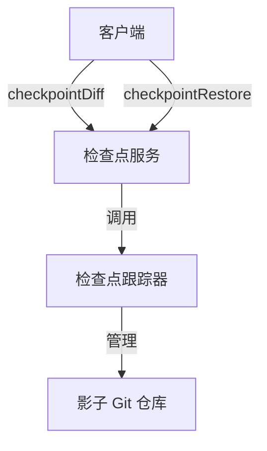
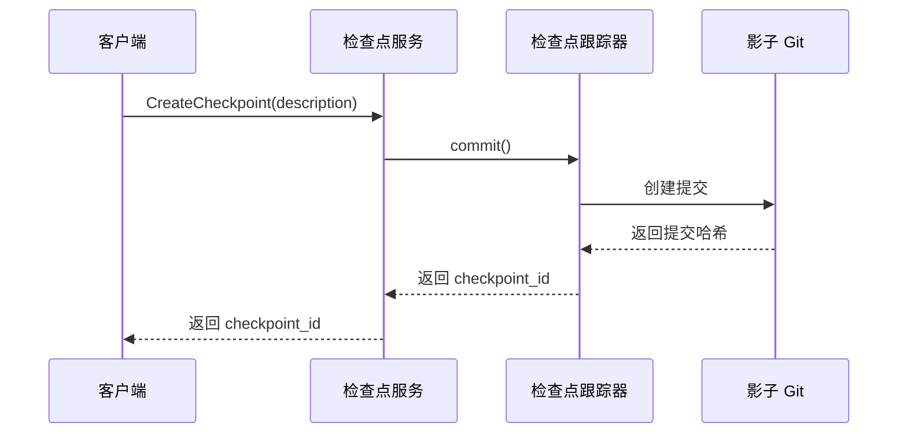
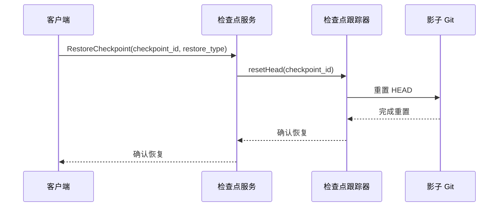
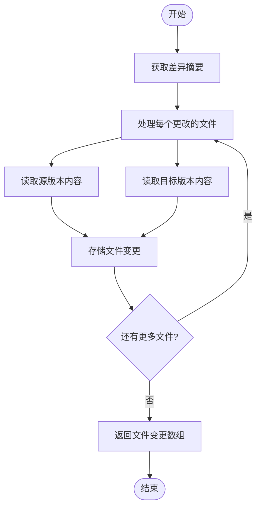
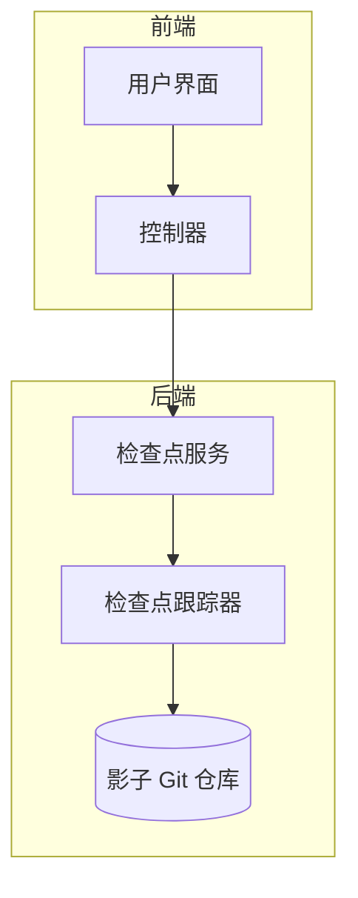

# 检查点服务

<cite>
**本文档中引用的文件**  
- [checkpoints.proto](file://proto/cline/checkpoints.proto)
- [CheckpointTracker.ts](file://src/integrations/checkpoints/CheckpointTracker.ts)
- [index.ts](file://src/integrations/checkpoints/index.ts)
</cite>

## 目录
1. [简介](#简介)
2. [API 概述](#api-概述)
3. [创建检查点](#创建检查点)
4. [恢复检查点](#恢复检查点)
5. [检查点生命周期管理](#检查点生命周期管理)
6. [变更差异生成](#变更差异生成)
7. [回滚操作示例](#回滚操作示例)
8. [集成架构](#集成架构)

## 简介
检查点服务为 Cline 提供了版本控制功能，允许用户保存和恢复工作区状态。该服务通过创建检查点来捕获工作区的快照，并支持将工作区恢复到先前的状态。检查点服务与 `CheckpointTracker` 集成，以管理检查点的生命周期，并通过 `checkpointDiff` 控制器生成变更差异以供用户审查。

## API 概述
检查点服务通过 gRPC 接口提供两个核心操作：`checkpointDiff` 和 `checkpointRestore`。这些操作允许用户生成变更差异和恢复到指定的检查点。服务定义在 `checkpoints.proto` 文件中，使用 Protocol Buffers 进行通信。



**Diagram sources**
- [checkpoints.proto](file://proto/cline/checkpoints.proto)
- [CheckpointTracker.ts](file://src/integrations/checkpoints/CheckpointTracker.ts)

**Section sources**
- [checkpoints.proto](file://proto/cline/checkpoints.proto)

## 创建检查点
`CreateCheckpoint` 方法用于创建当前工作区状态的检查点。当调用此方法时，系统会创建一个新的检查点提交，并返回一个唯一的 `checkpoint_id`。

### CreateCheckpointRequest
请求包含一个可选的 `description` 字段，用于描述检查点的目的或内容。该描述将作为提交消息的一部分存储在影子 Git 仓库中。

### CreateCheckpointResponse
响应返回一个 `checkpoint_id`，这是检查点提交的唯一标识符。此 ID 可用于后续的恢复操作。



**Diagram sources**
- [index.ts](file://src/integrations/checkpoints/index.ts)
- [CheckpointTracker.ts](file://src/integrations/checkpoints/CheckpointTracker.ts)

**Section sources**
- [index.ts](file://src/integrations/checkpoints/index.ts)
- [CheckpointTracker.ts](file://src/integrations/checkpoints/CheckpointTracker.ts)

## 恢复检查点
`RestoreCheckpoint` 方法用于将工作区文件恢复到指定检查点的状态。此操作通过将影子 Git 仓库的 HEAD 重置到目标提交来实现。

### 操作语义
恢复操作会丢弃目标检查点之后的所有更改，并将工作区恢复到该检查点时的状态。根据 `restore_type` 参数，可以恢复任务消息、工作区文件或两者。



**Diagram sources**
- [index.ts](file://src/integrations/checkpoints/index.ts)
- [CheckpointTracker.ts](file://src/integrations/checkpoints/CheckpointTracker.ts)

**Section sources**
- [index.ts](file://src/integrations/checkpoints/index.ts)
- [CheckpointTracker.ts](file://src/integrations/checkpoints/CheckpointTracker.ts)

## 检查点生命周期管理
检查点服务通过 `CheckpointTracker` 类管理检查点的生命周期。`CheckpointTracker` 负责创建和管理影子 Git 仓库，处理检查点的创建、恢复和差异生成。

### 核心功能
- **初始化**：创建 `CheckpointTracker` 实例时，会初始化影子 Git 仓库。
- **提交**：`commit()` 方法创建新的检查点提交。
- **重置**：`resetHead()` 方法将仓库重置到指定的检查点。
- **差异**：`getDiffSet()` 方法生成两个检查点之间的变更差异。

```mermaid
classDiagram
class CheckpointTracker {
+globalStoragePath : string
+taskId : string
+cwd : string
+cwdHash : string
+commit() : Promise~string~
+resetHead(commitHash : string) : Promise~void~
+getDiffSet(lhsHash : string, rhsHash? : string) : Promise~Array~
+getShadowGitConfigWorkTree() : Promise~string~
}
class GitOperations {
+initShadowGit(gitPath : string, workingDir : string, taskId : string) : Promise~void~
+addCheckpointFiles(git : SimpleGit) : Promise~{success : boolean}~
+getShadowGitConfigWorkTree(gitPath : string) : Promise~string~
}
CheckpointTracker --> GitOperations : "使用"
```

**Diagram sources**
- [CheckpointTracker.ts](file://src/integrations/checkpoints/CheckpointTracker.ts)

**Section sources**
- [CheckpointTracker.ts](file://src/integrations/checkpoints/CheckpointTracker.ts)

## 变更差异生成
`checkpointDiff` 控制器负责生成检查点之间的变更差异。通过调用 `getDiffSet()` 方法，系统可以获取两个检查点之间所有更改文件的前后内容。

### 差异生成流程
1. 调用 `getDiffSet()` 方法，传入源和目标检查点哈希。
2. 系统使用 Git 差异功能生成变更摘要。
3. 对于每个更改的文件，读取源和目标版本的内容。
4. 返回包含相对路径、绝对路径和前后内容的文件变更数组。



**Diagram sources**
- [CheckpointTracker.ts](file://src/integrations/checkpoints/CheckpointTracker.ts)

**Section sources**
- [CheckpointTracker.ts](file://src/integrations/checkpoints/CheckpointTracker.ts)

## 回滚操作示例
以下示例展示了如何使用检查点服务进行变更回滚：

1. **创建检查点**：
```typescript
const checkpointId = await checkpointsService.CreateCheckpoint({
  description: "功能开发前的稳定状态"
});
```

2. **进行变更**：
- 修改多个文件以实现新功能。

3. **发现问题需要回滚**：
```typescript
await checkpointsService.RestoreCheckpoint({
  checkpoint_id: checkpointId,
  restore_type: "taskAndWorkspace"
});
```

4. **验证恢复**：
- 工作区文件恢复到创建检查点时的状态。
- 任务消息历史也被恢复到相应的时间点。

**Section sources**
- [index.ts](file://src/integrations/checkpoints/index.ts)

## 积分架构
检查点服务与 `CheckpointTracker` 紧密集成，形成一个完整的检查点管理系统。`CheckpointTracker` 负责底层的 Git 操作，而检查点服务提供高层的 API 接口。



**Diagram sources**
- [index.ts](file://src/integrations/checkpoints/index.ts)
- [CheckpointTracker.ts](file://src/integrations/checkpoints/CheckpointTracker.ts)

**Section sources**
- [index.ts](file://src/integrations/checkpoints/index.ts)
- [CheckpointTracker.ts](file://src/integrations/checkpoints/CheckpointTracker.ts)