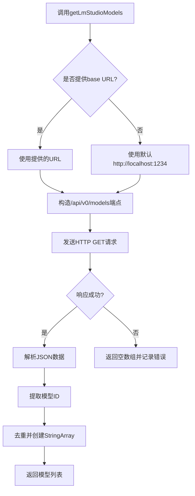

# 模型服务

<cite>
**本文档中引用的文件**  
- [models.proto](file://proto/cline/models.proto)
- [refreshOpenAiModels.ts](file://src/core/controller/models/refreshOpenAiModels.ts)
- [getLmStudioModels.ts](file://src/core/controller/models/getLmStudioModels.ts)
</cite>

## 目录
1. [简介](#简介)
2. [核心API方法](#核心api方法)
3. [请求与过滤器详解](#请求与过滤器详解)
4. [ModelInfo消息结构](#modelinfo消息结构)
5. [TypeScript使用示例](#typescript使用示例)
6. [模型发现与通信机制](#模型发现与通信机制)
7. [结论](#结论)

## 简介
`ModelsService` 是Cline系统中负责模型管理的核心服务，提供获取可用模型列表、刷新模型信息以及更新API配置等功能。该服务支持多种模型提供商，包括OpenAI、LM Studio、Ollama等，并能动态发现本地运行的模型实例。本文档重点介绍 `ListModels` 和 `GetModelInfo` 相关方法的实现与使用。

**Section sources**
- [models.proto](file://proto/cline/models.proto#L15-L349)

## 核心API方法
`ModelsService` 提供了多个RPC方法来获取不同来源的模型列表和信息：

- `refreshOpenAiModels`: 刷新并返回OpenAI兼容API的模型列表
- `getLmStudioModels`: 获取本地LM Studio服务中的模型列表
- `getOllamaModels`: 获取Ollama服务器上的可用模型
- `getVsCodeLmModels`: 获取VS Code本地模型API支持的模型
- `refreshOpenRouterModels`: 获取OpenRouter平台上的模型信息
- `refreshHuggingFaceModels`: 获取Hugging Face托管的模型信息

这些方法共同构成了Cline的模型发现机制，允许用户在不同提供商之间灵活切换。

**Section sources**
- [models.proto](file://proto/cline/models.proto#L15-L349)

## 请求与过滤器详解
### ListModelsRequest中的provider过滤器
在 `OpenAiModelsRequest` 消息中，虽然没有显式的 `provider` 字段作为过滤器，但通过 `base_url` 和 `api_key` 参数可以实现对不同OpenAI兼容服务的访问控制。例如：
- 使用 `https://api.openai.com` 作为base_url可访问官方OpenAI服务
- 使用自定义URL可访问Azure OpenAI、本地部署的LiteLLM或其他兼容接口

该设计允许通过配置不同的端点来间接实现提供者过滤功能。

### GetModelInfoRequest中model_id的格式
对于 `refreshOpenAiModels` 方法，其请求参数 `OpenAiModelsRequest` 不直接包含 `model_id`，而是返回所有可用模型的ID列表。实际的模型ID格式取决于具体提供商：
- OpenAI官方模型：如 `gpt-4o`, `gpt-3.5-turbo` 等标准命名
- 自定义部署：可能包含组织特定前缀或版本号
- 本地模型：由本地服务（如LM Studio）生成的唯一标识符

**Section sources**
- [models.proto](file://proto/cline/models.proto#L250-L255)
- [refreshOpenAiModels.ts](file://src/core/controller/models/refreshOpenAiModels.ts#L1-L37)

## ModelInfo消息结构
### OpenAiCompatibleModelInfo字段说明
`OpenAiCompatibleModelInfo` 消息包含以下关键字段：

- **max_tokens**: 模型单次响应的最大token数
- **context_window**: 上下文窗口大小（输入+输出）
- **supports_images**: 是否支持图像输入
- **supports_prompt_cache**: 是否支持提示缓存以优化成本
- **input_price/output_price**: 输入/输出每百万token的价格（美元）
- **thinking_config**: 思维/推理模式配置，含预算和输出价格
- **supports_global_endpoint**: 是否支持全局终端节点
- **tiers**: 分层定价结构，按上下文窗口划分
- **description**: 模型描述信息
- **is_r1_format_required**: 是否需要特定格式化

这些字段为用户提供全面的模型能力与成本信息，支持智能选择最优模型。

**Section sources**
- [models.proto](file://proto/cline/models.proto#L180-L195)

## TypeScript使用示例
以下示例展示如何获取所有可用的OpenAI模型：

```typescript
import { ModelsServiceClient } from "@shared/proto/cline/models.client";
import { OpenAiModelsRequest } from "@shared/proto/cline/models";

async function fetchOpenAIModels() {
  const client = new ModelsServiceClient(/* your transport */);
  
  const request = OpenAiModelsRequest.create({
    baseUrl: "https://api.openai.com",
    apiKey: "your-api-key-here"
  });

  try {
    const response = await client.refreshOpenAiModels(request);
    console.log("可用模型:", response.values);
    // 输出示例: ["gpt-4o", "gpt-3.5-turbo", "davinci-002", ...]
    return response.values;
  } catch (error) {
    console.error("获取模型失败:", error);
    return [];
  }
}

// 调用示例
fetchOpenAIModels();
```

此代码通过gRPC客户端调用 `refreshOpenAiModels` 方法，传入API密钥和基础URL，最终返回字符串数组形式的模型ID列表。

**Section sources**
- [refreshOpenAiModels.ts](file://src/core/controller/models/refreshOpenAiModels.ts#L1-L37)

## 模型发现与通信机制
### 与API提供者的通信
`ModelsService` 通过HTTP请求与各API提供者通信以动态刷新模型列表：

- **OpenAI**: 使用标准 `/models` REST端点，通过Bearer Token认证
- **LM Studio**: 访问本地 `http://localhost:1234/api/v0/models` 端点
- **Ollama**: 查询Ollama服务的 `/api/tags` 接口
- **OpenRouter/HuggingFace等**: 通过各自平台提供的公开API获取模型目录

所有外部请求均封装在对应的 `refresh*Models` 函数中，具备错误处理和空值保护机制。

### 本地模型发现
对于本地模型（如LM Studio），系统采用以下发现策略：
1. 默认尝试连接 `http://localhost:1234`
2. 支持通过配置指定自定义基础URL
3. 使用 `fetch` API查询模型端点
4. 将返回的模型元数据序列化为字符串数组



**Diagram sources**
- [getLmStudioModels.ts](file://src/core/controller/models/getLmStudioModels.ts#L1-L27)

**Section sources**
- [getLmStudioModels.ts](file://src/core/controller/models/getLmStudioModels.ts#L1-L27)
- [refreshOpenAiModels.ts](file://src/core/controller/models/refreshOpenAiModels.ts#L1-L37)

## 结论
`ModelsService` 构成了Cline模型管理的基础，通过统一的gRPC接口抽象了多源模型发现的复杂性。它不仅支持云端AI服务（如OpenAI、Anthropic），也兼容本地运行的模型服务器（如LM Studio、Ollama）。通过结构化的 `ModelInfo` 消息，系统能够传递丰富的模型元数据，为智能路由和成本优化提供数据基础。开发者可通过简单的TypeScript调用集成此功能，实现灵活的模型选择策略。