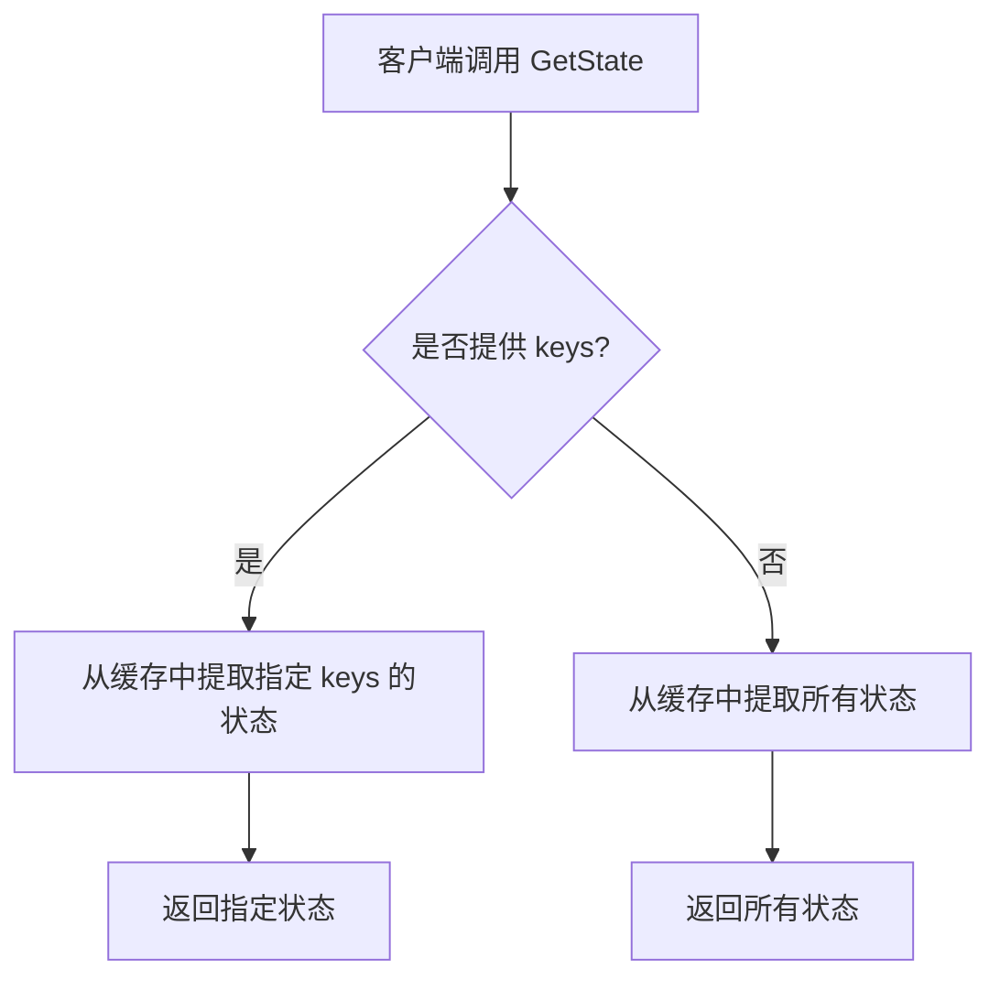
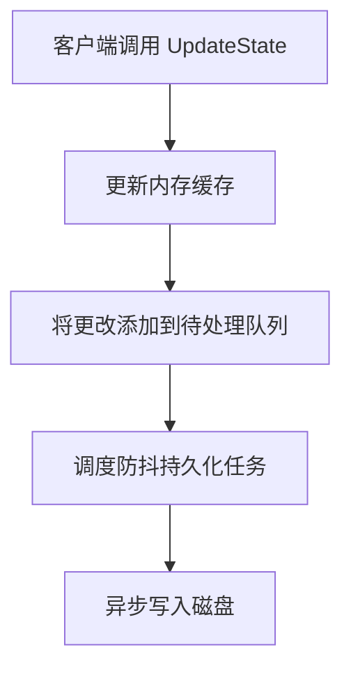
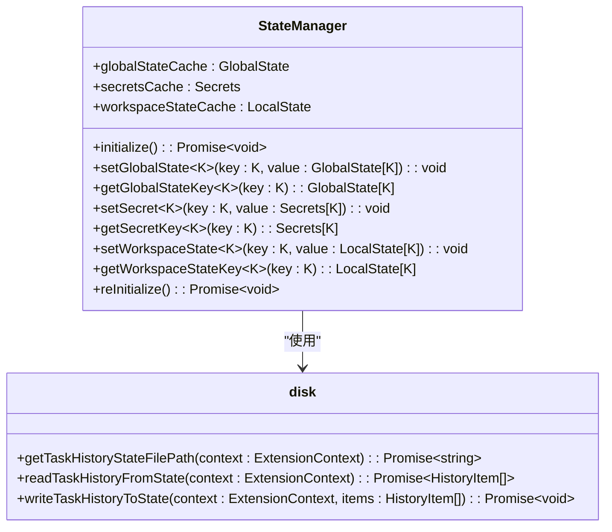
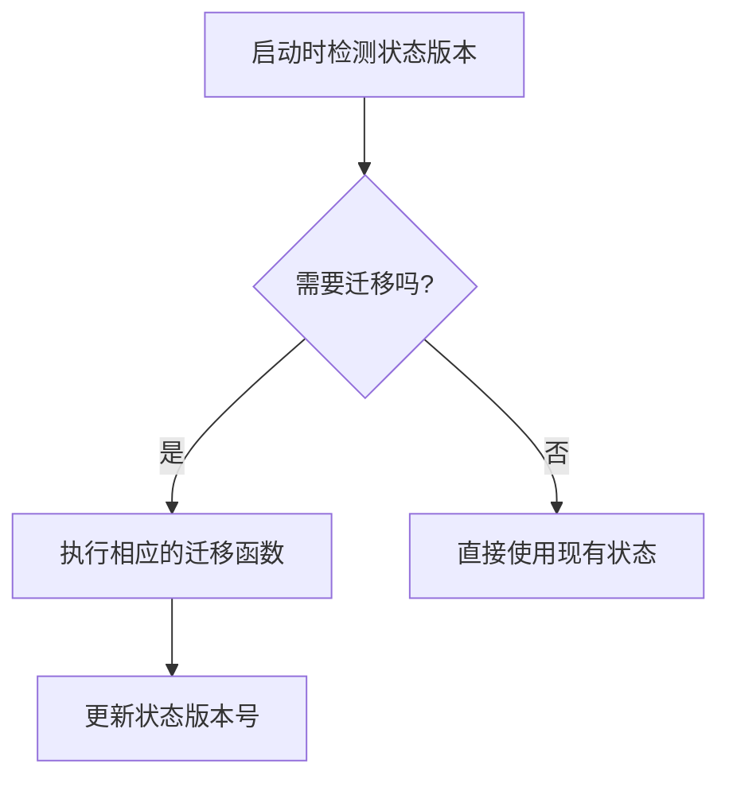
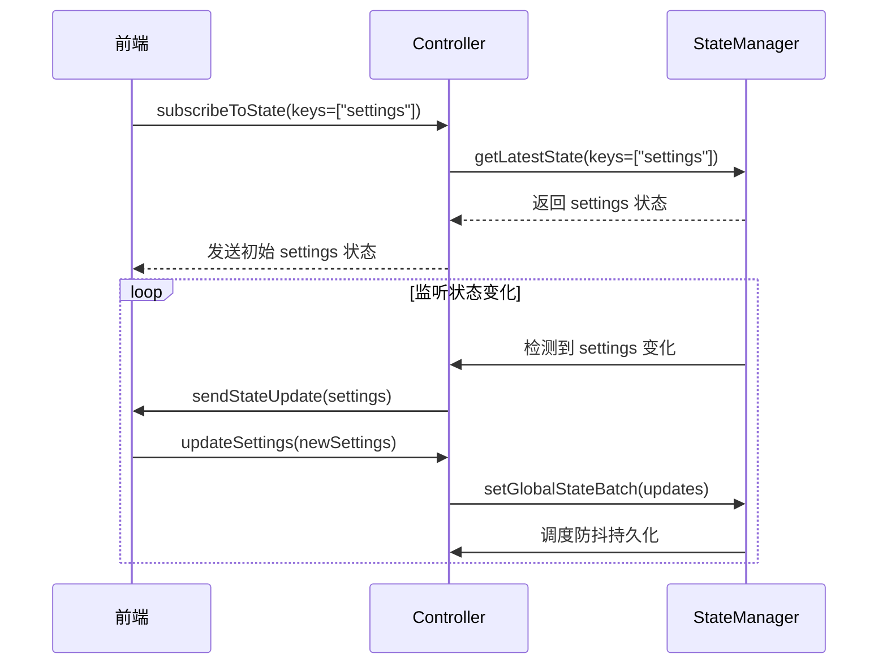

# 状态服务

<cite>
**本文档中引用的文件**  
- [StateManager.ts](file://src/core/storage/StateManager.ts)
- [disk.ts](file://src/core/storage/disk.ts)
- [state-keys.ts](file://src/core/storage/state-keys.ts)
- [state-migrations.ts](file://src/core/storage/state-migrations.ts)
- [subscribeToState.ts](file://src/core/controller/state/subscribeToState.ts)
- [updateSettings.ts](file://src/core/controller/state/updateSettings.ts)
</cite>

## 目录
1. [简介](#简介)
2. [核心组件](#核心组件)
3. [API 方法详解](#api-方法详解)
4. [状态持久化机制](#状态持久化机制)
5. [状态键命名约定](#状态键命名约定)
6. [状态迁移](#状态迁移)
7. [前端监听与更新示例](#前端监听与更新示例)
8. [结论](#结论)

## 简介

Cline 的 `StateService` 是一个用于管理应用状态的核心服务，它通过 `StateManager` 类提供高效的状态读写操作，并确保状态数据的持久化。该服务支持全局状态、工作区状态和密钥状态的管理，同时提供了灵活的 API 供前端和其他模块调用。本文档旨在为 `StateService` 创建权威的 API 文档，详细说明 `GetState` 和 `UpdateState` 方法，以及状态数据的持久化机制。

## 核心组件

`StateService` 的核心是 `StateManager` 类，它负责在内存中缓存状态数据，并异步地将更改持久化到磁盘。`StateManager` 使用了防抖（debounce）技术来减少对磁盘的频繁写入，从而提高性能。此外，`StateManager` 还支持通过 `subscribeToState` 方法订阅状态变化，以便前端能够实时响应状态更新。

**Section sources**
- [StateManager.ts](file://src/core/storage/StateManager.ts#L1-L843)

## API 方法详解

### GetState 方法

`GetState` 方法允许客户端获取当前的状态数据。此方法通常用于初始化前端界面或在需要时重新加载状态。`GetStateRequest` 接口定义了请求参数，其中 `keys` 字段是一个可选的字符串数组，用于指定要获取的具体状态键。如果未提供 `keys`，则返回所有状态。



**Diagram sources**
- [StateManager.ts](file://src/core/storage/StateManager.ts#L150-L200)

### UpdateState 方法

`UpdateState` 方法允许客户端更新一个或多个状态键的值。`UpdateStateRequest` 接口包含一个 `updates` 映射，该映射的键是状态键名，值是要更新的新值。当调用 `UpdateState` 时，`StateManager` 会立即更新内存中的缓存，并安排一个防抖的持久化任务，以确保更改最终被写入磁盘。



**Diagram sources**
- [StateManager.ts](file://src/core/storage/StateManager.ts#L250-L300)

## 状态持久化机制

`StateManager` 使用磁盘存储来持久化状态数据。具体来说，`StateManager` 通过 `disk.ts` 文件中的函数与文件系统进行交互。例如，`getTaskHistoryStateFilePath` 函数用于确定任务历史记录文件的路径，而 `readTaskHistoryFromState` 和 `writeTaskHistoryToState` 函数则分别用于读取和写入任务历史记录。

为了确保数据的一致性和可靠性，`StateManager` 在初始化时会从磁盘加载所有状态数据，并在每次状态更新后安排一个防抖的持久化任务。此外，`StateManager` 还使用 `chokidar` 库监视 `taskHistory.json` 文件的变化，以便在外部修改时及时更新内存缓存。



**Diagram sources**
- [StateManager.ts](file://src/core/storage/StateManager.ts#L1-L843)
- [disk.ts](file://src/core/storage/disk.ts#L1-L229)

## 状态键命名约定

状态键的命名遵循一定的约定，以确保代码的可读性和维护性。这些约定在 `state-keys.ts` 文件中定义。例如，全局状态键（`GlobalStateKey`）包括 `awsRegion`、`vertexProjectId` 等，而工作区状态键（`LocalStateKey`）包括 `localClineRulesToggles`、`localCursorRulesToggles` 等。每个状态键都有明确的类型定义，以确保类型安全。

```typescript
interface GlobalState {
	awsRegion: string | undefined
	vertexProjectId: string | undefined
	taskHistory: HistoryItem[]
	// ... 其他全局状态键
}

interface LocalState {
	localClineRulesToggles: ClineRulesToggles
	localCursorRulesToggles: ClineRulesToggles
	// ... 其他工作区状态键
}
```

**Section sources**
- [state-keys.ts](file://src/core/storage/state-keys.ts#L1-L203)

## 状态迁移

随着应用的发展，状态结构可能会发生变化。为了确保向后兼容性，Cline 提供了状态迁移功能。`state-migrations.ts` 文件中定义了一系列迁移函数，如 `migrateTaskHistoryToFile` 和 `migrateLegacyApiConfigurationToModeSpecific`，这些函数可以在启动时自动执行，以将旧版本的状态数据迁移到新版本。

例如，`migrateTaskHistoryToFile` 函数将任务历史记录从旧的全局状态位置迁移到新的文件系统位置，而 `migrateLegacyApiConfigurationToModeSpecific` 函数则将旧的 API 配置迁移到新的模式特定配置中。



**Diagram sources**
- [state-migrations.ts](file://src/core/storage/state-migrations.ts#L1-L618)

## 前端监听与更新示例

前端可以通过 `subscribeToState` 方法监听特定状态键的变化。例如，前端可以监听 `settings` 键的变化，并在检测到变化时触发 `updateSettings` 方法来更新设置。



**Diagram sources**
- [subscribeToState.ts](file://src/core/controller/state/subscribeToState.ts#L1-L79)
- [updateSettings.ts](file://src/core/controller/state/updateSettings.ts#L1-L280)

## 结论

Cline 的 `StateService` 通过 `StateManager` 类提供了一个高效且可靠的状态管理解决方案。它不仅支持快速的内存读写操作，还通过防抖技术和磁盘持久化确保了数据的安全性和一致性。此外，`StateService` 还提供了丰富的 API 和状态迁移功能，以支持应用的持续发展和向后兼容性。通过本文档，开发者可以更好地理解和使用 `StateService`，从而构建更加稳定和可维护的应用。