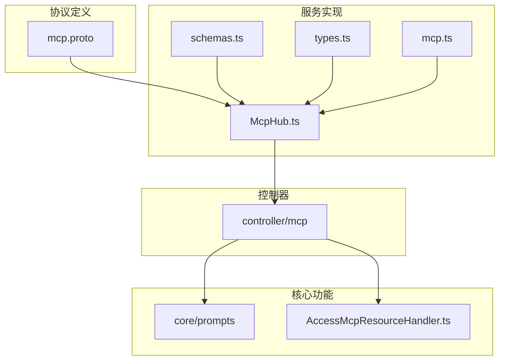
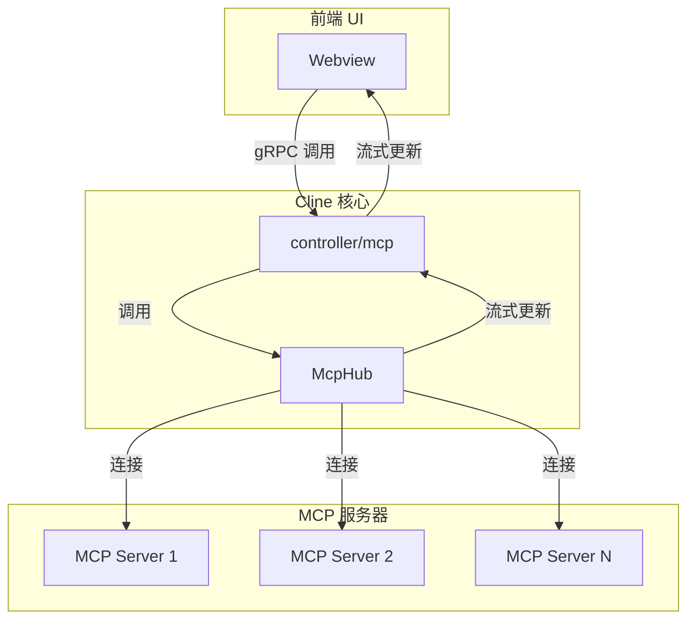
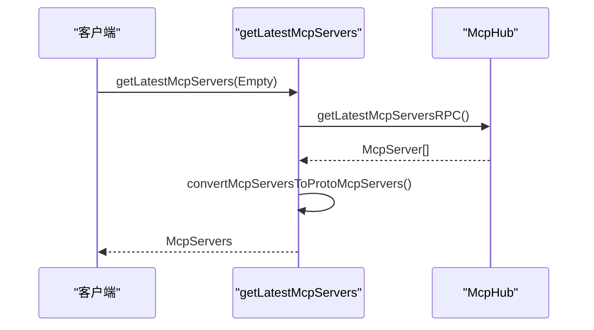
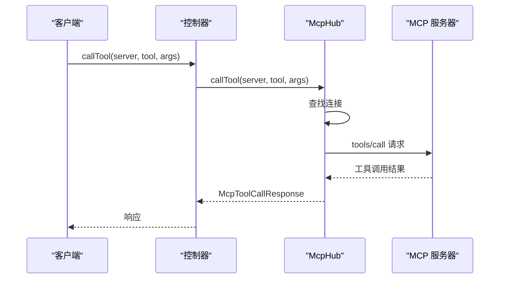
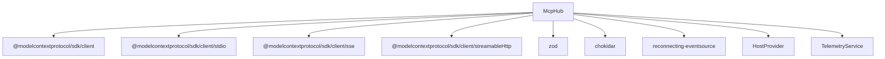

# MCP扩展服务

<cite>
**本文档引用的文件**  
- [mcp.proto](file://proto/cline/mcp.proto)
- [McpHub.ts](file://src/services/mcp/McpHub.ts)
- [schemas.ts](file://src/services/mcp/schemas.ts)
- [types.ts](file://src/services/mcp/types.ts)
- [mcp.ts](file://src/shared/mcp.ts)
- [downloadMcp.ts](file://src/core/controller/mcp/downloadMcp.ts)
- [getLatestMcpServers.ts](file://src/core/controller/mcp/getLatestMcpServers.ts)
- [AccessMcpResourceHandler.ts](file://src/core/task/tools/handlers/AccessMcpResourceHandler.ts)
- [loadMcpDocumentation.ts](file://src/core/prompts/loadMcpDocumentation.ts)
</cite>

## 目录
1. [简介](#简介)
2. [项目结构](#项目结构)
3. [核心组件](#核心组件)
4. [架构概述](#架构概述)
5. [详细组件分析](#详细组件分析)
6. [依赖分析](#依赖分析)
7. [性能考虑](#性能考虑)
8. [故障排除指南](#故障排除指南)
9. [结论](#结论)

## 简介
MCP（Model Context Protocol）扩展服务为Cline提供了动态加载和管理本地MCP服务器的能力，从而扩展其功能。通过`mcp.proto`中定义的`McpService`接口，Cline能够实现服务发现、工具调用和服务器管理等核心功能。`McpHub.ts`作为核心实现，负责与MCP服务器建立连接、维护状态、处理工具调用，并与`controller/mcp`模块协同工作。本API文档将深入解析这些机制，为开发者提供扩展开发指南。

## 项目结构
Cline的MCP相关代码分布在多个目录中，形成了清晰的分层架构。核心协议定义在`proto/cline/mcp.proto`中，服务实现位于`src/services/mcp/`，而控制器逻辑则在`src/core/controller/mcp/`中。

**图示来源**
- [mcp.proto](file://proto/cline/mcp.proto#L1-L132)
- [McpHub.ts](file://src/services/mcp/McpHub.ts#L1-L1156)
- [schemas.ts](file://src/services/mcp/schemas.ts#L1-L94)
- [types.ts](file://src/services/mcp/types.ts#L1-L20)
- [mcp.ts](file://src/shared/mcp.ts#L1-L115)

**本节来源**
- [mcp.proto](file://proto/cline/mcp.proto#L1-L132)
- [McpHub.ts](file://src/services/mcp/McpHub.ts#L1-L1156)
- [schemas.ts](file://src/services/mcp/schemas.ts#L1-L94)
- [types.ts](file://src/services/mcp/types.ts#L1-L20)
- [mcp.ts](file://src/shared/mcp.ts#L1-L115)

## 核心组件
MCP扩展服务的核心由`McpService`协议和`McpHub`类构成。`McpService`定义了与MCP服务器交互的API，而`McpHub`则负责具体的连接管理、状态同步和工具调用执行。`McpHub`通过读取`cline_mcp_settings.json`配置文件来初始化服务器连接，并利用`chokidar`库监控配置文件变化，实现动态更新。

**本节来源**
- [mcp.proto](file://proto/cline/mcp.proto#L1-L132)
- [McpHub.ts](file://src/services/mcp/McpHub.ts#L1-L1156)

## 架构概述
MCP服务的架构围绕`McpHub`展开，它作为中心枢纽，协调着Cline核心、gRPC控制器和外部MCP服务器之间的通信。`McpHub`通过不同的传输层（如stdio、sse、streamableHttp）与MCP服务器建立连接，并通过`subscribeToMcpServers`流将服务器状态实时推送给前端UI。

**图示来源**
- [McpHub.ts](file://src/services/mcp/McpHub.ts#L1-L1156)
- [getLatestMcpServers.ts](file://src/core/controller/mcp/getLatestMcpServers.ts#L1-L24)

## 详细组件分析

### McpService 方法解析
`mcp.proto`中定义的`McpService`提供了管理MCP服务器的RPC接口。

#### ListServers (由 getLatestMcpServers 实现)
此方法用于获取当前所有MCP服务器的列表。它通过调用`McpHub`的`getLatestMcpServersRPC`方法，获取按配置文件顺序排序的服务器列表，并将其转换为协议缓冲区格式返回。

**图示来源**
- [mcp.proto](file://proto/cline/mcp.proto#L25-L26)
- [getLatestMcpServers.ts](file://src/core/controller/mcp/getLatestMcpServers.ts#L1-L24)
- [McpHub.ts](file://src/services/mcp/McpHub.ts#L1050-L1065)

#### AddServer (由 addRemoteMcpServer 实现)
此方法允许用户通过指定名称和URL添加一个新的远程MCP服务器。它会验证URL的有效性，将服务器配置写入`cline_mcp_settings.json`，并触发`McpHub`重新建立连接。

#### RemoveServer (由 deleteMcpServer 实现)
此方法用于删除指定名称的MCP服务器。它会从配置文件中移除对应的服务器条目，并清理`McpHub`中的连接。

#### InvokeTool (由 callTool 实现)
这是调用MCP服务器上特定工具的核心方法。`McpHub`会根据服务器名称找到对应的连接，然后通过`client.request`发送`tools/call`请求。

**图示来源**
- [mcp.proto](file://proto/cline/mcp.proto#L1-L132)
- [McpHub.ts](file://src/services/mcp/McpHub.ts#L850-L900)

#### ListTools (由 fetchToolsList 实现)
此方法获取指定MCP服务器提供的所有工具列表。`McpHub`会向服务器发送`tools/list`请求，并根据本地配置（如`autoApprove`设置）对工具进行增强。

### McpHub 实现分析
`McpHub`是MCP服务的核心，它管理着所有服务器的生命周期。

#### 服务发现与动态加载
`McpHub`通过`watchMcpSettingsFile`方法监控`cline_mcp_settings.json`文件的变化。当文件被修改时，它会重新读取配置，并调用`updateServerConnections`来同步服务器连接状态，实现动态加载和卸载。

#### 安全权限模型
MCP服务的权限控制主要体现在工具调用前的确认机制。用户可以在设置中为特定工具配置`autoApprove`，决定是否在调用时自动授权。`McpHub`在调用`callTool`前会检查此设置，并在`fetchToolsList`时将配置信息注入到工具对象中。

#### 与 controller/mcp 模块的交互
`controller/mcp`模块中的函数（如`downloadMcp`、`getLatestMcpServers`）作为gRPC请求的处理器，它们将请求委托给`McpHub`实例。`McpHub`完成具体操作后，再将结果返回给控制器，由控制器将其序列化为协议缓冲区格式并响应客户端。

**本节来源**
- [McpHub.ts](file://src/services/mcp/McpHub.ts#L1-L1156)
- [schemas.ts](file://src/services/mcp/schemas.ts#L1-L94)
- [types.ts](file://src/services/mcp/types.ts#L1-L20)
- [mcp.ts](file://src/shared/mcp.ts#L1-L115)
- [downloadMcp.ts](file://src/core/controller/mcp/downloadMcp.ts#L1-L66)

## 依赖分析
MCP服务依赖于多个外部库和内部模块。

**图示来源**
- [McpHub.ts](file://src/services/mcp/McpHub.ts#L1-L1156)
- [go.mod](file://go.mod#L1-L20)

**本节来源**
- [McpHub.ts](file://src/services/mcp/McpHub.ts#L1-L1156)

## 性能考虑
MCP服务的性能主要受网络延迟和服务器响应时间的影响。`McpHub`为每个工具调用设置了超时机制（默认60秒，可配置），以防止长时间阻塞。对于stdio类型的服务器，`McpHub`还通过`chokidar`监控其源文件，实现热重载，减少了手动重启的开销。

## 故障排除指南
当MCP服务器连接失败时，应首先检查`cline_mcp_settings.json`文件的JSON格式是否正确。其次，查看服务器的stderr输出，通常会包含详细的错误信息。对于网络连接问题，需确认URL和端口是否正确。如果工具调用失败，检查工具名称和参数是否符合服务器的输入模式。

**本节来源**
- [McpHub.ts](file://src/services/mcp/McpHub.ts#L1-L1156)
- [AccessMcpResourceHandler.ts](file://src/core/task/tools/handlers/AccessMcpResourceHandler.ts#L101-L124)

## 结论
MCP扩展服务为Cline构建了一个强大且灵活的插件生态系统。通过清晰的协议定义和模块化的实现，开发者可以轻松地创建和管理MCP服务器，从而极大地扩展Cline的功能。深入理解`McpService`的API和`McpHub`的内部机制，是进行高效扩展开发的关键。