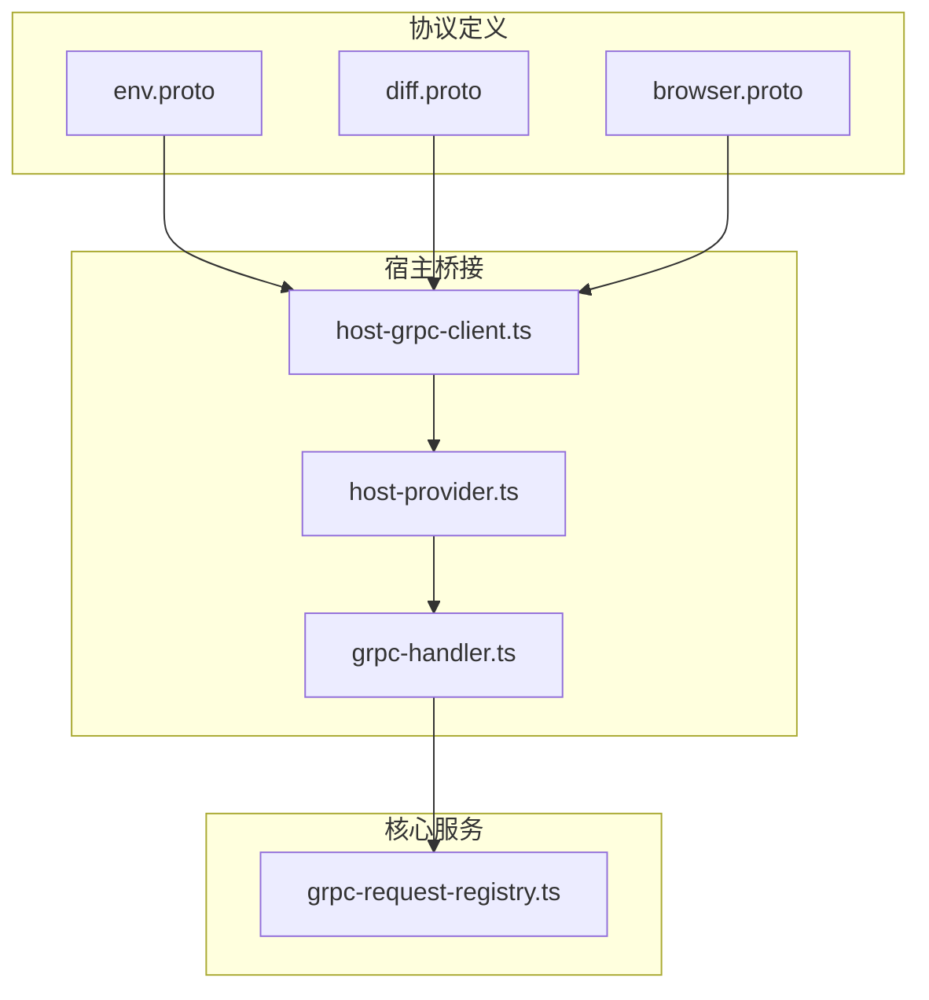
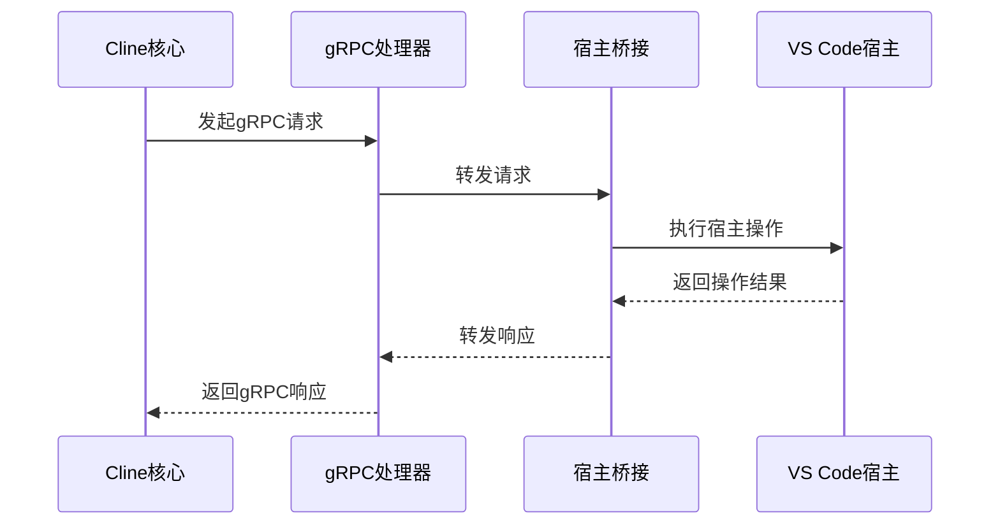
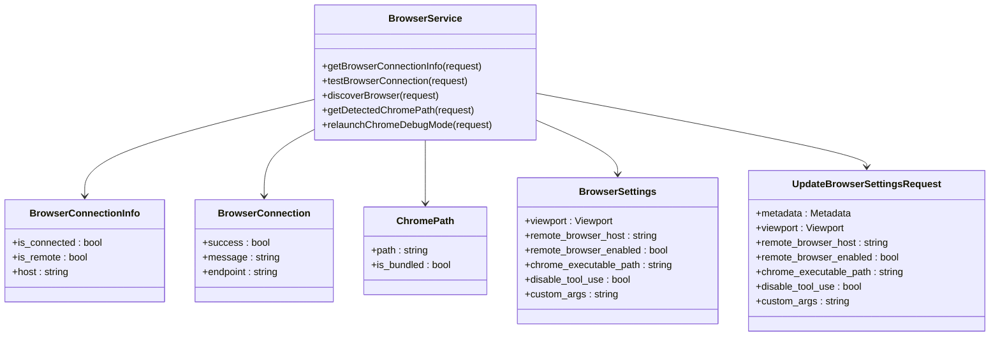
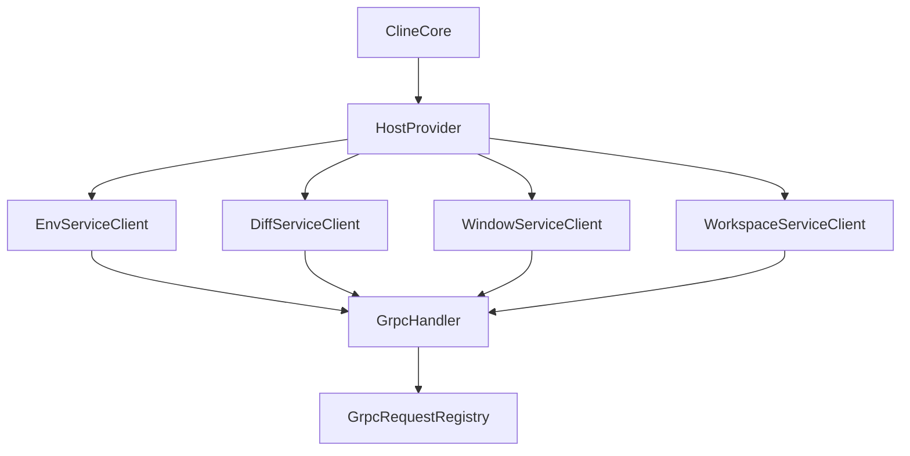

# 环境集成服务

<cite>
**本文档中引用的文件**  
- [env.proto](file://proto/host/env.proto)
- [diff.proto](file://proto/host/diff.proto)
- [browser.proto](file://proto/cline/browser.proto)
- [host-grpc-client.ts](file://src/hosts/vscode/hostbridge/client/host-grpc-client.ts)
- [host-provider.ts](file://src/hosts/host-provider.ts)
- [grpc-handler.ts](file://src/hosts/vscode/hostbridge-grpc-handler.ts)
- [grpc-request-registry.ts](file://src/core/controller/grpc-request-registry.ts)
</cite>

## 目录
1. [简介](#简介)
2. [项目结构](#项目结构)
3. [核心组件](#核心组件)
4. [架构概述](#架构概述)
5. [详细组件分析](#详细组件分析)
6. [依赖分析](#依赖分析)
7. [性能考虑](#性能考虑)
8. [故障排除指南](#故障排除指南)
9. [结论](#结论)

## 简介
本文档为Cline环境集成服务提供全面的API文档，涵盖`host/env.proto`、`host/diff.proto`和`cline/browser.proto`中定义的服务。重点说明`GetEnvVars`、`SetEnvVar`、`ApplyDiff`、`LaunchBrowser`和`ExecuteScript`等关键方法如何桥接Cline核心与VS Code宿主环境，实现环境变量访问、代码差异应用和浏览器自动化。文档结合VS Code Host Bridge的实现，描述gRPC调用的生命周期和数据转换过程，并包含跨环境调用的时序图、权限控制和性能优化建议。

## 项目结构
Cline项目采用模块化结构，将协议定义、核心逻辑、宿主集成和前端界面分离。环境集成服务主要涉及`proto`目录下的协议文件和`src/hosts`目录下的宿主桥接实现。



**Diagram sources**
- [env.proto](file://proto/host/env.proto)
- [diff.proto](file://proto/host/diff.proto)
- [browser.proto](file://proto/cline/browser.proto)
- [host-grpc-client.ts](file://src/hosts/vscode/hostbridge/client/host-grpc-client.ts)
- [host-provider.ts](file://src/hosts/host-provider.ts)
- [grpc-handler.ts](file://src/hosts/vscode/hostbridge-grpc-handler.ts)
- [grpc-request-registry.ts](file://src/core/controller/grpc-request-registry.ts)

**Section sources**
- [env.proto](file://proto/host/env.proto)
- [diff.proto](file://proto/host/diff.proto)
- [browser.proto](file://proto/cline/browser.proto)
- [host-grpc-client.ts](file://src/hosts/vscode/hostbridge/client/host-grpc-client.ts)

## 核心组件
环境集成服务的核心组件包括三个gRPC服务：`EnvService`、`DiffService`和`BrowserService`。这些服务通过VS Code Host Bridge与Cline核心通信，实现跨环境功能调用。

**Section sources**
- [env.proto](file://proto/host/env.proto#L1-L45)
- [diff.proto](file://proto/host/diff.proto#L1-L108)
- [browser.proto](file://proto/cline/browser.proto#L1-L52)

## 架构概述
环境集成服务采用gRPC作为通信协议，通过VS Code Host Bridge在Cline核心和VS Code宿主环境之间建立双向通信通道。Cline核心发起gRPC调用，请求宿主环境执行特定操作，宿主环境通过gRPC响应返回结果。



**Diagram sources**
- [host-provider.ts](file://src/hosts/host-provider.ts#L54-L108)
- [grpc-handler.ts](file://src/hosts/vscode/hostbridge-grpc-handler.ts#L0-L39)
- [grpc-request-registry.ts](file://src/core/controller/grpc-request-registry.ts#L0-L57)

## 详细组件分析

### 环境服务分析
`EnvService`提供与用户环境交互的方法，包括剪贴板操作、机器标识获取和遥测设置订阅。

```mermaid
classDiagram
class EnvService {
+clipboardWriteText(request)
+clipboardReadText(request)
+getMachineId(request)
+getHostVersion(request)
+getTelemetrySettings(request)
+subscribeToTelemetrySettings(request)
}
class GetHostVersionResponse {
+platform : string
+version : string
}
class GetTelemetrySettingsResponse {
+is_enabled : Setting
}
class TelemetrySettingsEvent {
+is_enabled : Setting
}
enum Setting {
UNSUPPORTED
ENABLED
DISABLED
}
EnvService --> GetHostVersionResponse
EnvService --> GetTelemetrySettingsResponse
EnvService --> TelemetrySettingsEvent
```

**Diagram sources**
- [env.proto](file://proto/host/env.proto#L1-L45)

**Section sources**
- [env.proto](file://proto/host/env.proto#L1-L45)
- [host-grpc-client.ts](file://src/hosts/vscode/hostbridge/client/host-grpc-client.ts#L0-L9)

### 差异服务分析
`DiffService`提供差异视图操作，包括打开差异视图、获取文档文本、替换文本、滚动差异、截断文档、保存文档和关闭所有差异。

```mermaid
classDiagram
class DiffService {
+openDiff(request)
+getDocumentText(request)
+replaceText(request)
+scrollDiff(request)
+truncateDocument(request)
+saveDocument(request)
+closeAllDiffs(request)
+openMultiFileDiff(request)
}
class OpenDiffRequest {
+metadata : Metadata
+path : string
+content : string
}
class OpenDiffResponse {
+diff_id : string
}
class GetDocumentTextRequest {
+metadata : Metadata
+diff_id : string
}
class GetDocumentTextResponse {
+content : string
}
class ReplaceTextRequest {
+metadata : Metadata
+diff_id : string
+content : string
+start_line : int32
+end_line : int32
}
class ReplaceTextResponse
class ScrollDiffRequest {
+diff_id : string
+line : int32
}
class ScrollDiffResponse
class TruncateDocumentRequest {
+metadata : Metadata
+diff_id : string
+end_line : int32
}
class TruncateDocumentResponse
class CloseAllDiffsRequest
class CloseAllDiffsResponse
class SaveDocumentRequest {
+metadata : Metadata
+diff_id : string
}
class SaveDocumentResponse
class OpenMultiFileDiffRequest {
+title : string
+diffs : repeated ContentDiff
}
class ContentDiff {
+file_path : string
+left_content : string
+right_content : string
}
class OpenMultiFileDiffResponse
DiffService --> OpenDiffRequest
DiffService --> OpenDiffResponse
DiffService --> GetDocumentTextRequest
DiffService --> GetDocumentTextResponse
DiffService --> ReplaceTextRequest
DiffService --> ReplaceTextResponse
DiffService --> ScrollDiffRequest
DiffService --> ScrollDiffResponse
DiffService --> TruncateDocumentRequest
DiffService --> TruncateDocumentResponse
DiffService --> CloseAllDiffsRequest
DiffService --> CloseAllDiffsResponse
DiffService --> SaveDocumentRequest
DiffService --> SaveDocumentResponse
DiffService --> OpenMultiFileDiffRequest
DiffService --> ContentDiff
DiffService --> OpenMultiFileDiffResponse
```



**Diagram sources**
- [diff.proto](file://proto/host/diff.proto#L1-L108)

**Section sources**
- [diff.proto](file://proto/host/diff.proto#L1-L108)
- [host-grpc-client.ts](file://src/hosts/vscode/hostbridge/client/host-grpc-client.ts#L0-L9)

### 浏览器服务分析
`BrowserService`提供浏览器操作，包括获取浏览器连接信息、测试浏览器连接、发现浏览器、获取检测到的Chrome路径和重新启动Chrome调试模式。



**Diagram sources**
- [browser.proto](file://proto/cline/browser.proto#L1-L52)

**Section sources**
- [browser.proto](file://proto/cline/browser.proto#L1-L52)
- [host-grpc-client.ts](file://src/hosts/vscode/hostbridge/client/host-grpc-client.ts#L0-L9)

## 依赖分析
环境集成服务依赖于gRPC框架和VS Code Host Bridge实现。`HostProvider`类作为单例模式管理宿主桥接客户端，确保在整个应用生命周期中复用gRPC连接。



**Diagram sources**
- [host-provider.ts](file://src/hosts/host-provider.ts#L54-L108)
- [host-grpc-client.ts](file://src/hosts/vscode/hostbridge/client/host-grpc-client.ts#L0-L9)
- [grpc-handler.ts](file://src/hosts/vscode/hostbridge-grpc-handler.ts#L0-L39)
- [grpc-request-registry.ts](file://src/core/controller/grpc-request-registry.ts#L0-L57)

**Section sources**
- [host-provider.ts](file://src/hosts/host-provider.ts#L54-L108)
- [host-grpc-client.ts](file://src/hosts/vscode/hostbridge/client/host-grpc-client.ts#L0-L9)
- [grpc-handler.ts](file://src/hosts/vscode/hostbridge-grpc-handler.ts#L0-L39)
- [grpc-request-registry.ts](file://src/core/controller/grpc-request-registry.ts#L0-L57)

## 性能考虑
环境集成服务通过gRPC连接复用和请求生命周期管理优化性能。`GrpcRequestRegistry`跟踪活动请求并提供清理功能，防止资源泄漏。`BaseGrpcClient`抽象类确保连接的懒加载和网络故障时的透明重连。

## 故障排除指南
当环境集成服务出现问题时，首先检查gRPC连接状态和宿主桥接服务是否正常运行。使用`getHostVersion`方法验证宿主环境版本，使用`getMachineId`方法确认机器标识。对于流式请求，确保正确处理`onComplete`回调以释放资源。

**Section sources**
- [env.proto](file://proto/host/env.proto#L1-L45)
- [grpc-handler.ts](file://src/hosts/vscode/hostbridge-grpc-handler.ts#L107-L145)
- [grpc-request-registry.ts](file://src/core/controller/grpc-request-registry.ts#L0-L57)

## 结论
Cline环境集成服务通过gRPC协议和VS Code Host Bridge实现了核心与宿主环境的无缝集成。`EnvService`、`DiffService`和`BrowserService`提供了丰富的功能，支持环境变量访问、代码差异应用和浏览器自动化。通过合理的架构设计和性能优化，该服务为Cline提供了强大的跨环境操作能力。