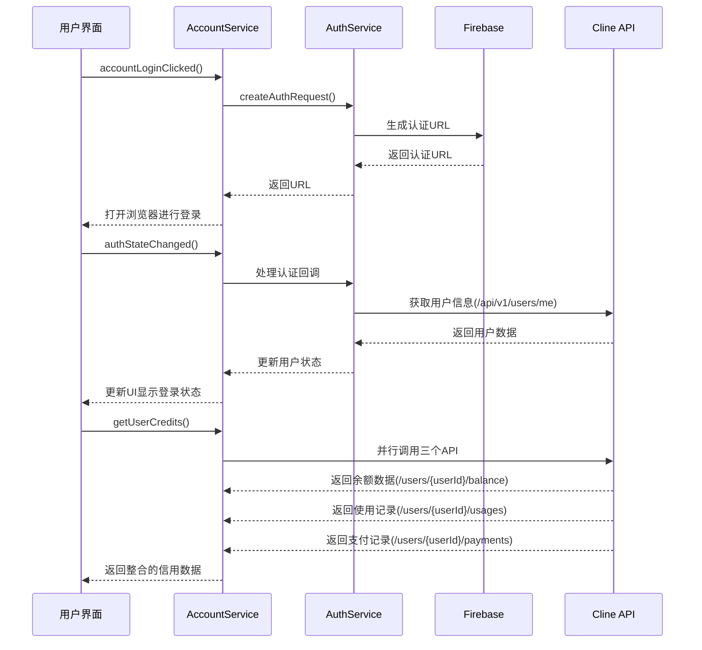
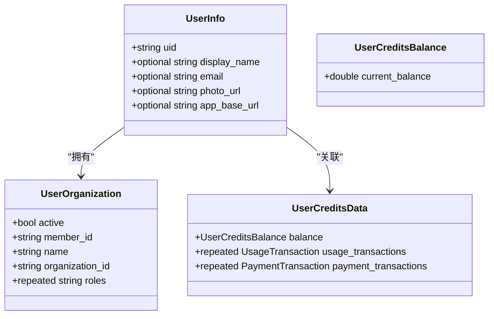
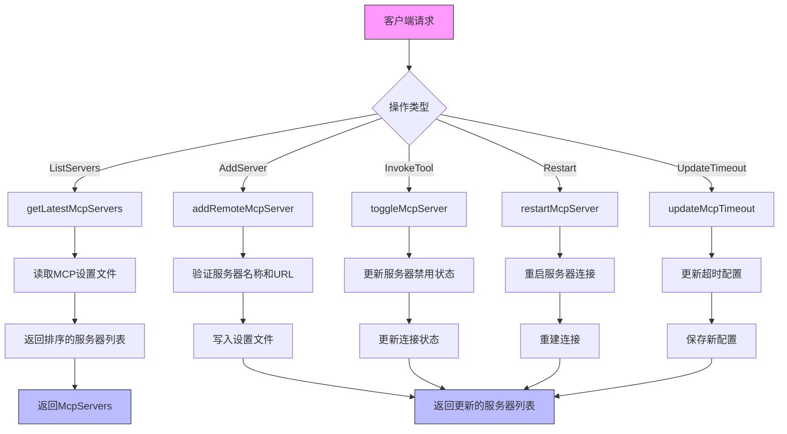
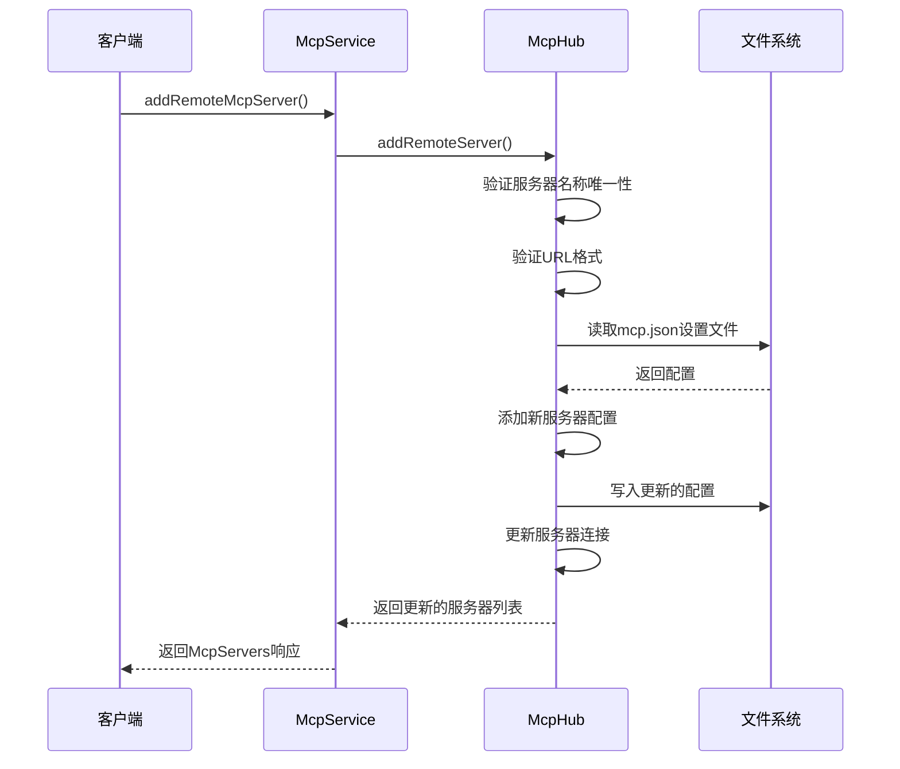
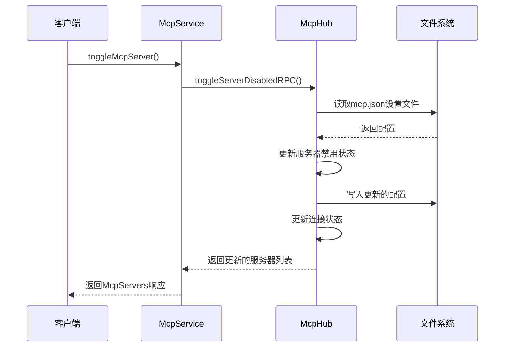
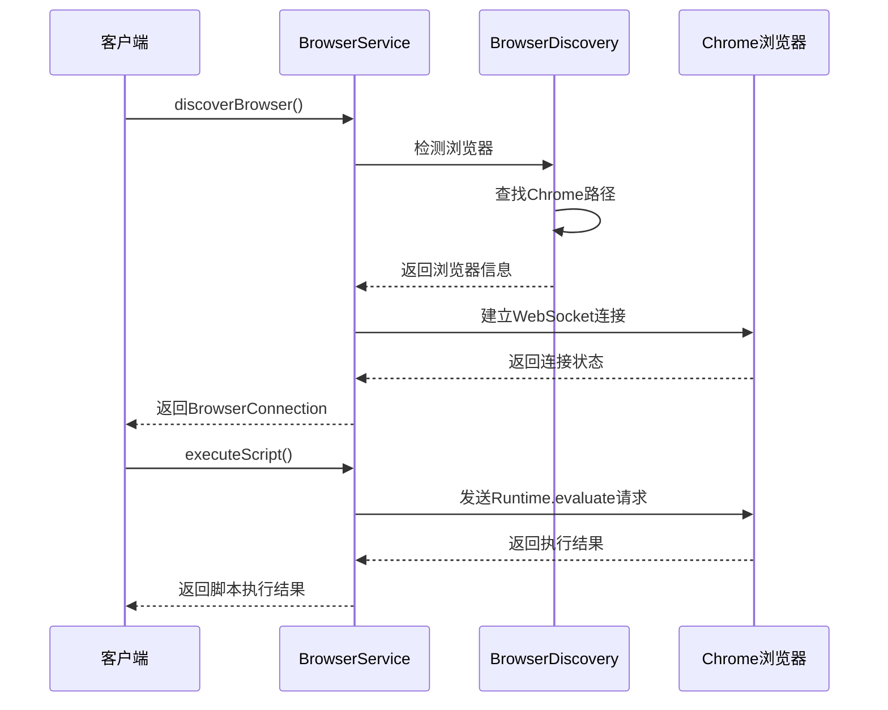
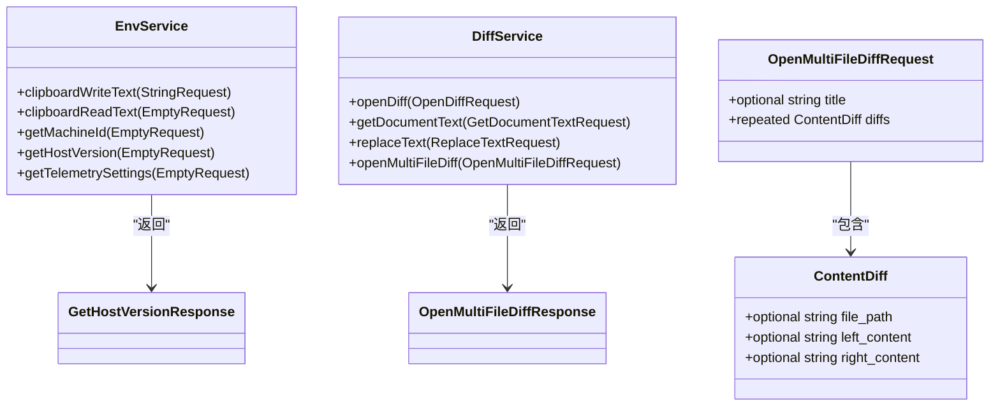
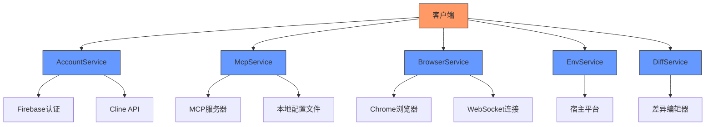
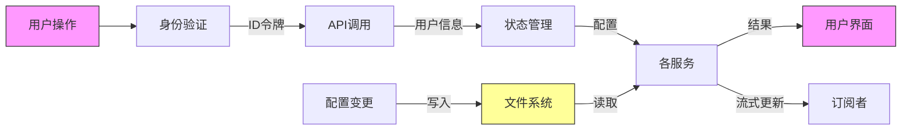

# 系统管理服务

<cite>
**本文档引用的文件**  
- [account.proto](file://proto/cline/account.proto)
- [mcp.proto](file://proto/cline/mcp.proto)
- [browser.proto](file://proto/cline/browser.proto)
- [env.proto](file://proto/host/env.proto)
- [diff.proto](file://proto/host/diff.proto)
- [accountLoginClicked.ts](file://src/core/controller/account/accountLoginClicked.ts)
- [accountLogoutClicked.ts](file://src/core/controller/account/accountLogoutClicked.ts)
- [getUserCredits.ts](file://src/core/controller/account/getUserCredits.ts)
- [getUserOrganizations.ts](file://src/core/controller/account/getUserOrganizations.ts)
- [addRemoteMcpServer.ts](file://src/core/controller/mcp/addRemoteMcpServer.ts)
- [deleteMcpServer.ts](file://src/core/controller/mcp/deleteMcpServer.ts)
- [toggleMcpServer.ts](file://src/core/controller/mcp/toggleMcpServer.ts)
- [restartMcpServer.ts](file://src/core/controller/mcp/restartMcpServer.ts)
- [updateMcpTimeout.ts](file://src/core/controller/mcp/updateMcpTimeout.ts)
- [getLatestMcpServers.ts](file://src/core/controller/mcp/getLatestMcpServers.ts)
- [subscribeToMcpServers.ts](file://src/core/controller/mcp/subscribeToMcpServers.ts)
- [McpHub.ts](file://src/services/mcp/McpHub.ts)
- [launchBrowser.ts](file://src/core/controller/browser/launchBrowser.ts)
- [executeScript.ts](file://src/core/controller/browser/executeScript.ts)
- [getEnvVars.ts](file://src/core/controller/host/env/getEnvVars.ts)
- [applyDiff.ts](file://src/core/controller/host/diff/applyDiff.ts)
</cite>

## 目录
1. [简介](#简介)
2. [身份验证服务](#身份验证服务)
3. [工具扩展服务](#工具扩展服务)
4. [环境集成服务](#环境集成服务)
5. [服务集成架构](#服务集成架构)
6. [API参考](#api参考)
7. [故障排除](#故障排除)
8. [结论](#结论)

## 简介

Cline系统管理与集成服务提供了一套全面的API，用于管理用户身份验证、扩展功能工具和集成宿主环境。本API文档详细介绍了核心服务接口，包括`AccountService`用于用户登录和账户管理，`McpService`用于管理工具服务器，`BrowserService`用于浏览器自动化，以及由宿主环境提供的`EnvService`和`DiffService`。

这些服务共同构成了Cline平台的核心功能体系，支持从用户认证到工具集成再到环境交互的完整工作流。通过标准化的gRPC接口，这些服务实现了跨平台的互操作性和可扩展性。

## 身份验证服务

`AccountService`是Cline平台的身份验证核心，负责处理用户登录、登出和账户信息管理。该服务通过安全的认证流程与Firebase集成，确保用户身份的安全验证。

**图示来源**
- [account.proto](file://proto/cline/account.proto#L15-L132)
- [accountLoginClicked.ts](file://src/core/controller/account/accountLoginClicked.ts#L1-L14)
- [FirebaseAuthProvider.ts](file://src/services/auth/providers/FirebaseAuthProvider.ts#L0-L80)

### 登录功能

`Login`方法通过`accountLoginClicked`RPC实现用户登录流程。当用户点击登录链接时，系统会生成一个安全的nonce用于状态验证，将其存储在密钥管理服务中，并在外部浏览器中打开认证URL。

该方法返回一个字符串类型的响应，包含重定向到认证提供程序（如Google）所需的URL。认证成功后，系统会通过`authStateChanged`方法更新用户状态，并获取用户信息用于后续操作。

**关键特性：**
- 使用Firebase进行身份验证
- 支持OAuth 2.0协议
- 生成安全nonce防止CSRF攻击
- 自动处理认证回调

### 获取用户详情

`GetUserDetails`功能由多个RPC方法组合实现，包括`getUserCredits`、`getUserOrganizations`和`authStateChanged`。这些方法共同提供了完整的用户信息视图。

`getUserCredits`方法并行调用三个后端API来获取用户的信用信息：
- 余额信息：通过`/api/v1/users/{userId}/balance`获取
- 使用记录：通过`/api/v1/users/{userId}/usages`获取
- 支付记录：通过`/api/v1/users/{userId}/payments`获取

`getUserOrganizations`方法获取用户所属的所有组织信息，包括组织ID、名称、角色等。这些信息用于支持多组织账户管理和权限控制。

**用户信息结构：**

**图示来源**
- [account.proto](file://proto/cline/account.proto#L80-L132)
- [getUserCredits.ts](file://src/core/controller/account/getUserCredits.ts#L0-L37)
- [getUserOrganizations.ts](file://src/core/controller/account/getUserOrganizations.ts#L0-L34)

**本节来源**
- [account.proto](file://proto/cline/account.proto#L15-L132)
- [accountLoginClicked.ts](file://src/core/controller/account/accountLoginClicked.ts#L1-L14)
- [getUserCredits.ts](file://src/core/controller/account/getUserCredits.ts#L0-L37)
- [getUserOrganizations.ts](file://src/core/controller/account/getUserOrganizations.ts#L0-L34)

## 工具扩展服务

`McpService`是Cline平台的工具扩展核心，负责管理MCP（Model Control Protocol）服务器的生命周期和配置。这些服务器提供了可扩展的工具功能，允许Cline与外部服务和工具集成。

**图示来源**
- [mcp.proto](file://proto/cline/mcp.proto#L15-L132)
- [McpHub.ts](file://src/services/mcp/McpHub.ts#L737-L1091)

### 服务器管理

`ListServers`方法通过`getLatestMcpServers`RPC实现，用于获取当前配置的所有MCP服务器列表。该方法读取本地的MCP设置文件，验证其有效性，并返回按配置顺序排序的服务器列表。

`AddServer`方法通过`addRemoteMcpServer`RPC实现，允许用户添加新的远程MCP服务器。该方法验证服务器名称的唯一性和URL的有效性，然后将新服务器配置写入设置文件，并更新服务器连接。

**图示来源**
- [mcp.proto](file://proto/cline/mcp.proto#L15-L45)
- [addRemoteMcpServer.ts](file://src/core/controller/mcp/addRemoteMcpServer.ts#L0-L32)
- [McpHub.ts](file://src/services/mcp/McpHub.ts#L987-L1024)

### 工具调用

`InvokeTool`功能通过`toggleMcpServer`RPC实现，用于启用或禁用特定的MCP服务器。该操作会更新服务器的禁用状态，修改本地设置文件，并相应地更新服务器连接状态。

当服务器被禁用时，其所有工具都将不可用；当服务器被启用时，系统会尝试建立与服务器的连接。此功能允许用户动态管理可用的工具集，根据需要启用或禁用特定功能。

**图示来源**
- [mcp.proto](file://proto/cline/mcp.proto#L15-L30)
- [toggleMcpServer.ts](file://src/core/controller/mcp/toggleMcpServer.ts#L0-L23)
- [McpHub.ts](file://src/services/mcp/McpHub.ts#L737-L772)

**本节来源**
- [mcp.proto](file://proto/cline/mcp.proto#L15-L132)
- [addRemoteMcpServer.ts](file://src/core/controller/mcp/addRemoteMcpServer.ts#L0-L32)
- [deleteMcpServer.ts](file://src/core/controller/mcp/deleteMcpServer.ts#L0-L24)
- [toggleMcpServer.ts](file://src/core/controller/mcp/toggleMcpServer.ts#L0-L23)
- [restartMcpServer.ts](file://src/core/controller/mcp/restartMcpServer.ts#L0-L23)
- [updateMcpTimeout.ts](file://src/core/controller/mcp/updateMcpTimeout.ts#L0-L25)
- [getLatestMcpServers.ts](file://src/core/controller/mcp/getLatestMcpServers.ts#L0-L24)
- [McpHub.ts](file://src/services/mcp/McpHub.ts#L737-L1091)

## 环境集成服务

Cline平台通过`BrowserService`、`EnvService`和`DiffService`与宿主环境深度集成，提供浏览器自动化、环境变量访问和差异比较等核心功能。

### 浏览器服务

`BrowserService`提供浏览器自动化功能，包括启动浏览器、执行脚本等。`Launch`方法通过`discoverBrowser`和`getBrowserConnectionInfo`RPC实现，用于发现和连接到可用的浏览器实例。

`ExecuteScript`功能允许在浏览器上下文中执行JavaScript代码，实现网页内容的读取和操作。该功能通过Chrome DevTools Protocol与浏览器通信，提供强大的网页自动化能力。

**图示来源**
- [browser.proto](file://proto/cline/browser.proto#L15-L51)
- [BrowserDiscovery.ts](file://src/services/browser/BrowserDiscovery.ts#L0-L100)

### 宿主环境服务

`EnvService`提供对宿主环境的访问，包括剪贴板操作、机器标识获取等。`GetEnvVars`功能通过`getHostVersion`和`getTelemetrySettings`RPC实现，用于获取宿主平台的版本信息和遥测设置。

`DiffService`提供差异比较功能，支持单文件和多文件的差异显示。`ApplyDiff`方法通过`openMultiFileDiff`RPC实现，允许在内存中显示多个文件的前后状态比较，而无需实际修改文件系统。

**图示来源**
- [env.proto](file://proto/host/env.proto#L15-L44)
- [diff.proto](file://proto/host/diff.proto#L15-L107)
- [hostbridge-grpc-service.ts](file://src/hosts/vscode/hostbridge/hostbridge-grpc-service.ts#L0-L200)

**本节来源**
- [browser.proto](file://proto/cline/browser.proto#L15-L51)
- [env.proto](file://proto/host/env.proto#L15-L44)
- [diff.proto](file://proto/host/diff.proto#L15-L107)
- [BrowserDiscovery.ts](file://src/services/browser/BrowserDiscovery.ts#L0-L100)
- [hostbridge-grpc-service.ts](file://src/hosts/vscode/hostbridge/hostbridge-grpc-service.ts#L0-L200)

## 服务集成架构

Cline系统管理服务采用分层架构设计，将核心功能划分为独立的服务模块，通过gRPC进行通信。这种设计实现了关注点分离，提高了系统的可维护性和可扩展性。

**图示来源**
- [account.proto](file://proto/cline/account.proto#L15-L132)
- [mcp.proto](file://proto/cline/mcp.proto#L15-L132)
- [browser.proto](file://proto/cline/browser.proto#L15-L51)
- [env.proto](file://proto/host/env.proto#L15-L44)
- [diff.proto](file://proto/host/diff.proto#L15-L107)

### 数据流分析

Cline服务之间的数据流遵循请求-响应模式，部分服务支持流式响应。身份验证数据通过Firebase令牌在服务间安全传递，配置数据持久化存储在本地文件系统中。

**图示来源**
- [account.proto](file://proto/cline/account.proto#L15-L132)
- [mcp.proto](file://proto/cline/mcp.proto#L15-L132)
- [state-manager.ts](file://src/core/storage/StateManager.ts#L0-L200)

**本节来源**
- [account.proto](file://proto/cline/account.proto#L15-L132)
- [mcp.proto](file://proto/cline/mcp.proto#L15-L132)
- [browser.proto](file://proto/cline/browser.proto#L15-L51)
- [env.proto](file://proto/host/env.proto#L15-L44)
- [diff.proto](file://proto/host/diff.proto#L15-L107)

## API参考

### AccountService

| 方法 | 请求类型 | 响应类型 | 描述 |
|------|----------|----------|------|
| `accountLoginClicked` | EmptyRequest | String | 处理用户点击登录链接，返回认证URL |
| `accountLogoutClicked` | EmptyRequest | Empty | 处理用户登出，清除API密钥和用户状态 |
| `authStateChanged` | AuthStateChangedRequest | AuthState | 处理认证状态变更，更新用户信息 |
| `getUserCredits` | EmptyRequest | UserCreditsData | 获取用户信用数据（余额、使用记录、支付记录） |
| `getUserOrganizations` | EmptyRequest | UserOrganizationsResponse | 获取用户所属的所有组织信息 |

### McpService

| 方法 | 请求类型 | 响应类型 | 描述 |
|------|----------|----------|------|
| `addRemoteMcpServer` | AddRemoteMcpServerRequest | McpServers | 添加新的远程MCP服务器 |
| `deleteMcpServer` | StringRequest | McpServers | 删除指定的MCP服务器 |
| `toggleMcpServer` | ToggleMcpServerRequest | McpServers | 切换MCP服务器的启用/禁用状态 |
| `restartMcpServer` | StringRequest | McpServers | 重启指定的MCP服务器连接 |
| `updateMcpTimeout` | UpdateMcpTimeoutRequest | McpServers | 更新MCP服务器的超时配置 |
| `getLatestMcpServers` | Empty | McpServers | 获取最新的MCP服务器列表 |
| `subscribeToMcpServers` | EmptyRequest | stream McpServers | 订阅MCP服务器变更事件 |

### BrowserService

| 方法 | 请求类型 | 响应类型 | 描述 |
|------|----------|----------|------|
| `discoverBrowser` | EmptyRequest | BrowserConnection | 发现并连接到可用的浏览器实例 |
| `getBrowserConnectionInfo` | EmptyRequest | BrowserConnectionInfo | 获取当前浏览器连接信息 |
| `testBrowserConnection` | StringRequest | BrowserConnection | 测试指定端点的浏览器连接 |

### EnvService

| 方法 | 请求类型 | 响应类型 | 描述 |
|------|----------|----------|------|
| `clipboardWriteText` | StringRequest | Empty | 将文本写入系统剪贴板 |
| `clipboardReadText` | EmptyRequest | String | 从系统剪贴板读取文本 |
| `getMachineId` | EmptyRequest | String | 获取用于遥测的稳定机器标识符 |
| `getHostVersion` | EmptyRequest | GetHostVersionResponse | 获取宿主平台的版本信息 |
| `getTelemetrySettings` | EmptyRequest | GetTelemetrySettingsResponse | 获取遥测设置状态 |

### DiffService

| 方法 | 请求类型 | 响应类型 | 描述 |
|------|----------|----------|------|
| `openMultiFileDiff` | OpenMultiFileDiffRequest | OpenMultiFileDiffResponse | 显示多个文件的差异比较 |
| `openDiff` | OpenDiffRequest | OpenDiffResponse | 打开单个文件的差异视图 |
| `getDocumentText` | GetDocumentTextRequest | GetDocumentTextResponse | 获取差异文档的内容 |
| `replaceText` | ReplaceTextRequest | ReplaceTextResponse | 替换差异中的文本选择 |

**本节来源**
- [account.proto](file://proto/cline/account.proto#L15-L132)
- [mcp.proto](file://proto/cline/mcp.proto#L15-L132)
- [browser.proto](file://proto/cline/browser.proto#L15-L51)
- [env.proto](file://proto/host/env.proto#L15-L44)
- [diff.proto](file://proto/host/diff.proto#L15-L107)

## 故障排除

### 身份验证问题

**问题：** `accountLoginClicked`调用后未打开浏览器
- **可能原因：** 默认浏览器未正确配置或无法启动
- **解决方案：** 检查系统默认浏览器设置，确保Chrome或支持的浏览器已安装

**问题：** 认证成功后用户信息未更新
- **可能原因：** Firebase ID令牌已过期或网络请求失败
- **解决方案：** 检查网络连接，确认Cline API端点可访问，必要时重新登录

### 工具服务器问题

**问题：** `addRemoteMcpServer`失败，提示URL无效
- **可能原因：** 提供的服务器URL格式不正确
- **解决方案：** 确保URL包含协议（http://或https://）和有效的主机名

**问题：** 服务器状态始终为"连接中"
- **可能原因：** 服务器未运行或网络防火墙阻止连接
- **解决方案：** 验证目标服务器正在运行，检查防火墙设置，确保端口开放

### 浏览器集成问题

**问题：** `discoverBrowser`无法找到Chrome安装
- **可能原因：** Chrome未安装在标准位置或环境变量未正确设置
- **解决方案：** 手动指定Chrome可执行文件路径，或重新安装Chrome

**问题：** `executeScript`执行超时
- **可能原因：** 脚本执行时间过长或页面未完全加载
- **解决方案：** 优化脚本逻辑，添加适当的等待条件，确保页面就绪后再执行

### 差异比较问题

**问题：** `openMultiFileDiff`未显示预期的差异
- **可能原因：** 左右内容完全相同或输入数据格式错误
- **解决方案：** 验证输入的left_content和right_content确实存在差异，检查文件路径是否正确

**问题：** 差异视图中的文本替换失败
- **可能原因：** 指定的行范围超出文档边界
- **解决方案：** 验证start_line和end_line参数在文档有效范围内

**本节来源**
- [accountLoginClicked.ts](file://src/core/controller/account/accountLoginClicked.ts#L1-L14)
- [addRemoteMcpServer.ts](file://src/core/controller/mcp/addRemoteMcpServer.ts#L0-L32)
- [BrowserDiscovery.ts](file://src/services/browser/BrowserDiscovery.ts#L0-L100)
- [DiffService.ts](file://src/hosts/vscode/hostbridge/diff/DiffService.ts#L0-L100)

## 结论

Cline系统管理与集成服务提供了一套强大而灵活的API，支持身份验证、工具扩展和环境集成三大核心功能。通过`AccountService`，用户可以安全地管理账户和身份验证；通过`McpService`，平台能够动态扩展功能工具集；通过`EnvService`和`DiffService`，Cline与宿主环境实现了深度集成。

这些服务共同构成了Cline平台的基础设施，为开发者提供了可编程的界面来构建复杂的自动化工作流。标准化的gRPC接口确保了跨平台的一致性和可靠性，而模块化的设计则为未来的功能扩展提供了良好的基础。