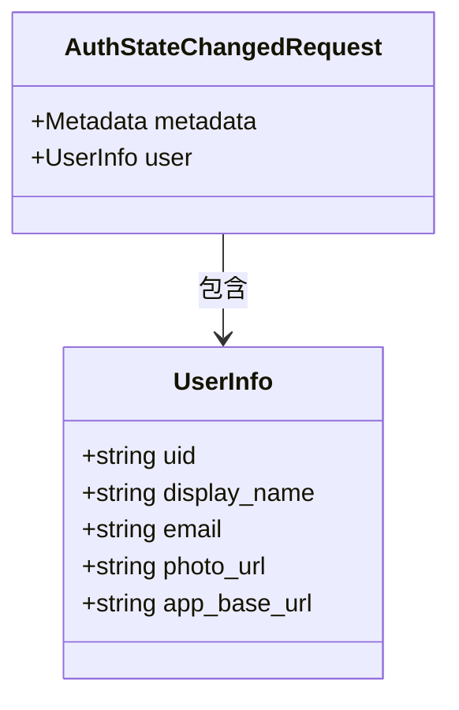
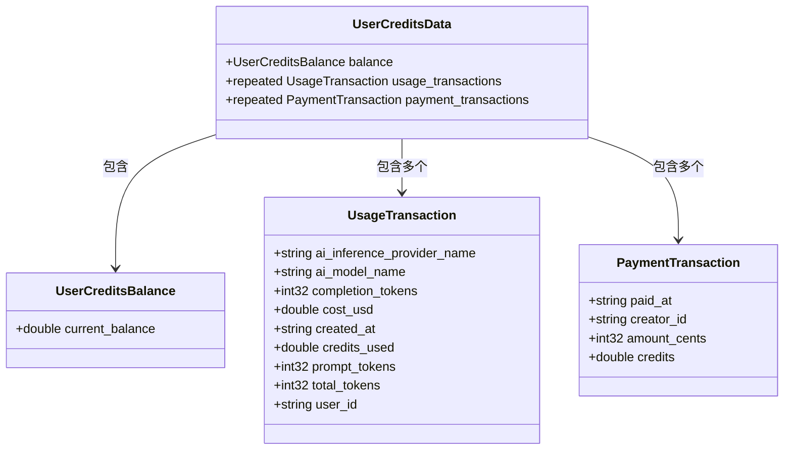
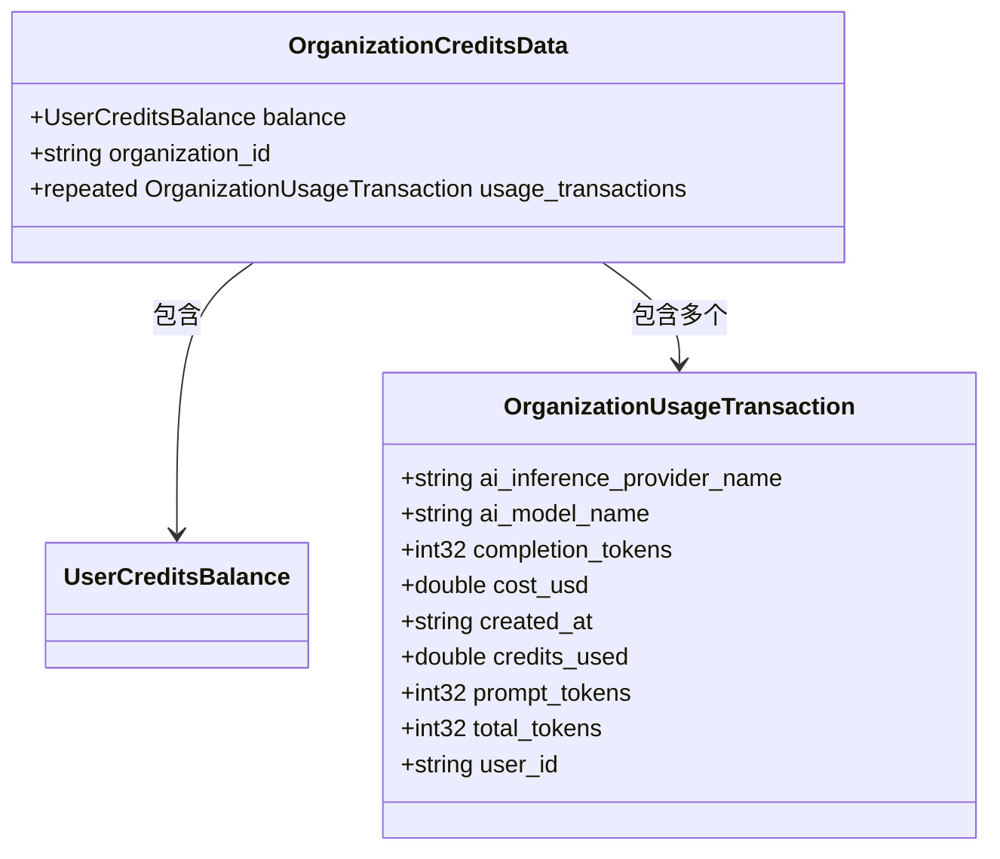
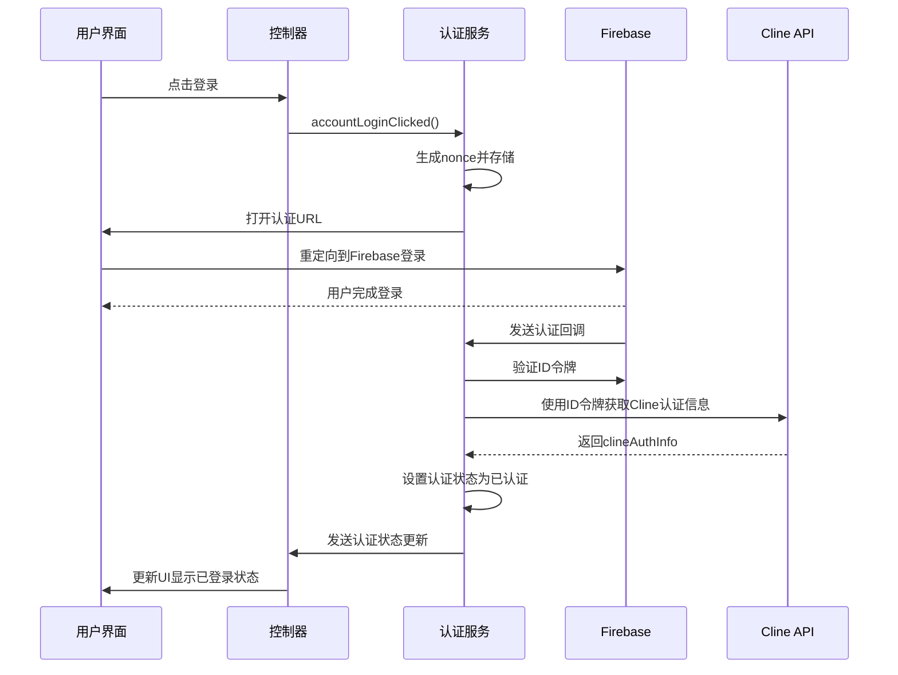
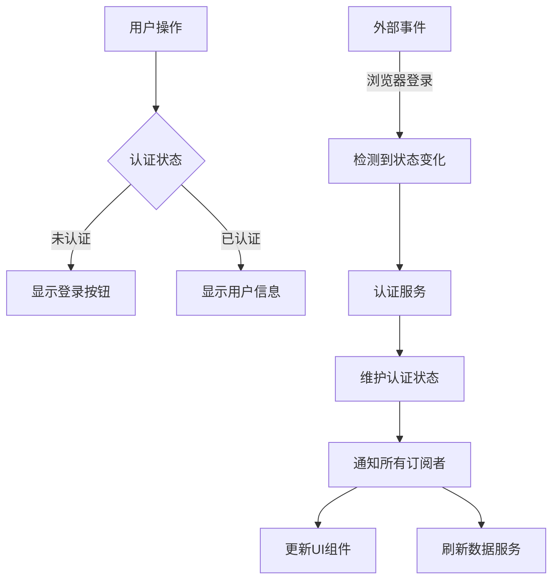
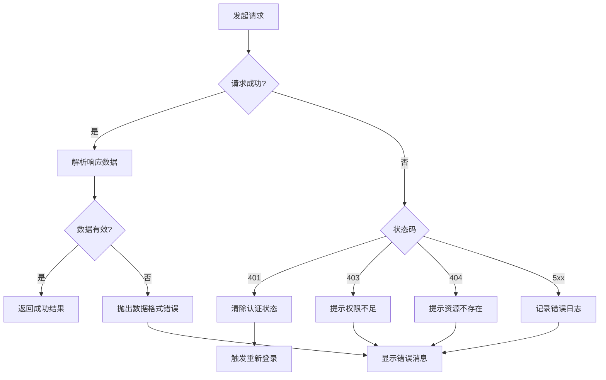
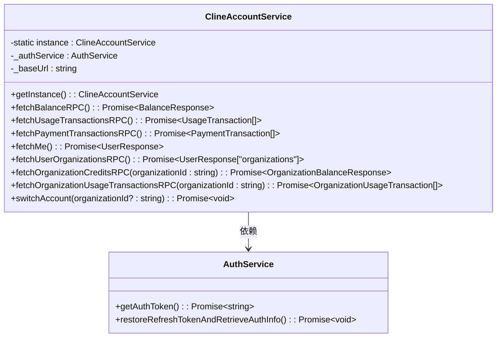
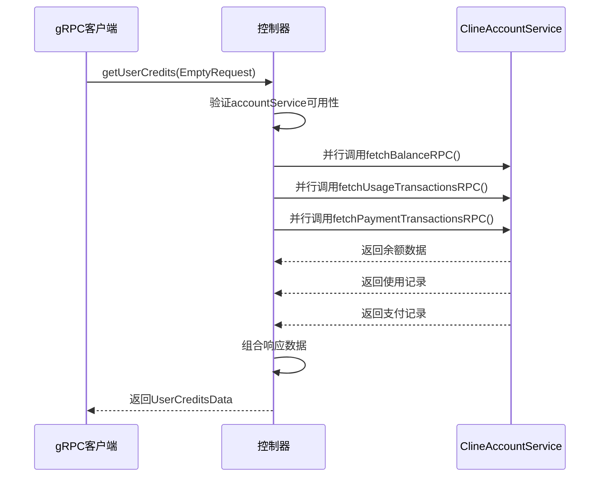
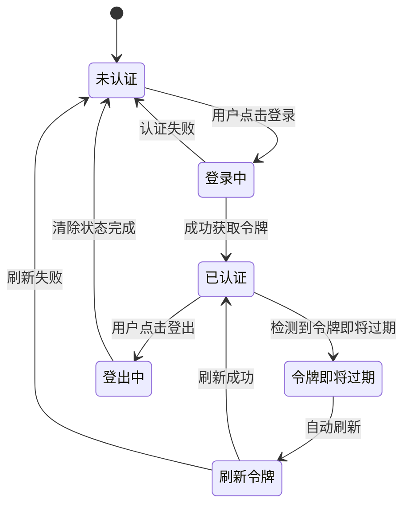
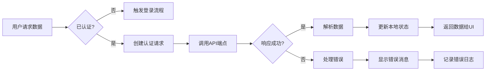

# 账户服务

<cite>
**本文档中引用的文件**  
- [account.proto](file://proto/cline/account.proto)
- [ClineAccountService.ts](file://src/services/account/ClineAccountService.ts)
- [AuthService.ts](file://src/services/auth/AuthService.ts)
- [accountLoginClicked.ts](file://src/core/controller/account/accountLoginClicked.ts)
- [accountLogoutClicked.ts](file://src/core/controller/account/accountLogoutClicked.ts)
- [getUserCredits.ts](file://src/core/controller/account/getUserCredits.ts)
- [getOrganizationCredits.ts](file://src/core/controller/account/getOrganizationCredits.ts)
</cite>

## 目录
1. [简介](#简介)
2. [核心方法说明](#核心方法说明)
3. [请求/响应消息结构](#请求响应消息结构)
4. [认证机制](#认证机制)
5. [错误处理](#错误处理)
6. [服务实现与集成](#服务实现与集成)
7. [实际调用示例](#实际调用示例)
8. [状态管理流程](#状态管理流程)
9. [常见问题排查指南](#常见问题排查指南)
10. [附录](#附录)

## 简介
账户服务是Cline平台的核心身份验证和信用管理模块，负责处理用户登录、登出、身份状态同步以及信用额度查询等关键功能。该服务通过gRPC接口暴露功能，并与Firebase认证系统深度集成，确保安全可靠的用户身份管理。本文档详细说明`AccountService`接口的实现细节、消息结构、认证流程及错误处理机制。

## 核心方法说明

### Login (accountLoginClicked)
触发用户登录流程。该方法生成一个安全的nonce用于状态验证，将其存储在密钥管理器中，并在外部浏览器中打开认证URL。如果用户已登录，则立即通知所有订阅者当前认证状态。

**Section sources**
- [account.proto](file://proto/cline/account.proto#L19-L23)
- [accountLoginClicked.ts](file://src/core/controller/account/accountLoginClicked.ts#L1-L15)

### Logout (accountLogoutClicked)
处理用户登出操作。该方法清除本地存储的API密钥和用户状态，将认证状态设置为未认证，并通知所有订阅者状态变更。

**Section sources**
- [account.proto](file://proto/cline/account.proto#L25-L28)
- [accountLogoutClicked.ts](file://src/core/controller/account/accountLogoutClicked.ts#L1-L16)

### GetUserDetails
虽然`account.proto`中未直接定义`GetUserDetails`方法，但通过`authStateChanged`和`subscribeToAuthStatusUpdate`机制实现了用户详情的获取和同步。当认证状态变化时，系统会自动更新并分发用户信息。

### GetUserCredits
获取用户的信用数据，包括余额、使用交易记录和支付交易记录。该方法调用账户服务的多个RPC方法并行获取数据，然后组合成完整的响应。

**Section sources**
- [account.proto](file://proto/cline/account.proto#L44-L47)
- [getUserCredits.ts](file://src/core/controller/account/getUserCredits.ts#L1-L38)

### GetOrganizationCredits
获取指定组织的信用数据，包括余额和使用交易记录。该方法需要提供组织ID作为请求参数，并从账户服务中获取相应的组织信用信息。

**Section sources**
- [account.proto](file://proto/cline/account.proto#L49-L51)
- [getOrganizationCredits.ts](file://src/core/controller/account/getOrganizationCredits.ts#L1-L55)

## 请求响应消息结构

### AuthStateChangedRequest
包含元数据和用户信息的消息，用于处理Firebase上下文触发的认证状态变更。



**Diagram sources**
- [account.proto](file://proto/cline/account.proto#L76-L85)

### UserCreditsData
包含用户信用数据的完整响应，包括余额、使用交易和支付交易。



**Diagram sources**
- [account.proto](file://proto/cline/account.proto#L105-L132)

### OrganizationCreditsData
包含组织信用数据的响应，包括余额、组织ID和使用交易记录。



**Diagram sources**
- [account.proto](file://proto/cline/account.proto#L114-L121)

## 认证机制

### Firebase认证集成
账户服务通过`FirebaseAuthProvider`与Firebase认证系统集成。认证流程如下：



**Diagram sources**
- [AuthService.ts](file://src/services/auth/AuthService.ts#L1-L343)
- [accountLoginClicked.ts](file://src/core/controller/account/accountLoginClicked.ts#L1-L15)

### 认证状态管理
系统使用发布-订阅模式管理认证状态，确保多个组件能实时响应状态变化。



**Diagram sources**
- [AuthService.ts](file://src/services/auth/AuthService.ts#L250-L343)

## 错误处理

### 错误类型
系统定义了多种错误处理场景，包括：

- **认证错误**：令牌无效、过期或验证失败
- **网络错误**：API请求失败或超时
- **数据错误**：响应数据格式无效
- **业务逻辑错误**：组织ID不存在或权限不足

### 错误处理流程


**Diagram sources**
- [ClineAccountService.ts](file://src/services/account/ClineAccountService.ts#L60-L105)
- [AuthService.ts](file://src/services/auth/AuthService.ts#L200-L240)

## 服务实现与集成

### ClineAccountService实现
`ClineAccountService`是账户服务的核心实现类，负责与Cline API进行通信。



**Diagram sources**
- [ClineAccountService.ts](file://src/services/account/ClineAccountService.ts#L12-L242)

### 控制器层集成
控制器层作为gRPC接口和底层服务之间的桥梁，处理请求分发和响应组装。



**Diagram sources**
- [getUserCredits.ts](file://src/core/controller/account/getUserCredits.ts#L1-L38)
- [ClineAccountService.ts](file://src/services/account/ClineAccountService.ts#L107-L199)

## 实际调用示例

### 登录流程调用
```typescript
// 客户端调用
const loginResponse = await accountServiceClient.accountLoginClicked(EmptyRequest.create({}));
// 打开返回的URL进行认证
window.open(loginResponse.value, '_blank');
```

### 获取用户信用数据
```typescript
// 客户端调用
try {
    const userCredits = await accountServiceClient.getUserCredits(EmptyRequest.create({}));
    console.log('余额:', userCredits.balance.currentBalance);
    console.log('使用记录:', userCredits.usageTransactions.length);
    console.log('支付记录:', userCredits.paymentTransactions.length);
} catch (error) {
    console.error('获取信用数据失败:', error);
}
```

### 获取组织信用数据
```typescript
// 客户端调用
try {
    const request = GetOrganizationCreditsRequest.create({
        organizationId: "org-12345"
    });
    const orgCredits = await accountServiceClient.getOrganizationCredits(request);
    console.log('组织余额:', orgCredits.balance.currentBalance);
    console.log('组织使用记录:', orgCredits.usageTransactions.length);
} catch (error) {
    console.error('获取组织信用数据失败:', error);
}
```

**Section sources**
- [getUserCredits.ts](file://src/core/controller/account/getUserCredits.ts#L1-L38)
- [getOrganizationCredits.ts](file://src/core/controller/account/getOrganizationCredits.ts#L1-L55)

## 状态管理流程

### 认证状态生命周期


**Diagram sources**
- [AuthService.ts](file://src/services/auth/AuthService.ts#L1-L343)

### 数据获取状态流


**Diagram sources**
- [ClineAccountService.ts](file://src/services/account/ClineAccountService.ts#L60-L105)

## 常见问题排查指南

### 登录失败
**问题**: 点击登录后无反应或重定向失败  
**排查步骤**:
1. 检查`clineEnvConfig.apiBaseUrl`配置是否正确
2. 确认`DefaultClineAccountURI`是否可访问
3. 检查浏览器是否阻止了弹出窗口
4. 查看控制台是否有CORS错误

**Section sources**
- [AuthService.ts](file://src/services/auth/AuthService.ts#L150-L170)

### 信用数据无法加载
**问题**: `getUserCredits`调用返回空数据或错误  
**排查步骤**:
1. 确认用户已成功登录并获取有效令牌
2. 检查`getAuthToken()`是否返回有效令牌
3. 验证API端点`/api/v1/users/me/balance`是否可访问
4. 检查网络请求是否返回401状态码

**Section sources**
- [ClineAccountService.ts](file://src/services/account/ClineAccountService.ts#L107-L135)
- [getUserCredits.ts](file://src/core/controller/account/getUserCredits.ts#L1-L38)

### 组织信用数据获取失败
**问题**: `getOrganizationCredits`调用失败  
**排查步骤**:
1. 确认提供的`organizationId`是否正确
2. 检查用户是否属于该组织（通过`fetchMe()`验证）
3. 验证`memberId`是否能正确从用户信息中提取
4. 检查API端点`/api/v1/organizations/{id}/balance`是否可访问

**Section sources**
- [ClineAccountService.ts](file://src/services/account/ClineAccountService.ts#L174-L188)
- [getOrganizationCredits.ts](file://src/core/controller/account/getOrganizationCredits.ts#L1-L55)

### 认证状态不同步
**问题**: UI显示已登录，但API调用返回401  
**排查步骤**:
1. 检查`restoreRefreshTokenAndRetrieveAuthInfo()`是否正常执行
2. 验证`_clineAuthInfo`对象是否包含有效数据
3. 确认`shouldRefreshIdToken()`逻辑是否正确判断令牌状态
4. 检查Firebase令牌是否已过期

**Section sources**
- [AuthService.ts](file://src/services/auth/AuthService.ts#L100-L130)

## 附录

### API端点映射
| 方法 | HTTP端点 | 认证要求 |
|------|----------|----------|
| 获取用户详情 | GET /api/v1/users/me | Bearer令牌 |
| 获取用户余额 | GET /api/v1/users/{userId}/balance | Bearer令牌 |
| 获取用户使用记录 | GET /api/v1/users/{userId}/usages | Bearer令牌 |
| 获取用户支付记录 | GET /api/v1/users/{userId}/payments | Bearer令牌 |
| 获取组织余额 | GET /api/v1/organizations/{orgId}/balance | Bearer令牌 |
| 获取组织使用记录 | GET /api/v1/organizations/{orgId}/members/{memberId}/usages | Bearer令牌 |
| 切换活跃账户 | PUT /api/v1/users/active-account | Bearer令牌 |

**Section sources**
- [ClineAccountService.ts](file://src/services/account/ClineAccountService.ts#L107-L230)

### 环境配置
```typescript
// 相关配置项
interface ClineEnvConfig {
    apiBaseUrl: string        // Cline API基础URL
    appBaseUrl: string        // Cline应用基础URL
    firebase: {
        apiKey: string
        authDomain: string
        projectId: string
        storageBucket: string
        messagingSenderId: string
        appId: string
    }
}
```

**Section sources**
- [AuthService.ts](file://src/services/auth/AuthService.ts#L10-L20)
- [config.ts](file://src/config.ts)