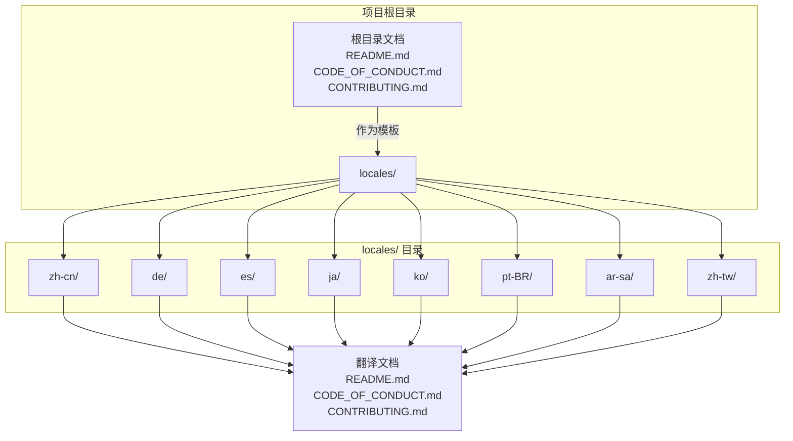
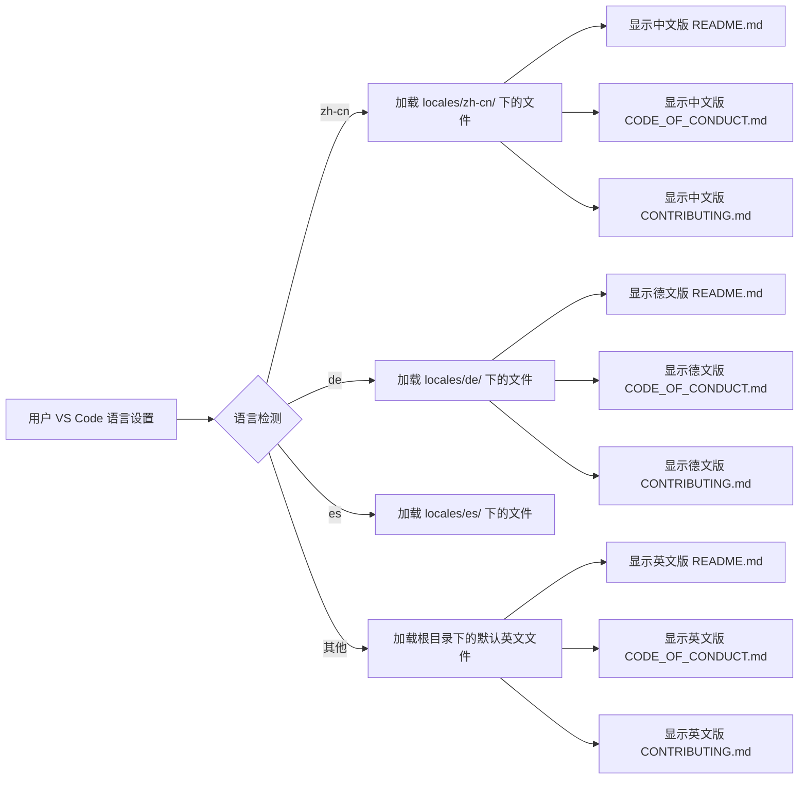
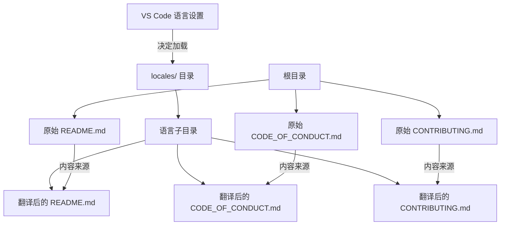

# 国际化支持

<cite>
**本文档中引用的文件**   
- [locales/zh-cn/README.md](file://locales/zh-cn/README.md)
- [locales/de/README.md](file://locales/de/README.md)
- [locales/zh-cn/CODE_OF_CONDUCT.md](file://locales/zh-cn/CODE_OF_CONDUCT.md)
- [locales/zh-cn/CONTRIBUTING.md](file://locales/zh-cn/CONTRIBUTING.md)
- [README.md](file://README.md)
- [CODE_OF_CONDUCT.md](file://CODE_OF_CONDUCT.md)
- [CONTRIBUTING.md](file://CONTRIBUTING.md)
</cite>

## 目录
1. [简介](#简介)
2. [项目结构](#项目结构)
3. [核心组件](#核心组件)
4. [架构概述](#架构概述)
5. [详细组件分析](#详细组件分析)
6. [依赖分析](#依赖分析)
7. [性能考虑](#性能考虑)
8. [故障排除指南](#故障排除指南)
9. [结论](#结论)
10. [附录](#附录) (如有必要)

## 简介
本文档旨在全面记录 Cline 项目的国际化（i18n）架构和流程。它详细说明了 `locales/` 目录的结构，解释了如何为新语言（如法语、德语）添加支持，描述了多语言文件的格式（Markdown），并阐明了系统如何根据用户的 VS Code 语言设置加载相应的翻译。此外，本文档还提供了一个完整的流程指南，指导贡献者如何提取需要翻译的文本、创建新的语言目录、翻译所有文档（CODE_OF_CONDUCT.md, CONTRIBUTING.md, README.md），并提交拉取请求。

## 项目结构
Cline 项目的国际化支持主要通过 `locales/` 目录实现。该目录包含了项目中所有需要翻译的顶级文档的多语言版本。每个受支持的语言都有一个以其语言区域代码命名的子目录，这些子目录中包含了翻译后的 Markdown 文件。

**Diagram sources**
- [locales/zh-cn/README.md](file://locales/zh-cn/README.md)
- [README.md](file://README.md)

**Section sources**
- [README.md](file://README.md)
- [CODE_OF_CONDUCT.md](file://CODE_OF_CONDUCT.md)
- [CONTRIBUTING.md](file://CONTRIBUTING.md)

## 核心组件
国际化架构的核心是 `locales/` 目录及其内容。该目录的结构直接映射到项目根目录下的关键文档。系统通过检测用户的 VS Code 环境语言设置，来决定加载 `locales/` 目录下哪个子目录中的翻译文件。例如，当用户的 VS Code 设置为德语（`de`）时，系统会优先加载 `locales/de/` 目录下的 `README.md`、`CODE_OF_CONDUCT.md` 和 `CONTRIBUTING.md` 文件，以替代根目录下的英文原版文件。这种设计确保了用户能够以自己熟悉的语言访问项目的核心信息。

**Section sources**
- [locales/zh-cn/README.md](file://locales/zh-cn/README.md)
- [locales/de/README.md](file://locales/de/README.md)

## 架构概述
Cline 的国际化架构采用了一种简单而有效的静态文件管理策略。其核心思想是将所有需要翻译的文档与源代码分离，集中存放在 `locales/` 目录中。这种架构避免了在代码中硬编码字符串，使得翻译工作可以独立于开发流程进行。

**Diagram sources**
- [locales/zh-cn/README.md](file://locales/zh-cn/README.md)
- [locales/de/README.md](file://locales/de/README.md)

## 详细组件分析
### 国际化流程分析
本节详细分析为 Cline 项目添加新语言支持的完整流程。

#### 为新语言添加支持的完整指南
以下是为 Cline 项目添加新语言（例如法语 `fr` 或德语 `de`）的标准化流程：

1.  **提取源文本**：
    *   首先，确定需要翻译的源文件。目前，这些文件是项目根目录下的 `README.md`、`CODE_OF_CONDUCT.md` 和 `CONTRIBUTING.md`。
    *   这些文件的英文版本被视为翻译的源文本。

2.  **创建新的语言目录**：
    *   在 `locales/` 目录下，创建一个以新语言区域代码命名的新子目录。例如，对于法语，创建 `locales/fr/`；对于德语，创建 `locales/de/`。
    *   语言区域代码应遵循标准的 BCP 47 格式（如 `zh-cn`、`pt-BR`）。

3.  **复制并翻译文档**：
    *   将根目录下的三个核心文档（`README.md`、`CODE_OF_CONDUCT.md`、`CONTRIBUTING.md`）复制到新创建的语言目录中。
    *   使用专业的翻译工具或人工翻译，将这三个文件的内容完整地翻译成目标语言。
    *   在翻译过程中，应保留原始的 Markdown 格式、链接、图片引用和代码块，仅翻译其中的文本内容。

4.  **验证翻译质量**：
    *   完成翻译后，仔细校对译文，确保其准确、流畅且符合目标语言的文化习惯。
    *   特别注意技术术语、专有名词和项目特定概念的一致性。

5.  **提交拉取请求 (Pull Request)**：
    *   将新创建的语言目录及其所有翻译文件作为一个完整的变更集提交。
    *   在拉取请求的描述中，清晰地说明所添加的语言、翻译的文件以及任何需要注意的事项。
    *   请求项目维护者进行审查。

6.  **审查与合并**：
    *   项目维护者将审查翻译的准确性、格式的正确性以及是否符合项目规范。
    *   审查通过后，拉取请求将被合并到主分支，新语言支持即告完成。

此流程确保了多语言内容的添加是系统化、可追踪且高质量的。

**Section sources**
- [locales/zh-cn/README.md](file://locales/zh-cn/README.md)
- [locales/zh-cn/CODE_OF_CONDUCT.md](file://locales/zh-cn/CODE_OF_CONDUCT.md)
- [locales/zh-cn/CONTRIBUTING.md](file://locales/zh-cn/CONTRIBUTING.md)

### 概念概述
Cline 的国际化策略侧重于文档级别的翻译，而非应用内用户界面（UI）的实时翻译。这是一种务实的方法，因为它优先确保了项目最重要的信息——即其介绍、行为准则和贡献指南——能够被全球开发者访问。通过将翻译文件与源代码分离，该项目简化了贡献流程，使得非技术贡献者也能轻松参与翻译工作。

## 依赖分析
国际化功能本身不依赖于外部库或复杂的运行时框架。其依赖关系主要体现在文件结构和内容同步上。

**Diagram sources**
- [README.md](file://README.md)
- [CODE_OF_CONDUCT.md](file://CODE_OF_CONDUCT.md)
- [CONTRIBUTING.md](file://CONTRIBUTING.md)

**Section sources**
- [README.md](file://README.md)
- [CODE_OF_CONDUCT.md](file://CODE_OF_CONDUCT.md)
- [CONTRIBUTING.md](file://CONTRIBUTING.md)

## 性能考虑
由于国际化是通过静态文件加载实现的，因此对系统性能的影响极小。文件加载是按需进行的，且仅涉及读取和显示预翻译的 Markdown 文件，没有复杂的运行时翻译或字符串查找开销。这种方法在保证多语言支持的同时，最大限度地保持了性能和效率。

## 故障排除指南
在处理国际化时，可能会遇到以下常见问题：

*   **问题：用户语言设置未被识别**
    *   **原因**：系统可能不支持该用户的特定语言区域代码。
    *   **解决方案**：检查 `locales/` 目录中是否存在匹配的子目录。如果不存在，该语言将回退到默认的英文版本。

*   **问题：翻译文件显示乱码或格式错误**
    *   **原因**：文件编码可能不是 UTF-8，或 Markdown 语法在翻译过程中被破坏。
    *   **解决方案**：确保所有翻译文件都以 UTF-8 编码保存，并仔细检查 Markdown 语法的正确性。

*   **问题：新翻译的链接失效**
    *   **原因**：翻译时可能错误地修改了相对链接或绝对链接。
    *   **解决方案**：在翻译过程中，应严格保留所有链接的原始路径，特别是指向项目内部资源的链接。

**Section sources**
- [locales/zh-cn/README.md](file://locales/zh-cn/README.md)
- [locales/de/README.md](file://locales/de/README.md)

## 结论
Cline 的国际化架构通过一个结构清晰、易于维护的 `locales/` 目录，有效地实现了多语言支持。该系统利用 VS Code 的语言设置来动态加载相应的翻译文件，为全球用户提供本地化的体验。为新语言添加支持的流程简单明了，鼓励社区贡献。这种以文档为中心的国际化方法，是平衡可访问性、可维护性和性能的有效实践。

## 附录
### 所有受支持的语言列表
截至当前，Cline 项目支持以下语言：
-   简体中文 (`zh-cn`)
-   繁体中文 (`zh-tw`)
-   德语 (`de`)
-   西班牙语 (`es`)
-   日语 (`ja`)
-   韩语 (`ko`)
-   巴西葡萄牙语 (`pt-BR`)
-   阿拉伯语 (`ar-sa`)