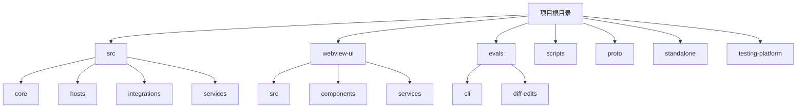
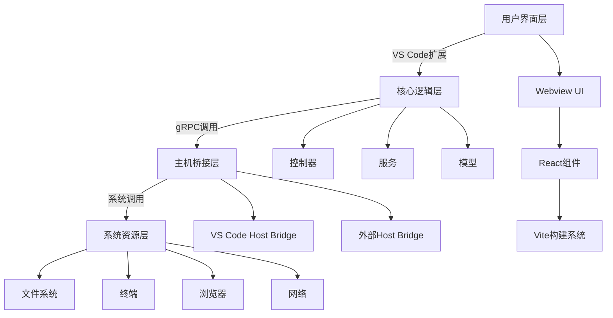
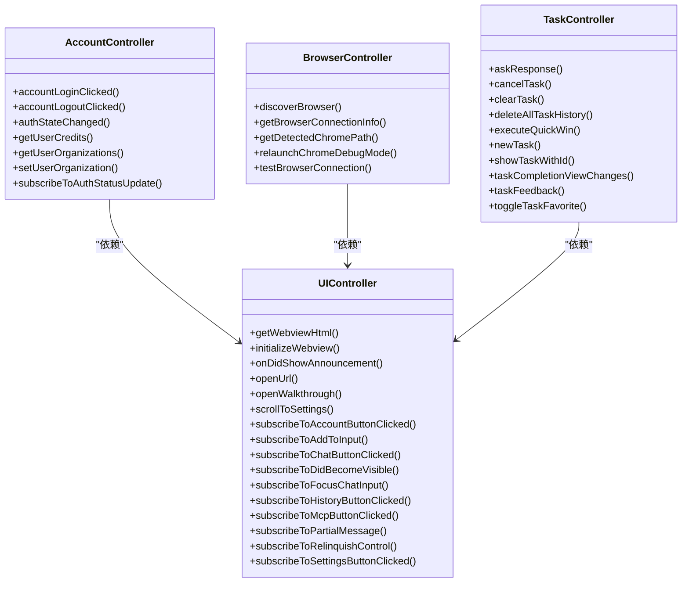
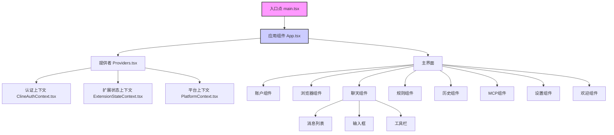
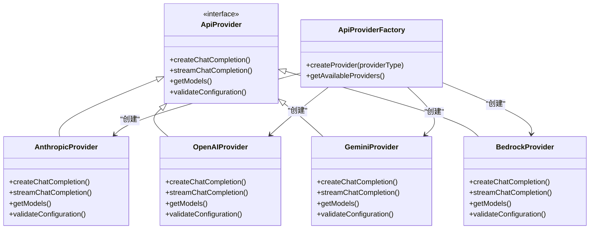

# 开发者指南

<cite>
**本文档中引用的文件**  
- [CONTRIBUTING.md](file://CONTRIBUTING.md)
- [package.json](file://package.json)
- [webview-ui/package.json](file://webview-ui/package.json)
- [README.md](file://README.md)
- [src/test/e2e/README.md](file://src/test/e2e/README.md)
- [scripts/interactive-playwright.ts](file://scripts/interactive-playwright.ts)
</cite>

## 更新摘要
**已做更改**  
- 在“附录”部分新增了端到端（E2E）测试和交互式Playwright调试的详细说明
- 更新了“调试技巧”和“贡献流程”部分，以反映新的测试工具和流程
- 添加了对`.nycrc.unit.json`和CI工作流的引用，以支持覆盖率度量
- 所有内容已根据最新代码变更进行语言转换和结构更新

## 目录
1. [简介](#简介)
2. [项目结构](#项目结构)
3. [核心组件](#核心组件)
4. [架构概述](#架构概述)
5. [详细组件分析](#详细组件分析)
6. [依赖分析](#依赖分析)
7. [性能考虑](#性能考虑)
8. [故障排除指南](#故障排除指南)
9. [结论](#结论)
10. [附录](#附录)

## 简介
本指南旨在为希望为Cline项目贡献代码的开发者提供详尽的说明。从环境搭建开始，列出所有先决条件，并提供一键式安装和构建命令。详细说明构建与运行流程，包括如何启动开发版扩展、如何调试核心逻辑和Webview前端。提供调试技巧，例如如何使用日志、如何设置断点以及如何利用`src/test/`中的测试工具。最后，明确贡献流程，引用`CONTRIBUTING.md`中的规范，包括代码风格、提交信息格式、分支策略和代码审查流程。确保指南能让新贡献者在最短时间内成功构建并运行项目。

## 项目结构
Cline项目采用模块化设计，主要分为以下几个核心目录：

- `src/`: 核心源代码，包含扩展逻辑、控制器、模型、提示词系统等
- `webview-ui/`: Webview前端界面，基于React和Vite构建
- `evals/`: 评估工具和测试框架
- `scripts/`: 构建、发布和测试脚本
- `proto/`: Protocol Buffer定义文件
- `standalone/`: 独立运行时文件
- `testing-platform/`: 测试平台相关代码



**图示来源**
- [package.json](file://package.json)
- [webview-ui/package.json](file://webview-ui/package.json)

**本节来源**
- [package.json](file://package.json)
- [README.md](file://README.md)

## 核心组件
Cline的核心组件包括：

1. **核心控制器** (`src/core/controller`): 处理账户、浏览器、检查点、命令、文件、MCP、模型、任务、UI等操作
2. **API提供者** (`src/core/api/providers`): 支持Anthropic、OpenAI、Gemini、Bedrock等多种AI模型提供商
3. **Webview提供者** (`src/hosts/vscode/VscodeWebviewProvider.ts`): 管理VS Code中的Webview界面
4. **任务系统** (`src/core/task`): 管理任务状态、工具执行和消息状态
5. **上下文管理** (`src/core/context`): 管理上下文窗口和上下文跟踪

这些组件共同构成了Cline的智能编码代理功能，使其能够在IDE中执行复杂的软件开发任务。

**本节来源**
- [src/core/README.md](file://src/core/README.md)
- [package.json](file://package.json)

## 架构概述
Cline采用分层架构设计，主要包括以下几个层次：



该架构实现了人机协作的AI编码代理模式，通过VS Code扩展提供图形用户界面，核心逻辑层处理复杂的AI代理任务，主机桥接层与VS Code环境进行交互，最终访问系统资源完成各种开发任务。

**图示来源**
- [package.json](file://package.json)
- [src/core/README.md](file://src/core/README.md)

## 详细组件分析

### 核心控制器分析
核心控制器是Cline的大脑，负责协调各种操作和功能。



**图示来源**
- [src/core/controller/account/accountLoginClicked.ts](file://src/core/controller/account/accountLoginClicked.ts)
- [src/core/controller/browser/discoverBrowser.ts](file://src/core/controller/browser/discoverBrowser.ts)
- [src/core/controller/task/newTask.ts](file://src/core/controller/task/newTask.ts)
- [src/core/controller/ui/initializeWebview.ts](file://src/core/controller/ui/initializeWebview.ts)

**本节来源**
- [src/core/controller](file://src/core/controller)
- [CONTRIBUTING.md](file://CONTRIBUTING.md)

### Webview前端分析
Webview前端负责在VS Code中呈现Cline的用户界面。



**图示来源**
- [webview-ui/src/main.tsx](file://webview-ui/src/main.tsx)
- [webview-ui/src/App.tsx](file://webview-ui/src/App.tsx)
- [webview-ui/src/Providers.tsx](file://webview-ui/src/Providers.tsx)

**本节来源**
- [webview-ui/package.json](file://webview-ui/package.json)
- [webview-ui/src](file://webview-ui/src)

### API提供者分析
API提供者模块支持多种AI模型提供商，实现了灵活的模型集成。



**图示来源**
- [src/core/api/providers/anthropic.ts](file://src/core/api/providers/anthropic.ts)
- [src/core/api/providers/openai.ts](file://src/core/api/providers/openai.ts)
- [src/core/api/providers/gemini.ts](file://src/core/api/providers/gemini.ts)
- [src/core/api/providers/bedrock.ts](file://src/core/api/providers/bedrock.ts)

**本节来源**
- [src/core/api/providers](file://src/core/api/providers)
- [package.json](file://package.json)

## 依赖分析
Cline项目依赖多个关键技术和库，确保其功能完整性和性能表现。

```mermaid
graph TD
A[Cline] --> B[Node.js]
A --> C[TypeScript]
A --> D[VS Code API]
A --> E[React]
A --> F[Vite]
A --> G[Protocol Buffers]
A --> H[gRPC]
A --> I[Playwright]
B --> J[Node.js 20.x]
C --> K[TypeScript 5.4.5]
D --> L[VS Code ^1.84.0]
E --> M[React 18.3.1]
F --> N[Vite 6.3.4]
G --> O[buf 1.54.0]
H --> P[@grpc/grpc-js 1.9.15]
I --> Q[Playwright 1.53.2]
A --> R[构建工具]
R --> S[esbuild 0.25.0]
R --> T[biome 2.1.4]
R --> U[husky 9.1.7]
A --> V[测试框架]
V --> W[Mocha]
V --> X[Chai]
V --> Y[Playwright]
style A fill:#f96,stroke:#333,stroke-width:2px
```

**图示来源**
- [package.json](file://package.json)
- [webview-ui/package.json](file://webview-ui/package.json)

**本节来源**
- [package.json](file://package.json)
- [webview-ui/package.json](file://webview-ui/package.json)

## 性能考虑
Cline在设计时充分考虑了性能因素，确保在处理复杂任务时仍能保持良好的响应速度和资源利用率。

1. **上下文管理**: 通过精心管理上下文窗口，避免在大型复杂项目中超出上下文限制
2. **增量构建**: 使用esbuild进行快速增量构建，缩短开发迭代周期
3. **资源监控**: 监控API使用情况和成本，让用户随时了解花费
4. **异步处理**: 采用异步编程模型，避免阻塞主线程
5. **缓存机制**: 实现多层次缓存，减少重复计算和网络请求

这些性能优化措施确保Cline能够在各种规模的项目中高效运行，为开发者提供流畅的使用体验。

## 故障排除指南
当遇到问题时，可以参考以下步骤进行排查：

1. **检查依赖**: 确保所有依赖已正确安装
2. **查看日志**: 检查VS Code的输出面板中的日志信息
3. **验证配置**: 确认AI模型提供商的API密钥和配置正确
4. **重启扩展**: 尝试重启VS Code或重新加载扩展
5. **检查网络**: 确保网络连接正常，能够访问AI模型提供商的API

对于更复杂的问题，可以参考`CONTRIBUTING.md`中的详细说明，或在Discord社区的`#contributors`频道中寻求帮助。

**本节来源**
- [CONTRIBUTING.md](file://CONTRIBUTING.md)
- [README.md](file://README.md)

## 结论
Cline是一个功能强大的AI编码代理，通过与VS Code深度集成，为开发者提供智能化的开发辅助。本指南详细介绍了项目的结构、核心组件、架构设计和贡献流程，帮助新贡献者快速上手并开始贡献代码。遵循`CONTRIBUTING.md`中的规范，确保代码质量和一致性，共同推动Cline项目的发展。

## 附录

### 环境搭建步骤
1. 克隆仓库（需要安装[git-lfs](https://git-lfs.com/)）:
    ```bash
    git clone https://github.com/cline/cline.git
    ```
2. 在VS Code中打开项目:
    ```bash
    code cline
    ```
3. 安装所有依赖:
    ```bash
    npm run install:all
    ```
4. 按F5启动调试，打开新的VS Code窗口加载扩展

### 一键式安装和构建命令
```bash
# 安装所有依赖
npm run install:all

# 编译项目
npm run compile

# 运行测试
npm run test

# 格式化代码
npm run format:fix

# 创建变更集
npm run changeset
```

### 调试技巧
- 使用`console.log`输出调试信息
- 在关键函数处设置断点
- 利用`src/test/`中的测试工具进行单元测试和集成测试
- 查看VS Code的开发者工具中的控制台输出
- 使用交互式Playwright脚本进行手动调试和gRPC调用记录

**本节来源**
- [CONTRIBUTING.md](file://CONTRIBUTING.md)
- [package.json](file://package.json)
- [README.md](file://README.md)

### 贡献流程
1. 在GitHub上创建问题
2. 等待核心维护者批准
3. 创建变更集
4. 提交代码和变更集文件
5. 创建PR，CI将自动运行测试和检查
6. 编写端到端测试以验证功能
7. 使用`npm run test:e2e -- --debug`进行交互式调试

**本节来源**
- [CONTRIBUTING.md](file://CONTRIBUTING.md)
- [src/test/e2e/README.md](file://src/test/e2e/README.md)
- [scripts/interactive-playwright.ts](file://scripts/interactive-playwright.ts)

### 端到端测试指南
Cline使用Playwright进行端到端测试，模拟真实用户在VS Code中的交互。

**运行测试**
```bash
# 构建并运行所有E2E测试
npm run test:e2e

# 运行测试而不重新构建
npm run e2e

# 以调试模式运行（启用交互式调试器）
npm run test:e2e -- --debug
```

**测试结构**
- `auth.test.ts`: 测试API密钥设置、提供商选择和设置导航
- `chat.test.ts`: 测试聊天功能，包括消息发送、模式切换（计划/执行）、斜杠命令和@提及
- `diff.test.ts`: 测试文件修改的差异编辑器功能
- `editor.test.ts`: 测试代码操作、编辑器面板集成和代码选择功能

**编写测试**
使用`e2e` fixture进行单根工作区测试：
```typescript
import { expect } from "@playwright/test"
import { e2e } from "./utils/helpers"

e2e("测试描述", async ({ sidebar, helper, page }) => {
  await helper.signin(sidebar)
  const inputbox = sidebar.getByTestId("chat-input")
  await inputbox.fill("你好，Cline！")
  await sidebar.getByTestId("send-button").click()
  await expect(sidebar.getByText("API请求...")).toBeVisible()
})
```

**交互式调试**
使用交互式Playwright脚本进行手动测试和gRPC调用记录：
```bash
npm run test:playwright:interactive
```
此命令将启动VS Code，加载Cline扩展并启用gRPC记录，允许手动交互和会话记录。

**本节来源**
- [src/test/e2e/README.md](file://src/test/e2e/README.md)
- [scripts/interactive-playwright.ts](file://scripts/interactive-playwright.ts)
- [CONTRIBUTING.md](file://CONTRIBUTING.md)

### 覆盖率度量
项目已设置初始的单元测试覆盖率度量，配置文件为`.nycrc.unit.json`，CI工作流在`.github/workflows/test.yml`中定义。贡献者应确保新代码有足够的测试覆盖。

**本节来源**
- [.nycrc.unit.json](file://.nycrc.unit.json)
- [.github/workflows/test.yml](file://.github/workflows/test.yml)