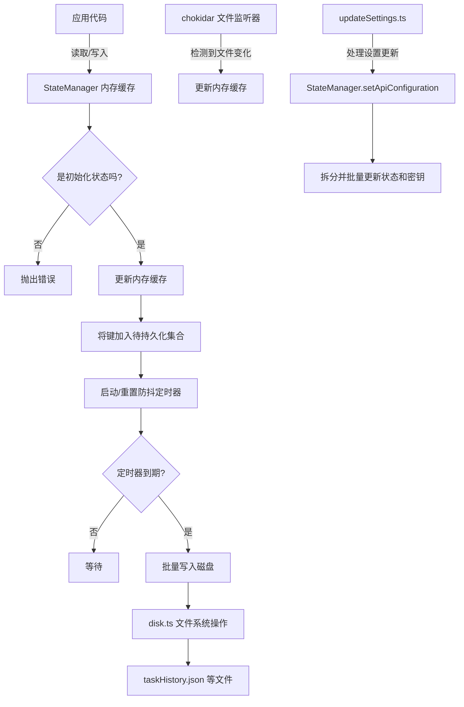

# 数据模型

<cite>
**本文档中引用的文件**   
- [TaskState.ts](file://src/core/task/TaskState.ts)
- [ChatContent.ts](file://src/shared/ChatContent.ts)
- [HistoryItem.ts](file://src/shared/HistoryItem.ts)
- [UserInfo.ts](file://src/shared/UserInfo.ts)
- [TelemetrySetting.ts](file://src/shared/TelemetrySetting.ts)
- [StateManager.ts](file://src/core/storage/StateManager.ts)
- [disk.ts](file://src/core/storage/disk.ts)
- [state.proto](file://proto/cline/state.proto) - *在最近的提交中更新*
- [models.proto](file://proto/cline/models.proto) - *在最近的提交中更新*
- [updateSettings.ts](file://src/core/controller/state/updateSettings.ts) - *在最近的提交中更新*
</cite>

## 更新摘要
**已更改内容**   
- 根据代码重构更新了 `StateManager` 的 API 配置管理机制。
- 更新了 `TelemetrySetting` 的定义以反映其在协议缓冲区中的实际枚举结构。
- 修正了关于收藏模型 ID 状态管理的文档，以反映其已移至专用状态管理的事实。
- 更新了受影响部分的源代码引用，以包含新的和修改过的文件。

**目录**
1. [简介](#简介)
2. [核心数据模型](#核心数据模型)
   - [TaskState（任务状态机）](#taskstate任务状态机)
   - [ChatContent（聊天消息结构）](#chatcontent聊天消息结构)
   - [HistoryItem（任务历史记录）](#historyitem任务历史记录)
   - [UserInfo（用户账户信息）](#userinfo用户账户信息)
   - [TelemetrySetting（遥测配置）](#telemetrysetting遥测配置)
3. [数据模型关系](#数据模型关系)
4. [序列化JSON示例](#序列化json示例)
5. [状态管理与持久化机制](#状态管理与持久化机制)
6. [结论](#结论)

## 简介
本文档全面定义了Cline项目中的核心数据模型，重点关注`src/shared/`目录下的关键TypeScript接口和类。这些模型构成了应用程序状态管理、用户交互和任务执行的基础。文档详细描述了每个模型的字段、类型、可选性及语义，并解释了它们之间的关系。此外，还涵盖了`src/core/storage/`中的状态管理机制，说明了数据如何被高效地持久化到磁盘。

## 核心数据模型

### TaskState（任务状态机）
`TaskState` 类定义了单个任务在其生命周期内的完整状态。它是一个复杂的、动态的对象，用于跟踪任务执行过程中的所有关键信息，包括流式传输状态、内容处理、用户交互、错误处理和上下文管理。

**字段列表：**

- **isStreaming**: `boolean` - 标记当前是否正在从AI模型接收流式响应。
- **isWaitingForFirstChunk**: `boolean` - 标记是否正在等待流式响应的第一个数据块。
- **didCompleteReadingStream**: `boolean` - 标记流式响应是否已完全读取完毕。
- **currentStreamingContentIndex**: `number` - 当前正在处理的流式内容块的索引。
- **assistantMessageContent**: `AssistantMessageContent[]` - 存储从AI助手接收到的消息内容数组。
- **userMessageContent**: `(Anthropic.TextBlockParam | Anthropic.ImageBlockParam)[]` - 存储用户发送给AI的消息内容数组。
- **userMessageContentReady**: `boolean` - 标记用户消息内容是否已准备就绪，可用于发送。
- **askResponse**: `ClineAskResponse` (可选) - 存储用户通过“ask”命令发起的查询的响应对象。
- **askResponseText**: `string` (可选) - 存储“ask”命令响应的文本内容。
- **askResponseImages**: `string[]` (可选) - 存储“ask”命令响应中包含的图片URL数组。
- **askResponseFiles**: `string[]` (可选) - 存储“ask”命令响应中包含的文件路径数组。
- **lastMessageTs**: `number` (可选) - 记录最后一条消息的时间戳。
- **isAwaitingPlanResponse**: `boolean` - 在计划模式下，标记是否正在等待AI的计划响应。
- **didRespondToPlanAskBySwitchingMode**: `boolean` - 标记是否通过切换模式来响应了计划相关的查询。
- **conversationHistoryDeletedRange**: `[number, number]` (可选) - 记录对话历史中被删除的消息范围（起始和结束索引）。
- **didRejectTool**: `boolean` - 标记用户是否拒绝了AI建议的工具执行。
- **didAlreadyUseTool**: `boolean` - 标记某个工具是否已被使用过。
- **didEditFile**: `boolean` - 标记任务是否已经编辑了文件。
- **consecutiveAutoApprovedRequestsCount**: `number` - 跟踪连续自动批准的请求数量。
- **consecutiveMistakeCount**: `number` - 跟踪连续出现的错误次数。
- **didAutomaticallyRetryFailedApiRequest**: `boolean` - 标记是否已自动重试失败的API请求。
- **checkpointManagerErrorMessage**: `string` (可选) - 存储检查点管理器遇到的错误消息。
- **isInitialized**: `boolean` - 标记任务状态是否已完成初始化。
- **apiRequestCount**: `number` - 统计该任务发起的API请求数量。
- **apiRequestsSinceLastTodoUpdate**: `number` - 统计自上次待办事项更新以来的API请求数量。
- **currentFocusChainChecklist**: `string | null` - 存储当前焦点链（待办事项列表）的文本内容。
- **todoListWasUpdatedByUser**: `boolean` - 标记待办事项列表是否已被用户手动更新。
- **abort**: `boolean` - 标记任务是否已被用户中止。
- **didFinishAbortingStream**: `boolean` - 标记流式传输的中止过程是否已完成。
- **abandoned**: `boolean` - 标记任务是否已被放弃。
- **currentlySummarizing**: `boolean` - 标记是否正在进行自动上下文摘要。
- **lastAutoCompactTriggerIndex**: `number` (可选) - 记录最后一次自动压缩触发时的内容索引。

**Section sources**
- [TaskState.ts](file://src/core/task/TaskState.ts#L4-L64)

### ChatContent（聊天消息结构）
`ChatContent` 接口定义了一条聊天消息的基本结构，用于在用户界面和后端逻辑之间传递消息内容。

**字段列表：**

- **message**: `string` (可选) - 消息的文本内容。
- **images**: `string[]` (可选) - 与消息关联的图片URL数组。
- **files**: `string[]` (可选) - 与消息关联的文件路径数组。

**Section sources**
- [ChatContent.ts](file://src/shared/ChatContent.ts#L0-L4)

### HistoryItem（任务历史记录）
`HistoryItem` 类型定义了存储在任务历史记录中的单个条目。它记录了每次任务执行的关键元数据，用于成本计算、性能分析和用户回顾。

**字段列表：**

- **id**: `string` - 任务的唯一标识符。
- **ulid**: `string` (可选) - 一个更优的唯一标识符（ULID），用于更好的追踪和指标分析。
- **ts**: `number` - 任务开始的时间戳。
- **task**: `string` - 用户输入的原始任务描述。
- **tokensIn**: `number` - 输入到AI模型的token数量。
- **tokensOut**: `number` - 从AI模型输出的token数量。
- **cacheWrites**: `number` (可选) - 缓存写入操作的数量。
- **cacheReads**: `number` (可选) - 缓存读取操作的数量。
- **totalCost**: `number` - 本次任务的总成本（以某种货币单位计）。
- **size**: `number` (可选) - 任务相关数据的大小。
- **shadowGitConfigWorkTree**: `string` (可选) - 与任务相关的Git配置工作树路径。
- **cwdOnTaskInitialization**: `string` (可选) - 任务初始化时的工作目录。
- **conversationHistoryDeletedRange**: `[number, number]` (可选) - 记录该任务历史条目中被删除的对话历史范围。
- **isFavorited**: `boolean` (可选) - 标记该任务历史条目是否被用户收藏。
- **checkpointManagerErrorMessage**: `string` (可选) - 与该任务相关的检查点管理器错误消息。

**Section sources**
- [HistoryItem.ts](file://src/shared/HistoryItem.ts#L0-L17)

### UserInfo（用户账户信息）
`UserInfo` 接口定义了与用户账户相关的基本信息。

**字段列表：**

- **displayName**: `string` (可选) - 用户的显示名称。
- **email**: `string` (可选) - 用户的电子邮件地址。
- **photoUrl**: `string` (可选) - 用户头像图片的URL。
- **apiBaseUrl**: `string` (可选) - API请求的基地址。

**Section sources**
- [UserInfo.ts](file://src/shared/UserInfo.ts#L0-L5)

### TelemetrySetting（遥测配置）
`TelemetrySetting` 类型定义了用户对遥测数据收集的偏好设置。其值来源于协议缓冲区中的 `TelemetrySettingEnum` 枚举。

**可能的值：**

- **"unset"**: 用户尚未设置偏好，处于未决定状态。
- **"enabled"**: 用户已启用遥测数据收集。
- **"disabled"**: 用户已禁用遥测数据收集。

**Section sources**
- [TelemetrySetting.ts](file://src/shared/TelemetrySetting.ts#L0-L0)
- [state.proto](file://proto/cline/state.proto#L150-L153) - *定义了底层的TelemetrySettingEnum枚举*

## 数据模型关系
这些数据模型通过引用和组合的方式紧密关联。`HistoryItem` 是一个关键的聚合点，它直接引用了其他模型的状态快照。例如，一个 `HistoryItem` 可以通过 `conversationHistoryDeletedRange` 字段来反映 `TaskState` 中的 `conversationHistoryDeletedRange` 状态，从而记录在该次任务执行期间发生的对话历史变更。`UserInfo` 和 `TelemetrySetting` 通常作为全局状态的一部分，影响着所有任务（`TaskState`）的行为和数据收集策略。`ChatContent` 则是构成 `TaskState` 中 `userMessageContent` 和 `assistantMessageContent` 数组的基本单元。

## 序列化JSON示例
以下是一个序列化后的 `HistoryItem` 对象的JSON示例，展示了数据在存储和传输时的实际形态：

```json
{
  "id": "task_abc123",
  "ulid": "01HVD5ZK3V1234567890ABCDEFG",
  "ts": 1700000000,
  "task": "修复登录页面的CSS样式问题",
  "tokensIn": 150,
  "tokensOut": 300,
  "cacheReads": 5,
  "totalCost": 0.025,
  "cwdOnTaskInitialization": "/home/user/project/frontend",
  "isFavorited": true
}
```

## 状态管理与持久化机制
Cline使用 `StateManager` 类来管理应用状态，它提供了一个高性能的内存缓存层，并通过异步方式将数据持久化到磁盘。

**核心机制：**

1.  **内存缓存 (In-Memory Cache)**: `StateManager` 在内存中维护 `globalStateCache`, `secretsCache`, 和 `workspaceStateCache` 三个对象。所有读写操作首先在内存中进行，确保了极快的访问速度。

2.  **异步持久化 (Async Persistence)**: 对状态的修改不会立即写入磁盘。相反，`StateManager` 会将待持久化的键（key）加入 `pendingGlobalState`, `pendingSecrets`, `pendingWorkspaceState` 等集合中，并启动一个500毫秒的防抖（debounced）定时器。

3.  **防抖写入 (Debounced Writes)**: 防抖机制确保了在短时间内对同一状态的多次修改只会触发一次磁盘写入操作，极大地减少了I/O开销。当定时器到期时，所有挂起的更改会通过 `Promise.all` 批量写入。

4.  **文件系统交互**: 实际的磁盘读写由 `disk.ts` 文件中的函数处理。例如，`readTaskHistoryFromState` 和 `writeTaskHistoryToState` 函数专门负责 `taskHistory.json` 文件的读写。`StateManager` 通过 `chokidar` 库监听 `taskHistory.json` 文件的变化，当检测到外部修改时，会自动更新内存缓存，保证了数据的一致性。

5.  **错误处理与恢复**: 该机制包含了完善的错误处理。如果持久化失败，`StateManager` 会触发 `onPersistenceError` 回调，并可以通过 `reInitialize` 方法从磁盘重新加载状态以进行恢复。

6.  **API 配置管理**: `StateManager` 提供了 `setApiConfiguration` 和 `getApiConfiguration` 方法来集中管理API配置。`setApiConfiguration` 方法会将传入的 `ApiConfiguration` 对象拆解，并通过 `setGlobalStateBatch` 和 `setSecretsBatch` 方法批量更新全局状态和密钥缓存。此机制在 `updateSettings` 控制器函数中被调用，用于处理来自前端的设置更新请求。



**Diagram sources**
- [StateManager.ts](file://src/core/storage/StateManager.ts#L35-L1045)
- [disk.ts](file://src/core/storage/disk.ts#L1-L229)
- [updateSettings.ts](file://src/core/controller/state/updateSettings.ts#L25-L298)

**Section sources**
- [StateManager.ts](file://src/core/storage/StateManager.ts#L35-L1045)
- [disk.ts](file://src/core/storage/disk.ts#L1-L229)
- [updateSettings.ts](file://src/core/controller/state/updateSettings.ts#L25-L298)

## 结论
Cline的核心数据模型设计清晰，职责分明。`TaskState` 提供了任务执行的精细视图，`HistoryItem` 则为长期追踪和分析提供了结构化的数据。通过 `StateManager` 的高效缓存和防抖持久化机制，系统在保证数据安全的同时，也提供了流畅的用户体验。理解这些模型及其关系对于开发和维护Cline功能至关重要。