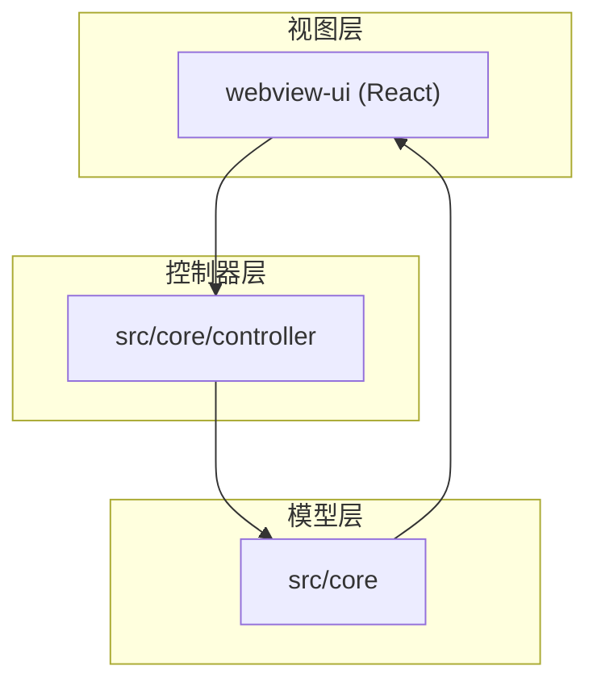
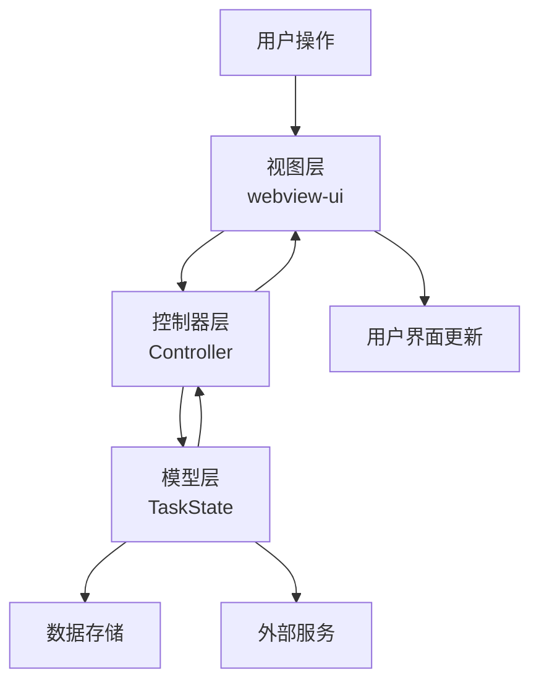
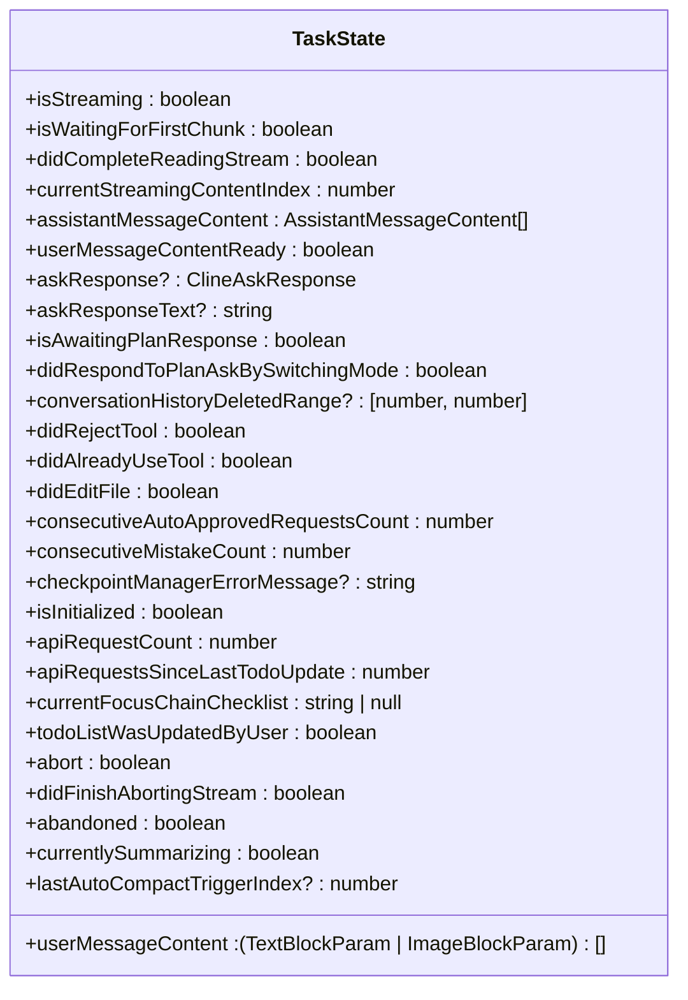
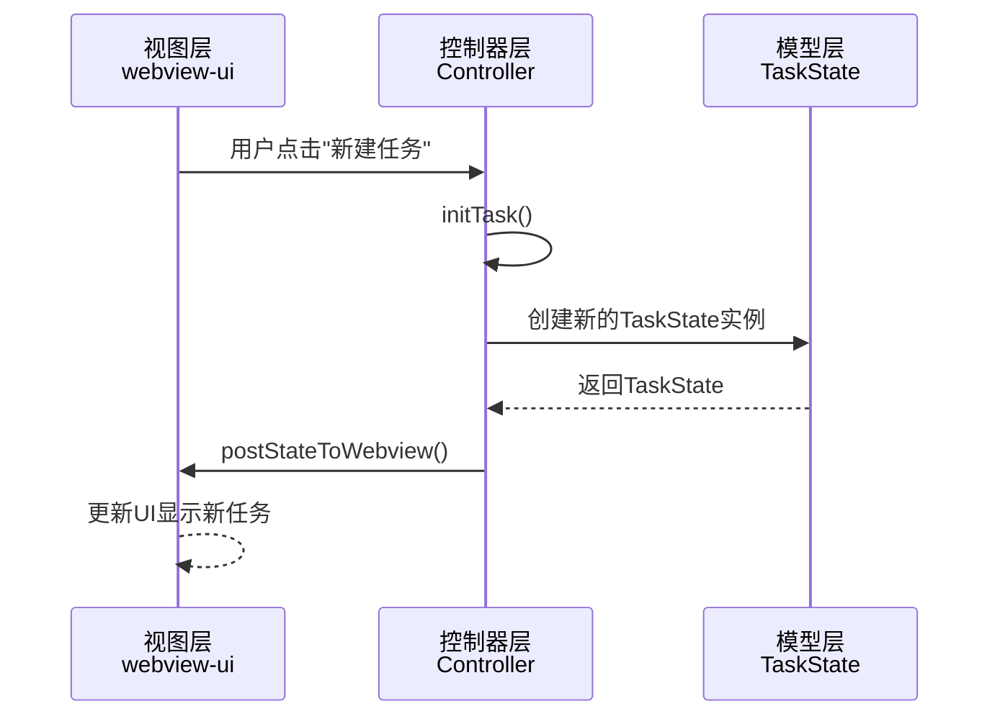
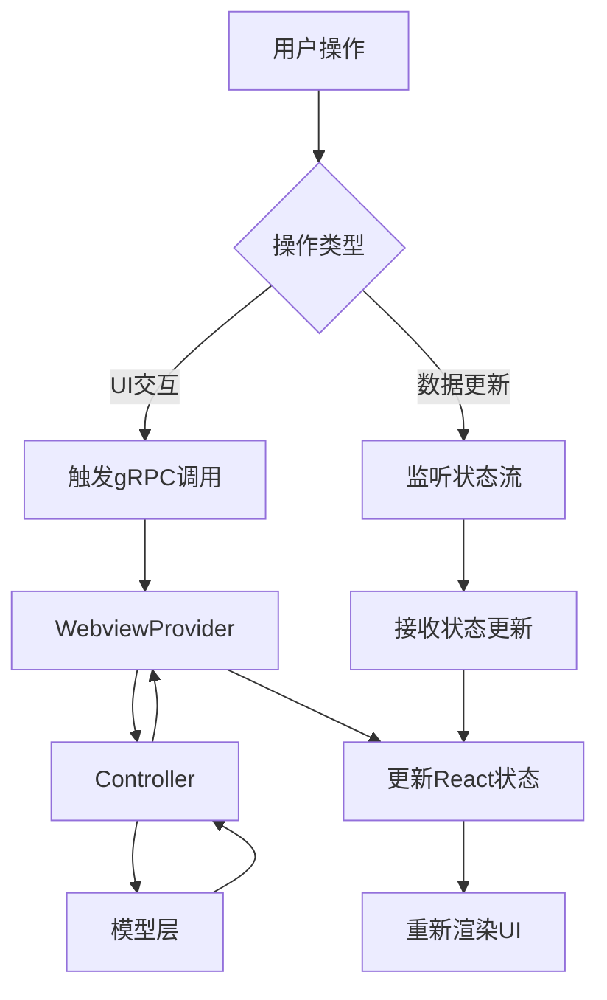
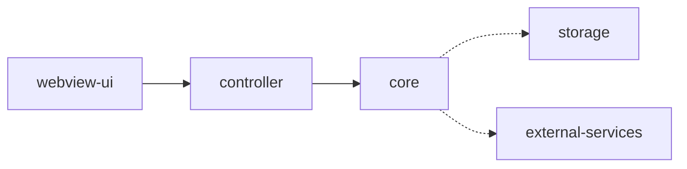

# MVC架构模式

<cite>
**本文档中引用的文件**  
- [TaskState.ts](file://src/core/task/TaskState.ts)
- [WebviewProvider.ts](file://src/core/webview/WebviewProvider.ts)
- [Controller.ts](file://src/core/controller/index.ts)
- [App.tsx](file://webview-ui/src/App.tsx)
- [index.ts](file://webview-ui/src/main.tsx)
</cite>

## 目录
1. [简介](#简介)
2. [项目结构](#项目结构)
3. [核心组件](#核心组件)
4. [架构概述](#架构概述)
5. [详细组件分析](#详细组件分析)
6. [依赖分析](#依赖分析)
7. [性能考虑](#性能考虑)
8. [故障排除指南](#故障排除指南)
9. [结论](#结论)

## 简介
本文档详细阐述了Cline项目中Model-View-Controller（MVC）设计模式的具体实现。该架构将应用程序分为三个核心层次：`src/core`作为模型层，负责管理任务状态、上下文、存储和核心业务逻辑；`webview-ui`作为视图层，使用React构建用户界面并处理用户交互；`src/core/controller`作为控制器层，接收来自视图的命令并协调模型和视图之间的交互。文档将深入描述各层之间的调用关系和数据流，例如用户在Webview中点击按钮如何通过`WebviewProvider`触发`Controller`中的方法，进而更新`TaskState`并反馈到UI。通过序列图说明典型用户操作（如创建新任务）的完整调用链，并讨论这种模式如何促进代码的可维护性和可测试性。

## 项目结构
Cline项目采用分层架构，将不同职责的代码组织在不同的目录中。模型层位于`src/core`目录下，包含任务状态、上下文管理和核心业务逻辑。控制器层位于`src/core/controller`目录下，负责协调模型和视图。视图层是一个独立的React应用，位于`webview-ui`目录下，通过Webview技术嵌入到VS Code扩展中。

**图示来源**
- [WebviewProvider.ts](file://src/core/webview/WebviewProvider.ts)
- [Controller.ts](file://src/core/controller/index.ts)

**本节来源**
- [WebviewProvider.ts](file://src/core/webview/WebviewProvider.ts)
- [Controller.ts](file://src/core/controller/index.ts)

## 核心组件
Cline的MVC架构由三个核心组件构成：模型层的`TaskState`负责管理任务的完整状态，包括流式处理标志、内容处理、用户响应和错误跟踪；控制器层的`Controller`类作为协调中心，管理任务生命周期、认证状态和与模型层的交互；视图层的`WebviewProvider`负责创建和管理Webview实例，将React应用注入到VS Code界面中。这些组件通过明确定义的接口进行通信，确保了代码的高内聚和低耦合。

**本节来源**
- [TaskState.ts](file://src/core/task/TaskState.ts)
- [Controller.ts](file://src/core/controller/index.ts)
- [WebviewProvider.ts](file://src/core/webview/WebviewProvider.ts)

## 架构概述
Cline的MVC架构实现了清晰的关注点分离。视图层（`webview-ui`）完全负责用户界面的呈现和用户交互，使用React构建动态UI。控制器层（`src/core/controller`）作为中介，接收来自视图的命令，调用模型层的业务逻辑，并将结果返回给视图。模型层（`src/core`）包含所有核心业务逻辑和状态管理，如任务状态、上下文管理和存储。这种分层设计使得各层可以独立开发和测试，提高了代码的可维护性和可扩展性。

**图示来源**
- [TaskState.ts](file://src/core/task/TaskState.ts)
- [Controller.ts](file://src/core/controller/index.ts)
- [WebviewProvider.ts](file://src/core/webview/WebviewProvider.ts)

## 详细组件分析

### 模型层分析
模型层是Cline的核心，负责管理应用程序的状态和业务逻辑。`TaskState`类封装了任务的所有状态信息，包括流式处理标志、内容处理、用户响应和错误跟踪。该类的设计体现了单一职责原则，专注于任务状态的管理，不涉及任何UI逻辑或用户交互。

**图示来源**
- [TaskState.ts](file://src/core/task/TaskState.ts)

**本节来源**
- [TaskState.ts](file://src/core/task/TaskState.ts)

### 控制器层分析
控制器层是连接视图和模型的桥梁。`Controller`类负责协调所有操作，从处理用户命令到管理任务生命周期。它通过`WebviewProvider`接收来自视图的事件，调用模型层的方法，并将结果返回给视图。控制器还负责管理认证状态、任务历史和与外部服务的交互。

**图示来源**
- [Controller.ts](file://src/core/controller/index.ts)
- [TaskState.ts](file://src/core/task/TaskState.ts)

**本节来源**
- [Controller.ts](file://src/core/controller/index.ts)

### 视图层分析
视图层是一个独立的React应用，负责用户界面的呈现和用户交互。`WebviewProvider`类负责创建和管理Webview实例，将React应用注入到VS Code界面中。视图层通过gRPC调用与控制器层通信，实现了前后端的完全分离。

**图示来源**
- [WebviewProvider.ts](file://src/core/webview/WebviewProvider.ts)
- [App.tsx](file://webview-ui/src/App.tsx)

**本节来源**
- [WebviewProvider.ts](file://src/core/webview/WebviewProvider.ts)
- [App.tsx](file://webview-ui/src/App.tsx)

## 依赖分析
Cline的MVC架构通过清晰的依赖关系实现了模块化设计。视图层依赖于控制器层提供的API，控制器层依赖于模型层的业务逻辑，而模型层不依赖于其他任何层。这种单向依赖关系确保了代码的可维护性和可测试性。通过使用gRPC进行通信，各层之间的耦合度进一步降低，使得各层可以独立开发和部署。

**图示来源**
- [WebviewProvider.ts](file://src/core/webview/WebviewProvider.ts)
- [Controller.ts](file://src/core/controller/index.ts)

**本节来源**
- [WebviewProvider.ts](file://src/core/webview/WebviewProvider.ts)
- [Controller.ts](file://src/core/controller/index.ts)

## 性能考虑
Cline的MVC架构在性能方面进行了多项优化。通过将视图层与模型层分离，避免了UI渲染对核心业务逻辑的影响。使用流式状态更新机制，控制器层可以高效地将状态变化推送到视图层，而不需要频繁的全量更新。模型层的状态管理采用了内存缓存和持久化存储相结合的方式，在保证性能的同时确保了数据的可靠性。

## 故障排除指南
当遇到MVC架构相关的问题时，可以从以下几个方面进行排查：首先检查控制器层的日志，确认命令是否正确接收和处理；然后验证模型层的状态是否按预期更新；最后检查视图层是否正确订阅了状态更新。对于通信问题，需要确保gRPC服务正常运行，并且各层之间的接口定义一致。

**本节来源**
- [Controller.ts](file://src/core/controller/index.ts)
- [WebviewProvider.ts](file://src/core/webview/WebviewProvider.ts)

## 结论
Cline的MVC架构模式通过清晰的分层设计，实现了关注点的有效分离。模型层专注于业务逻辑和状态管理，控制器层负责协调和流程控制，视图层专司用户界面呈现。这种架构不仅提高了代码的可维护性和可测试性，还为未来的功能扩展提供了良好的基础。通过gRPC进行层间通信，进一步降低了耦合度，使得各层可以独立演进。这种设计模式为构建复杂、可扩展的VS Code扩展提供了一个优秀的范例。