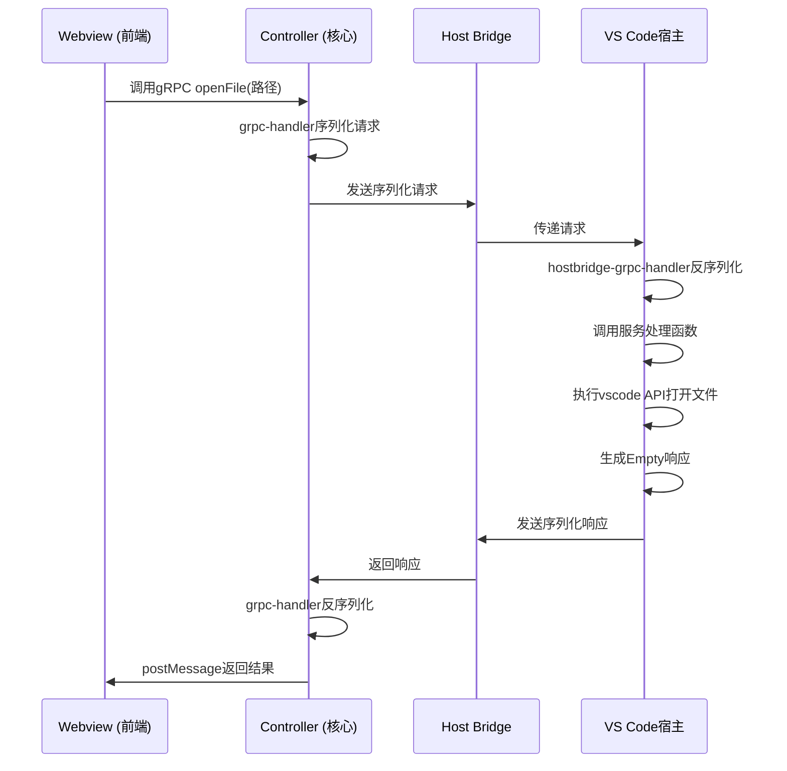

# gRPC通信机制

<cite>
**本文档中引用的文件**  
- [file.proto](file://proto/cline/file.proto)
- [account.proto](file://proto/cline/account.proto)
- [browser.proto](file://proto/cline/browser.proto)
- [grpc-service.ts](file://src/core/controller/grpc-service.ts)
- [hostbridge-grpc-service.ts](file://src/hosts/vscode/hostbridge-grpc-service.ts)
- [grpc-handler.ts](file://src/core/controller/grpc-handler.ts)
- [openFile.ts](file://src/core/controller/file/openFile.ts)
- [hostbridge-grpc-handler.ts](file://src/hosts/vscode/hostbridge-grpc-handler.ts)
</cite>

## 目录
1. [引言](#引言)
2. [gRPC选型优势](#grpc选型优势)
3. [Proto文件定义与服务接口](#proto文件定义与服务接口)
4. [TypeScript服务映射机制](#typescript服务映射机制)
5. [VS Code端服务实现](#vs-code端服务实现)
6. [请求-响应流程示例：openFile](#请求-响应流程示例：openfile)
7. [错误处理与超时机制](#错误处理与超时机制)
8. [双向流与实时更新](#双向流与实时更新)
9. [总结](#总结)

## 引言
Cline采用gRPC作为其与VS Code宿主环境之间通信的核心协议，旨在实现高效、类型安全且支持流式传输的跨进程交互。该机制贯穿于前端Webview、核心控制器与VS Code扩展宿主之间，支撑着账户管理、文件操作、浏览器控制等关键功能。本文档详细解析Cline的gRPC通信架构，从协议选型、接口定义到具体实现流程。

## gRPC选型优势
Cline选择gRPC作为通信协议，主要基于以下三大核心优势：

**性能优势**：gRPC使用Protocol Buffers（Protobuf）作为接口定义语言和数据序列化格式。Protobuf是一种二进制编码格式，相比JSON等文本格式，其序列化和反序列化速度更快，生成的数据包更小，显著降低了通信延迟和带宽消耗，尤其适合在IDE插件这种对响应速度要求极高的场景。

**类型安全**：通过`.proto`文件定义服务接口和消息结构，gRPC工具链可以为多种编程语言（如TypeScript）生成强类型的客户端和服务端代码。这确保了在编译时就能发现接口不匹配的错误，避免了运行时因数据格式错误导致的崩溃，极大地提升了代码的健壮性和开发效率。

**流式传输**：gRPC原生支持四种通信模式，包括服务器流、客户端流和双向流。这对于需要实时更新的场景（如日志输出、任务状态推送）至关重要。Cline利用双向流能力，实现了从宿主环境到前端的实时事件推送，而无需前端进行轮询。

## Proto文件定义与服务接口
位于`proto/cline/`目录下的`.proto`文件是整个gRPC通信的基石，它们以结构化的方式定义了所有可用的服务和数据类型。

**服务接口定义**：每个`.proto`文件定义一个服务（`service`），该服务包含多个远程过程调用（RPC）方法。例如：
- `account.proto` 定义了 `AccountService`，包含 `accountLoginClicked`、`getUserCredits` 等方法，用于处理用户认证和账户信息查询。
- `file.proto` 定义了 `FileService`，包含 `openFile`、`searchFiles` 等方法，用于执行文件系统操作。
- `browser.proto` 定义了 `BrowserService`，包含 `getBrowserConnectionInfo`、`discoverBrowser` 等方法，用于与浏览器进行交互。

**消息结构定义**：每个RPC方法都有明确的请求和响应消息类型（`message`）。这些消息由字段（`field`）组成，并通过`Metadata`（在`common.proto`中定义）传递上下文信息。例如，`openFile`方法的请求类型是`StringRequest`，它包含一个名为`value`的字符串字段来传递文件路径。

**Section sources**
- [file.proto](file://proto/cline/file.proto#L1-L187)
- [account.proto](file://proto/cline/account.proto#L1-L133)
- [browser.proto](file://proto/cline/browser.proto#L1-L52)

## TypeScript服务映射机制
`grpc-service.ts`文件位于`src/core/controller/`目录下，是Cline核心控制器（Controller）端的gRPC服务注册中心。它负责将`.proto`文件中定义的服务映射到实际的TypeScript逻辑。

该机制的核心是一个`ServiceRegistry`类。当一个服务（如`FileService`）被创建时，会调用`createServiceRegistry`工厂函数生成一个注册表。然后，通过`registerMethod`方法，将每个RPC方法名（如`openFile`）与一个具体的处理函数（handler）关联起来。

这些处理函数是实际的业务逻辑实现，它们接收`Controller`实例和反序列化后的请求消息作为参数，并返回响应。`ServiceRegistry`根据方法名查找对应的处理函数，并在收到请求时调用它。这种设计实现了接口定义与业务逻辑的解耦，使得服务的扩展和维护变得非常清晰。

**Section sources**
- [grpc-service.ts](file://src/core/controller/grpc-service.ts#L1-L154)

## VS Code端服务实现
`hostbridge-grpc-service.ts`文件位于`src/hosts/vscode/`目录下，是VS Code宿主环境一侧的gRPC服务实现。它与`grpc-service.ts`在结构上非常相似，同样使用`ServiceRegistry`来注册和管理服务方法。

关键区别在于，`hostbridge-grpc-service.ts`中的处理函数（handler）直接与VS Code的API进行交互，执行实际的宿主操作。例如，一个处理`openFile`请求的函数，最终会调用VS Code的`vscode.workspace.openTextDocument`和`vscode.window.showTextDocument` API来打开文件。

此外，`hostbridge-grpc-handler.ts`负责处理来自前端的gRPC请求。它接收序列化的请求，根据服务和方法名查找`hostServiceHandlers`配置（该配置由代码生成工具根据`.proto`文件生成），然后调用相应的服务处理函数。对于流式请求，它会管理响应流的生命周期，并在请求取消时进行清理。

**Section sources**
- [hostbridge-grpc-service.ts](file://src/hosts/vscode/hostbridge-grpc-service.ts#L1-L139)
- [hostbridge-grpc-handler.ts](file://src/hosts/vscode/hostbridge-grpc-handler.ts#L1-L183)

## 请求-响应流程示例：openFile
以下是一个`openFile`命令从发起到执行的完整流程：

1.  **前端调用**：用户在Cline的Webview界面中触发“打开文件”操作。前端代码调用gRPC客户端，发起一个`FileService.openFile`请求，请求消息中包含目标文件的路径。
2.  **序列化与发送**：`grpc-handler.ts`中的`handleGrpcRequest`函数被调用。它首先记录请求，然后判断`openFile`是一个非流式（unary）请求，因此调用`handleUnaryRequest`。
3.  **跨进程通信**：序列化后的请求通过VS Code的Host Bridge机制，从Webview进程安全地传递到VS Code扩展的主进程。
4.  **反序列化与路由**：在VS Code主进程中，`hostbridge-grpc-handler.ts`接收到请求。它解析服务名（`FileService`）和方法名（`openFile`），并从`hostServiceHandlers`配置中找到对应的处理函数。
5.  **执行与响应**：处理函数被调用，它使用`vscode` API打开指定文件。操作完成后，生成一个空的`Empty`响应。
6.  **返回结果**：响应被序列化，并通过Host Bridge返回给Webview进程。`grpc-handler.ts`接收到响应后，通过`postMessageToWebview`将其发送回前端，完成整个流程。

**Diagram sources**
- [grpc-handler.ts](file://src/core/controller/grpc-handler.ts#L1-L203)
- [hostbridge-grpc-handler.ts](file://src/hosts/vscode/hostbridge-grpc-handler.ts#L1-L183)
- [openFile.ts](file://src/core/controller/file/openFile.ts#L1-L17)

**Section sources**
- [grpc-handler.ts](file://src/core/controller/grpc-handler.ts#L1-L203)
- [hostbridge-grpc-handler.ts](file://src/hosts/vscode/hostbridge-grpc-handler.ts#L1-L183)
- [openFile.ts](file://src/core/controller/file/openFile.ts#L1-L17)

## 错误处理与超时机制
Cline的gRPC通信机制内置了完善的错误处理流程。在`grpc-handler.ts`中，`handleUnaryRequest`和`handleStreamingRequest`方法都使用了`try-catch`块来捕获处理函数执行过程中的任何异常。

一旦捕获到错误，系统会立即向Webview发送一个包含错误信息的`grpc_response`消息，其中`error`字段会携带具体的错误描述。这确保了前端能够及时感知到操作失败，并向用户展示有意义的错误提示。

关于超时，虽然文档中未直接体现，但gRPC本身支持设置请求超时时间。在实际应用中，可以在发起gRPC调用时配置超时选项。如果在指定时间内未收到响应，客户端会自动取消请求，并触发错误处理流程，防止界面长时间无响应。

**Section sources**
- [grpc-handler.ts](file://src/core/controller/grpc-handler.ts#L1-L203)

## 双向流与实时更新
对于需要持续接收数据的场景，Cline利用gRPC的流式特性。例如，`AccountService`中的`subscribeToAuthStatusUpdate`方法就是一个服务器流RPC，它返回一个`stream AuthState`。

在实现上，`grpc-service.ts`中的`ServiceRegistry`通过`registerMethod`的`metadata`参数标记该方法为流式方法（`isStreaming: true`）。当此类请求到达时，`grpc-handler.ts`会调用`handleStreamingRequest`，创建一个`responseStream`函数。这个函数允许服务端在任何时候（如用户登录状态改变时）通过调用`responseStream`来推送新的`AuthState`消息给前端，从而实现状态的实时同步，而无需前端主动查询。

**Section sources**
- [account.proto](file://proto/cline/account.proto#L1-L133)
- [grpc-service.ts](file://src/core/controller/grpc-service.ts#L1-L154)
- [grpc-handler.ts](file://src/core/controller/grpc-handler.ts#L1-L203)

## 总结
Cline通过gRPC构建了一个高性能、类型安全且功能丰富的通信层。通过`.proto`文件进行契约定义，利用`grpc-service.ts`和`hostbridge-grpc-service.ts`在两端实现服务逻辑，并通过`grpc-handler.ts`和`hostbridge-grpc-handler.ts`处理序列化、路由和错误，形成了一套完整、可靠的通信机制。这一架构不仅支撑了当前的功能，也为未来扩展更复杂的交互模式（如双向流）奠定了坚实的基础。