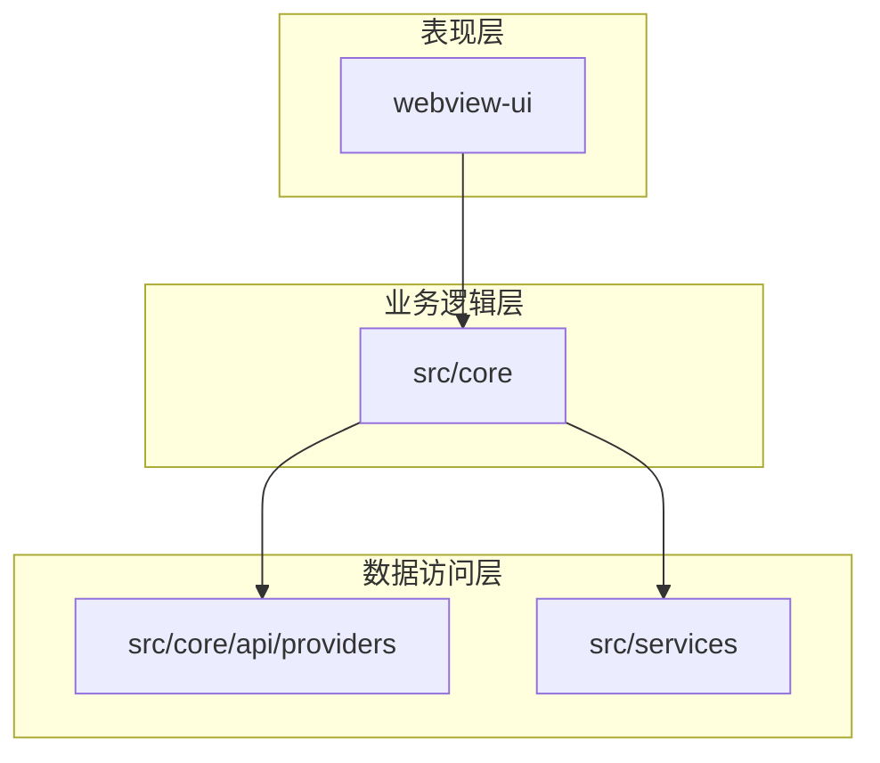
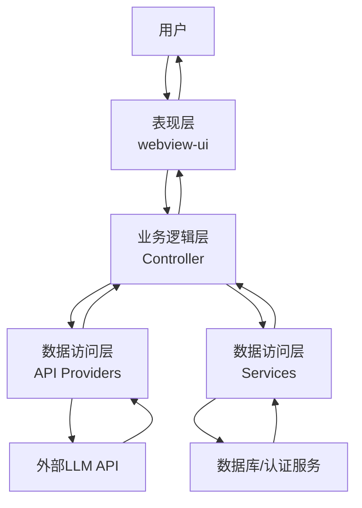
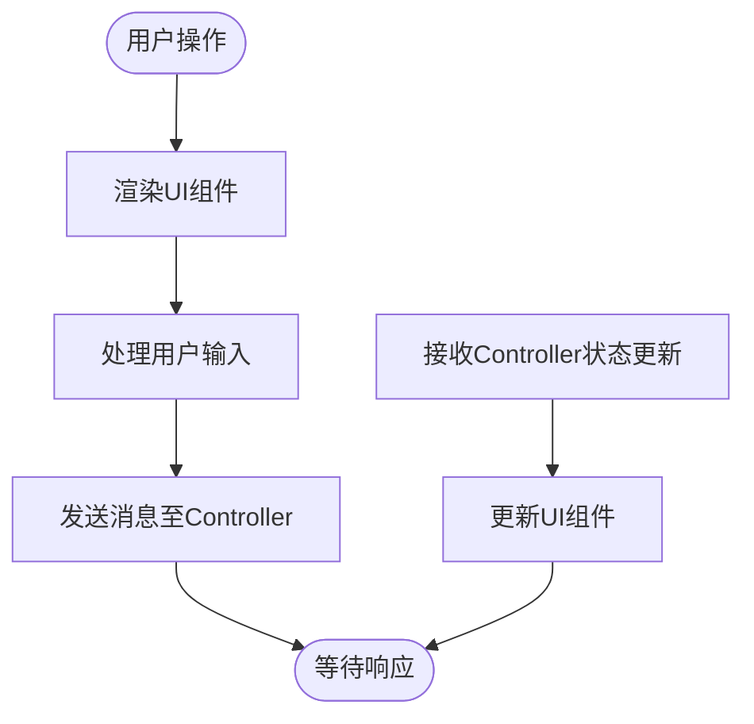
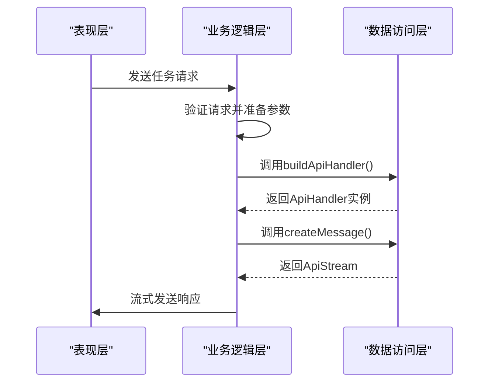
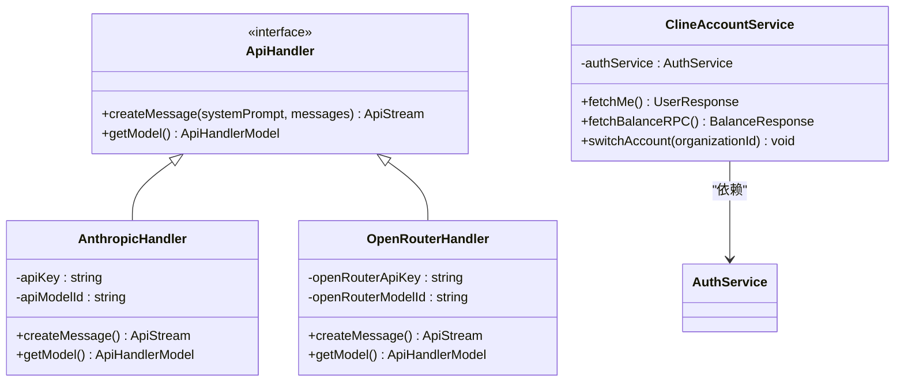
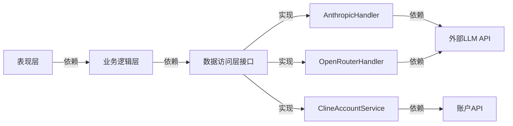

# 分层架构

<cite>
**本文档中引用的文件**  
- [WebviewProvider.ts](file://src/core/webview/WebviewProvider.ts)
- [controller/index.ts](file://src/core/controller/index.ts)
- [api/index.ts](file://src/core/api/index.ts)
- [ClineAccountService.ts](file://src/services/account/ClineAccountService.ts)
- [dify.ts](file://src/api/providers/dify.ts)
- [webview-ui/src/main.tsx](file://webview-ui/src/main.tsx)
</cite>

## 目录
1. [介绍](#介绍)
2. [项目结构](#项目结构)
3. [核心组件](#核心组件)
4. [架构概述](#架构概述)
5. [详细组件分析](#详细组件分析)
6. [依赖分析](#依赖分析)
7. [性能考虑](#性能考虑)
8. [故障排除指南](#故障排除指南)
9. [结论](#结论)
10. [附录](#附录)（如有必要）

## 介绍
本文档详细阐述了Cline项目的分层架构设计。该架构将系统划分为三个主要层次：表现层（由`webview-ui`实现）、业务逻辑层（由`src/core`实现）和数据访问层（由`src/core/api/providers`和`src/services`实现）。这种分层设计旨在提高代码的模块化程度，使得各层可以独立开发、测试和维护。文档将深入分析每一层的职责边界、依赖关系以及它们之间的交互方式，并讨论这种架构如何促进系统的可扩展性和可维护性。

## 项目结构
Cline项目采用清晰的分层目录结构，以支持其模块化设计。表现层位于`webview-ui`目录中，是一个独立的React应用，负责用户界面的渲染和用户交互。业务逻辑层位于`src/core`目录下，包含了控制器、任务执行、上下文管理等核心功能。数据访问层分布在`src/core/api/providers`和`src/services`目录中，前者包含与各种LLM API通信的提供者，后者包含与数据库、认证服务等外部系统交互的服务。这种物理上的分离强化了逻辑上的分层，使得代码库更易于理解和维护。

**图示来源**
- [webview-ui/src/main.tsx](file://webview-ui/src/main.tsx)
- [src/core/controller/index.ts](file://src/core/controller/index.ts)
- [src/core/api/index.ts](file://src/core/api/index.ts)
- [src/services/account/ClineAccountService.ts](file://src/services/account/ClineAccountService.ts)

**本节来源**
- [webview-ui](file://webview-ui)
- [src/core](file://src/core)
- [src/core/api/providers](file://src/core/api/providers)
- [src/services](file://src/services)

## 核心组件
Cline的核心组件围绕其分层架构构建。表现层的`webview-ui`是一个现代化的React应用，利用Vite进行构建，负责所有UI渲染和用户输入处理。业务逻辑层的`Controller`类是整个系统的中枢，它管理着任务的生命周期，协调表现层和数据访问层之间的通信。数据访问层则由一系列专门的处理器（Handlers）和服务（Services）组成，如`AnthropicHandler`、`OpenRouterHandler`和`ClineAccountService`，它们封装了与外部API通信的复杂性，为上层提供简洁的接口。

**本节来源**
- [WebviewProvider.ts](file://src/core/webview/WebviewProvider.ts)
- [controller/index.ts](file://src/core/controller/index.ts)
- [api/index.ts](file://src/core/api/index.ts)
- [ClineAccountService.ts](file://src/services/account/ClineAccountService.ts)

## 架构概述
Cline的分层架构遵循清晰的单向数据流原则。用户交互始于表现层（`webview-ui`），通过消息传递机制被发送到业务逻辑层的`Controller`。`Controller`根据请求的类型，调用相应的服务或API处理器来执行业务逻辑。这些数据访问组件与外部LLM API、数据库或认证服务进行通信，并将结果返回给`Controller`。最后，`Controller`将处理结果发送回表现层进行展示。这种设计确保了业务逻辑与UI和数据源的解耦，极大地提高了系统的灵活性和可测试性。

**图示来源**
- [WebviewProvider.ts](file://src/core/webview/WebviewProvider.ts)
- [controller/index.ts](file://src/core/controller/index.ts)
- [api/index.ts](file://src/core/api/index.ts)
- [ClineAccountService.ts](file://src/services/account/ClineAccountService.ts)

## 详细组件分析

### 表现层分析
表现层由`webview-ui`实现，它是一个独立的React前端应用。该层的职责是渲染用户界面、处理用户输入（如点击、表单提交）并将这些事件转换为结构化的消息发送给业务逻辑层。同时，它也负责接收来自业务逻辑层的状态更新，并相应地更新UI。这种设计使得UI的开发可以与后端逻辑并行进行，只要双方约定好消息格式即可。

**图示来源**
- [webview-ui/src/main.tsx](file://webview-ui/src/main.tsx)
- [WebviewProvider.ts](file://src/core/webview/WebviewProvider.ts)

**本节来源**
- [webview-ui](file://webview-ui)
- [src/core/webview](file://src/core/webview)

### 业务逻辑层分析
业务逻辑层是Cline的核心，主要由`src/core/controller`中的`Controller`类实现。它负责管理应用程序的状态、协调任务执行流程、处理来自表现层的命令，并调用数据访问层的服务。`Controller`充当了表现层和数据访问层之间的中介，确保了业务规则的集中管理和执行。例如，当用户发起一个任务时，`Controller`会创建一个`Task`对象，根据当前配置选择合适的API处理器，并启动执行流程。

**图示来源**
- [controller/index.ts](file://src/core/controller/index.ts)
- [api/index.ts](file://src/core/api/index.ts)

**本节来源**
- [controller/index.ts](file://src/core/controller/index.ts)

### 数据访问层分析
数据访问层由两部分组成：`src/core/api/providers`和`src/services`。`api/providers`目录下的每个文件（如`anthropic.ts`、`openai.ts`）都实现了一个`ApiHandler`接口，负责与特定的LLM API进行通信。这些处理器封装了API调用的细节，如认证、请求构建和响应解析。`src/services`目录则包含更通用的服务，如`ClineAccountService`，它负责与Cline的账户和计费API交互。这种设计通过接口抽象了外部依赖，使得系统可以轻松地集成新的LLM提供商或替换现有的服务。

**图示来源**
- [api/index.ts](file://src/core/api/index.ts)
- [ClineAccountService.ts](file://src/services/account/ClineAccountService.ts)

**本节来源**
- [src/core/api/providers](file://src/core/api/providers)
- [src/services](file://src/services)

## 依赖分析
Cline的分层架构通过明确的依赖关系实现了高内聚、低耦合。表现层仅依赖于业务逻辑层暴露的接口，而不关心其内部实现。业务逻辑层依赖于数据访问层提供的`ApiHandler`接口和服务类，但不直接依赖于具体的第三方库或API。数据访问层的实现类则依赖于具体的HTTP客户端（如axios）和外部API的SDK。这种依赖关系确保了各层的独立性，例如，可以为`ApiHandler`创建一个模拟实现用于单元测试，而无需启动任何外部服务。

**图示来源**
- [controller/index.ts](file://src/core/controller/index.ts)
- [api/index.ts](file://src/core/api/index.ts)
- [ClineAccountService.ts](file://src/services/account/ClineAccountService.ts)

**本节来源**
- [src/core](file://src/core)
- [src/core/api](file://src/core/api)
- [src/services](file://src/services)

## 性能考虑
虽然本文档主要关注架构设计，但分层本身对性能有重要影响。通过将计算密集型任务（如与LLM API的通信）隔离在数据访问层，并采用流式传输（`ApiStream`），系统能够及时向用户反馈处理进度，提供更好的用户体验。业务逻辑层的`Controller`通过缓存和状态管理来减少不必要的重复计算。未来可以通过在各层之间引入异步通信和更精细的缓存策略来进一步优化性能。

## 故障排除指南
当遇到与分层架构相关的问题时，应首先检查各层之间的接口契约是否被正确遵守。例如，如果表现层没有收到预期的响应，应检查`Controller`是否正确地处理了请求并调用了正确的服务。如果数据访问失败，应检查相关`ApiHandler`的配置（如API密钥）是否正确，并查看其错误处理逻辑。日志记录主要集中在业务逻辑层和数据访问层，`Controller`和各个服务类都包含了详细的日志输出，有助于追踪问题根源。

**本节来源**
- [controller/index.ts](file://src/core/controller/index.ts)
- [api/index.ts](file://src/core/api/index.ts)
- [ClineAccountService.ts](file://src/services/account/ClineAccountService.ts)

## 结论
Cline的分层架构设计有效地将关注点分离，提高了代码的模块化、可维护性和可测试性。表现层、业务逻辑层和数据访问层之间的清晰边界使得团队可以并行开发不同的功能模块。通过接口抽象外部依赖，系统具备了良好的扩展性，可以轻松集成新的LLM提供商或服务。这种架构为Cline的长期发展奠定了坚实的基础。

## 附录
无