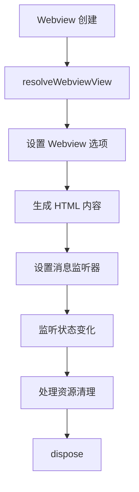
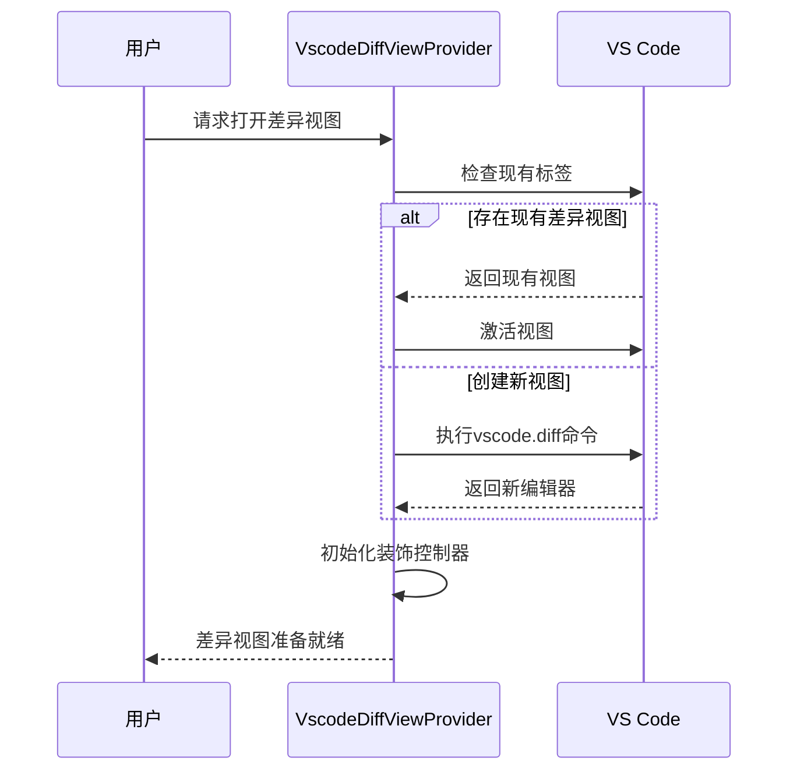
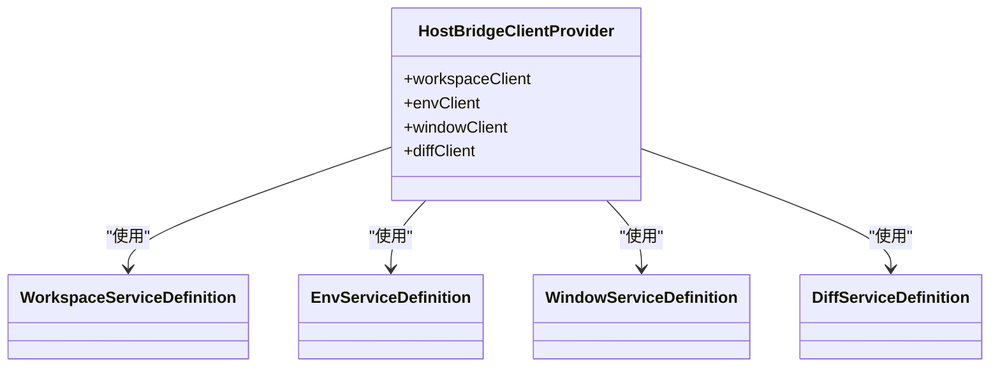
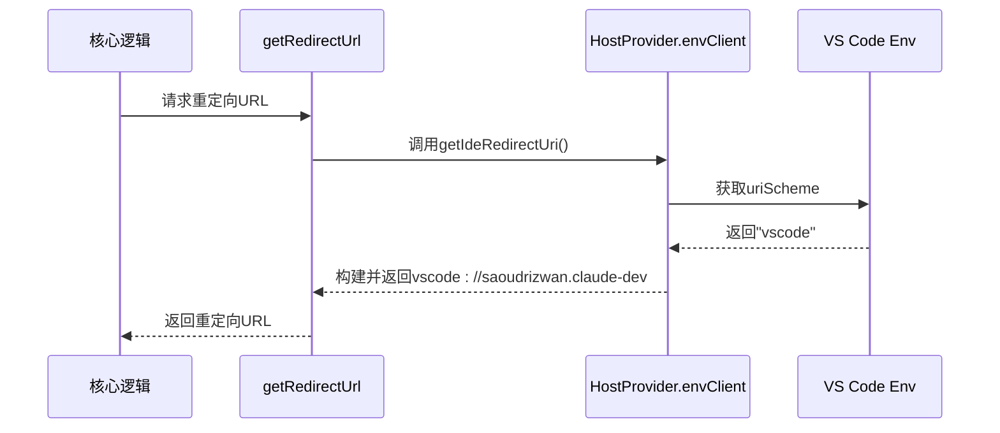

# 宿主环境集成

<cite>
**本文档中引用的文件**
- [host-provider.ts](file://src/hosts/host-provider.ts) - *更新了全局存储路径和扩展安装目录字段*
- [VscodeWebviewProvider.ts](file://src/hosts/vscode/VscodeWebviewProvider.ts)
- [VscodeDiffViewProvider.ts](file://src/hosts/vscode/VscodeDiffViewProvider.ts)
- [host-grpc-client.ts](file://src/hosts/vscode/hostbridge/client/host-grpc-client.ts)
- [hostbridge-client.ts](file://src/standalone/hostbridge-client.ts)
- [getRedirectUrl.ts](file://src/core/controller/account/getRedirectUrl.ts) - *重构了重定向URL生成逻辑*
- [getIdeRedirectUri.ts](file://src/hosts/vscode/hostbridge/env/getIdeRedirectUri.ts) - *新增的IDE重定向URI服务方法*
</cite>

## 更新摘要
**已做更改**
- 更新了`HostProvider`抽象层设计部分，增加了`globalStorageFsPath`和`extensionFsPath`字段说明
- 重构了引言部分，反映最新的架构解耦进展
- 更新了VS Code集成实现中的gRPC通信机制，增加了环境服务中的重定向URL功能
- 添加了新的"IDE重定向URL生成"小节，说明URL生成逻辑的重构
- 所有文件引用均已更新为中文标题并标注变更状态

## 目录
1. [引言](#引言)
2. [HostProvider 抽象层设计](#hostprovider-抽象层设计)
3. VS Code 集成实现
   1. [Webview 生命周期管理](#webview-生命周期管理)
   2. [差异视图处理](#差异视图处理)
   3. [gRPC 通信机制](#grpc-通信机制)
   4. [IDE重定向URL生成](#ide重定向url生成)
4. [独立运行时兼容性](#独立运行时兼容性)
5. [插件式架构的可扩展性](#插件式架构的可扩展性)
6. [新宿主环境集成指南](#新宿主环境集成指南)
7. [结论](#结论)

## 引言
Cline 通过 `HostProvider` 抽象层实现了核心逻辑与具体 IDE 环境的解耦。这种架构设计使得 Cline 能够灵活地集成到不同的开发环境中，同时保持核心功能的一致性和可维护性。近期的架构演进进一步增强了这种解耦，通过添加`globalStorageFsPath`和`extensionFsPath`字段，将存储路径管理完全交由宿主环境处理。本文档详细说明了该集成架构的设计原理和具体实现。

## HostProvider 抽象层设计

`HostProvider` 类采用单例模式，通过定义统一的接口来解耦核心逻辑与具体的 IDE 环境。它提供了创建 Webview 和差异视图提供者的工厂方法，并封装了与宿主环境通信的桥接机制。

该抽象层的核心职责包括：
- 管理 Webview 提供者和差异视图提供者的创建
- 提供与宿主环境通信的 gRPC 客户端
- 统一的日志记录接口
- 回调 URI 和二进制位置的获取
- **扩展安装目录路径**：通过`extensionFsPath`字段提供扩展安装路径
- **全局存储路径**：通过`globalStorageFsPath`字段提供全局存储路径

这种设计模式确保了核心业务逻辑不依赖于任何特定的 IDE 实现，从而提高了代码的可维护性和可测试性。新增的路径字段使得存储管理更加灵活，避免了对 VS Code 特定 API 的直接依赖。

**Section sources**
- [host-provider.ts](file://src/hosts/host-provider.ts#L19-L144) - *更新了全局存储路径和扩展安装目录字段*

## VS Code 集成实现

### Webview 生命周期管理

`VscodeWebviewProvider` 类负责管理 VS Code 中 Webview 的完整生命周期。它实现了 `vscode.WebviewViewProvider` 接口，并处理以下关键事件：

- **初始化**：设置 Webview 选项，包括启用脚本和配置本地资源根路径
- **HTML 内容生成**：根据扩展模式提供 HMR（热模块替换）或生产环境的 HTML 内容
- **消息监听**：建立从 Webview 到扩展的消息通信通道
- **状态变化**：监听可见性和焦点状态变化，触发相应的事件处理
- **资源清理**：在 Webview 销毁时正确释放所有订阅和资源

该实现还支持侧边栏和标签面板两种展示形式，通过静态 ID 确保 VS Code 缓存的兼容性。

**Diagram sources**
- [VscodeWebviewProvider.ts](file://src/hosts/vscode/VscodeWebviewProvider.ts#L16-L232)

**Section sources**
- [VscodeWebviewProvider.ts](file://src/hosts/vscode/VscodeWebviewProvider.ts#L16-L232)

### 差异视图处理

`VscodeDiffViewProvider` 类专门处理 VS Code 中的差异视图操作。其主要功能包括：

- **差异编辑器打开**：检查文件是否已打开，复用现有差异视图或创建新的差异视图
- **文本替换**：在差异编辑器中替换指定范围的文本，并更新装饰器
- **滚动控制**：支持精确滚动到指定行和流畅的滚动动画
- **文档截断**：清除指定行之后的所有内容
- **资源管理**：关闭所有 Cline 相关的差异视图

该实现利用 VS Code 的 `TabInputTextDiff` 接口和自定义的 `DIFF_VIEW_URI_SCHEME` 来标识和管理差异视图，确保用户体验的一致性。

**Diagram sources**
- [VscodeDiffViewProvider.ts](file://src/hosts/vscode/VscodeDiffViewProvider.ts#L8-L194)

**Section sources**
- [VscodeDiffViewProvider.ts](file://src/hosts/vscode/VscodeDiffViewProvider.ts#L8-L194)

### gRPC 通信机制

VS Code 集成通过 `hostbridge` 模块使用 gRPC 与扩展主机进行通信。该机制的实现包括：

- **客户端创建**：基于 proto 定义创建 gRPC 客户端
- **服务划分**：按功能模块组织服务（工作区、环境、窗口、差异）
- **健康检查**：确保服务可用性
- **错误处理**：统一的错误处理和重试机制

`vscodeHostBridgeClient` 对象提供了四个主要客户端：
- `workspaceClient`：工作区相关操作
- `envClient`：环境信息获取
- `windowClient`：窗口和编辑器操作
- `diffClient`：差异视图操作

这种分层设计使得通信接口清晰且易于维护。

**Diagram sources**
- [host-grpc-client.ts](file://src/hosts/vscode/hostbridge/client/host-grpc-client.ts#L1-L11)

**Section sources**
- [host-grpc-client.ts](file://src/hosts/vscode/hostbridge/client/host-grpc-client.ts#L1-L11)

### IDE重定向URL生成

IDE重定向URL的生成逻辑已重构，从 Webview 层移至平台桥接层。这一变更通过以下组件实现：

- **`getIdeRedirectUri` 服务方法**：在 `env.proto` 中定义，返回 IDE 特定的重定向 URI
- **`getRedirectUrl` 控制器**：调用宿主环境的 `getIdeRedirectUri` 方法获取 URL
- **协议支持**：支持 `vscode://`、`idea://`、`pycharm://` 等不同 IDE 的 URI 方案

这种重构实现了 URL 生成逻辑的平台无关性，使得核心逻辑不再需要了解具体 IDE 的 URI 方案。`HostProvider` 的 `envClient` 直接提供此功能，保持了抽象层的一致性。

**Diagram sources**
- [getRedirectUrl.ts](file://src/core/controller/account/getRedirectUrl.ts#L7-L10)
- [getIdeRedirectUri.ts](file://src/hosts/vscode/hostbridge/env/getIdeRedirectUri.ts#L3-L7)

**Section sources**
- [getRedirectUrl.ts](file://src/core/controller/account/getRedirectUrl.ts#L7-L10)
- [getIdeRedirectUri.ts](file://src/hosts/vscode/hostbridge/env/getIdeRedirectUri.ts#L3-L7)

## 独立运行时兼容性

`standalone/hostbridge-client.ts` 模块为独立运行时提供了与 VS Code 扩展兼容的接口。其主要特性包括：

- **端口配置**：默认使用 26041 端口进行通信
- **健康检查**：`waitForHostBridgeReady` 函数确保服务就绪
- **连接管理**：自动处理连接重试和超时
- **环境变量支持**：支持通过 `HOST_BRIDGE_ADDRESS` 环境变量指定地址

该实现确保了在独立运行时环境中，Cline 核心功能能够通过相同的接口与宿主环境交互，从而实现了代码的复用和一致性。

**Section sources**
- [hostbridge-client.ts](file://src/standalone/hostbridge-client.ts#L1-L49)

## 插件式架构的可扩展性

Cline 的插件式架构设计支持未来集成到其他编辑器（如 JetBrains IDEs）。这种可扩展性体现在：

- **接口抽象**：`IHostProvider` 接口定义了所有宿主环境必须实现的功能
- **工厂模式**：通过工厂方法创建具体实现，便于添加新的宿主类型
- **模块化通信**：gRPC 协议的使用使得通信机制与具体 IDE 解耦
- **配置驱动**：通过配置文件可以轻松切换不同的宿主实现

这种设计允许开发团队为新的 IDE 创建相应的提供者类，而无需修改核心逻辑。新增的 `globalStorageFsPath` 和 `extensionFsPath` 字段进一步增强了这种可扩展性，使得存储管理也能适应不同 IDE 的文件系统结构。

## 新宿主环境集成指南

集成新宿主环境的步骤如下：

1. **实现 HostProvider 接口**：创建新的提供者类，实现所有必需的方法
2. **实现 WebviewProvider**：处理 Webview 的创建和生命周期管理
3. **实现 DiffViewProvider**：处理差异视图的显示和交互
4. **建立通信桥接**：实现与新宿主环境的通信机制（如 gRPC、IPC 等）
5. **注册提供者**：在初始化时注册新的 HostProvider 实现
6. **测试验证**：确保所有功能在新环境中正常工作

关键注意事项：
- 保持接口的一致性
- 处理好资源的生命周期管理
- 实现适当的错误处理和恢复机制
- 确保与核心逻辑的松耦合
- **实现存储路径管理**：提供 `extensionFsPath` 和 `globalStorageFsPath` 字段
- **实现重定向URL服务**：在环境服务中提供 `getIdeRedirectUri` 方法

## 结论

Cline 的宿主环境集成架构通过 `HostProvider` 抽象层成功实现了核心逻辑与具体 IDE 环境的解耦。这种设计不仅支持当前的 VS Code 集成，还为未来扩展到其他编辑器奠定了坚实的基础。通过标准化的接口和模块化的实现，Cline 能够在不同开发环境中提供一致的用户体验，同时保持代码的可维护性和可扩展性。近期对存储路径管理和重定向URL生成的重构进一步增强了架构的灵活性和可扩展性。