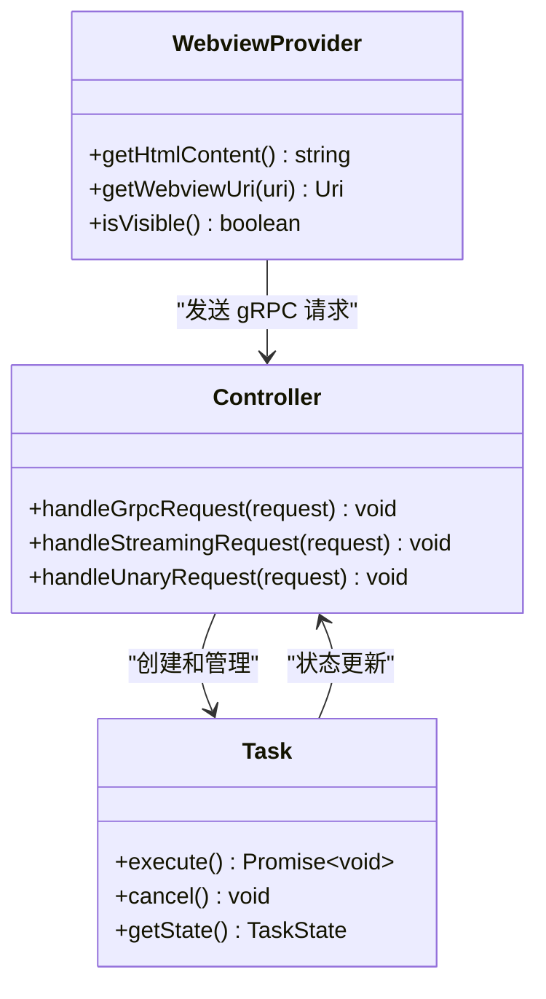
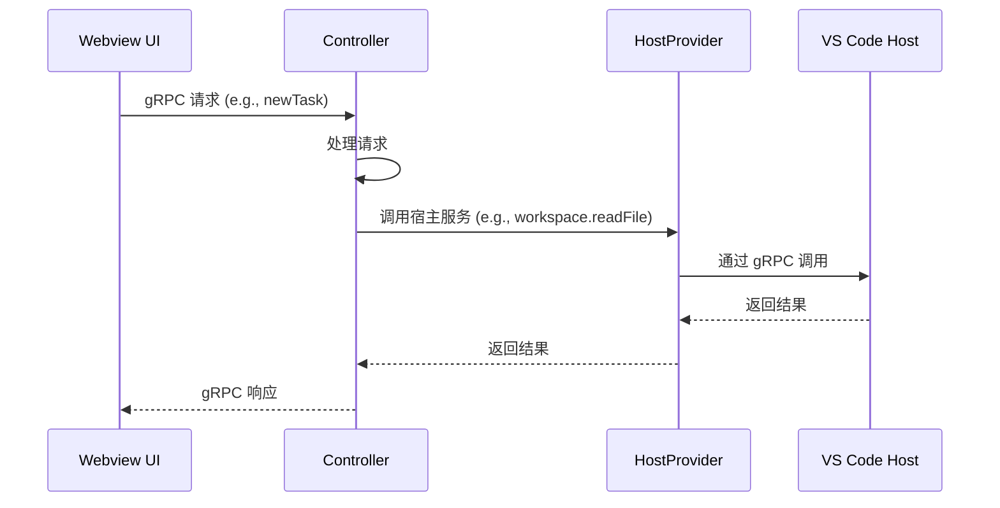
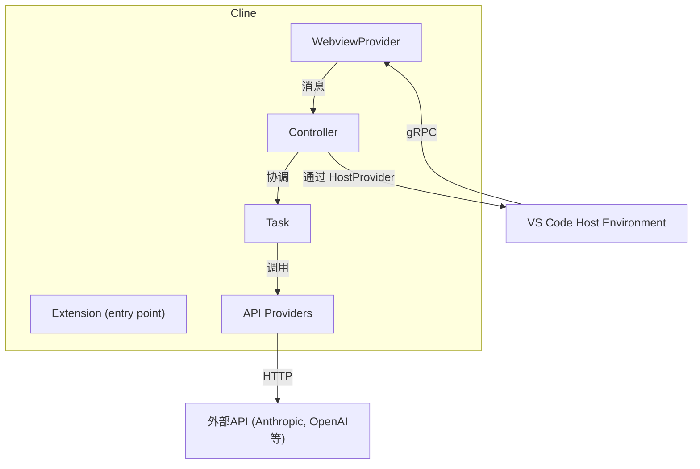
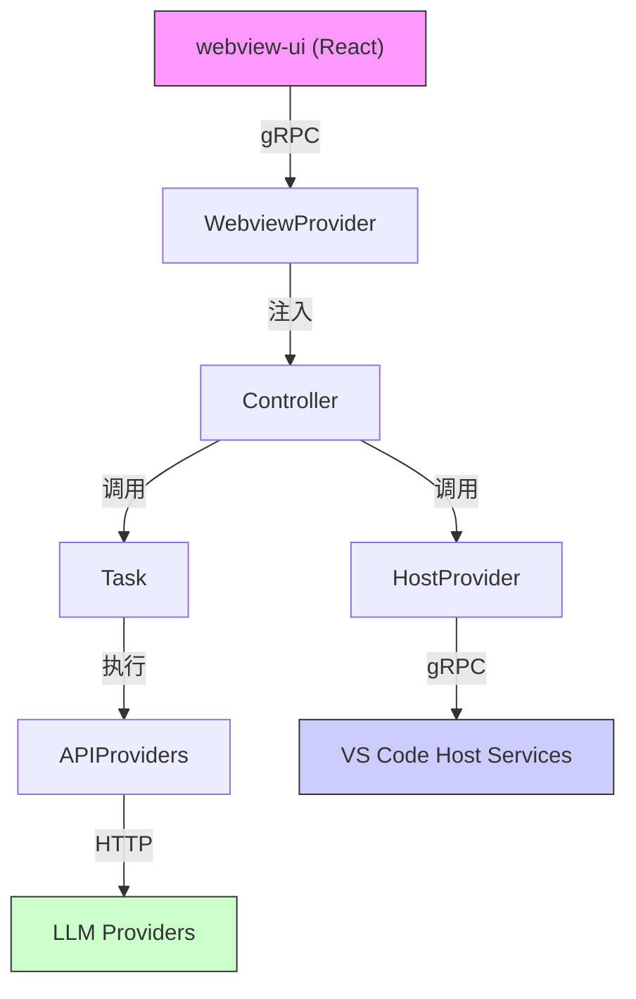

# 架构设计

<cite>
**本文档中引用的文件**  
- [WebviewProvider.ts](file://src/core/webview/WebviewProvider.ts)
- [host-provider.ts](file://src/hosts/host-provider.ts)
- [grpc-handler.ts](file://src/core/controller/grpc-handler.ts)
- [grpc-request-registry.ts](file://src/core/controller/grpc-request-registry.ts)
- [host-grpc-client-base.ts](file://src/hosts/vscode/hostbridge/client/host-grpc-client-base.ts)
- [ui.proto](file://proto/cline/ui.proto)
- [hostbridge-grpc-handler.ts](file://src/hosts/vscode/hostbridge-grpc-handler.ts)
- [getWebviewHtml.ts](file://src/core/controller/ui/getWebviewHtml.ts)
- [webview-ui/index.html](file://webview-ui/index.html)
- [standalone/runtime-files/package.json](file://standalone/runtime-files/package.json)
</cite>

## 目录
1. [引言](#引言)
2. [分层架构设计](#分层架构设计)
3. [MVC模式实现](#mvc模式实现)
4. [基于gRPC的事件驱动通信](#基于grpc的事件驱动通信)
5. [系统上下文图](#系统上下文图)
6. [组件图](#组件图)
7. [关键技术决策](#关键技术决策)
8. [结论](#结论)

## 引言
Cline是一款集成在VS Code中的智能编程助手，采用分层架构和MVC设计模式构建。本架构设计文档详细阐述了Cline的高级架构，包括其表现层、业务逻辑层和数据访问层的划分，MVC模式的具体实现，以及基于gRPC的事件驱动通信机制。文档还分析了关键的技术决策，如选择gRPC而非REST的原因，以及这种架构在可维护性、可扩展性和性能方面的权衡。

## 分层架构设计
Cline的架构清晰地划分为三个主要层次：表现层、业务逻辑层和数据访问层。这种分层设计实现了关注点分离，提高了代码的可维护性和可测试性。

- **表现层（Webview UI）**：位于`webview-ui`目录，基于React构建，负责用户界面的渲染和用户交互。它通过gRPC与控制器层通信，接收数据并发送用户命令。
- **业务逻辑层（Core）**：位于`src/core`目录，是系统的核心，处理所有业务逻辑。它包含控制器、任务管理、上下文管理等核心功能。
- **数据访问层（API Providers）**：位于`src/api/providers`和`src/core/api/providers`目录，负责与外部API（如Anthropic、OpenAI等）通信，以及与VS Code宿主环境的集成。

这种分层架构确保了各层之间的松耦合，使得每一层都可以独立开发、测试和演进。

**Section sources**
- [WebviewProvider.ts](file://src/core/webview/WebviewProvider.ts#L0-L37)
- [host-provider.ts](file://src/hosts/host-provider.ts#L0-L126)

## MVC模式实现
Cline严格遵循MVC（Model-View-Controller）设计模式，将应用程序的逻辑、数据和界面分离。

### 模型层（Model）
模型层由`src/core`目录下的核心组件构成，负责管理应用程序的状态和业务逻辑。`Controller`类是模型层的核心，协调任务执行、状态管理和与其他组件的交互。`Task`类代表一个具体的用户请求，封装了任务的状态、上下文和执行逻辑。

### 视图层（View）
视图层由`webview-ui`目录下的React应用实现，负责用户界面的展示。它通过`WebviewProvider`类与VS Code的Webview API集成，将React应用嵌入到VS Code的侧边栏或独立标签页中。视图层是被动的，只负责渲染从控制器接收到的数据。

### 控制器层（Controller）
控制器层位于`src/core/controller`目录，是连接视图和模型的桥梁。它接收来自视图层的用户交互事件（通过gRPC），调用模型层的业务逻辑，并将结果返回给视图层进行更新。每个控制器方法都对应一个具体的用户命令，如`newTask`、`cancelTask`等。

**Diagram sources**
- [WebviewProvider.ts](file://src/core/webview/WebviewProvider.ts#L0-L37)
- [controller/index.ts](file://src/core/controller/index.ts#L0-L50)
- [task/index.ts](file://src/core/task/index.ts#L0-L50)

**Section sources**
- [WebviewProvider.ts](file://src/core/webview/WebviewProvider.ts#L0-L37)
- [controller/index.ts](file://src/core/controller/index.ts#L0-L50)
- [task/index.ts](file://src/core/task/index.ts#L0-L50)

## 基于gRPC的事件驱动通信
Cline采用基于gRPC的事件驱动通信机制，实现Webview UI与VS Code宿主环境之间的高效、双向通信。

### .proto文件定义接口
位于`proto/cline`和`proto/host`目录下的`.proto`文件使用Protocol Buffers定义了Cline与VS Code之间的所有接口。这些文件精确地描述了服务、方法、请求和响应的消息格式。例如，`ui.proto`文件定义了`UiService`，其中包含`subscribeToChatButtonClicked`、`initializeWebview`等方法。

### HostProvider实现松耦合集成
`HostProvider`是一个单例类，负责管理与宿主环境（VS Code）的集成。它通过依赖注入的方式，将平台特定的实现（如`VscodeWebviewProvider`、`VscodeDiffViewProvider`）与核心业务逻辑解耦。核心代码通过`HostProvider.get().hostBridge`访问宿主服务，而无需关心底层的具体实现。

**Diagram sources**
- [ui.proto](file://proto/cline/ui.proto#L249-L271)
- [host-provider.ts](file://src/hosts/host-provider.ts#L0-L126)
- [hostbridge-grpc-handler.ts](file://src/hosts/vscode/hostbridge-grpc-handler.ts#L0-L39)

**Section sources**
- [ui.proto](file://proto/cline/ui.proto#L249-L271)
- [host-provider.ts](file://src/hosts/host-provider.ts#L0-L126)
- [grpc-handler.ts](file://src/core/controller/grpc-handler.ts#L0-L202)

## 系统上下文图
系统上下文图展示了Cline作为一个整体与外部环境（主要是VS Code）的交互。

**Diagram sources**
- [extension.ts](file://src/extension.ts#L499-L539)
- [WebviewProvider.ts](file://src/core/webview/WebviewProvider.ts#L0-L37)
- [controller/index.ts](file://src/core/controller/index.ts#L0-L50)

## 组件图
组件图详细展示了Cline内部关键组件及其依赖关系。

**Diagram sources**
- [WebviewProvider.ts](file://src/core/webview/WebviewProvider.ts#L0-L37)
- [controller/index.ts](file://src/core/controller/index.ts#L0-L50)
- [task/index.ts](file://src/core/task/index.ts#L0-L50)
- [host-provider.ts](file://src/hosts/host-provider.ts#L0-L126)
- [api/providers/anthropic.ts](file://src/core/api/providers/anthropic.ts#L0-L50)

## 关键技术决策
### 选择gRPC而非REST
Cline选择gRPC作为核心通信机制，主要基于以下原因：
1. **性能**：gRPC使用Protocol Buffers进行序列化，比JSON更小、更快，减少了网络传输开销。
2. **双向流**：gRPC原生支持服务器端流和客户端流，非常适合实时通信场景，如流式接收AI模型的响应。
3. **强类型**：`.proto`文件提供了强类型的接口定义，减少了运行时错误，并支持自动生成客户端和服务端代码。
4. **多语言支持**：gRPC支持多种编程语言，为未来可能的跨平台扩展提供了便利。

### 架构权衡
- **可维护性**：分层架构和MVC模式使得代码结构清晰，易于理解和维护。
- **可扩展性**：松耦合的设计允许独立扩展各层。例如，可以轻松添加新的API提供者或支持新的宿主环境。
- **性能**：gRPC和事件驱动模型确保了高效的通信，但引入了额外的复杂性，如需要管理gRPC连接和流。

**Section sources**
- [standalone/runtime-files/package.json](file://standalone/runtime-files/package.json#L0-L12)
- [grpc-handler.ts](file://src/core/controller/grpc-handler.ts#L0-L202)
- [host-grpc-client-base.ts](file://src/hosts/vscode/hostbridge/client/host-grpc-client-base.ts#L0-L57)

## 结论
Cline的架构设计体现了现代软件工程的最佳实践。通过采用分层架构、MVC模式和基于gRPC的事件驱动通信，Cline实现了高内聚、低耦合的系统结构。这种设计不仅提升了代码的可维护性和可扩展性，也为高性能的实时交互提供了坚实的基础。`HostProvider`的抽象层确保了核心逻辑与宿主环境的解耦，为未来的平台扩展铺平了道路。