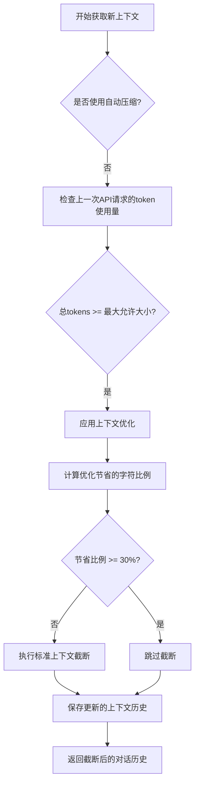
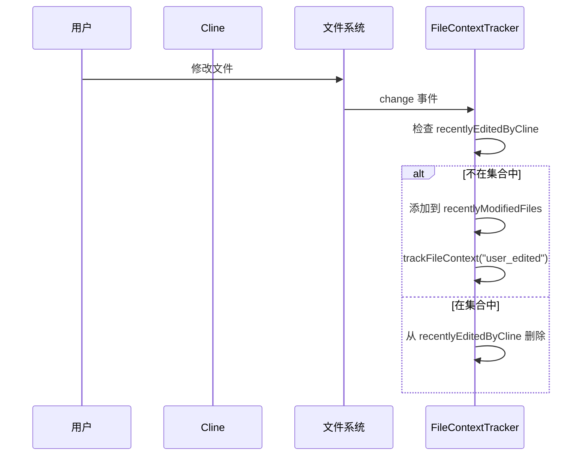
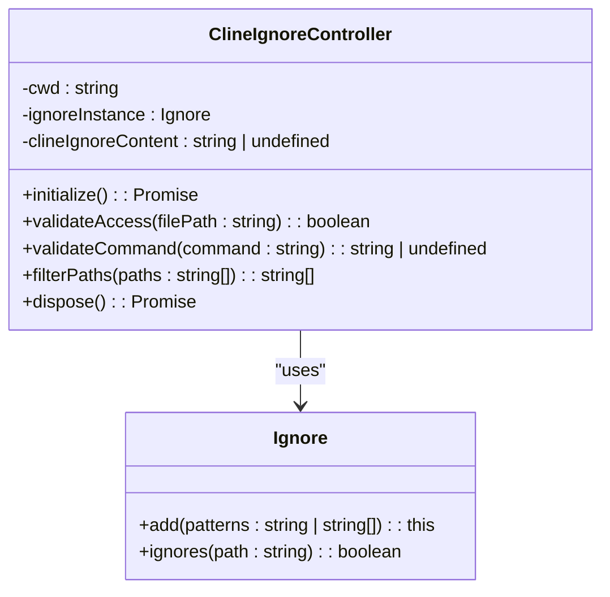

# 上下文管理

<cite>
**本文档中引用的文件**  
- [ContextManager.ts](file://src/core/context/context-management/ContextManager.ts)
- [context-window-utils.ts](file://src/core/context/context-management/context-window-utils.ts)
- [FileContextTracker.ts](file://src/core/context/context-tracking/FileContextTracker.ts)
- [ModelContextTracker.ts](file://src/core/context/context-tracking/ModelContextTracker.ts)
- [workflows.ts](file://src/core/context/instructions/user-instructions/workflows.ts)
- [ClineIgnoreController.ts](file://src/core/ignore/ClineIgnoreController.ts)
</cite>

## 目录
1. [简介](#简介)
2. [智能上下文选择机制](#智能上下文选择机制)
3. [上下文窗口限制与优化算法](#上下文窗口限制与优化算法)
4. [用户与模型上下文交互跟踪](#用户与模型上下文交互跟踪)
5. [指令集对上下文的指导作用](#指令集对上下文的指导作用)
6. [性能优化建议与忽略文件策略](#性能优化建议与忽略文件策略)
7. [总结](#总结)

## 简介
Cline 的上下文管理策略旨在高效地管理大型语言模型（LLM）在执行任务过程中所需的上下文信息。该策略通过智能选择、动态优化和精确跟踪机制，确保在有限的上下文窗口内提供最相关的信息，同时避免冗余和过时数据。核心组件包括 `ContextManager`、`FileContextTracker`、`ModelContextTracker` 以及基于 `.clineignore` 文件的访问控制，共同构成了一个健壮且高效的上下文管理系统。

## 智能上下文选择机制

Cline 的智能上下文选择由 `ContextManager.ts` 实现，其核心在于动态维护和更新对话历史中的上下文信息。`ContextManager` 类通过一个名为 `contextHistoryUpdates` 的嵌套映射结构来记录对对话历史的每一次修改。该结构以消息索引为键，存储了按时间戳排序的更新操作，包括文本替换、文件读取通知等。

当系统检测到即将超出模型的上下文窗口限制时，`ContextManager` 会触发上下文优化流程。它首先分析对话历史，识别出重复或可简化的文件读取操作。例如，如果同一个文件在多个工具调用中被读取，系统会将早期的完整文件内容替换为一个占位符通知（如“[DUPLICATE FILE READ]”），仅保留最后一次的完整内容。这种机制显著减少了上下文中的冗余信息，为新的交互腾出空间。



**Diagram sources**
- [ContextManager.ts](file://src/core/context/context-management/ContextManager.ts#L300-L500)

**Section sources**
- [ContextManager.ts](file://src/core/context/context-management/ContextManager.ts#L0-L959)

## 上下文窗口限制与优化算法

上下文窗口的限制是上下文管理的关键约束。`context-window-utils.ts` 文件中的 `getContextWindowInfo` 函数负责根据当前使用的 API 提供商和模型 ID 确定具体的上下文窗口大小和最大允许使用量。

该算法首先获取模型声明的原始上下文窗口大小（如 Claude 为 200,000，DeepSeek 为 128,000）。然后，它会减去一个安全缓冲区，以确保不会因计算误差或元数据开销而真正超出限制。缓冲区的大小根据模型类型有所不同：Claude 模型减去 40,000，大多数模型减去 30,000，而 DeepSeek 等特定模型则减去 27,000。对于未知模型，算法采用更保守的策略，取窗口大小减去 40,000 和窗口大小 80% 之间的较大值，以保证足够的缓冲空间。

`ContextManager` 利用此信息来决定何时进行上下文压缩。它通过检查上一次 API 请求的 `tokensIn`、`tokensOut`、`cacheWrites` 和 `cacheReads` 总和是否接近或达到 `maxAllowedSize` 来触发优化流程。这种基于实际使用量的判断比简单的消息计数更精确，能有效防止上下文溢出错误。

```mermaid
classDiagram
class ContextWindowInfo {
+contextWindow : number
+maxAllowedSize : number
}
class ApiHandler {
+getModel() : ModelInfo
}
class ModelInfo {
+id : string
+info : { contextWindow : number }
}
getContextWindowInfo(api : ApiHandler) ContextWindowInfo
ApiHandler --> ModelInfo : "has"
getContextWindowInfo ..> ApiHandler : "uses"
getContextWindowInfo ..> ContextWindowInfo : "returns"
```

**Diagram sources**
- [context-window-utils.ts](file://src/core/context/context-management/context-window-utils.ts#L0-L35)
- [ContextManager.ts](file://src/core/context/context-management/ContextManager.ts#L200-L250)

**Section sources**
- [context-window-utils.ts](file://src/core/context/context-management/context-window-utils.ts#L0-L35)

## 用户与模型上下文交互跟踪

为了确保上下文的时效性和一致性，Cline 使用 `FileContextTracker` 和 `ModelContextTracker` 来跟踪用户和模型的交互。

`FileContextTracker` 通过 `chokidar` 库监听工作区中文件的修改。当一个文件通过工具调用、文件提及或编辑被引入上下文时，`FileContextTracker` 会为该文件设置一个文件监视器。如果文件在 Cline 之外被修改，监视器会捕获此事件，并将文件标记为“最近修改”。这确保了在后续的编辑操作中，Cline 能够意识到文件内容可能已过时，并在应用补丁前重新读取最新内容，从而避免了因文件状态不一致导致的编辑失败。

`ModelContextTracker` 则负责记录任务执行过程中模型的使用情况。它将每次模型调用的时间戳、提供者 ID、模型 ID 和模式（mode）记录到任务元数据中。这不仅为性能分析和成本核算提供了数据支持，也帮助系统理解任务的演变过程。



**Diagram sources**
- [FileContextTracker.ts](file://src/core/context/context-tracking/FileContextTracker.ts#L0-L317)
- [ModelContextTracker.ts](file://src/core/context/context-tracking/ModelContextTracker.ts#L0-L41)

**Section sources**
- [FileContextTracker.ts](file://src/core/context/context-tracking/FileContextTracker.ts#L0-L317)
- [ModelContextTracker.ts](file://src/core/context/context-tracking/ModelContextTracker.ts#L0-L41)

## 指令集对上下文的指导作用

`workflows.ts` 文件定义了指导上下文添加和使用的指令集。其核心函数 `refreshWorkflowToggles` 负责同步和管理工作流规则的开关状态。

该函数从全局和本地状态中读取工作流规则的切换状态，并确保相应的规则文件目录存在。它调用 `synchronizeRuleToggles` 函数来比对当前的规则文件与存储的状态，自动更新任何变化。这确保了上下文管理的行为（例如，哪些工作流是激活的）能够根据用户的配置文件（如 `.cline/workflows` 目录下的文件）动态调整。这些规则直接影响 `ContextManager` 如何处理和优化上下文，例如，决定是否对特定类型的文件读取进行去重。

**Section sources**
- [workflows.ts](file://src/core/context/instructions/user-instructions/workflows.ts#L0-L33)

## 性能优化建议与忽略文件策略

为了提高效率，Cline 提供了通过 `.clineignore` 文件排除不必要文件的机制，该功能由 `ClineIgnoreController.ts` 实现。

`ClineIgnoreController` 使用标准的 `.gitignore` 语法来定义被忽略的文件和目录模式。它会监听 `.clineignore` 文件的变化，并动态加载其内容。控制器不仅支持直接的忽略模式，还支持 `!include <filename>` 指令，允许从其他文件导入忽略规则，增强了配置的灵活性。

当需要检查文件访问权限时（例如，在向 LLM 提供文件内容或执行终端命令前），`validateAccess` 方法会根据当前的忽略规则判断该文件是否应被允许。`filterPaths` 方法则可用于批量过滤文件列表。此外，`validateCommand` 方法能解析终端命令，检查其操作的文件是否被忽略，从而防止 LLM 通过命令行访问被禁止的文件。

**性能优化建议：**
1.  **合理使用 `.clineignore`**：将大型日志文件、编译输出目录（如 `dist/`, `build/`）、依赖包目录（如 `node_modules/`）添加到 `.clineignore` 中，可以显著减少上下文扫描和处理的开销。
2.  **避免深度嵌套的 `!include`**：虽然支持 `!include`，但过多的嵌套会增加加载和解析时间，应保持规则文件的简洁。
3.  **定期审查规则**：随着项目结构的变化，应定期审查 `.clineignore` 文件，确保其仍然有效且不过度忽略。



**Diagram sources**
- [ClineIgnoreController.ts](file://src/core/ignore/ClineIgnoreController.ts#L0-L259)

**Section sources**
- [ClineIgnoreController.ts](file://src/core/ignore/ClineIgnoreController.ts#L0-L259)

## 总结
Cline 的上下文管理策略是一个多层次、动态响应的系统。它通过 `ContextManager` 实现智能的上下文选择和优化，利用 `context-window-utils` 精确处理模型限制，借助 `FileContextTracker` 和 `ModelContextTracker` 确保上下文的实时性和一致性，并通过 `workflows.ts` 中的指令集进行行为指导。最后，`ClineIgnoreController` 提供了强大的性能优化手段，允许用户通过 `.clineignore` 文件精确控制 LLM 的文件访问权限，从而在保证功能的同时，最大化系统的效率和安全性。