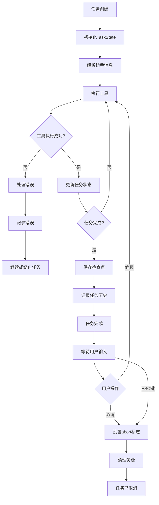

# 任务自动化

<cite>
**本文档引用的文件**
- [TaskState.ts](file://src/core/task/TaskState.ts)
- [ToolExecutor.ts](file://src/core/task/ToolExecutor.ts)
- [parse-assistant-message.ts](file://src/core/assistant-message/parse-assistant-message.ts)
- [getTaskHistory.ts](file://src/core/controller/task/getTaskHistory.ts)
- [taskFeedback.ts](file://src/core/controller/task/taskFeedback.ts)
</cite>

## 更新摘要
**已做更改**
- 在“工具执行协调”部分添加了关于“Yolo模式”的新功能说明
- 在“任务生命周期流程图”中更新了状态机以包含任务取消功能
- 添加了关于ESC键取消任务的新用户交互说明
- 更新了相关代码文件的引用以反映最新实现

## 目录
1. [简介](#简介)
2. [任务状态管理](#任务状态管理)
3. [工具执行协调](#工具执行协调)
4. [助手消息解析](#助手消息解析)
5. [任务历史与反馈](#任务历史与反馈)
6. [任务生命周期流程图](#任务生命周期流程图)

## 简介
Cline的任务自动化系统是一个复杂的框架，用于管理从用户请求到最终完成的完整任务生命周期。该系统通过`TaskState`类管理任务的各个状态，利用`ToolExecutor`协调各种工具的执行，并通过`parse-assistant-message.ts`解析助手消息中的多文件差异。本文件将深入探讨这些核心组件如何协同工作，以实现高效的任务自动化。

## 任务状态管理

`TaskState`类是任务生命周期管理的核心，它维护了任务从创建到完成的所有状态信息。该类包含多个标志和计数器，用于跟踪任务的流式传输、内容处理、工具执行、错误处理等各个方面。

**Section sources**
- [TaskState.ts](file://src/core/task/TaskState.ts#L4-L64)

## 工具执行协调

`ToolExecutor`类负责协调和调度各种工具的执行。它通过`ToolExecutorCoordinator`注册和管理所有工具处理器，并根据任务配置执行相应的工具。`ToolExecutor`还处理工具执行中的错误，并确保在执行非浏览器工具时关闭浏览器会话。

新增的“Yolo模式”功能允许自动执行操作，通过`updateYoloModeToggled`方法更新模式状态，并将此状态传递给`AutoApprove`实例以实现全自动审批。当`yoloModeToggled`为true时，`AutoApprove`类会自动批准所有工具调用，从而实现无需用户干预的完全自动化任务执行。

**Section sources**
- [ToolExecutor.ts](file://src/core/task/ToolExecutor.ts#L49-L389)
- [autoApprove.ts](file://src/core/task/tools/autoApprove.ts#L5-L117) - *新增Yolo模式支持*

## 助手消息解析

`parse-assistant-message.ts`文件中的`parseAssistantMessageV2`函数负责解析助手消息，提取其中的文本和工具使用块。该函数通过预计算的标签映射快速查找工具和参数的开始和结束标签，并使用索引管理当前文本、工具使用和参数值的起始位置。对于未完全关闭的块，函数会在最后将其标记为部分块。

**Section sources**
- [parse-assistant-message.ts](file://src/core/assistant-message/parse-assistant-message.ts#L0-L237)

## 任务历史与反馈

`getTaskHistory.ts`文件中的`getTaskHistory`函数负责获取过滤后的任务历史。它从全局状态中获取任务历史，并根据请求参数应用过滤器，如仅显示收藏的任务、仅显示当前工作区的任务、搜索查询等。函数还支持按时间、成本、令牌数等排序。

`taskFeedback.ts`文件处理任务反馈机制，允许用户对任务结果进行评价和反馈，从而帮助系统不断优化和改进。

**Section sources**
- [getTaskHistory.ts](file://src/core/controller/task/getTaskHistory.ts#L0-L116)
- [taskFeedback.ts](file://src/core/controller/task/taskFeedback.ts)

## 任务生命周期流程图

**Diagram sources**
- [TaskState.ts](file://src/core/task/TaskState.ts#L4-L64)
- [ToolExecutor.ts](file://src/core/task/ToolExecutor.ts#L49-L389)
- [parse-assistant-message.ts](file://src/core/assistant-message/parse-assistant-message.ts#L0-L237)
- [getTaskHistory.ts](file://src/core/controller/task/getTaskHistory.ts#L0-L116)
- [taskFeedback.ts](file://src/core/controller/task/taskFeedback.ts)
- [ActionButtons.tsx](file://webview-ui/src/components/chat/chat-view/components/layout/ActionButtons.tsx#L24-L155) - *新增ESC键取消功能*