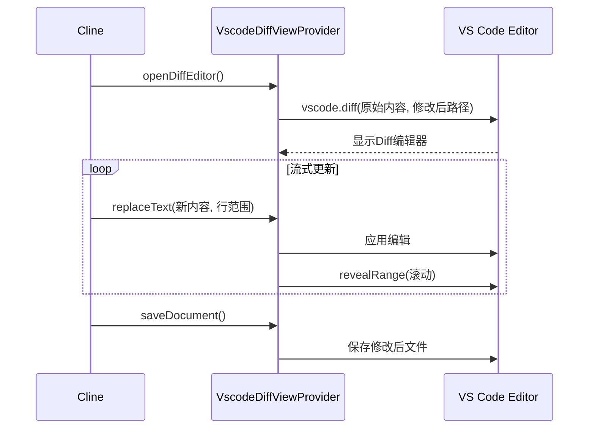
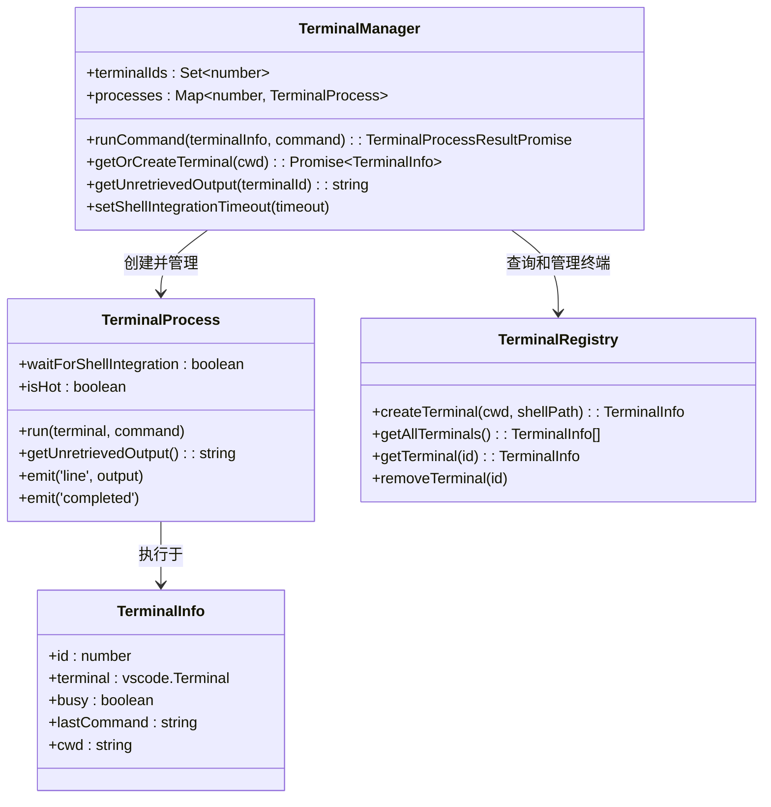

# 多工具集成

<cite>
**本文档中引用的文件**  
- [openFileRelativePath.ts](file://src/core/controller/file/openFileRelativePath.ts)
- [searchFiles.ts](file://src/core/controller/file/searchFiles.ts)
- [replaceInFile.ts](file://src/core/assistant-message/diff.ts)
- [openDiff.ts](file://src/hosts/vscode/VscodeDiffViewProvider.ts)
- [TerminalManager.ts](file://src/integrations/terminal/TerminalManager.ts)
- [get-latest-output.ts](file://src/integrations/terminal/TerminalManager.ts)
- [fetchOpenGraphData.ts](file://src/services/browser/UrlContentFetcher.ts)
- [openInBrowser.ts](file://src/core/controller/web/openInBrowser.ts)
</cite>

## 目录
1. [简介](#简介)
2. [文件操作工具集](#文件操作工具集)
3. [终端集成机制](#终端集成机制)
4. [浏览器操作功能](#浏览器操作功能)
5. [工具集成与工作流应用](#工具集成与工作流应用)
6. [总结](#总结)

## 简介
Cline 是一个功能强大的 VS Code 扩展，通过集成多种工具能力，为开发者提供智能化的开发辅助。其核心能力涵盖文件操作、终端控制和浏览器交互三大方面。文件操作工具集允许精确地打开、搜索和修改文件；终端集成机制利用 VS Code 的 shell 集成 API 安全地执行命令并获取结果；浏览器操作功能则能获取网页的 Open Graph 数据并进行交互。这些工具共同构成了 Cline 自动化处理复杂开发任务的基础。

## 文件操作工具集
Cline 的文件操作工具集提供了对项目文件进行高效管理的核心功能，包括基于相对路径打开文件、在工作区中搜索文件以及在 diff 视图中应用文件修改。

### 打开相对路径文件
`openFileRelativePath` 工具允许通过指定相对于工作区根目录的路径来打开文件。该工具首先获取当前工作区的绝对路径，然后将请求中的相对路径解析为绝对路径，最后调用底层集成来打开文件。此方法确保了路径解析的准确性，避免了因路径错误导致的文件打开失败。

**Section sources**
- [openFileRelativePath.ts](file://src/core/controller/file/openFileRelativePath.ts#L1-L35)

### 搜索文件
`searchFiles` 工具用于在当前工作区中进行文件和文件夹的模糊搜索。它接收一个包含查询字符串和可选类型过滤器的请求，调用 `searchWorkspaceFiles` 服务执行搜索，并将结果转换为协议缓冲区（proto）格式返回。该工具支持文件和文件夹类型的筛选，并设有默认的搜索结果数量限制。

**Section sources**
- [searchFiles.ts](file://src/core/controller/file/searchFiles.ts#L1-L51)

### 替换文件内容与 Diff 视图集成
文件内容的修改主要通过 `diff` 模块实现，它与 VS Code 的 diff 视图深度集成。当需要修改文件时，Cline 会创建一个特殊的 diff 编辑器。该编辑器的原始版本（左侧）是文件的当前内容，而修改版本（右侧）是待应用的更改。`VscodeDiffViewProvider` 类负责管理这个 diff 视图的整个生命周期，包括打开、更新文本、滚动动画和最终保存。

**Diagram sources**
- [VscodeDiffViewProvider.ts](file://src/hosts/vscode/VscodeDiffViewProvider.ts#L1-L195)
- [diff.ts](file://src/core/assistant-message/diff.ts#L1-L100)

**Section sources**
- [diff.ts](file://src/core/assistant-message/diff.ts#L1-L100)
- [VscodeDiffViewProvider.ts](file://src/hosts/vscode/VscodeDiffViewProvider.ts#L1-L195)

## 终端集成机制
Cline 的终端集成机制通过 `TerminalManager` 类实现，它利用 VS Code 的 shell 集成 API 来安全、高效地执行命令并获取结果。

### TerminalManager 核心功能
`TerminalManager` 负责终端的创建、复用和命令执行。它通过 `TerminalRegistry` 管理所有终端实例，并使用 `TerminalProcess` 来封装命令执行过程。该机制的核心优势在于能够监听 shell 集成事件，从而在命令执行完成后立即获取输出，避免了传统 `sendText` 方法的异步和不可靠性。

### Shell 集成与命令执行
当执行命令时，`TerminalManager` 会首先检查目标终端的 shell 集成是否已激活。如果已激活，则直接通过 `shellIntegration.executeCommand` 执行命令并读取输出流。如果未激活，它会等待一个预设的超时时间（默认4秒），以允许 shell 集成脚本自动加载。这种设计确保了在支持的环境中获得最佳性能，同时在不支持的旧版 VS Code 中也能优雅降级。

### 获取最新输出
`getUnretrievedOutput` 功能是终端集成的关键部分。它允许在命令执行过程中或之后，获取那些尚未被处理的输出行。`TerminalProcess` 在监听到输出时会将其缓存，`TerminalManager` 则提供接口来访问这些缓存的输出。这对于需要实时反馈或处理长运行命令输出的场景至关重要。

**Diagram sources**
- [TerminalManager.ts](file://src/integrations/terminal/TerminalManager.ts#L1-L461)
- [TerminalProcess.ts](file://src/integrations/terminal/TerminalProcess.ts#L1-L100)
- [TerminalRegistry.ts](file://src/integrations/terminal/TerminalRegistry.ts#L1-L50)

**Section sources**
- [TerminalManager.ts](file://src/integrations/terminal/TerminalManager.ts#L1-L461)

## 浏览器操作功能
Cline 的浏览器操作功能允许与外部网页进行交互，主要通过获取网页的 Open Graph 数据和在默认浏览器中打开链接来实现。

### 获取 Open Graph 数据
`fetchOpenGraphData` 工具用于从指定的 URL 提取 Open Graph 元数据。它使用 `ogs` 库发起 HTTP 请求，解析网页中的 `og:title`、`og:description`、`og:image` 等标签。该工具还处理了相对图片 URL 的转换，并在请求失败时提供基于 URL 的基本信息作为回退。这些数据可用于在聊天界面中生成美观的链接预览。

**Section sources**
- [fetchOpenGraphData.ts](file://src/services/browser/UrlContentFetcher.ts#L1-L82)

### 在浏览器中打开链接
`openInBrowser` 工具的功能是将指定的 URL 在用户的默认系统浏览器中打开。其实现非常直接，调用 VS Code 提供的 `openExternal` API 即可完成。这个简单的功能是实现更复杂浏览器自动化（如测试、调试）的基础步骤。

**Section sources**
- [openInBrowser.ts](file://src/core/controller/web/openInBrowser.ts#L1-L20)

## 工具集成与工作流应用
Cline 的各项工具并非孤立存在，而是紧密集成，共同服务于复杂的开发工作流。

### API 调用方式
这些工具主要通过 gRPC 服务在 Cline 的核心（Controller）和前端（Webview）之间进行调用。例如，前端可以通过 `WebServiceClient.fetchOpenGraphData()` 调用后端的 `fetchOpenGraphData` 函数。文件和终端操作则通过各自的控制器（如 `fileController`）暴露的函数进行调用。

### 实际应用场景
1.  **代码审查与修复**：Cline 可以搜索相关文件 (`searchFiles`)，打开它们 (`openFileRelativePath`)，分析问题，并通过 diff 视图 (`openDiff`) 提出修改建议。
2.  **自动化测试**：Cline 可以在终端中运行测试命令 (`TerminalManager.runCommand`)，监控输出 (`getUnretrievedOutput`)，并在发现错误时，打开相关文件进行修复。
3.  **文档与知识集成**：当用户分享一个链接时，Cline 可以自动获取其 Open Graph 数据 (`fetchOpenGraphData`) 并生成一个美观的预览，然后在需要时在浏览器中打开 (`openInBrowser`) 进行深入阅读。

## 总结
Cline 通过精心设计的多工具集成，实现了从文件操作、终端控制到浏览器交互的全方位开发辅助能力。其文件操作工具集提供了精确的文件管理，终端集成机制利用现代 API 实现了安全高效的命令执行，而浏览器操作功能则打通了与外部网络世界的连接。这些能力的有机结合，使得 Cline 能够理解并执行复杂的开发任务，极大地提升了开发者的生产力。