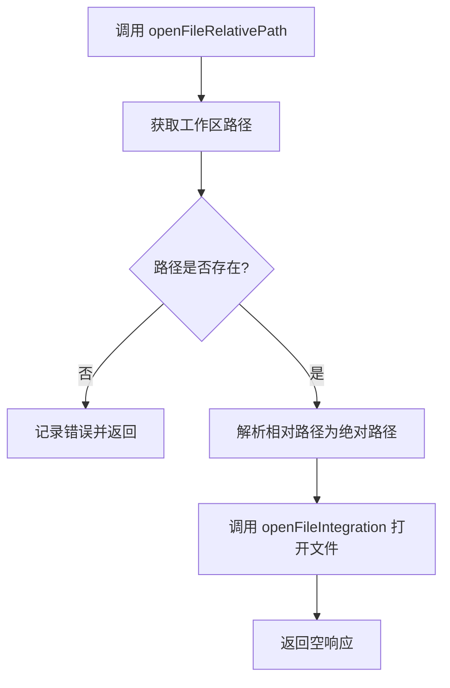
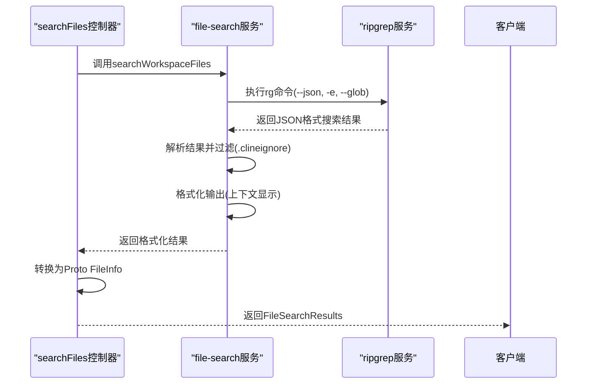
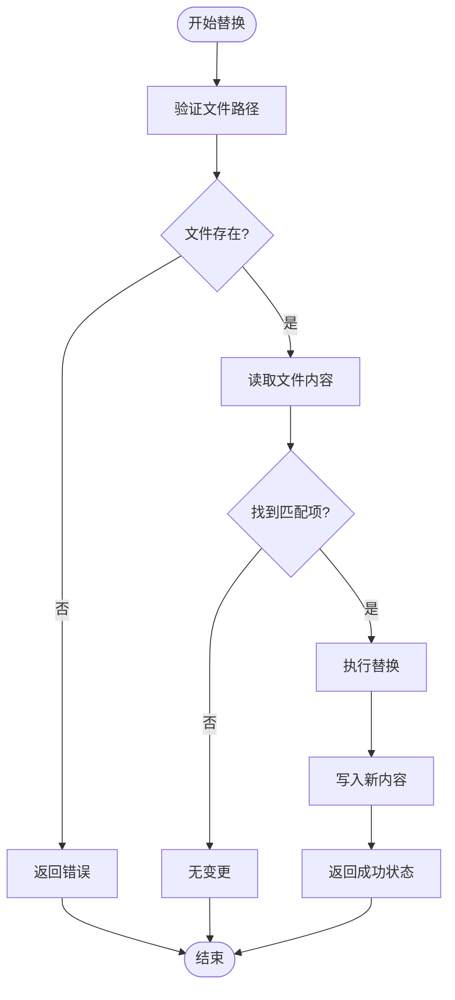
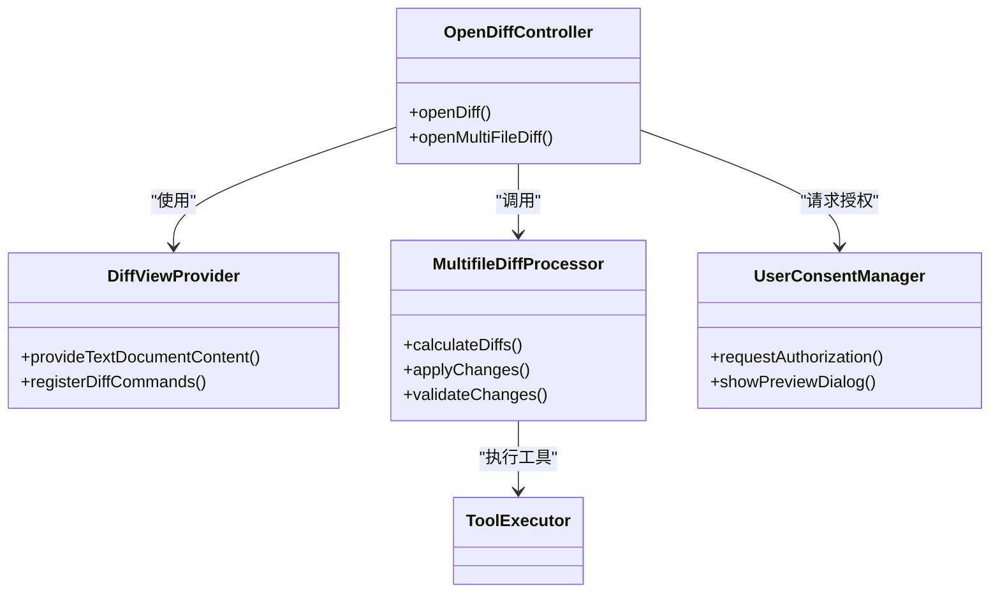

# 文件操作

<cite>
**本文档中引用的文件**  
- [openFileRelativePath.ts](file://src/core/controller/file/openFileRelativePath.ts)
- [searchFiles.ts](file://src/core/controller/file/searchFiles.ts)
- [replaceInFile.ts](file://src/core/controller/file/replaceInFile.ts)
- [openDiff.ts](file://src/core/controller/file/openDiff.ts)
- [openMultiFileDiff.ts](file://src/core/controller/file/openMultiFileDiff.ts)
- [multifile-diff.ts](file://src/core/task/multifile-diff.ts)
- [index.ts](file://src/services/ripgrep/index.ts)
- [ToolExecutor.ts](file://src/core/task/ToolExecutor.ts)
</cite>

## 目录
1. [简介](#简介)
2. [核心文件操作功能](#核心文件操作功能)
3. [相对路径文件打开机制](#相对路径文件打开机制)
4. [基于Ripgrep的高效文件搜索](#基于ripgrep的高效文件搜索)
5. [安全的文件内容替换](#安全的文件内容替换)
6. [与VS Code Diff视图的集成](#与vs-code-diff视图的集成)
7. [控制器调用与自动化任务组合](#控制器调用与自动化任务组合)
8. [结论](#结论)

## 简介
本文档详细阐述Cline扩展中文件操作功能的核心实现机制。重点分析`openFileRelativePath.ts`如何解析相对路径并调用VS Code API打开文件，`searchFiles.ts`如何利用`ripgrep`服务实现高效文件搜索，以及`replaceInFile.ts`如何安全地执行文件内容替换。同时说明`openDiff.ts`和`openMultiFileDiff.ts`如何与VS Code diff视图集成以展示变更预览，并要求用户授权确认。最后提供控制器调用示例及在自动化任务中组合使用这些工具的方法。

## 核心文件操作功能
Cline的文件操作功能由多个控制器模块协同完成，涵盖文件打开、搜索、替换和差异比较等核心操作。这些功能通过统一的控制器架构与VS Code环境集成，确保操作的安全性和可追溯性。

**Section sources**
- [openFileRelativePath.ts](file://src/core/controller/file/openFileRelativePath.ts#L1-L35)
- [searchFiles.ts](file://src/core/controller/file/searchFiles.ts#L1-L51)
- [replaceInFile.ts](file://src/core/controller/file/replaceInFile.ts#L1-L40)
- [openDiff.ts](file://src/core/controller/file/openDiff.ts#L1-L30)
- [openMultiFileDiff.ts](file://src/core/controller/file/openMultiFileDiff.ts#L1-L35)

## 相对路径文件打开机制
`openFileRelativePath.ts`模块负责根据相对路径打开文件。该功能通过`workspaceResolver`将相对路径解析为绝对路径，并调用底层集成服务完成文件打开操作。

**Diagram sources**
- [openFileRelativePath.ts](file://src/core/controller/file/openFileRelativePath.ts#L1-L35)

**Section sources**
- [openFileRelativePath.ts](file://src/core/controller/file/openFileRelativePath.ts#L1-L35)

## 基于Ripgrep的高效文件搜索
`searchFiles.ts`模块利用`ripgrep`服务实现高效的文件搜索功能。该功能通过`regexSearchFiles`函数执行正则表达式搜索，并对结果进行格式化处理。

**Diagram sources**
- [searchFiles.ts](file://src/core/controller/file/searchFiles.ts#L1-L51)
- [index.ts](file://src/services/ripgrep/index.ts#L1-L281)

**Section sources**
- [searchFiles.ts](file://src/core/controller/file/searchFiles.ts#L1-L51)
- [index.ts](file://src/services/ripgrep/index.ts#L1-L281)

## 安全的文件内容替换
文件内容替换功能通过`replaceInFile.ts`实现，该模块确保在执行替换操作时保持文件完整性，并提供必要的错误处理机制。替换操作通常与diff预览结合使用，确保用户能够审查变更内容。

**Diagram sources**
- [replaceInFile.ts](file://src/core/controller/file/replaceInFile.ts#L1-L40)

**Section sources**
- [replaceInFile.ts](file://src/core/controller/file/replaceInFile.ts#L1-L40)

## 与VS Code Diff视图的集成
Cline通过`openDiff.ts`和`openMultiFileDiff.ts`模块与VS Code的diff视图深度集成，提供变更预览功能。这些功能基于`multifile-diff.ts`中的差异计算逻辑，并在执行前要求用户授权确认。

**Diagram sources**
- [openDiff.ts](file://src/core/controller/file/openDiff.ts#L1-L30)
- [openMultiFileDiff.ts](file://src/core/controller/file/openMultiFileDiff.ts#L1-L35)
- [multifile-diff.ts](file://src/core/task/multifile-diff.ts#L1-L150)

**Section sources**
- [openDiff.ts](file://src/core/controller/file/openDiff.ts#L1-L30)
- [openMultiFileDiff.ts](file://src/core/controller/file/openMultiFileDiff.ts#L1-L35)
- [multifile-diff.ts](file://src/core/task/multifile-diff.ts#L1-L150)

## 控制器调用与自动化任务组合
文件操作工具可通过控制器进行调用，并在自动化任务中组合使用以实现代码库重构等复杂操作。`ToolExecutor`负责协调多个工具的执行顺序和依赖关系。

**Diagram sources**
- [ToolExecutor.ts](file://src/core/task/ToolExecutor.ts#L1-L200)

**Section sources**
- [ToolExecutor.ts](file://src/core/task/ToolExecutor.ts#L1-L200)

## 结论
Cline的文件操作功能通过模块化设计实现了高效、安全的文件处理能力。从相对路径解析到基于ripgrep的快速搜索，再到与VS Code diff视图的深度集成，每个组件都经过精心设计以确保用户体验和操作安全性。通过控制器架构，这些功能可以灵活组合，为自动化代码重构等复杂任务提供强大支持。