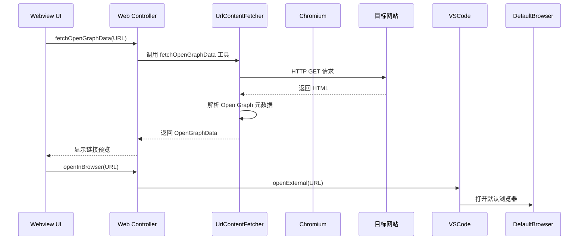
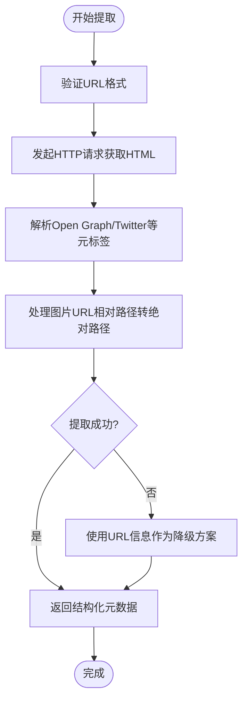
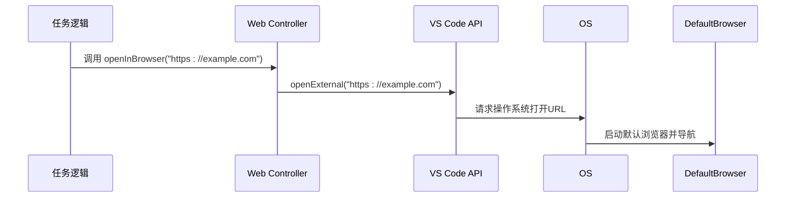
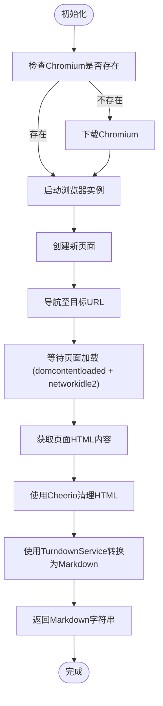

# 浏览器操作

<cite>
**本文档中引用的文件**  
- [link-preview.ts](file://src/integrations/misc/link-preview.ts)
- [fetchOpenGraphData.ts](file://src/core/controller/web/fetchOpenGraphData.ts)
- [openInBrowser.ts](file://src/core/controller/web/openInBrowser.ts)
- [UrlContentFetcher.ts](file://src/services/browser/UrlContentFetcher.ts)
- [open-graph-conversion.ts](file://src/shared/proto-conversions/web/open-graph-conversion.ts)
</cite>

## 目录
1. [简介](#简介)
2. [项目结构](#项目结构)
3. [核心组件](#核心组件)
4. [架构概览](#架构概览)
5. [详细组件分析](#详细组件分析)
6. [依赖分析](#依赖分析)
7. [性能考虑](#性能考虑)
8. [故障排除指南](#故障排除指南)
9. [结论](#结论)

## 简介
本文档深入探讨 Cline 浏览器操作功能的实现机制。重点分析 `fetchOpenGraphData.ts` 如何从网页中提取元数据（如标题、描述、图片），`openInBrowser.ts` 如何启动外部浏览器或在 VS Code 内嵌视图中打开 URL，以及 `UrlContentFetcher.ts` 服务如何支持更复杂的网页内容抓取场景。同时阐述这些功能如何与工作流集成，例如在添加网页链接作为上下文时自动获取预览信息，或在执行任务时查阅在线文档。文档还提供调用示例、跨域限制说明和错误处理方法。

## 项目结构
Cline 的浏览器相关功能分布在多个模块中，主要位于 `src` 目录下。核心功能被组织在 `integrations/misc`、`core/controller/web` 和 `services/browser` 等路径中，体现了关注点分离的设计原则。

```mermaid
graph TB
subgraph "核心控制器"
A[web/fetchOpenGraphData.ts]
B[web/openInBrowser.ts]
end
subgraph "集成工具"
C[misc/link-preview.ts]
end
subgraph "浏览器服务"
D[UrlContentFetcher.ts]
end
subgraph "数据转换"
E[open-graph-conversion.ts]
end
A --> C
C --> E
D --> A
B --> "VS Code API"
```

**Diagram sources**
- [link-preview.ts](file://src/integrations/misc/link-preview.ts)
- [fetchOpenGraphData.ts](file://src/core/controller/web/fetchOpenGraphData.ts)
- [UrlContentFetcher.ts](file://src/services/browser/UrlContentFetcher.ts)

**Section sources**
- [link-preview.ts](file://src/integrations/misc/link-preview.ts)
- [fetchOpenGraphData.ts](file://src/core/controller/web/fetchOpenGraphData.ts)
- [openInBrowser.ts](file://src/core/controller/web/openInBrowser.ts)
- [UrlContentFetcher.ts](file://src/services/browser/UrlContentFetcher.ts)

## 核心组件
本节分析浏览器操作功能的三个核心组件：元数据提取、URL 打开和网页内容抓取。

**Section sources**
- [link-preview.ts](file://src/integrations/misc/link-preview.ts)
- [openInBrowser.ts](file://src/core/controller/web/openInBrowser.ts)
- [UrlContentFetcher.ts](file://src/services/browser/UrlContentFetcher.ts)

## 架构概览
Cline 的浏览器操作功能采用分层架构，从用户界面请求到后端服务处理，再到外部资源交互。



**Diagram sources**
- [fetchOpenGraphData.ts](file://src/core/controller/web/fetchOpenGraphData.ts)
- [openInBrowser.ts](file://src/core/controller/web/openInBrowser.ts)
- [UrlContentFetcher.ts](file://src/services/browser/UrlContentFetcher.ts)

## 详细组件分析
本节对每个关键组件进行深入分析。

### 元数据提取分析
`fetchOpenGraphData` 功能负责从网页中提取结构化元数据，用于生成链接预览。

#### 实现流程


**Diagram sources**
- [link-preview.ts](file://src/integrations/misc/link-preview.ts)
- [open-graph-conversion.ts](file://src/shared/proto-conversions/web/open-graph-conversion.ts)

**Section sources**
- [link-preview.ts](file://src/integrations/misc/link-preview.ts#L17-L82)
- [fetchOpenGraphData.ts](file://src/core/controller/web/fetchOpenGraphData.ts#L12-L25)
- [open-graph-conversion.ts](file://src/shared/proto-conversions/web/open-graph-conversion.ts#L10-L18)

### URL 打开分析
`openInBrowser` 功能提供了一种简单而可靠的方式，将 URL 传递给用户的默认浏览器。

#### 调用流程


**Diagram sources**
- [openInBrowser.ts](file://src/core/controller/web/openInBrowser.ts#L10-L20)

**Section sources**
- [openInBrowser.ts](file://src/core/controller/web/openInBrowser.ts#L10-L21)

### 网页内容抓取分析
`UrlContentFetcher` 服务提供了高级网页内容抓取能力，适用于需要完整页面内容的复杂场景。

#### 内容抓取流程


**Diagram sources**
- [UrlContentFetcher.ts](file://src/services/browser/UrlContentFetcher.ts#L16-L95)

**Section sources**
- [UrlContentFetcher.ts](file://src/services/browser/UrlContentFetcher.ts#L16-L96)

## 依赖分析
浏览器操作功能依赖于多个内部和外部组件。

```mermaid
graph LR
A[fetchOpenGraphData.ts] --> B[link-preview.ts]
A --> C[open-graph-conversion.ts]
D[openInBrowser.ts] --> E[VS Code openExternal API]
F[UrlContentFetcher.ts] --> G[Puppeteer Core]
F --> H[Cheerio]
F --> I[TurndownService]
F --> J[PCR (Puppeteer Chromium Resolver)]
B --> K[open-graph-scraper]
B --> L[axios]
```

**Diagram sources**
- [package.json](file://package.json)
- [UrlContentFetcher.ts](file://src/services/browser/UrlContentFetcher.ts)

**Section sources**
- [UrlContentFetcher.ts](file://src/services/browser/UrlContentFetcher.ts)
- [link-preview.ts](file://src/integrations/misc/link-preview.ts)

## 性能考虑
浏览器操作功能在设计时考虑了性能和资源管理。

- **资源重用**：`UrlContentFetcher` 在实例生命周期内复用浏览器和页面实例，避免了频繁启动和关闭的开销。
- **超时控制**：所有网络请求都设置了合理的超时（如 5 秒或 10 秒），防止操作无限期挂起。
- **按需加载**：Chromium 浏览器内核在首次需要时才下载，减少了初始安装包大小。
- **内容清理**：抓取内容时会移除 `script`、`style`、`nav` 等非必要元素，减少处理的数据量。

## 故障排除指南
本节分析错误处理策略和常见问题。

**Section sources**
- [link-preview.ts](file://src/integrations/misc/link-preview.ts#L65-L82)
- [fetchOpenGraphData.ts](file://src/core/controller/web/fetchOpenGraphData.ts#L20-L25)
- [openInBrowser.ts](file://src/core/controller/web/openInBrowser.ts#L17-L21)
- [UrlContentFetcher.ts](file://src/services/browser/UrlContentFetcher.ts#L75-L77)

### 错误处理策略
- **优雅降级**：当 `fetchOpenGraphData` 无法获取元数据时，会返回基于 URL 的基本信息，确保功能不完全失效。
- **异常捕获**：所有异步操作都包裹在 `try-catch` 块中，防止未处理的异常导致整个扩展崩溃。
- **日志记录**：关键错误会被记录到控制台，便于调试和问题追踪。
- **资源清理**：`UrlContentFetcher` 提供了 `closeBrowser` 方法，确保浏览器进程在使用后能被正确关闭，避免资源泄漏。

### 潜在限制
- **跨域限制**：由于在服务器端执行，不受浏览器同源策略限制，但目标网站的反爬虫机制可能阻止请求。
- **网络依赖**：所有功能都依赖于稳定的网络连接。
- **资源消耗**：`UrlContentFetcher` 启动的 Chromium 实例会消耗较多内存和 CPU 资源。
- **自定义参数**：用户可以通过 `browserSettings` 配置自定义浏览器启动参数，以适应特定网站的需求。

## 结论
Cline 的浏览器操作功能通过 `fetchOpenGraphData`、`openInBrowser` 和 `UrlContentFetcher` 三个核心组件，为用户提供了一套强大而灵活的网页交互能力。这些功能不仅支持基本的链接预览和外部打开，还能通过无头浏览器技术抓取和转换复杂的网页内容，极大地增强了在开发工作流中查阅和利用在线资源的效率。通过合理的错误处理和资源管理，这些功能在保持高性能的同时，也确保了使用的稳定性和可靠性。