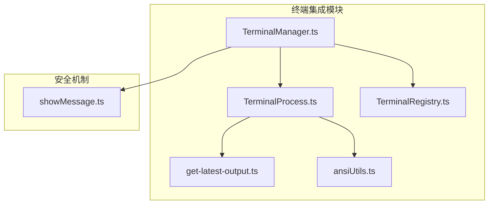
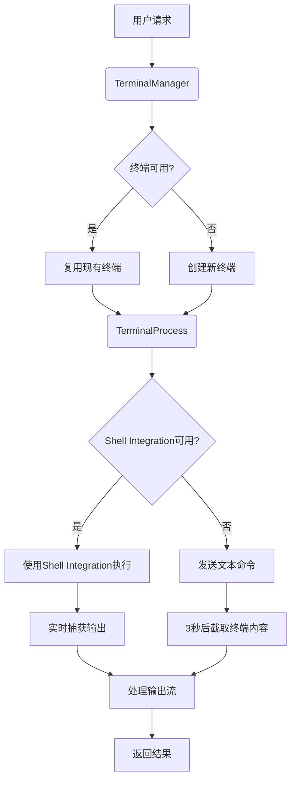
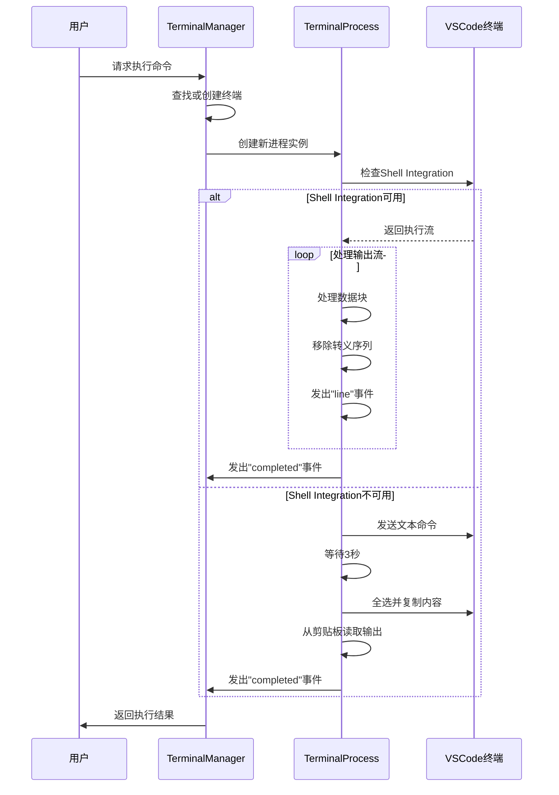
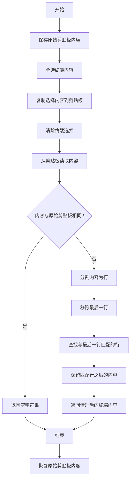
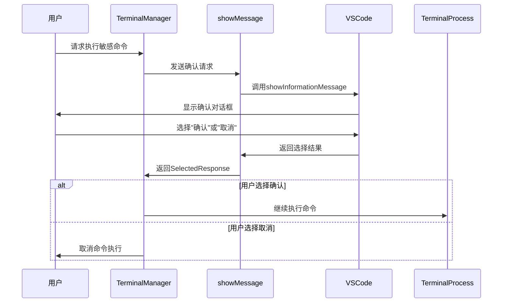
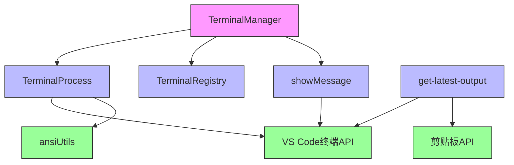

# 终端命令

<cite>
**本文档中引用的文件**   
- [TerminalManager.ts](file://src/integrations/terminal/TerminalManager.ts)
- [TerminalProcess.ts](file://src/integrations/terminal/TerminalProcess.ts)
- [get-latest-output.ts](file://src/integrations/terminal/get-latest-output.ts)
- [showMessage.ts](file://src/hosts/vscode/hostbridge/window/showMessage.ts)
- [TerminalRegistry.ts](file://src/integrations/terminal/TerminalRegistry.ts)
</cite>

## 目录
1. [简介](#简介)
2. [项目结构](#项目结构)
3. [核心组件](#核心组件)
4. [架构概述](#架构概述)
5. [详细组件分析](#详细组件分析)
6. [依赖分析](#依赖分析)
7. [性能考虑](#性能考虑)
8. [故障排除指南](#故障排除指南)
9. [结论](#结论)

## 简介
本文档全面开发Cline终端命令集成的文档。详细说明`TerminalManager.ts`的核心架构，包括如何创建和管理终端会话、处理命令执行生命周期，以及如何与`TerminalProcess.ts`协同工作来捕获输出流。解释`get-latest-output.ts`如何从终端会话中提取最新结果，以便在后续任务中使用。阐述安全机制，描述所有命令执行前如何通过`showMessage.ts`向用户弹出确认对话框。提供实际用例，例如如何自动化运行测试套件、安装依赖或部署应用，并展示相关的API调用序列和错误处理策略。

## 项目结构
Cline项目的终端功能主要集中在`src/integrations/terminal`目录下，该目录包含管理终端会话、处理命令执行和捕获输出的核心模块。终端管理器负责协调终端的创建和复用，而终端进程类则处理具体的命令执行和输出捕获。此外，项目还包括用于获取终端最新输出的工具函数和安全确认机制。



**图源**
- [TerminalManager.ts](file://src/integrations/terminal/TerminalManager.ts)
- [TerminalProcess.ts](file://src/integrations/terminal/TerminalProcess.ts)
- [get-latest-output.ts](file://src/integrations/terminal/get-latest-output.ts)
- [showMessage.ts](file://src/hosts/vscode/hostbridge/window/showMessage.ts)

**节源**
- [TerminalManager.ts](file://src/integrations/terminal/TerminalManager.ts)
- [TerminalProcess.ts](file://src/integrations/terminal/TerminalProcess.ts)

## 核心组件
终端命令系统的核心由`TerminalManager`、`TerminalProcess`和`get-latest-output`三个主要组件构成。`TerminalManager`负责管理终端会话的生命周期，包括创建、复用和销毁终端实例。`TerminalProcess`处理具体的命令执行过程，捕获输出流并管理执行状态。`get-latest-output`提供了一种从活动终端获取最新输出内容的机制，这对于需要读取命令执行结果的场景至关重要。

**节源**
- [TerminalManager.ts](file://src/integrations/terminal/TerminalManager.ts#L92-L460)
- [TerminalProcess.ts](file://src/integrations/terminal/TerminalProcess.ts#L18-L296)
- [get-latest-output.ts](file://src/integrations/terminal/get-latest-output.ts#L1-L46)

## 架构概述
Cline的终端命令架构采用分层设计，将终端管理、命令执行和输出捕获分离为独立的组件。这种设计提高了代码的可维护性和可测试性。`TerminalManager`作为顶层协调者，负责管理终端资源池并处理会话复用逻辑。`TerminalProcess`封装了具体的命令执行细节，包括对VS Code Shell Integration API的使用和回退机制。`get-latest-output`提供了一种统一的接口来获取终端输出，无论命令是通过Shell Integration还是传统方式执行。



**图源**
- [TerminalManager.ts](file://src/integrations/terminal/TerminalManager.ts#L92-L460)
- [TerminalProcess.ts](file://src/integrations/terminal/TerminalProcess.ts#L18-L296)

## 详细组件分析

### TerminalManager分析
`TerminalManager`是终端会话管理的核心类，负责创建、复用和管理终端实例。它维护一个终端ID集合和进程映射，以跟踪所有活动的终端会话。通过`getOrCreateTerminal`方法，系统可以智能地选择现有终端或创建新终端，优先考虑工作目录匹配的非繁忙终端。当终端复用启用时，系统会尝试将现有终端切换到目标工作目录。

```mermaid
classDiagram
class TerminalManager {
+terminalIds : Set<number>
+processes : Map<number, TerminalProcess>
+disposables : Disposable[]
+shellIntegrationTimeout : number
+terminalReuseEnabled : boolean
+terminalOutputLineLimit : number
+defaultTerminalProfile : string
+runCommand(terminalInfo : TerminalInfo, command : string) : TerminalProcessResultPromise
+getOrCreateTerminal(cwd : string) : Promise<TerminalInfo>
+getTerminals(busy : boolean) : { id : number; lastCommand : string }[]
+getUnretrievedOutput(terminalId : number) : string
+isProcessHot(terminalId : number) : boolean
+disposeAll() : void
+setShellIntegrationTimeout(timeout : number) : void
+setTerminalReuseEnabled(enabled : boolean) : void
+setTerminalOutputLineLimit(limit : number) : void
+processOutput(outputLines : string[]) : string
+setDefaultTerminalProfile(profileId : string) : { closedCount : number; busyTerminals : TerminalInfo[] }
+filterTerminals(filterFn : (terminal : TerminalInfo) => boolean) : TerminalInfo[]
+closeTerminals(filterFn : (terminal : TerminalInfo) => boolean, force : boolean) : number
+handleTerminalProfileChange(newShellPath : string | undefined) : { closedCount : number; busyTerminals : TerminalInfo[] }
+closeAllTerminals() : number
}
class TerminalProcess {
+waitForShellIntegration : boolean
+isListening : boolean
+buffer : string
+fullOutput : string
+lastRetrievedIndex : number
+isHot : boolean
+hotTimer : NodeJS.Timeout | null
+run(terminal : vscode.Terminal, command : string) : Promise<void>
+emitIfEol(chunk : string) : void
+emitRemainingBufferIfListening() : void
+continue() : void
+getUnretrievedOutput() : string
+removeLastLineArtifacts(output : string) : string
}
class TerminalRegistry {
+getAllTerminals() : TerminalInfo[]
+getTerminal(id : number) : TerminalInfo | undefined
+createTerminal(cwd : string, shellPath? : string) : TerminalInfo
+updateTerminal(id : number, updates : Partial<TerminalInfo>) : void
+removeTerminal(id : number) : void
}
TerminalManager --> TerminalProcess : "使用"
TerminalManager --> TerminalRegistry : "使用"
```

**图源**
- [TerminalManager.ts](file://src/integrations/terminal/TerminalManager.ts#L92-L460)
- [TerminalProcess.ts](file://src/integrations/terminal/TerminalProcess.ts#L18-L296)
- [TerminalRegistry.ts](file://src/integrations/terminal/TerminalRegistry.ts)

**节源**
- [TerminalManager.ts](file://src/integrations/terminal/TerminalManager.ts#L92-L460)

### TerminalProcess分析
`TerminalProcess`类负责处理命令执行的生命周期和输出捕获。它通过继承`EventEmitter`来实现事件驱动的输出处理机制。当使用Shell Integration时，系统可以实时捕获命令输出并进行处理，包括移除VS Code的自定义转义序列和处理重复字符等终端工件。对于不支持Shell Integration的终端，系统会采用回退机制，通过复制终端内容来获取输出。



**图源**
- [TerminalProcess.ts](file://src/integrations/terminal/TerminalProcess.ts#L18-L296)
- [TerminalManager.ts](file://src/integrations/terminal/TerminalManager.ts#L92-L460)

**节源**
- [TerminalProcess.ts](file://src/integrations/terminal/TerminalProcess.ts#L18-L296)

### get-latest-output分析
`get-latest-output.ts`模块提供了一个关键功能：从活动终端获取最新输出内容。该功能通过一系列VS Code命令实现：首先全选终端内容，然后复制到剪贴板，最后读取剪贴板内容。为了确保用户原始剪贴板内容不被破坏，系统会在操作前后保存和恢复剪贴板内容。此外，函数还包含逻辑来清理输出，移除可能的命令回显和终端提示符。



**图源**
- [get-latest-output.ts](file://src/integrations/terminal/get-latest-output.ts#L1-L46)

**节源**
- [get-latest-output.ts](file://src/integrations/terminal/get-latest-output.ts#L1-L46)

### 安全机制分析
Cline终端命令的安全机制通过`showMessage.ts`实现，确保所有命令执行前都需要用户确认。该机制使用VS Code的原生消息对话框，根据请求类型显示信息、警告或错误消息。用户必须明确选择操作选项才能继续执行命令，这有效防止了意外或恶意命令的执行。对话框支持模态和非模态显示，以及详细的附加信息，为用户提供充分的上下文来做出决策。



**图源**
- [showMessage.ts](file://src/hosts/vscode/hostbridge/window/showMessage.ts#L5-L25)
- [TerminalManager.ts](file://src/integrations/terminal/TerminalManager.ts#L92-L460)

**节源**
- [showMessage.ts](file://src/hosts/vscode/hostbridge/window/showMessage.ts#L5-L25)

## 依赖分析
终端命令系统依赖于多个核心模块和VS Code API。`TerminalManager`依赖`TerminalProcess`进行命令执行，依赖`TerminalRegistry`管理终端实例，依赖`showMessage`实现安全确认。`TerminalProcess`直接使用VS Code的终端API和shell integration功能。`get-latest-output`依赖VS Code的命令执行API和剪贴板操作功能。这些依赖关系形成了一个紧密协作的系统，每个组件都专注于特定的功能领域。



**图源**
- [TerminalManager.ts](file://src/integrations/terminal/TerminalManager.ts)
- [TerminalProcess.ts](file://src/integrations/terminal/TerminalProcess.ts)
- [TerminalRegistry.ts](file://src/integrations/terminal/TerminalRegistry.ts)
- [showMessage.ts](file://src/hosts/vscode/hostbridge/window/showMessage.ts)
- [get-latest-output.ts](file://src/integrations/terminal/get-latest-output.ts)

**节源**
- [TerminalManager.ts](file://src/integrations/terminal/TerminalManager.ts)
- [TerminalProcess.ts](file://src/integrations/terminal/TerminalProcess.ts)

## 性能考虑
终端命令系统的性能主要受几个因素影响。首先，Shell Integration的可用性直接影响输出捕获的效率和实时性。当Shell Integration可用时，系统可以实时流式传输输出，提供最佳用户体验。其次，终端复用策略可以显著减少创建新终端的开销，特别是在频繁执行命令的场景中。此外，输出处理的复杂性也会影响性能，特别是对于大量输出的命令，系统需要处理字符串操作和事件发射。

为了优化性能，系统实现了输出行限制功能，当输出行数超过阈值时自动截断，防止内存占用过高。同时，`isHot`机制可以防止在长时间运行的命令（如开发服务器）执行期间发送过多API请求，避免系统过载。这些性能优化措施共同确保了终端命令系统在各种使用场景下的稳定性和响应性。

## 故障排除指南
当终端命令功能出现问题时，可以按照以下步骤进行排查：

1. **检查Shell Integration状态**：确保VS Code终端的shell integration已启用，这是实现最佳输出捕获的关键。
2. **验证终端权限**：确认Cline扩展具有执行终端命令所需的权限。
3. **检查工作目录**：确保终端的工作目录与预期一致，特别是在使用终端复用功能时。
4. **查看日志输出**：检查控制台日志，寻找与终端管理相关的错误或警告信息。
5. **测试基本命令**：尝试执行简单的命令（如`echo "test"`）来验证基本功能是否正常。
6. **检查剪贴板访问**：如果使用回退机制，确保扩展可以正常访问系统剪贴板。

**节源**
- [TerminalManager.ts](file://src/integrations/terminal/TerminalManager.ts#L92-L460)
- [TerminalProcess.ts](file://src/integrations/terminal/TerminalProcess.ts#L18-L296)
- [get-latest-output.ts](file://src/integrations/terminal/get-latest-output.ts#L1-L46)

## 结论
Cline的终端命令系统通过精心设计的架构实现了高效、安全的命令执行和输出捕获。`TerminalManager`、`TerminalProcess`和`get-latest-output`三个核心组件协同工作，提供了从终端会话管理到输出提取的完整解决方案。安全确认机制确保了所有命令执行都经过用户同意，防止了潜在的风险。该系统不仅支持现代的Shell Integration API，还提供了兼容传统终端的回退机制，确保了广泛的适用性。通过合理的性能优化和错误处理，该系统为自动化任务提供了可靠的基础。