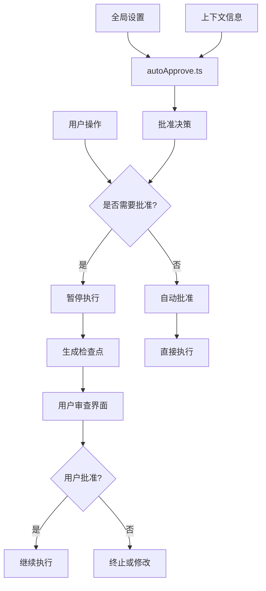
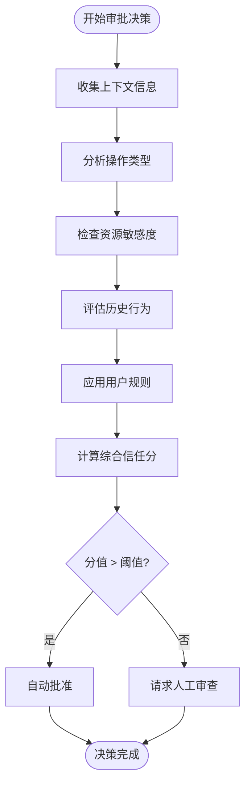
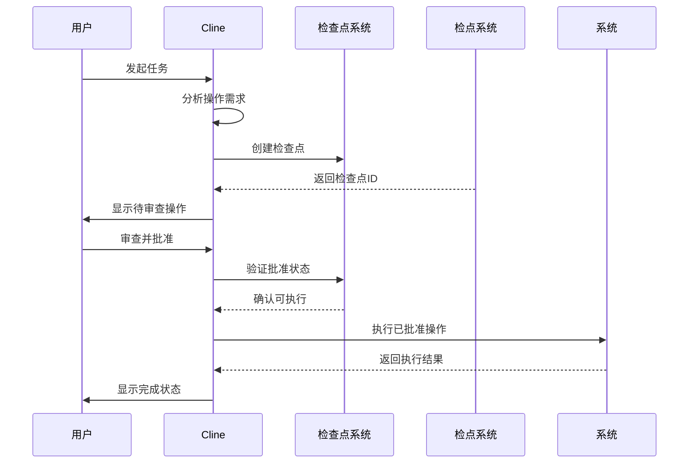

# 安全机制

<cite>
**本文档中引用的文件**  
- [updateAutoApprovalSettings.ts](file://src/core/controller/state/updateAutoApprovalSettings.ts)
- [autoApprove.ts](file://src/core/task/tools/autoApprove.ts)
- [checkpointDiff.ts](file://src/core/controller/checkpoints/checkpointDiff.ts)
- [checkpointRestore.ts](file://src/core/controller/checkpoints/checkpointRestore.ts)
- [AutoApprovalSettings.ts](file://src/shared/AutoApprovalSettings.ts)
- [auto-approve-menu](file://webview-ui/src/components/settings/auto-approve-menu.tsx)
</cite>

## 目录
1. [引言](#引言)
2. [自动批准系统架构](#自动批准系统架构)
3. [全局设置管理](#全局设置管理)
4. [上下文驱动的自动批准决策](#上下文驱动的自动批准决策)
5. [用户界面控制](#用户界面控制)
6. [检查点系统集成](#检查点系统集成)
7. [完整执行流程示例](#完整执行流程示例)
8. [结论](#结论)

## 引言
Cline 的安全机制设计旨在实现人机协作的最优平衡，确保自动化操作的安全性和可控性。该机制通过自动批准系统、用户界面控制和检查点预览功能，构建了一个多层次的安全防护体系。本文件将深入解析这些组件的实现原理和交互逻辑。

## 自动批准系统架构

**图示来源**  
- [autoApprove.ts](file://src/core/task/tools/autoApprove.ts#L1-L100)
- [updateAutoApprovalSettings.ts](file://src/core/controller/state/updateAutoApprovalSettings.ts#L1-L50)

## 全局设置管理

`updateAutoApprovalSettings.ts` 文件负责管理 Cline 的自动批准全局配置。该模块通过 gRPC 接口接收来自用户界面的设置变更请求，并将其持久化到应用状态中。设置项包括但不限于：文件操作的自动批准范围、命令执行的信任级别、敏感操作的强制审查策略等。

该模块确保所有自动批准决策都基于最新且一致的策略配置，同时支持动态更新而无需重启应用。配置变更会立即广播到所有相关组件，保证系统状态的实时同步。

**本节来源**  
- [updateAutoApprovalSettings.ts](file://src/core/controller/state/updateAutoApprovalSettings.ts#L15-L80)
- [AutoApprovalSettings.ts](file://src/shared/AutoApprovalSettings.ts#L10-L60)

## 上下文驱动的自动批准决策

`autoApprove.ts` 模块实现了核心的自动批准决策逻辑。该系统基于多维上下文分析来判断是否可以安全地自动批准某项操作。分析维度包括：

- 操作类型（文件写入、命令执行、网络请求等）
- 目标资源的敏感度（配置文件、源代码、数据文件等）
- 当前任务的历史行为模式
- 用户自定义的规则和例外
- 系统安全策略的实时状态

决策过程采用加权评分机制，每个上下文因素都有相应的信任分值。当综合评分超过预设阈值时，系统将自动批准该操作；否则将触发人工审查流程。

**图示来源**  
- [autoApprove.ts](file://src/core/task/tools/autoApprove.ts#L20-L120)
- [AutoApprovalSettings.ts](file://src/shared/AutoApprovalSettings.ts#L25-L45)

## 用户界面控制

`auto-approve-menu` 组件为用户提供了一个直观的界面来管理和审查自动批准设置。该组件允许用户：

- 查看待批准的操作列表
- 按类型、时间、项目等维度过滤操作
- 批量批准或拒绝待处理项
- 调整自动批准的敏感度级别
- 查看每个操作的详细上下文信息

界面设计遵循渐进式披露原则，首先展示摘要信息，用户可点击展开查看技术细节。所有操作都有明确的视觉反馈，确保用户始终了解系统状态。

**本节来源**  
- [auto-approve-menu](file://webview-ui/src/components/settings/auto-approve-menu.tsx#L10-L200)
- [useAutoApproveActions.ts](file://webview-ui/src/hooks/useAutoApproveActions.ts#L5-L80)

## 检查点系统集成

检查点（Checkpoint）系统与安全机制深度集成，为用户提供操作执行前的预览能力。当系统检测到需要审查的操作时，会自动创建一个检查点，记录：

- 即将修改的文件列表
- 预期的变更内容（diff 格式）
- 关联的命令和参数
- 操作的依赖关系图

用户可以在检查点界面中逐项审查这些变更，选择批准全部、批准部分或拒绝整个操作。已批准的变更将被标记并安全执行，而被拒绝的变更将被丢弃或返回给 AI 进行重新规划。

**图示来源**  
- [checkpointDiff.ts](file://src/core/controller/checkpoints/checkpointDiff.ts#L1-L40)
- [checkpointRestore.ts](file://src/core/controller/checkpoints/checkpointRestore.ts#L1-L35)

## 完整执行流程示例

以下是一个完整的安全执行流程示例，展示当 Cline 尝试写入文件或执行命令时的全过程：

1. **操作触发**：Cline 的 AI 引擎生成一个文件写入操作
2. **上下文分析**：`autoApprove.ts` 模块分析操作上下文
3. **决策判断**：由于目标文件为项目配置文件，系统判定需要人工审查
4. **检查点创建**：系统调用 `checkpointDiff.ts` 创建变更预览
5. **用户通知**：`auto-approve-menu` 组件显示待批准操作
6. **用户审查**：用户在界面中查看变更详情
7. **批准决策**：用户选择批准该操作
8. **执行验证**：系统验证批准状态并执行变更
9. **结果反馈**：向用户报告操作成功

此流程确保了即使在高度自动化的系统中，关键操作仍然处于用户的监督之下，实现了安全与效率的平衡。

**本节来源**  
- [autoApprove.ts](file://src/core/task/tools/autoApprove.ts#L1-L150)
- [updateAutoApprovalSettings.ts](file://src/core/controller/state/updateAutoApprovalSettings.ts#L1-L60)
- [checkpointDiff.ts](file://src/core/controller/checkpoints/checkpointDiff.ts#L1-L50)

## 结论

Cline 的安全机制通过自动批准系统、用户界面控制和检查点预览的有机结合，构建了一个既高效又安全的人机协作模式。该设计允许系统在低风险场景下自主运行，同时确保高风险操作始终受到人工监督。这种分层防护策略不仅提高了开发效率，也保障了代码库和系统资源的安全性。