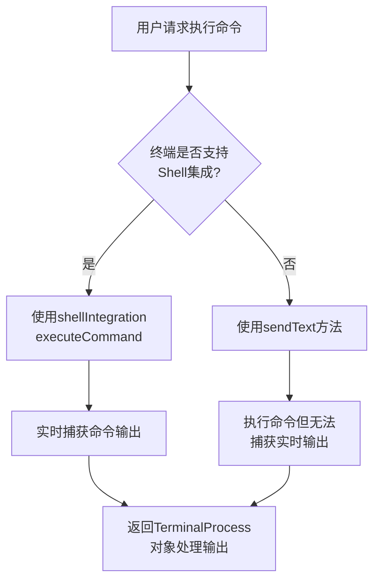
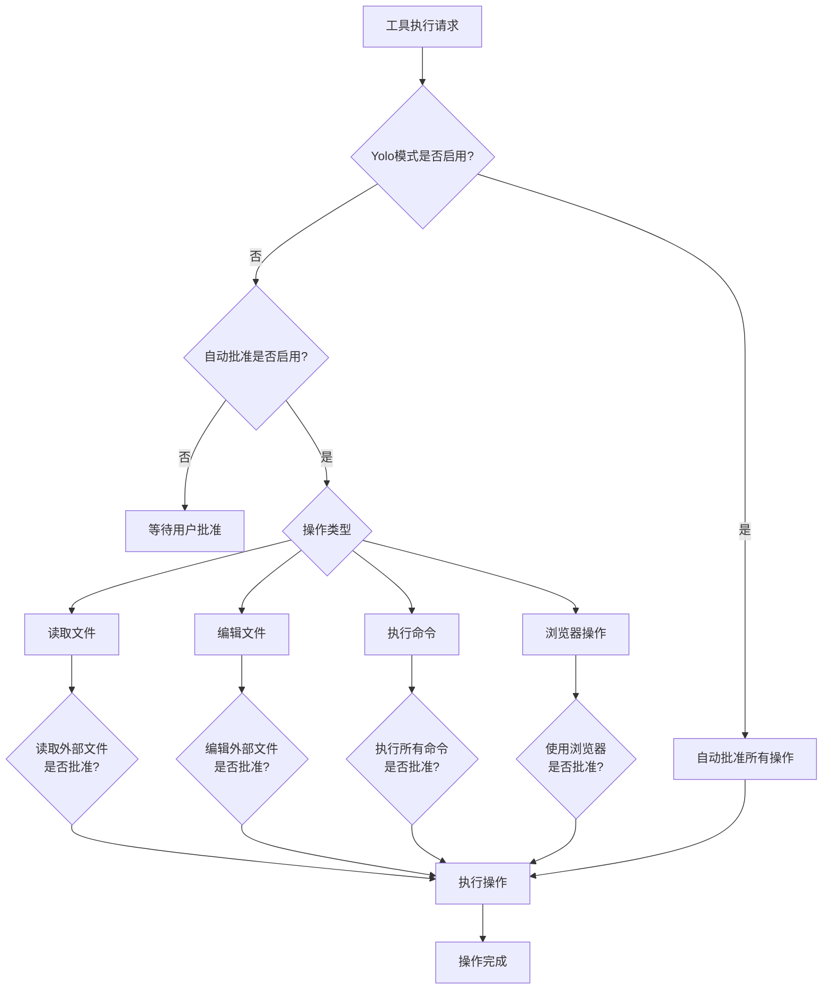
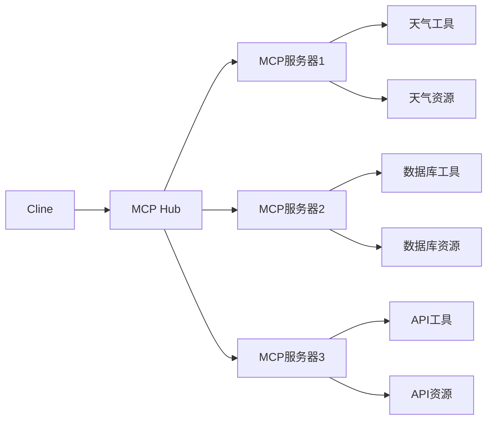
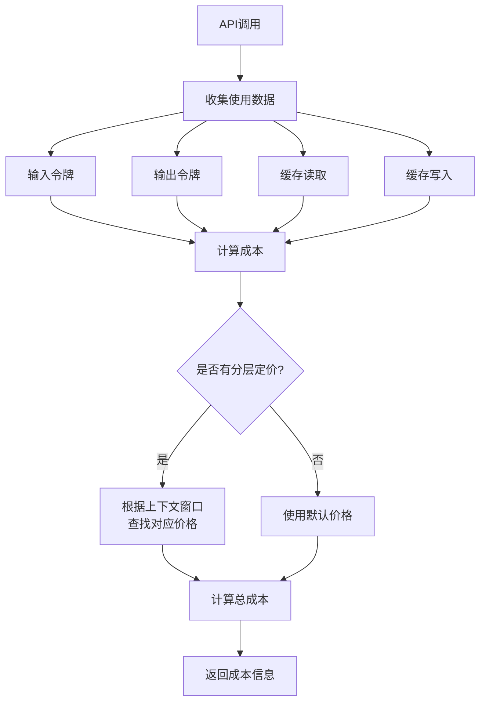

# 核心功能

<cite>
**本文档中引用的文件**  
- [ToolExecutor.ts](file://src/core/task/ToolExecutor.ts) - *在提交 a505a79 中更新，支持 Yolo 模式*
- [ToolExecutorCoordinator.ts](file://src/core/task/tools/ToolExecutorCoordinator.ts)
- [AutoApprovalSettings.ts](file://src/shared/AutoApprovalSettings.ts)
- [autoApprove.ts](file://src/core/task/tools/autoApprove.ts)
- [BrowserSession.ts](file://src/services/browser/BrowserSession.ts)
- [UrlContentFetcher.ts](file://src/services/browser/UrlContentFetcher.ts)
- [McpHub.ts](file://src/services/mcp/McpHub.ts)
- [loadMcpDocumentation.ts](file://src/core/prompts/loadMcpDocumentation.ts)
- [ContextManager.ts](file://src/core/context/context-management/ContextManager.ts)
- [cost.ts](file://src/utils/cost.ts)
- [gemini.ts](file://src/core/api/providers/gemini.ts)
- [groq.ts](file://src/core/api/providers/groq.ts)
- [state.proto](file://proto/cline/state.proto) - *在提交 a505a79 中新增 Yolo 模式配置*
- [WorkspacePathAdapter.ts](file://src/core/workspace/WorkspacePathAdapter.ts) - *在提交 4e7af6e 中更新，支持多根工作区*
- [ActionButtons.tsx](file://webview-ui/src/components/chat/chat-view/components/layout/ActionButtons.tsx) - *在提交 fe1da0f 中新增 ESC 键取消任务*
- [useMessageHandlers.ts](file://webview-ui/src/components/chat/chat-view/hooks/useMessageHandlers.ts) - *在提交 fe1da0f 中新增 ESC 键监听器*
</cite>

## 更新摘要
**已做更改**  
- 在“安全机制”部分新增“Yolo模式”子章节，介绍自动执行功能
- 在“任务自动化系统”部分更新`ToolExecutor`以反映多根工作区支持
- 在“人机协作模式”图表中新增Yolo模式分支
- 在“任务自动化系统”部分新增任务取消快捷键说明
- 更新文档来源以包含新修改的文件

## 目录
1. [任务自动化系统](#任务自动化系统)
2. [多工具集成](#多工具集成)
3. [安全机制](#安全机制)
4. [能力扩展机制MCP](#能力扩展机制mcp)
5. [上下文管理策略](#上下文管理策略)
6. [成本跟踪功能](#成本跟踪功能)

## 任务自动化系统

Cline的任务自动化系统通过将复杂的开发任务分解为可执行的步骤来实现高效的任务处理。系统首先分析用户任务并设定清晰、可实现的目标，然后按逻辑顺序优先排列这些目标。每个目标对应问题解决过程中的一个明确步骤，系统通过迭代方式逐一完成这些目标。

任务执行过程中，系统利用可用工具逐个处理目标，并通过`task_progress`参数定期更新检查清单，使用户了解整体任务进度。在使用`attempt_completion`工具前，系统确保最终检查清单项已勾选，以表明任务完成。

系统现已支持多根工作区环境，通过`WorkspacePathAdapter`类统一处理单根和多根工作区的路径解析。该适配器能够确定路径所属的工作区，并将相对路径解析为绝对路径，确保在多项目环境中工具调用的正确性。

此外，用户现在可以通过按下ESC键快速取消当前任务，该功能通过在`useMessageHandlers`中添加ESC键监听器实现，提升了用户交互体验。

**Section sources**
- [ToolExecutor.ts](file://src/core/task/ToolExecutor.ts#L0-L406) - *在提交 4e7af6e 中更新以支持多根工作区*
- [WorkspacePathAdapter.ts](file://src/core/workspace/WorkspacePathAdapter.ts#L0-L223) - *在提交 4e7af6e 中实现多根工作区支持*
- [ActionButtons.tsx](file://webview-ui/src/components/chat/chat-view/components/layout/ActionButtons.tsx#L0-L150) - *在提交 fe1da0f 中新增取消按钮*
- [useMessageHandlers.ts](file://webview-ui/src/components/chat/chat-view/hooks/useMessageHandlers.ts#L0-L200) - *在提交 fe1da0f 中添加ESC键监听器*

## 多工具集成

Cline实现了多种工具的深度集成，包括文件系统操作、终端命令执行和浏览器交互能力。

### 文件系统操作
系统支持创建、读取、编辑和搜索文件等操作。通过`list_files`、`read_file`、`write_to_file`等工具，Cline能够探索代码库、查看源码定义、正则搜索文件内容，并对文件进行修改。

### 终端命令执行
Cline利用VS Code的shell集成API执行终端命令。当shell集成可用时，系统通过`shellIntegration.executeCommand`执行命令并实时捕获输出；当shell集成不可用时，系统回退到使用`sendText`方法。`TerminalManager`负责创建/复用终端并运行命令，返回`TerminalProcess`对象以处理实时输出。

**Diagram sources**
- [TerminalManager.ts](file://src/integrations/terminal/TerminalManager.ts#L0-L43)
- [TerminalProcess.ts](file://src/integrations/terminal/TerminalProcess.ts#L27-L55)

### 浏览器交互
Cline能够在无头浏览器中进行网页交互。系统通过Puppeteer启动Chromium浏览器，支持本地模式（无头）和远程模式（非无头）。`BrowserSession`类管理浏览器会话，支持导航到URL、点击元素、输入文本、滚动页面等操作。

**Section sources**
- [BrowserSession.ts](file://src/services/browser/BrowserSession.ts#L165-L284)
- [UrlContentFetcher.ts](file://src/services/browser/UrlContentFetcher.ts#L43-L67)

## 安全机制

Cline实施了严格的安全机制，确保所有潜在危险操作都经过用户明确批准。

### 人机协作模式
系统采用人机协作模式，所有写入文件、执行命令等潜在危险操作必须经过用户批准。`AutoApprovalSettings`接口定义了自动批准设置，包括是否启用自动批准、各项操作的权限、最大自动批准请求数等。

### 自动批准策略
`AutoApprove`类根据设置决定是否自动批准工具使用。系统区分安全命令和所有命令的执行权限，读取外部文件和编辑外部文件的权限，以及浏览器和MCP工具的使用权限。默认情况下，仅启用安全操作的自动批准。

### Yolo模式
系统新增了"Yolo模式"，这是一种高风险的自动化模式，允许Cline自动执行所有操作而无需用户批准。此模式通过`yolo_mode_toggled`标志在`UpdateSettingsRequest`消息中控制，当启用时会绕过常规的批准流程。该模式适用于信任度高的场景，但会显著增加安全风险。

**Diagram sources**
- [autoApprove.ts](file://src/core/task/tools/autoApprove.ts#L8-L47)
- [state.proto](file://proto/cline/state.proto#L280-L281) - *Yolo模式配置定义*
- [ToolExecutor.ts](file://src/core/task/ToolExecutor.ts#L108-L110) - *Yolo模式状态管理*

**Section sources**
- [autoApprove.ts](file://src/core/task/tools/autoApprove.ts#L8-L47)
- [AutoApprovalSettings.ts](file://src/shared/AutoApprovalSettings.ts#L0-L38)
- [state.proto](file://proto/cline/state.proto#L280-L281)
- [ToolExecutor.ts](file://src/core/task/ToolExecutor.ts#L108-L110)

## 能力扩展机制MCP

Model Context Protocol (MCP) 是Cline的能力扩展机制，通过自定义工具增强系统功能。

### MCP服务器连接
MCP允许系统与本地运行的MCP服务器通信，这些服务器提供额外的工具和资源来扩展能力。连接服务器后，可以通过`use_mcp_tool`工具使用服务器提供的工具，或通过`access_mcp_resource`工具访问服务器提供的资源。

### 工具和资源
MCP服务器可以提供多种工具和资源：
- **工具**：具有定义输入模式的可执行功能，可处理动态参数
- **资源**：作为上下文的数据源，如文件、API响应或系统信息

用户可以通过创建TypeScript服务器项目来构建自定义MCP服务器，例如使用OpenWeather API获取天气信息的服务器。

**Diagram sources**
- [McpHub.ts](file://src/services/mcp/McpHub.ts)
- [loadMcpDocumentation.ts](file://src/core/prompts/loadMcpDocumentation.ts#L11-L25)

**Section sources**
- [McpHub.ts](file://src/services/mcp/McpHub.ts)
- [loadMcpDocumentation.ts](file://src/core/prompts/loadMcpDocumentation.ts#L11-L25)

## 上下文管理策略

Cline采用智能的上下文管理策略来优化LLM性能。

### 上下文窗口管理
系统通过`ContextManager`类管理上下文消息和元数据。当API请求接近上下文窗口限制时，系统会自动触发上下文优化步骤，包括总结历史消息、移除不相关上下文等操作，以确保有足够的空间处理新请求。

### 上下文优化
上下文优化步骤包括：
- 识别并保存文件读取上下文历史更新
- 应用上下文优化步骤并返回是否发生更改
- 管理对话历史删除范围

系统会根据模型的上下文窗口大小动态调整上下文管理策略，确保在不同模型间保持一致的性能表现。

**Section sources**
- [ContextManager.ts](file://src/core/context/context-management/ContextManager.ts#L146-L183)

## 成本跟踪功能

Cline实现了详细的成本跟踪功能，记录API调用的令牌消耗和费用。

### 令牌消耗计算
系统为不同提供商实现了成本计算逻辑：
- **Gemini**：计算输入/输出令牌、思考令牌和缓存读取令牌的成本
- **Groq**：计算输入/输出令牌和缓存读取令牌的成本，Groq不跟踪缓存写入
- **OpenAI兼容**：计算非缓存输入令牌、输出令牌、缓存创建和读取令牌的成本

### 成本计算逻辑
成本计算考虑了多种因素：
- 基本输入/输出价格
- 缓存读取和写入价格
- 分层定价（根据上下文窗口大小）
- 思考预算令牌

系统通过`calculateApiCostInternal`函数统一处理成本计算，支持分层定价查找和不同提供商的特定计算逻辑。

**Diagram sources**
- [cost.ts](file://src/utils/cost.ts#L0-L25)
- [gemini.ts](file://src/core/api/providers/gemini.ts#L293-L339)

**Section sources**
- [cost.ts](file://src/utils/cost.ts#L0-L25)
- [gemini.ts](file://src/core/api/providers/gemini.ts#L293-L339)
- [groq.ts](file://src/core/api/providers/groq.ts#L85-L133)