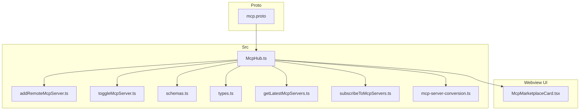
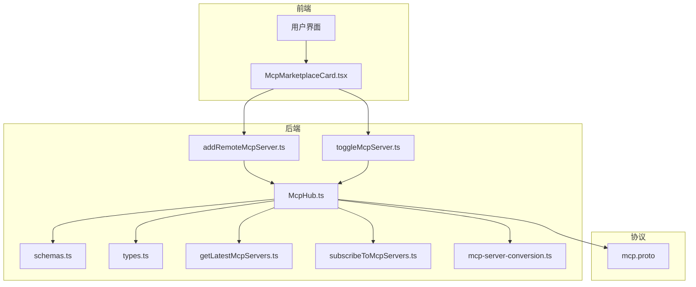
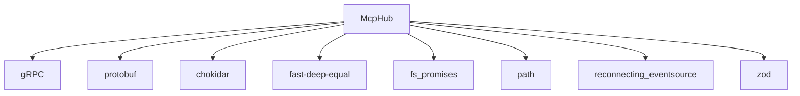

# 能力扩展

<cite>
**本文档中引用的文件**  
- [mcp.proto](file://proto/cline/mcp.proto)
- [McpHub.ts](file://src/services/mcp/McpHub.ts)
- [addRemoteMcpServer.ts](file://src/core/controller/mcp/addRemoteMcpServer.ts)
- [toggleMcpServer.ts](file://src/core/controller/mcp/toggleMcpServer.ts)
- [schemas.ts](file://src/services/mcp/schemas.ts)
- [types.ts](file://src/services/mcp/types.ts)
- [getLatestMcpServers.ts](file://src/core/controller/mcp/getLatestMcpServers.ts)
- [subscribeToMcpServers.ts](file://src/core/controller/mcp/subscribeToMcpServers.ts)
- [mcp-server-conversion.ts](file://src/shared/proto-conversions/mcp/mcp-server-conversion.ts)
- [loadMcpDocumentation.ts](file://src/core/prompts/loadMcpDocumentation.ts)
- [AccessMcpResourceHandler.ts](file://src/core/task/tools/handlers/AccessMcpResourceHandler.ts)
- [UseMcpToolHandler.ts](file://src/core/task/tools/handlers/UseMcpToolHandler.ts)
</cite>

## 目录
1. [简介](#简介)
2. [项目结构](#项目结构)
3. [核心组件](#核心组件)
4. [架构概述](#架构概述)
5. [详细组件分析](#详细组件分析)
6. [依赖分析](#依赖分析)
7. [性能考虑](#性能考虑)
8. [故障排除指南](#故障排除指南)
9. [结论](#结论)

## 简介
Cline 的能力扩展机制基于模型上下文协议（Model Context Protocol, MCP），该机制允许系统与外部数据源和工具进行交互，从而增强其功能。通过 MCP，Cline 可以访问数据库、API 和其他外部服务，实现更复杂的开发任务。本文档将全面介绍 MCP 的通信机制、数据结构以及如何在 Cline 中管理和使用 MCP 服务器。

## 项目结构
Cline 项目的结构清晰地组织了各个模块和组件，确保了代码的可维护性和扩展性。主要目录包括 `proto`、`src`、`webview-ui` 等，其中 `proto` 目录包含了协议文件，`src` 目录包含了核心逻辑和服务，`webview-ui` 目录包含了用户界面相关的代码。



**图示来源**
- [mcp.proto](file://proto/cline/mcp.proto)
- [McpHub.ts](file://src/services/mcp/McpHub.ts)
- [addRemoteMcpServer.ts](file://src/core/controller/mcp/addRemoteMcpServer.ts)
- [toggleMcpServer.ts](file://src/core/controller/mcp/toggleMcpServer.ts)
- [schemas.ts](file://src/services/mcp/schemas.ts)
- [types.ts](file://src/services/mcp/types.ts)
- [getLatestMcpServers.ts](file://src/core/controller/mcp/getLatestMcpServers.ts)
- [subscribeToMcpServers.ts](file://src/core/controller/mcp/subscribeToMcpServers.ts)
- [mcp-server-conversion.ts](file://src/shared/proto-conversions/mcp/mcp-server-conversion.ts)
- [McpMarketplaceCard.tsx](file://webview-ui/src/components/mcp/configuration/tabs/marketplace/McpMarketplaceCard.tsx)

## 核心组件
### MCP 协议 (mcp.proto)
MCP 协议定义了 Cline 与 MCP 服务器之间的通信接口。协议文件 `mcp.proto` 包含了多个 RPC 方法，用于管理 MCP 服务器的连接、配置和状态。

**协议方法**
- `toggleMcpServer`: 切换 MCP 服务器的启用/禁用状态。
- `updateMcpTimeout`: 更新 MCP 服务器的超时时间。
- `addRemoteMcpServer`: 添加远程 MCP 服务器。
- `downloadMcp`: 下载 MCP 服务器。
- `restartMcpServer`: 重启 MCP 服务器。
- `deleteMcpServer`: 删除 MCP 服务器。
- `toggleToolAutoApprove`: 切换工具的自动批准状态。
- `refreshMcpMarketplace`: 刷新 MCP 市场目录。
- `openMcpSettings`: 打开 MCP 设置。
- `subscribeToMcpMarketplaceCatalog`: 订阅 MCP 市场目录更新。
- `getLatestMcpServers`: 获取最新的 MCP 服务器列表。
- `subscribeToMcpServers`: 订阅 MCP 服务器更新。

**数据结构**
- `ToggleMcpServerRequest`: 包含元数据、服务器名称和禁用状态。
- `UpdateMcpTimeoutRequest`: 包含元数据、服务器名称和超时时间。
- `AddRemoteMcpServerRequest`: 包含元数据、服务器名称和服务器 URL。
- `ToggleToolAutoApproveRequest`: 包含元数据、服务器名称、工具名称列表和自动批准状态。
- `McpTool`: 包含工具名称、描述、输入模式和自动批准状态。
- `McpResource`: 包含资源 URI、名称、MIME 类型和描述。
- `McpResourceTemplate`: 包含资源模板 URI、名称、MIME 类型和描述。
- `McpServerStatus`: 枚举类型，表示服务器状态（断开连接、已连接、连接中）。
- `McpServer`: 包含服务器名称、配置、状态、错误信息、工具列表、资源列表、资源模板列表、禁用状态和超时时间。
- `McpServers`: 包含多个 `McpServer` 对象的列表。
- `McpMarketplaceItem`: 包含市场项目 ID、GitHub URL、名称、作者、描述、图标、徽标 URL、类别、标签、是否需要 API 密钥、README 内容、LLM 安装内容、是否推荐、GitHub 星标数、下载次数、创建时间、更新时间和最后同步时间。
- `McpMarketplaceCatalog`: 包含多个 `McpMarketplaceItem` 对象的列表。
- `McpDownloadResponse`: 包含 MCP 项目 ID、GitHub URL、名称、作者、描述、README 内容、LLM 安装内容、是否需要 API 密钥和错误信息。

**协议文件来源**
- [mcp.proto](file://proto/cline/mcp.proto)

### McpHub (McpHub.ts)
`McpHub` 是 MCP 服务器的中心枢纽，负责管理 MCP 服务器的发现、连接和调用。它通过读取和验证 MCP 设置文件来初始化服务器连接，并提供了一系列方法来管理服务器的状态。

**主要功能**
- **初始化**: 读取 MCP 设置文件并初始化服务器连接。
- **连接管理**: 连接到 MCP 服务器，处理连接错误和关闭事件。
- **状态管理**: 更新服务器状态，发送状态更新通知。
- **工具和资源管理**: 获取服务器的工具列表、资源列表和资源模板列表。
- **通知管理**: 处理来自 MCP 服务器的实时消息通知。

**类图**
```mermaid
classDiagram
class McpHub {
+getMcpServersPath : () => Promise<string>
+getSettingsDirectoryPath : () => Promise<string>
+clientVersion : string
+telemetryService : TelemetryService
+settingsWatcher : FSWatcher
+fileWatchers : Map<string, FSWatcher>
+connections : McpConnection[]
+isConnecting : boolean
+pendingNotifications : Array<{serverName : string, level : string, message : string, timestamp : number}>
+notificationCallback : (serverName : string, level : string, message : string) => void
+getServers() : McpServer[]
+getMcpSettingsFilePath() : Promise<string>
+readAndValidateMcpSettingsFile() : Promise<z.infer<typeof McpSettingsSchema> | undefined>
+watchMcpSettingsFile() : Promise<void>
+initializeMcpServers() : Promise<void>
+findConnection(name : string, source : "rpc" | "internal") : McpConnection | undefined
+connectToServer(name : string, config : z.infer<typeof ServerConfigSchema>, source : "rpc" | "internal") : Promise<void>
+appendErrorMessage(connection : McpConnection, error : string) : void
+fetchToolsList(serverName : string) : Promise<McpTool[]>
+fetchResourcesList(serverName : string) : Promise<McpResource[]>
+fetchResourceTemplatesList(serverName : string) : Promise<McpResourceTemplate[]>
+deleteConnection(name : string) : Promise<void>
+updateServerConnectionsRPC(newServers : Record<string, McpServerConfig>) : Promise<void>
+updateServerConnections(newServers : Record<string, McpServerConfig>) : Promise<void>
+setupFileWatcher(name : string, config : Extract<McpServerConfig, { type : "stdio" }>) : void
+removeAllFileWatchers() : void
+restartConnectionRPC(serverName : string) : Promise<McpServer[]>
+restartConnection(serverName : string) : Promise<void>
+getSortedMcpServers(serverOrder : string[]) : McpServer[]
+notifyWebviewOfServerChanges() : Promise<void>
+sendLatestMcpServers() : Promise<void>
+getLatestMcpServersRPC() : Promise<McpServer[]>
+toggleServerDisabledRPC(serverName : string, disabled : boolean) : Promise<McpServer[]>
+readResource(serverName : string, uri : string) : Promise<McpResourceResponse>
}
class McpConnection {
+server : McpServer
+client : Client
+transport : Transport
}
class McpServer {
+name : string
+config : string
+status : McpServerStatus
+error : string
+tools : McpTool[]
+resources : McpResource[]
+resourceTemplates : McpResourceTemplate[]
+disabled : boolean
+timeout : number
}
class McpTool {
+name : string
+description : string
+inputSchema : string
+autoApprove : boolean
}
class McpResource {
+uri : string
+name : string
+mimeType : string
+description : string
}
class McpResourceTemplate {
+uriTemplate : string
+name : string
+mimeType : string
+description : string
}
class McpServerStatus {
+MCP_SERVER_STATUS_DISCONNECTED : 0
+MCP_SERVER_STATUS_CONNECTED : 1
+MCP_SERVER_STATUS_CONNECTING : 2
}
McpHub --> McpConnection : "管理"
McpConnection --> McpServer : "包含"
McpServer --> McpTool : "包含"
McpServer --> McpResource : "包含"
McpServer --> McpResourceTemplate : "包含"
McpServer --> McpServerStatus : "状态"
```

**图示来源**
- [McpHub.ts](file://src/services/mcp/McpHub.ts)

### 控制器方法
#### addRemoteMcpServer (addRemoteMcpServer.ts)
`addRemoteMcpServer` 方法用于通过 gRPC 添加新的远程 MCP 服务器。它接收服务器名称和 URL 作为参数，并调用 `McpHub` 的方法来添加服务器。

**方法签名**
```typescript
export async function addRemoteMcpServer(controller: Controller, request: AddRemoteMcpServerRequest): Promise<McpServers>
```

**参数**
- `controller`: 控制器实例。
- `request`: 包含服务器名称和 URL 的请求对象。

**返回值**
- `McpServers`: 包含所有 MCP 服务器的响应对象。

**方法来源**
- [addRemoteMcpServer.ts](file://src/core/controller/mcp/addRemoteMcpServer.ts)

#### toggleMcpServer (toggleMcpServer.ts)
`toggleMcpServer` 方法用于切换 MCP 服务器的启用/禁用状态。它接收服务器名称和禁用状态作为参数，并调用 `McpHub` 的方法来更新服务器状态。

**方法签名**
```typescript
export async function toggleMcpServer(controller: Controller, request: ToggleMcpServerRequest): Promise<McpServers>
```

**参数**
- `controller`: 控制器实例。
- `request`: 包含服务器名称和禁用状态的请求对象。

**返回值**
- `McpServers`: 包含所有 MCP 服务器的响应对象。

**方法来源**
- [toggleMcpServer.ts](file://src/core/controller/mcp/toggleMcpServer.ts)

## 架构概述
Cline 的 MCP 机制通过 `McpHub` 作为中心枢纽，管理 MCP 服务器的发现、连接和调用。`McpHub` 通过读取和验证 MCP 设置文件来初始化服务器连接，并提供了一系列方法来管理服务器的状态。控制器方法如 `addRemoteMcpServer` 和 `toggleMcpServer` 通过 gRPC 调用 `McpHub` 的方法来实现 MCP 服务器的动态管理。



**图示来源**
- [McpMarketplaceCard.tsx](file://webview-ui/src/components/mcp/configuration/tabs/marketplace/McpMarketplaceCard.tsx)
- [addRemoteMcpServer.ts](file://src/core/controller/mcp/addRemoteMcpServer.ts)
- [toggleMcpServer.ts](file://src/core/controller/mcp/toggleMcpServer.ts)
- [McpHub.ts](file://src/services/mcp/McpHub.ts)
- [mcp.proto](file://proto/cline/mcp.proto)
- [schemas.ts](file://src/services/mcp/schemas.ts)
- [types.ts](file://src/services/mcp/types.ts)
- [getLatestMcpServers.ts](file://src/core/controller/mcp/getLatestMcpServers.ts)
- [subscribeToMcpServers.ts](file://src/core/controller/mcp/subscribeToMcpServers.ts)
- [mcp-server-conversion.ts](file://src/shared/proto-conversions/mcp/mcp-server-conversion.ts)

## 详细组件分析
### McpHub 详细分析
`McpHub` 是 MCP 服务器的核心管理组件，负责处理所有与 MCP 服务器相关的操作。以下是 `McpHub` 的详细分析。

#### 初始化
`McpHub` 在构造函数中初始化，读取 MCP 设置文件并启动服务器连接。

**初始化流程**
1. 读取 MCP 设置文件路径。
2. 验证 MCP 设置文件格式。
3. 初始化服务器连接。

**代码片段**
```typescript
constructor(
    getMcpServersPath: () => Promise<string>,
    getSettingsDirectoryPath: () => Promise<string>,
    clientVersion: string,
    telemetryService: TelemetryService,
) {
    this.getMcpServersPath = getMcpServersPath
    this.getSettingsDirectoryPath = getSettingsDirectoryPath
    this.clientVersion = clientVersion
    this.telemetryService = telemetryService
    this.watchMcpSettingsFile()
    this.initializeMcpServers()
}
```

**初始化来源**
- [McpHub.ts](file://src/services/mcp/McpHub.ts#L31-L43)

#### 连接管理
`McpHub` 通过 `connectToServer` 方法连接到 MCP 服务器。该方法根据服务器配置选择适当的传输类型（stdio、sse、streamableHttp）并建立连接。

**连接流程**
1. 检查现有连接，如果存在则删除。
2. 根据配置创建客户端和传输。
3. 启动传输并连接客户端。
4. 注册错误和关闭事件处理器。
5. 获取服务器的工具、资源和资源模板列表。

**代码片段**
```typescript
private async connectToServer(
    name: string,
    config: z.infer<typeof ServerConfigSchema>,
    source: "rpc" | "internal",
): Promise<void> {
    // Remove existing connection if it exists
    this.connections = this.connections.filter((conn) => conn.server.name !== name)

    if (config.disabled) {
        // Create a connection object for disabled server
        const disabledConnection: McpConnection = {
            server: {
                name,
                config: JSON.stringify(config),
                status: "disconnected",
                disabled: true,
            },
            client: null as unknown as Client,
            transport: null as unknown as Transport,
        }
        this.connections.push(disabledConnection)
        return
    }

    try {
        const client = new Client(
            {
                name: "Cline",
                version: this.clientVersion,
            },
            {
                capabilities: {},
            },
        )

        let transport: StdioClientTransport | SSEClientTransport | StreamableHTTPClientTransport

        switch (config.type) {
            case "stdio": {
                transport = new StdioClientTransport({
                    command: config.command,
                    args: config.args,
                    cwd: config.cwd,
                    env: {
                        ...getDefaultEnvironment(),
                        ...(config.env || {}),
                    },
                    stderr: "pipe",
                })

                transport.onerror = async (error) => {
                    console.error(`Transport error for "${name}":`, error)
                    const connection = this.findConnection(name, source)
                    if (connection) {
                        connection.server.status = "disconnected"
                        this.appendErrorMessage(connection, error instanceof Error ? error.message : `${error}`)
                    }
                    await this.notifyWebviewOfServerChanges()
                }

                transport.onclose = async () => {
                    const connection = this.findConnection(name, source)
                    if (connection) {
                        connection.server.status = "disconnected"
                    }
                    await this.notifyWebviewOfServerChanges()
                }

                await transport.start()
                const stderrStream = transport.stderr
                if (stderrStream) {
                    stderrStream.on("data", async (data: Buffer) => {
                        const output = data.toString()
                        const isInfoLog = !/\berror\b/i.test(output)

                        if (isInfoLog) {
                            console.log(`Server "${name}" info:`, output)
                        } else {
                            console.error(`Server "${name}" stderr:`, output)
                            const connection = this.findConnection(name, source)
                            if (connection) {
                                this.appendErrorMessage(connection, output)
                                if (connection.server.status === "disconnected") {
                                    await this.notifyWebviewOfServerChanges()
                                }
                            }
                        }
                    })
                } else {
                    console.error(`No stderr stream for ${name}`)
                }
                transport.start = async () => {}
                break
            }
            case "sse": {
                const sseOptions = {
                    requestInit: {
                        headers: config.headers,
                    },
                }
                const reconnectingEventSourceOptions = {
                    max_retry_time: 5000,
                    withCredentials: !!config.headers?.["Authorization"],
                }
                global.EventSource = ReconnectingEventSource
                transport = new SSEClientTransport(new URL(config.url), {
                    ...sseOptions,
                    eventSourceInit: reconnectingEventSourceOptions,
                })

                transport.onerror = async (error) => {
                    console.error(`Transport error for "${name}":`, error)
                    const connection = this.findConnection(name, source)
                    if (connection) {
                        connection.server.status = "disconnected"
                        this.appendErrorMessage(connection, error instanceof Error ? error.message : `${error}`)
                    }
                    await this.notifyWebviewOfServerChanges()
                }
                break
            }
            case "streamableHttp": {
                transport = new StreamableHTTPClientTransport(new URL(config.url), {
                    requestInit: {
                        headers: config.headers,
                    },
                })
                transport.onerror = async (error) => {
                    console.error(`Transport error for "${name}":`, error)
                    const connection = this.findConnection(name, source)
                    if (connection) {
                        connection.server.status = "disconnected"
                        this.appendErrorMessage(connection, error instanceof Error ? error.message : `${error}`)
                    }
                    await this.notifyWebviewOfServerChanges()
                }
                break
            }
            default:
                throw new Error(`Unknown transport type: ${(config as any).type}`)
        }

        const connection: McpConnection = {
            server: {
                name,
                config: JSON.stringify(config),
                status: "connecting",
                disabled: config.disabled,
            },
            client,
            transport,
        }
        this.connections.push(connection)

        // Connect
        await client.connect(transport)

        connection.server.status = "connected"
        connection.server.error = ""

        // Register notification handler for real-time messages
        try {
            const { z } = await import("zod")

            const NotificationMessageSchema = z.object({
                method: z.literal("notifications/message"),
                params: z
                    .object({
                        level: z.enum(["debug", "info", "warning", "error"]).optional(),
                        logger: z.string().optional(),
                        data: z.string().optional(),
                        message: z.string().optional(),
                    })
                    .optional(),
            })

            connection.client.setNotificationHandler(NotificationMessageSchema as any, async (notification: any) => {
                const params = notification.params || {}
                const level = params.level || "info"
                const data = params.data || params.message || ""
                const logger = params.logger || ""

                const message = logger ? `[${logger}] ${data}` : data

                if (this.notificationCallback) {
                    this.notificationCallback(name, level, message)
                } else {
                    this.pendingNotifications.push({
                        serverName: name,
                        level,
                        message,
                        timestamp: Date.now(),
                    })
                }
            })

            connection.client.fallbackNotificationHandler = async (notification: any) => {
                HostProvider.window.showMessage({
                    type: ShowMessageType.INFORMATION,
                    message: `MCP ${name}: ${notification.method || "unknown"} - ${JSON.stringify(notification.params || {})}`,
                })
            }
        } catch (error) {
            console.error(`[MCP Debug] Error setting notification handlers for ${name}:`, error)
        }

        // Initial fetch of tools and resources
        connection.server.tools = await this.fetchToolsList(name)
        connection.server.resources = await this.fetchResourcesList(name)
        connection.server.resourceTemplates = await this.fetchResourceTemplatesList(name)
    } catch (error) {
        const connection = this.findConnection(name, source)
        if (connection) {
            connection.server.status = "disconnected"
            this.appendErrorMessage(connection, error instanceof Error ? error.message : String(error))
        }
        throw error
    }
}
```

**连接管理来源**
- [McpHub.ts](file://src/services/mcp/McpHub.ts#L100-L300)

#### 状态管理
`McpHub` 通过 `notifyWebviewOfServerChanges` 方法发送服务器状态更新通知。该方法将当前服务器状态转换为协议格式并发送给前端。

**状态管理流程**
1. 读取 MCP 设置文件路径。
2. 读取设置文件内容。
3. 解析设置文件内容。
4. 获取排序后的服务器列表。
5. 将服务器列表转换为协议格式。
6. 发送状态更新通知。

**代码片段**
```typescript
private async notifyWebviewOfServerChanges(): Promise<void> {
    const settingsPath = await this.getMcpSettingsFilePath()
    const content = await fs.readFile(settingsPath, "utf-8")
    const config = JSON.parse(content)
    const serverOrder = Object.keys(config.mcpServers || {})

    const sortedServers = this.getSortedMcpServers(serverOrder)

    await sendMcpServersUpdate({
        mcpServers: convertMcpServersToProtoMcpServers(sortedServers),
    })
}
```

**状态管理来源**
- [McpHub.ts](file://src/services/mcp/McpHub.ts#L700-L720)

#### 工具和资源管理
`McpHub` 通过 `fetchToolsList`、`fetchResourcesList` 和 `fetchResourceTemplatesList` 方法获取服务器的工具、资源和资源模板列表。

**工具管理流程**
1. 查找服务器连接。
2. 发送 `tools/list` 请求。
3. 解析响应并返回工具列表。

**代码片段**
```typescript
private async fetchToolsList(serverName: string): Promise<McpTool[]> {
    try {
        const connection = this.connections.find((conn) => conn.server.name === serverName)

        if (!connection) {
            throw new Error(`No connection found for server: ${serverName}`)
        }

        if (connection.server.disabled || !connection.client) {
            return []
        }

        const response = await connection.client.request({ method: "tools/list" }, ListToolsResultSchema, {
            timeout: DEFAULT_REQUEST_TIMEOUT_MS,
        })

        const settingsPath = await this.getMcpSettingsFilePath()
        const content = await fs.readFile(settingsPath, "utf-8")
        const config = JSON.parse(content)
        const autoApproveConfig = config.mcpServers[serverName]?.autoApprove || []

        const tools = (response?.tools || []).map((tool) => ({
            ...tool,
            autoApprove: autoApproveConfig.includes(tool.name),
        }))

        return tools
    } catch (error) {
        console.error(`Failed to fetch tools for ${serverName}:`, error)
        return []
    }
}
```

**工具管理来源**
- [McpHub.ts](file://src/services/mcp/McpHub.ts#L300-L350)

**资源管理流程**
1. 查找服务器连接。
2. 发送 `resources/list` 请求。
3. 解析响应并返回资源列表。

**代码片段**
```typescript
private async fetchResourcesList(serverName: string): Promise<McpResource[]> {
    try {
        const connection = this.connections.find((conn) => conn.server.name === serverName)

        if (!connection || connection.server.disabled || !connection.client) {
            return []
        }

        const response = await connection.client.request({ method: "resources/list" }, ListResourcesResultSchema, {
            timeout: DEFAULT_REQUEST_TIMEOUT_MS,
        })
        return response?.resources || []
    } catch (_error) {
        return []
    }
}
```

**资源管理来源**
- [McpHub.ts](file://src/services/mcp/McpHub.ts#L350-L380)

**资源模板管理流程**
1. 查找服务器连接。
2. 发送 `resources/templates/list` 请求。
3. 解析响应并返回资源模板列表。

**代码片段**
```typescript
private async fetchResourceTemplatesList(serverName: string): Promise<McpResourceTemplate[]> {
    try {
        const connection = this.connections.find((conn) => conn.server.name === serverName)

        if (!connection || connection.server.disabled || !connection.client) {
            return []
        }

        const response = await connection.client.request(
            { method: "resources/templates/list" },
            ListResourceTemplatesResultSchema,
            {
                timeout: DEFAULT_REQUEST_TIMEOUT_MS,
            },
        )

        return response?.resourceTemplates || []
    } catch (_error) {
        return []
    }
}
```

**资源模板管理来源**
- [McpHub.ts](file://src/services/mcp/McpHub.ts#L380-L410)

### 控制器方法详细分析
#### addRemoteMcpServer 详细分析
`addRemoteMcpServer` 方法用于通过 gRPC 添加新的远程 MCP 服务器。该方法接收服务器名称和 URL 作为参数，并调用 `McpHub` 的方法来添加服务器。

**方法流程**
1. 验证请求参数。
2. 调用 `McpHub` 的 `addRemoteServer` 方法。
3. 将结果转换为协议格式。
4. 返回响应。

**代码片段**
```typescript
export async function addRemoteMcpServer(controller: Controller, request: AddRemoteMcpServerRequest): Promise<McpServers> {
    try {
        if (!request.serverName) {
            throw new Error("Server name is required")
        }
        if (!request.serverUrl) {
            throw new Error("Server URL is required")
        }

        const servers = await controller.mcpHub?.addRemoteServer(request.serverName, request.serverUrl)

        const protoServers = convertMcpServersToProtoMcpServers(servers)

        return McpServers.create({ mcpServers: protoServers })
    } catch (error) {
        console.error(`Failed to add remote MCP server ${request.serverName}:`, error)

        throw error
    }
}
```

**方法来源**
- [addRemoteMcpServer.ts](file://src/core/controller/mcp/addRemoteMcpServer.ts#L0-L33)

#### toggleMcpServer 详细分析
`toggleMcpServer` 方法用于切换 MCP 服务器的启用/禁用状态。该方法接收服务器名称和禁用状态作为参数，并调用 `McpHub` 的方法来更新服务器状态。

**方法流程**
1. 验证请求参数。
2. 调用 `McpHub` 的 `toggleServerDisabledRPC` 方法。
3. 将结果转换为协议格式。
4. 返回响应。

**代码片段**
```typescript
export async function toggleMcpServer(controller: Controller, request: ToggleMcpServerRequest): Promise<McpServers> {
    try {
        const mcpServers = await controller.mcpHub?.toggleServerDisabledRPC(request.serverName, request.disabled)

        const protoServers = convertMcpServersToProtoMcpServers(mcpServers)

        return McpServers.create({ mcpServers: protoServers })
    } catch (error) {
        console.error(`Failed to toggle MCP server ${request.serverName}:`, error)
        throw error
    }
}
```

**方法来源**
- [toggleMcpServer.ts](file://src/core/controller/mcp/toggleMcpServer.ts#L0-L24)

## 依赖分析
Cline 的 MCP 机制依赖于多个组件和库，确保了系统的稳定性和扩展性。

**主要依赖**
- **gRPC**: 用于实现 RPC 通信。
- **protobuf**: 用于定义和解析协议文件。
- **chokidar**: 用于文件系统监控。
- **fast-deep-equal**: 用于深度比较对象。
- **fs/promises**: 用于文件系统操作。
- **path**: 用于路径操作。
- **reconnecting-eventsource**: 用于 SSE 连接。
- **zod**: 用于数据验证。

**依赖图**


**图示来源**
- [McpHub.ts](file://src/services/mcp/McpHub.ts)

## 性能考虑
Cline 的 MCP 机制在设计时考虑了性能优化，确保了系统的高效运行。

**性能优化措施**
- **异步操作**: 所有文件系统和网络操作都使用异步方法，避免阻塞主线程。
- **缓存**: 服务器状态和工具列表等数据在内存中缓存，减少重复请求。
- **连接复用**: 使用连接池和复用机制，减少连接建立和关闭的开销。
- **错误处理**: 异常处理机制确保了系统的稳定性，避免因单个错误导致整个系统崩溃。

**性能来源**
- [McpHub.ts](file://src/services/mcp/McpHub.ts)

## 故障排除指南
### 常见问题
1. **无法连接到 MCP 服务器**
   - 检查服务器配置是否正确。
   - 确认服务器是否正在运行。
   - 检查网络连接是否正常。

2. **工具或资源列表为空**
   - 确认服务器是否支持 `tools/list` 和 `resources/list` 方法。
   - 检查服务器日志，查看是否有错误信息。

3. **状态更新不及时**
   - 确认 `notifyWebviewOfServerChanges` 方法是否被正确调用。
   - 检查 gRPC 通信是否正常。

### 调试工具
- **日志**: 查看 `McpHub` 和服务器的日志，定位问题。
- **调试器**: 使用调试器逐步执行代码，检查变量值。
- **网络监控**: 使用网络监控工具，检查 gRPC 请求和响应。

**故障排除来源**
- [McpHub.ts](file://src/services/mcp/McpHub.ts)
- [addRemoteMcpServer.ts](file://src/core/controller/mcp/addRemoteMcpServer.ts)
- [toggleMcpServer.ts](file://src/core/controller/mcp/toggleMcpServer.ts)

## 结论
Cline 的能力扩展机制通过 MCP 协议实现了与外部数据源和工具的交互，极大地增强了系统的功能。`McpHub` 作为中心枢纽，管理 MCP 服务器的发现、连接和调用，确保了系统的稳定性和扩展性。控制器方法如 `addRemoteMcpServer` 和 `toggleMcpServer` 提供了灵活的服务器管理功能。通过详细的文档和示例，开发者可以轻松地创建和管理自定义的 MCP 工具，进一步提升 Cline 的能力。