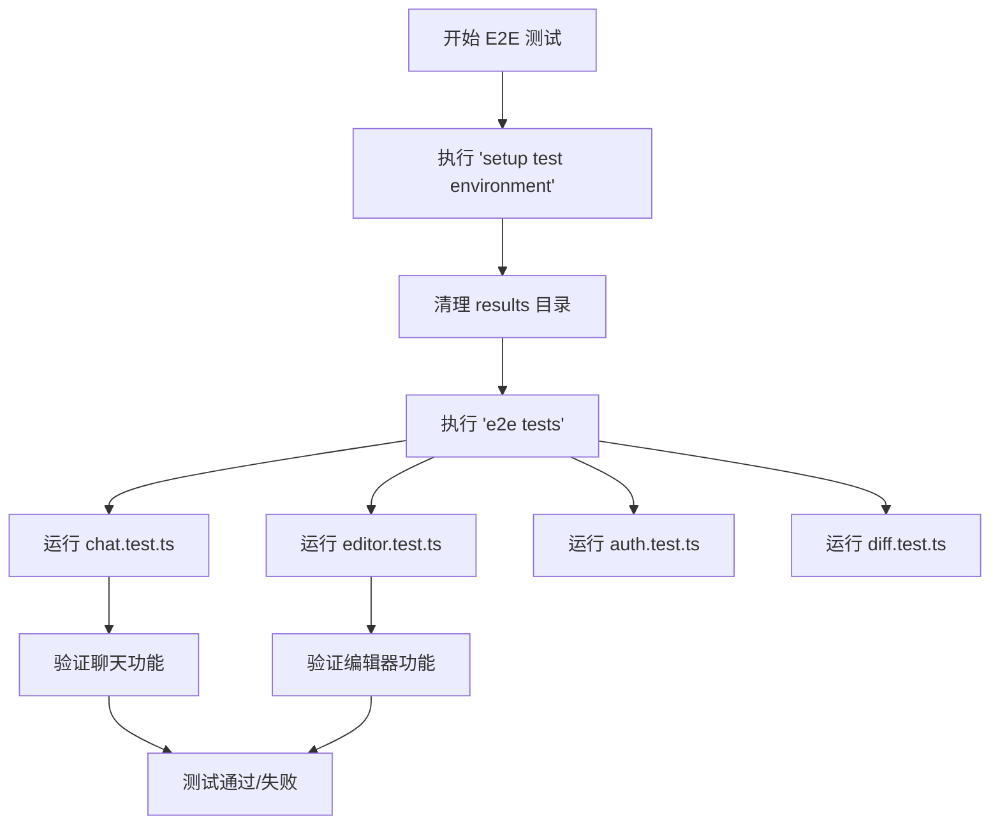
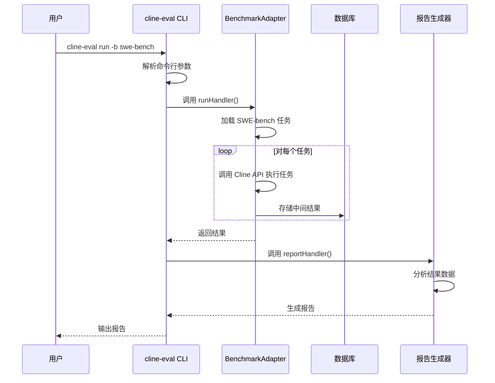

# 测试与评估

<cite>
**本文档中引用的文件**  
- [playwright.config.ts](file://playwright.config.ts)
- [src/test/e2e/chat.test.ts](file://src/test/e2e/chat.test.ts)
- [src/test/e2e/editor.test.ts](file://src/test/e2e/editor.test.ts)
- [src/test/e2e/utils/global.setup.ts](file://src/test/e2e/utils/global.setup.ts)
- [evals/cli/src/index.ts](file://evals/cli/src/index.ts)
- [evals/cli/src/commands/setup.ts](file://evals/cli/src/commands/setup.ts)
- [testing-platform/index.ts](file://testing-platform/index.ts)
- [src/test/e2e/README.md](file://src/test/e2e/README.md) - *新增E2E测试文档*
- [testing-platform/harness/config.ts](file://testing-platform/harness/config.ts) - *新增非确定性字段配置*
- [scripts/testing-platform-orchestrator.ts](file://scripts/testing-platform-orchestrator.ts) - *测试平台编排器增强*
</cite>

## 目录
1. [简介](#简介)
2. [单元测试与集成测试](#单元测试与集成测试)
3. [端到端（E2E）测试框架](#端到端e2e测试框架)
4. [评估工具与基准测试](#评估工具与基准测试)
5. [测试平台](#测试平台)
6. [完整测试流程指南](#完整测试流程指南)
7. [结论](#结论)

## 简介
本文档旨在全面介绍 Cline 项目的测试与评估体系。涵盖从单元测试、集成测试到端到端测试的完整流程，并深入解析其评估工具、CLI 命令行接口以及为复杂测试场景设计的测试平台。目标是为开发者和测试人员提供一套完整的实践指南，以确保 Cline 核心功能的稳定性、可靠性和高性能。

## 单元测试与集成测试
Cline 项目采用 Jest 作为主要的测试框架，用于执行单元测试和集成测试。测试文件通常位于 `src/test/` 目录下，特别是 `src/test/e2e/` 中的测试用例使用 Playwright 进行端到端的集成测试。

对于 `src/core` 目录中的控制器、任务和工具执行器，测试实践遵循以下原则：
- **控制器测试**：通过模拟 gRPC 请求和响应，验证控制器逻辑的正确性。例如，`accountLoginClicked` 控制器会测试其在用户点击登录按钮时是否能正确触发认证流程。
- **任务测试**：测试 `TaskState` 和 `ToolExecutor` 等核心类，确保任务的创建、执行、取消和状态管理功能正常。测试用例会模拟不同的任务输入和工具调用场景。
- **工具执行器测试**：对 `ToolExecutorCoordinator` 和 `ToolValidator` 进行测试，确保工具调用的安全性、有效性和自动批准逻辑的正确性。

虽然具体的单元测试文件（如 `__tests__` 目录下的文件）未在上下文中提供，但整体测试策略是通过模拟依赖项（如 API 提供者、文件系统）来隔离测试目标组件。

**Section sources**
- [src/test/e2e/chat.test.ts](file://src/test/e2e/chat.test.ts#L1-L130)
- [src/test/e2e/editor.test.ts](file://src/test/e2e/editor.test.ts#L1-L44)

## 端到端（E2E）测试框架
Cline 的端到端测试框架基于 Playwright 构建，用于在真实的 VS Code 环境中模拟用户交互，验证整个应用的工作流。

### `playwright.config.ts` 配置
该配置文件定义了 E2E 测试的全局设置：
- **测试目录**：`testDir` 指定为 `src/test/e2e`，所有 E2E 测试用例都存放于此。
- **测试匹配**：`testMatch` 使用正则表达式 `/.*\.test\.ts/` 来识别测试文件。
- **超时设置**：根据是否在 CI（持续集成）环境或 Windows 平台运行，动态调整 `timeout` 和 `expect.timeout`，以适应不同环境的性能差异。
- **并行执行**：`fullyParallel: true` 允许测试用例并行运行，提高测试效率。
- **视频录制**：`use.video: "retain-on-failure"` 配置在测试失败时保留视频录制，便于调试。
- **测试项目**：定义了两个项目：
  - `setup test environment`：负责运行 `global.setup.ts`，在测试前清理结果目录。
  - `e2e tests`：实际的 E2E 测试套件，依赖于 `setup test environment` 项目，确保测试环境的干净。



**Diagram sources**
- [playwright.config.ts](file://playwright.config.ts#L1-L31)
- [src/test/e2e/utils/global.setup.ts](file://src/test/e2e/utils/global.setup.ts#L1-L26)

**Section sources**
- [playwright.config.ts](file://playwright.config.ts#L1-L31)
- [src/test/e2e/utils/global.setup.ts](file://src/test/e2e/utils/global.setup.ts#L1-L26)
- [src/test/e2e/README.md](file://src/test/e2e/README.md#L1-L261) - *新增E2E测试文档*

### E2E 测试结构与执行
根据新增的 `src/test/e2e/README.md` 文档，E2E 测试套件包含以下关键组件：

#### 测试文件
- **`auth.test.ts`** - 测试 API 密钥设置、提供商选择和设置导航
- **`chat.test.ts`** - 测试聊天功能，包括消息发送、模式切换（计划/执行）、斜杠命令和 @ 提及
- **`diff.test.ts`** - 测试文件修改的差异编辑器功能
- **`editor.test.ts`** - 测试代码操作、编辑器面板集成和代码选择功能

#### 测试基础设施
- **`utils/helpers.ts`** - 核心测试工具和固定装置，包括：
  - `e2e` - 单根工作区测试的主测试固定装置
  - `e2eMultiRoot` - 多根工作区测试的测试固定装置
  - `E2ETestHelper` - 包含 VS Code 交互实用程序的辅助类
- **`utils/common.ts`** - UI 交互的通用实用函数
- **`utils/global.setup.ts`** - 全局测试设置和清理
- **`utils/build.mjs`** - 测试环境准备的构建脚本

#### 测试固定装置
- **`fixtures/workspace/`** - 单根工作区测试文件（HTML、TypeScript等）
- **`fixtures/workspace_2/`** - 包含 Python 提供商文件的附加工作区
- **`fixtures/multiroots.code-workspace`** - 多根工作区配置
- **`fixtures/server/`** - 用于测试 Cline 后端交互的模拟 API 服务器

#### 测试执行
要构建测试环境并运行所有 E2E 测试：
```bash
npm run test:e2e
```

要运行所有 E2E 测试而不重新构建测试环境（例如，仅更新了测试文件）：
```bash
npm run e2e
```

#### 调试模式
要在调试模式下运行 E2E 测试并使用 Playwright 的交互式调试器：
```bash
npm run test:e2e -- --debug
```

在调试模式下，Playwright 将：
- 打开一个显示 VS Code 实例的浏览器窗口
- 在每个测试开始时暂停执行
- 允许您逐步执行测试操作
- 提供一个用于检查元素和状态的控制台

## 评估工具与基准测试
`evals/` 目录是 Cline 的核心评估系统，提供了一个强大的 CLI 工具来运行基准测试、分析结果和生成报告。

### CLI 命令
评估 CLI (`cline-eval`) 提供了多个命令：
- **`setup`**：克隆并设置基准测试仓库（如 exercism, swe-bench, swelancer, multi-swe）。它会创建必要的目录结构（`repositories`, `results`）。
- **`run`**：执行评估。可以指定基准测试、模型、任务数量和 API 密钥。
- **`report`**：生成评估报告，支持 JSON 和 Markdown 格式。
- **`evals-env`**：管理 `evals.env` 文件，用于激活测试模式。
- **`run-diff-eval`**：运行专门的 diff 编辑评估套件，支持复杂的参数配置，如模型 ID、系统提示、解析函数等。

### 基准测试执行
以 SWE-bench 为例，执行流程如下：
1.  使用 `cline-eval setup -b swe-bench` 准备 SWE-bench 环境。
2.  使用 `cline-eval run -b swe-bench -m claude-3-opus-20240229 -c 10` 运行 10 个任务。
3.  测试结果会被存储在 `evals/results/runs/` 目录下。
4.  使用 `cline-eval report -f markdown -o ./report.md` 生成 Markdown 报告。

评估工具通过适配器模式（`adapters/` 目录）支持多种基准测试，每种基准测试（如 `swe-bench.ts`）都实现了特定的设置和运行逻辑。



**Diagram sources**
- [evals/cli/src/index.ts](file://evals/cli/src/index.ts#L1-L125)
- [evals/cli/src/commands/setup.ts](file://evals/cli/src/commands/setup.ts#L1-L41)

**Section sources**
- [evals/cli/src/index.ts](file://evals/cli/src/index.ts#L1-L125)
- [evals/cli/src/commands/setup.ts](file://evals/cli/src/commands/setup.ts#L1-L41)

## 测试平台
`testing-platform/` 目录提供了一个更底层的、用于复杂和自动化测试场景的测试平台。它通过 gRPC 与 Cline 核心服务进行交互。

### 核心机制
- **`GrpcAdapter`**：位于 `adapters/grpcAdapter.ts`，是测试平台与 Cline gRPC 服务器通信的桥梁。它封装了 gRPC 调用的细节。
- **`SpecFile`**：测试用例以 JSON 文件的形式定义，包含服务名、方法名、请求参数和预期的响应。
- **`runSpec` 和 `runSpecsFromFolder`**：`index.ts` 中的主函数，负责加载 JSON 规范文件，通过 `GrpcAdapter` 发送请求，并将实际响应与预期响应进行比较。

### 增强的测试平台功能
根据代码变更，测试平台已得到增强以处理非确定性场景：

#### 非确定性字段配置
`testing-platform/harness/config.ts` 文件定义了 `NON_DETERMINISTIC_FIELDS` 数组，列出了在测试断言中应忽略的非确定性字段，例如：
- `stateJson.version`
- `stateJson.distinctId`
- `stateJson.clineMessages.ts`
- `paymentTransactions.paidAt`
- `tasks.id`
- `tasks.ts`

此配置确保测试不会因时间戳、唯一ID等动态值而失败。

#### 测试平台编排器
`scripts/testing-platform-orchestrator.ts` 脚本自动化了针对独立服务器的规范文件运行过程：
- **服务器生命周期管理**：自动启动和停止 gRPC 服务器
- **重复执行**：使用 `--count` 标志重复执行测试
- **日志控制**：使用 `--server-logs` 标志显示服务器日志
- **自动修复**：使用 `--fix` 标志自动更新规范文件中的实际响应
- **环境变量**：支持 `STANDALONE_GRPC_SERVER_PORT` 和 `SERVER_BOOT_DELAY` 进行配置

**Diagram sources**
- [testing-platform/index.ts](file://testing-platform/index.ts#L1-L67)
- [testing-platform/harness/config.ts](file://testing-platform/harness/config.ts#L1-L44) - *新增非确定性字段配置*
- [scripts/testing-platform-orchestrator.ts](file://scripts/testing-platform-orchestrator.ts#L1-L164) - *测试平台编排器增强*

**Section sources**
- [testing-platform/index.ts](file://testing-platform/index.ts#L1-L67)
- [testing-platform/harness/config.ts](file://testing-platform/harness/config.ts#L1-L44)
- [scripts/testing-platform-orchestrator.ts](file://scripts/testing-platform-orchestrator.ts#L1-L164)

## 完整测试流程指南
要为 Cline 项目执行完整的测试与评估，遵循以下步骤：

1.  **设置环境**：
    - 确保 Node.js、Playwright 和 TypeScript 环境已正确安装。
    - 安装项目依赖：`npm install`。

2.  **运行单元/集成测试**：
    - 执行 E2E 测试套件：`npm run test:e2e`。这将根据 `playwright.config.ts` 的配置运行所有测试。

3.  **运行基准评估**：
    - 初始化评估环境：`cd evals/cli && npm install`。
    - 设置基准测试：`npx cline-eval setup -b swe-bench`。
    - 执行评估：`npx cline-eval run -b swe-bench -m <your_model> -c 5`。
    - 生成报告：`npx cline-eval report -f markdown -o ./swe-bench-report.md`。

4.  **使用测试平台**：
    - 启动 Cline 核心服务。
    - 在 `testing-platform/` 目录下编写或准备 JSON 测试规范。
    - 运行测试：`ts-node index.ts ./path/to/specs`。

5.  **解读结果**：
    - E2E 测试结果由 Playwright 报告器输出，失败时可查看视频。
    - 基准测试结果位于 `evals/results/`，可通过报告命令进行分析。
    - 测试平台的结果直接在控制台输出，明确指示成功或失败。

## 结论
Cline 建立了一套多层次、全方位的测试与评估体系。从 Playwright 驱动的 E2E 测试确保用户界面的流畅性，到 `evals/` CLI 提供的标准化基准测试来衡量 AI 模型能力，再到 `testing-platform/` 提供的底层 gRPC 测试能力以支持复杂的自动化场景。这套体系共同保障了 Cline 作为一个强大、可靠的开发辅助工具的质量和性能。开发者应充分利用这些工具，持续进行测试和评估，以推动项目的稳定发展。