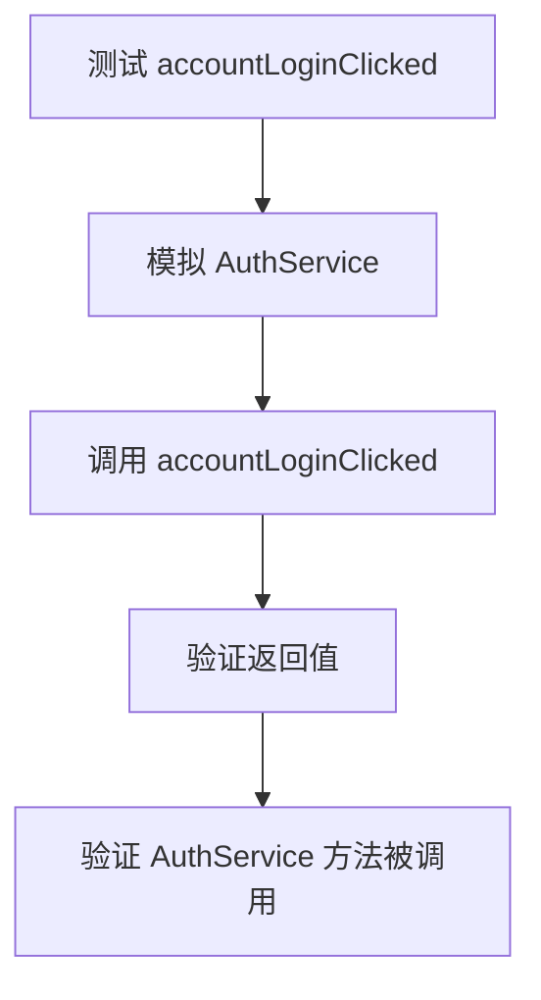
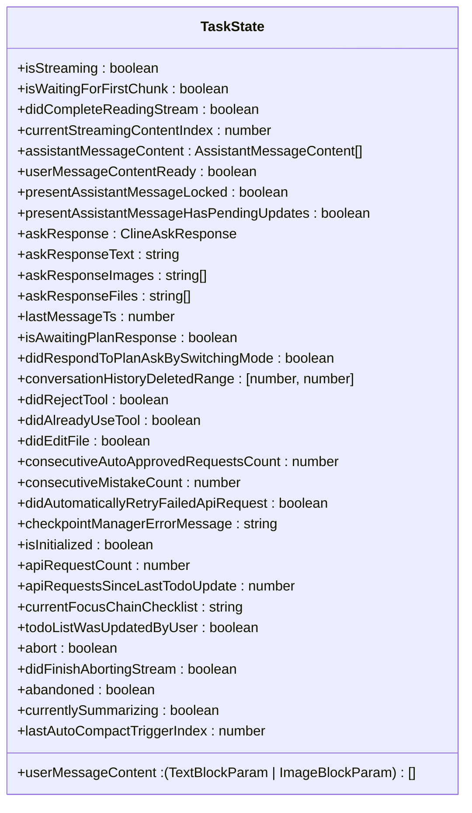
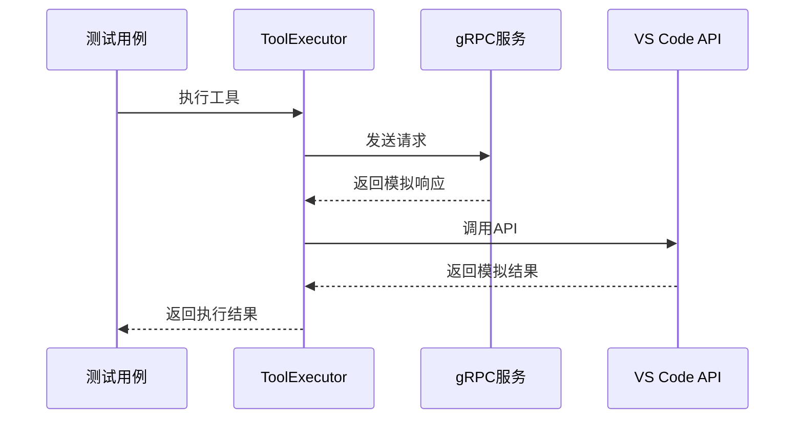
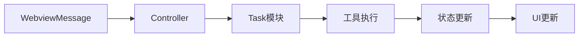
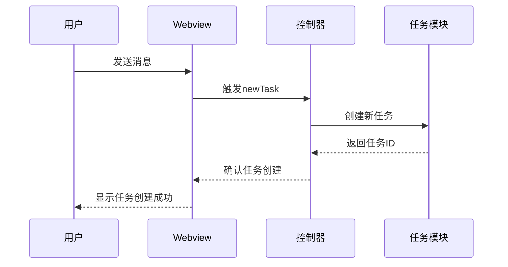
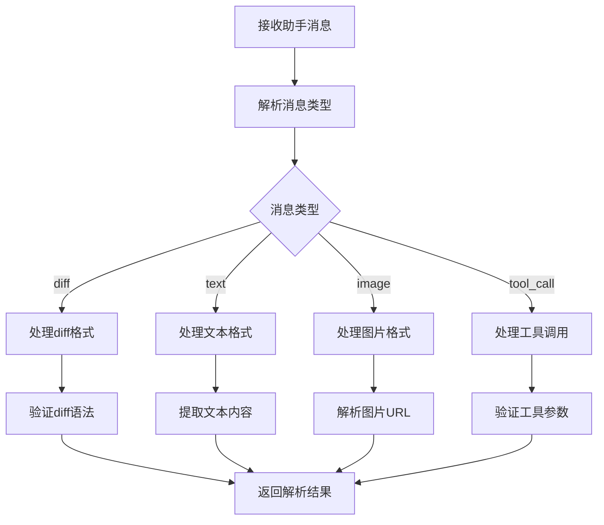

# 单元与集成测试

<cite>
**本文档引用的文件**  
- [ContextManager.ts](file://src/core/context/context-management/ContextManager.ts)
- [accountLoginClicked.ts](file://src/core/controller/account/accountLoginClicked.ts)
- [TaskState.ts](file://src/core/task/TaskState.ts)
- [ToolExecutor.ts](file://src/core/task/ToolExecutor.ts)
- [parse-assistant-message.ts](file://src/core/assistant-message/parse-assistant-message.ts)
- [newTask.ts](file://src/core/controller/task/newTask.ts)
- [ContextManager.test.ts](file://src/core/context/context-management/__tests__/ContextManager.test.ts)
</cite>

## 目录
1. [简介](#简介)
2. [单元测试实践](#单元测试实践)
3. [集成测试策略](#集成测试策略)
4. [核心功能测试](#核心功能测试)
5. [测试最佳实践](#测试最佳实践)
6. [结论](#结论)

## 简介
本文档详细说明了如何为 Cline 项目中的核心模块编写单元和集成测试。重点涵盖使用 Jest 框架对控制器、任务状态机和工具执行器等关键组件进行测试的方法。文档将介绍如何使用 `jest.mock` 模拟 gRPC 服务、VS Code API 和外部 LLM 提供商，以及如何测试模块间的交互流程。通过具体的代码示例和最佳实践，帮助开发者建立全面的测试覆盖，确保核心功能的稳定性和可靠性。

## 单元测试实践

### 控制器测试
对控制器方法进行单元测试时，需要隔离外部依赖，确保测试的纯粹性。以 `accountLoginClicked` 函数为例，该函数依赖于 `AuthService` 服务来创建认证请求。



**测试要点**：
- 使用 `jest.mock` 模拟 `AuthService` 类，确保测试不依赖实际的身份验证服务
- 验证函数返回的登录 URL 是否符合预期格式
- 确认 `AuthService` 的 `createAuthRequest` 方法被正确调用

**Section sources**
- [accountLoginClicked.ts](file://src/core/controller/account/accountLoginClicked.ts)

### 任务状态机测试
`TaskState` 类管理着任务执行过程中的各种状态，包括流式传输、内容处理、工具执行等。对状态机的测试需要覆盖各种状态转换场景。



**测试要点**：
- 验证初始状态的正确性
- 测试状态转换逻辑，如从 `isStreaming = false` 到 `isStreaming = true`
- 确保状态变更不会导致意外的副作用

**Diagram sources**
- [TaskState.ts](file://src/core/task/TaskState.ts)

### 工具执行器测试
`ToolExecutor` 负责执行各种工具操作，需要模拟 gRPC 服务和外部 API 调用。



**测试要点**：
- 使用 `jest.mock` 模拟 gRPC 服务和 VS Code API
- 测试各种工具执行场景，包括成功和失败情况
- 验证错误处理逻辑

**Section sources**
- [ToolExecutor.ts](file://src/core/task/ToolExecutor.ts)

## 集成测试策略

### 模块间交互测试
集成测试关注模块间的协作，例如从 `WebviewMessage` 触发 `Controller` 方法，进而调用 `Task` 模块执行逻辑的完整流程。



**测试要点**：
- 模拟完整的用户操作流程
- 验证数据在模块间的正确传递
- 测试异常情况下的流程处理

### 异步操作测试
Cline 中的许多操作都是异步的，需要特别注意异步测试的编写。



**测试要点**：
- 使用 `async/await` 处理异步操作
- 验证 Promise 的正确解析
- 测试超时和取消场景

**Section sources**
- [newTask.ts](file://src/core/controller/task/newTask.ts)

## 核心功能测试

### 上下文管理测试
`ContextManager` 负责管理对话上下文，包括上下文窗口的压缩和历史记录的更新。

```mermaid
classDiagram
class ContextManager {
+contextHistoryUpdates : Map<number, [number, Map<number, ContextUpdate[]>]>
+initializeContextHistory(taskDirectory : string) : Promise<void>
+getSavedContextHistory(taskDirectory : string) : Promise<Map<number, [number, Map<number, ContextUpdate[]>]>
+saveContextHistory(taskDirectory : string) : Promise<void>
+shouldCompactContextWindow(clineMessages : ClineMessage[], api : ApiHandler, previousApiReqIndex : number) : boolean
+getContextTelemetryData(clineMessages : ClineMessage[], api : ApiHandler, triggerIndex? : number) : {tokensUsed : number, maxContextWindow : number} | null
+getNewContextMessagesAndMetadata(apiConversationHistory : MessageParam[], clineMessages : ClineMessage[], api : ApiHandler, conversationHistoryDeletedRange : [number, number] | undefined, previousApiReqIndex : number, taskDirectory : string, useAutoCondense : boolean) : Promise<{conversationHistoryDeletedRange : [number, number] | undefined, updatedConversationHistoryDeletedRange : boolean, truncatedConversationHistory : MessageParam[]}>
+getNextTruncationRange(apiMessages : MessageParam[], currentDeletedRange : [number, number] | undefined, keep : "none" | "lastTwo" | "half" | "quarter") : [number, number]
+getTruncatedMessages(messages : MessageParam[], deletedRange : [number, number] | undefined) : MessageParam[]
+getAndAlterTruncatedMessages(messages : MessageParam[], deletedRange : [number, number] | undefined) : MessageParam[]
+applyContextHistoryUpdates(messages : MessageParam[], startFromIndex : number) : MessageParam[]
+truncateContextHistory(timestamp : number, taskDirectory : string) : Promise<void>
+truncateContextHistoryAtTimestamp(contextHistory : Map<number, [number, Map<number, ContextUpdate[]>]>, timestamp : number) : void
+applyContextOptimizations(apiMessages : MessageParam[], startFromIndex : number, timestamp : number) : [boolean, Set<number>]
+triggerApplyStandardContextTruncationNoticeChange(timestamp : number, taskDirectory : string, apiConversationHistory : MessageParam[]) : Promise<void>
+applyStandardContextTruncationNoticeChange(timestamp : number) : boolean
+applyFirstUserMessageReplacement(timestamp : number, apiConversationHistory : MessageParam[]) : boolean
+findAndPotentiallySaveFileReadContextHistoryUpdates(apiMessages : MessageParam[], startFromIndex : number, timestamp : number) : [boolean, Set<number>]
+getPossibleDuplicateFileReads(apiMessages : MessageParam[], startFromIndex : number) : [Map<string, [number, number, string, string][]>, Map<number, string[]>]
+handlePotentialFileMentionCalls(i : number, secondBlockText : string, fileReadIndices : Map<string, [number, number, string, string][]>, thisExistingFileReads : string[]) : [boolean, string[]]
+parsePotentialToolCall(text : string) : [string, string] | null
+handleReadFileToolCall(i : number, filePath : string, fileReadIndices : Map<string, [number, number, string, string][]>) : void
+handlePotentialFileChangeToolCalls(i : number, filePath : string, secondBlockText : string, fileReadIndices : Map<string, [number, number, string, string][]>) : void
+applyFileReadContextHistoryUpdates(fileReadIndices : Map<string, [number, number, string, string][]>, messageFilePaths : Map<number, string[]>, apiMessages : MessageParam[], timestamp : number) : [boolean, Set<number>]
}
class EditType {
+UNDEFINED : 0
+NO_FILE_READ : 1
+READ_FILE_TOOL : 2
+ALTER_FILE_TOOL : 3
+FILE_MENTION : 4
}
```

**测试要点**：
- 验证上下文压缩逻辑的正确性
- 测试历史记录的保存和加载
- 确保上下文更新的原子性

**Diagram sources**
- [ContextManager.ts](file://src/core/context/context-management/ContextManager.ts)

### 助手消息解析测试
`parse-assistant-message.ts` 负责解析助手返回的消息，需要处理各种消息格式和边界情况。



**测试要点**：
- 测试各种消息格式的解析
- 验证错误消息的处理
- 确保解析结果的准确性

**Section sources**
- [parse-assistant-message.ts](file://src/core/assistant-message/parse-assistant-message.ts)

## 测试最佳实践

### 测试覆盖率
确保关键路径的测试覆盖率，特别是：
- 核心业务逻辑
- 错误处理路径
- 边界条件

### 断言方法
使用合适的断言方法来验证测试结果：
- `expect(value).toBe(expected)` 用于严格相等比较
- `expect(object).toEqual(expected)` 用于对象深度比较
- `expect(fn).toThrow()` 用于验证异常抛出
- `expect(promise).resolves.toEqual(expected)` 用于异步操作

### 异步测试处理
正确处理异步测试：
- 使用 `async/await` 语法
- 对于定时器相关的测试，使用 `jest.useFakeTimers()`
- 对于 Promise，使用 `.resolves` 或 `.rejects` 匹配器

### 模拟策略
合理使用模拟：
- 只模拟必要的外部依赖
- 保持模拟的简单性
- 避免过度模拟导致测试脆弱

## 结论
通过本文档介绍的单元和集成测试方法，开发者可以为 Cline 的核心模块建立全面的测试覆盖。合理的测试策略不仅能提高代码质量，还能加速开发迭代。建议在开发新功能时遵循"测试先行"的原则，确保每个功能都有相应的测试用例。同时，定期审查和更新测试用例，以适应代码的演进和需求的变化。