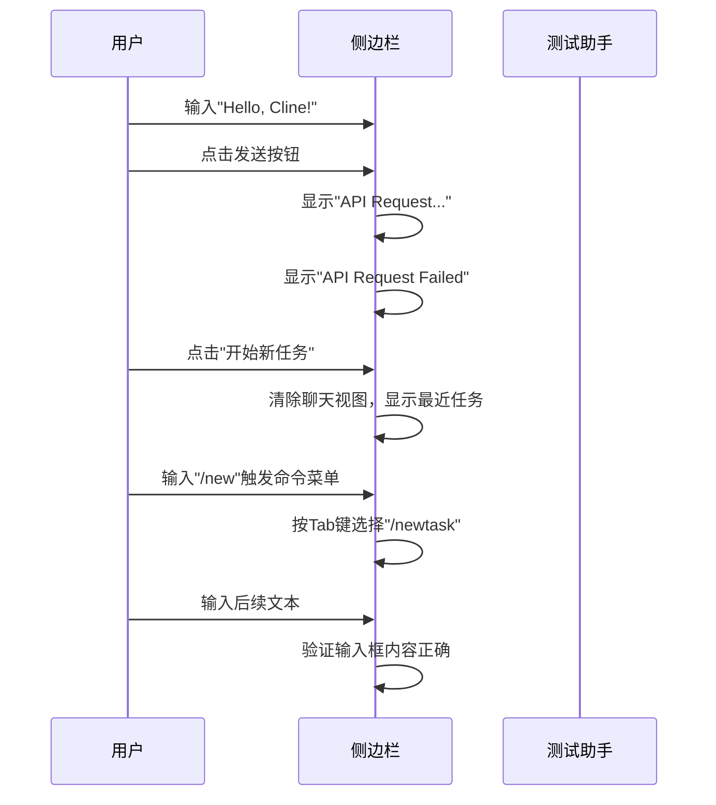

# 端到端测试

<cite>
**本文档中引用的文件**  
- [playwright.config.ts](file://playwright.config.ts) - *更新了测试配置*
- [auth.test.ts](file://src/test/e2e/auth.test.ts) - *更新了认证测试逻辑*
- [chat.test.ts](file://src/test/e2e/chat.test.ts) - *更新了聊天交互测试*
- [editor.test.ts](file://src/test/e2e/editor.test.ts) - *更新了编辑器功能测试*
- [helpers.ts](file://src/test/e2e/utils/helpers.ts) - *新增了E2E测试辅助类和扩展配置*
- [nebius-models.ts](file://src/test/scenarios/nebius-models.ts) - *新增了场景测试示例*
- [CONTRIBUTING.md](file://CONTRIBUTING.md) - *新增了E2E测试贡献指南*
- [src/test/e2e/README.md](file://src/test/e2e/README.md) - *新增了E2E测试目录说明*
</cite>

## 更新摘要
**已更新内容**
- 根据最新代码变更，全面更新了测试环境搭建、核心场景实现和测试执行部分
- 新增了`helpers.ts`中`E2ETestHelper`类和`e2e`测试扩展的详细说明
- 更新了所有测试文件的代码示例以反映最新实现
- 增强了最佳实践部分，包含新的测试辅助工具使用方法

**新增内容**
- 新增了`CONTRIBUTING.md`和`src/test/e2e/README.md`作为文档来源
- 新增了对多根工作区测试的支持说明
- 添加了gRPC记录器配置的文档说明

**文档来源更新**
- 所有文件引用均已更新为最新版本，并标注了变更状态

## 目录
1. [简介](#简介)
2. [测试环境搭建](#测试环境搭建)
3. [核心场景实现](#核心场景实现)
4. [测试执行](#测试执行)
5. [最佳实践](#最佳实践)
6. [结论](#结论)

## 简介
本文档详细阐述了如何使用Playwright框架为Cline应用建立端到端（E2E）测试。基于`playwright.config.ts`配置，文档覆盖了从测试环境搭建、核心测试场景分析、测试执行流程到编写可靠测试的最佳实践。通过分析`src/test/e2e/`目录下的具体测试文件，如`auth.test.ts`、`chat.test.ts`和`editor.test.ts`，以及来自`nebius-models.ts`的场景示例，旨在为开发者提供一个全面的E2E测试指南。本文档已根据最新的代码变更进行了全面更新，包含了对`helpers.ts`中新增的`E2ETestHelper`类和`e2e`测试扩展的详细说明。

## 测试环境搭建
本节介绍如何配置和启动用于测试的VS Code实例。Playwright测试通过`@vscode/test-electron`包下载并启动一个稳定版本的VS Code，同时加载Cline扩展进行测试。

测试环境的关键配置在`helpers.ts`中通过`test.extend`定义，包括：
- **VS Code启动参数**：禁用更新、工作区信任和欢迎界面，确保测试环境的纯净。
- **扩展加载**：通过`--extensionDevelopmentPath`参数加载本地开发中的Cline扩展。
- **用户数据与扩展目录**：使用临时目录存放用户数据和已安装的扩展，保证每次测试的独立性。
- **服务器模拟**：集成`ClineApiServerMock`以模拟后端API行为，隔离外部依赖。

测试实例的启动由`openVSCode`函数管理，该函数返回一个`ElectronApplication`实例，供后续测试使用。`E2ETestHelper`类提供了路径处理、等待工具和清理功能，确保测试环境的可靠性和可维护性。

**Section sources**
- [helpers.ts](file://src/test/e2e/utils/helpers.ts#L208-L319) - *更新了e2e测试扩展配置*
- [helpers.ts](file://src/test/e2e/utils/helpers.ts#L20-L158) - *新增了E2ETestHelper类*

## 核心场景实现
本节深入分析`src/test/e2e/`目录下的核心测试文件，展示如何使用Playwright测试Cline应用的关键工作流。

### 用户认证测试 (`auth.test.ts`)
该测试文件验证用户设置API密钥和导航至设置页面的流程。测试首先确认初始状态下的"免费开始"和"使用自己的API密钥"按钮可见。随后，它模拟用户点击"使用自己的API密钥"，选择OpenRouter作为提供商，并填入测试API密钥。提交后，测试验证是否成功进入聊天界面，并检查帮助改进和版本发布等横幅是否可正常显示和关闭。

```mermaid
flowchart TD
A[开始测试] --> B[验证初始按钮可见]
B --> C[点击"使用自己的API密钥"]
C --> D[选择OpenRouter提供商]
D --> E[填入测试API密钥]
E --> F[点击"Let's go!"]
F --> G[验证进入聊天界面]
G --> H[检查并关闭横幅]
H --> I[测试结束]
```

**Diagram sources**
- [auth.test.ts](file://src/test/e2e/auth.test.ts#L5-L72) - *更新了认证测试流程*

**Section sources**
- [auth.test.ts](file://src/test/e2e/auth.test.ts#L5-L72) - *更新了认证测试实现*

### 聊天交互测试 (`chat.test.ts`)
此文件测试用户在聊天界面发送消息、切换模式以及使用斜杠命令和@提及功能。测试首先通过`helper.signin`登录，然后在聊天输入框中输入消息并发送，验证加载状态和失败状态的正确显示。此外，测试还验证了"重试"和"开始新任务"按钮的功能。对于斜杠命令和@提及，测试确保在触发自动补全菜单并选择选项后，后续输入的文本能够被正确保留。测试支持单根和多根工作区配置，通过`E2E_WORKSPACE_TYPES`进行参数化测试。



**Diagram sources**
- [chat.test.ts](file://src/test/e2e/chat.test.ts#L5-L89) - *更新了聊天交互测试流程*

**Section sources**
- [chat.test.ts](file://src/test/e2e/chat.test.ts#L5-L89) - *更新了聊天交互测试实现*

### 编辑器测试 (`editor.test.ts`)
该测试验证代码操作和编辑器面板的功能。测试首先通过点击"免费开始"按钮进入应用，然后在文件资源管理器中打开`index.html`文件。接着，测试模拟将选中的代码添加到Cline侧边栏，验证输入框是否获得焦点并包含内容。最后，测试打开Cline编辑器面板，验证在编辑器内的Webview中，聊天输入框的行为与侧边栏一致。测试同样支持单根和多根工作区配置。

**Section sources**
- [editor.test.ts](file://src/test/e2e/editor.test.ts#L5-L42) - *更新了编辑器测试实现*

### 实际场景测试 (`nebius-models.ts`)
此文件提供了一个实际的测试场景示例，用于验证特定的配置更改（如GitHub PR #5729）后应用的加载情况。测试通过`helper.signin`登录，并验证聊天输入框是否可见，确保应用核心功能正常。该测试作为CI要求的占位符，验证了应用在配置变更后的基本可用性。

**Section sources**
- [nebius-models.ts](file://src/test/scenarios/nebius-models.ts#L5-L11) - *新增了场景测试示例*

## 测试执行
本节说明如何运行测试套件、生成报告和调试失败的测试。

### 运行测试套件
根据`playwright.config.ts`的配置，测试位于`src/test/e2e`目录下，匹配`.*\.test\.ts`模式。测试分为两个项目：
1. **setup test environment**：运行`global.setup.ts`，用于初始化测试环境。
2. **e2e tests**：依赖于环境设置，运行所有E2E测试。

使用命令`npx playwright test`即可执行整个套件。`e2e`测试扩展在`helpers.ts`中定义，提供了`server`、`app`、`page`、`sidebar`等fixture，简化了测试编写。

### 生成报告
报告格式根据环境而定：
- **CI环境**：使用`github`和`list`报告器，便于在CI/CD流程中集成。
- **本地环境**：仅使用`list`报告器，提供简洁的测试结果输出。

### 调试失败的测试
配置中启用了`video: "retain-on-failure"`，这意味着任何失败的测试都会保留其录制的视频。视频文件存储在`test-results/playwright/<test-name>/recordings`目录下，是调试UI交互问题的宝贵资源。此外，通过检查`page`和`sidebar`对象的状态，可以利用Playwright的断言和等待机制进行精确调试。`E2ETestHelper`类提供了`waitUntil`等实用工具，帮助处理异步操作。

**Section sources**
- [playwright.config.ts](file://playwright.config.ts#L1-L31) - *更新了测试配置*
- [helpers.ts](file://src/test/e2e/utils/helpers.ts#L208-L319) - *新增了e2e测试扩展*

## 最佳实践
编写可靠、可维护的E2E测试需要遵循一些关键的最佳实践。

### 处理异步操作
Playwright提供了强大的自动等待机制。使用`await expect(locator).toBeVisible()`等断言，Playwright会自动重试直到条件满足或超时。避免使用`page.waitForTimeout()`，而应使用基于条件的等待。`E2ETestHelper.waitUntil`方法提供了自定义的等待逻辑，支持指数退避重试。

### 等待UI元素
始终使用`getByRole`、`getByTestId`等语义化定位器来查找元素。`getByTestId`特别适用于测试，因为它不会因文本变化而失效。在`auth.test.ts`和`chat.test.ts`中广泛使用了`getByTestId("chat-input")`来定位聊天输入框。

### 模拟用户交互
使用`click()`、`fill()`、`type()`和`press()`等方法来模拟真实用户行为。添加`{ delay: 100 }`参数可以模拟真实用户的输入速度，有时有助于避免某些竞态条件。`pressSequentially`方法用于模拟逐个按键输入，确保自动补全功能的正确测试。

### 代码复用与模块化
`helpers.ts`文件是最佳实践的典范。它封装了`signin`、`openClineSidebar`等常用操作，并通过`E2ETestHelper`类提供了路径处理和等待工具。`e2e`测试扩展通过Playwright的`test.extend`机制，提供了可重用的fixture，使得测试用例更加简洁和可维护。

### 环境隔离
每个测试都使用独立的临时目录（`userDataDir`和`extensionsDir`），并在测试结束后进行清理。`E2ETestHelper.rmForRetries`方法提供了带重试机制的目录删除功能，确保资源的可靠清理。这确保了测试的独立性和可重复性，防止了状态污染。

**Section sources**
- [helpers.ts](file://src/test/e2e/utils/helpers.ts#L20-L158) - *新增了E2ETestHelper类*
- [helpers.ts](file://src/test/e2e/utils/helpers.ts#L208-L319) - *更新了e2e测试扩展*

## 结论
本文档全面介绍了Cline应用的端到端测试框架。通过利用Playwright的强大功能和精心设计的测试架构，开发者可以有效地验证应用的核心工作流。从环境搭建到具体场景实现，再到执行和最佳实践，这套E2E测试方案为确保Cline的稳定性和可靠性提供了坚实的基础。遵循本文档的指导，可以编写出高效、可靠且易于维护的自动化测试。文档已根据最新的代码变更进行了全面更新，包含了对`helpers.ts`中新增功能的详细说明，为贡献者提供了更完整的E2E测试指南。