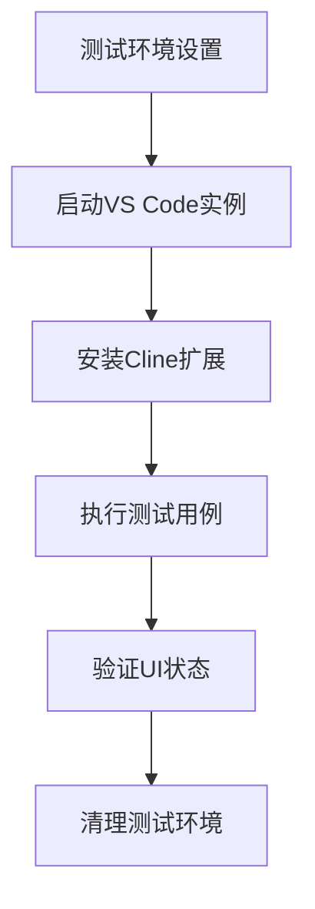
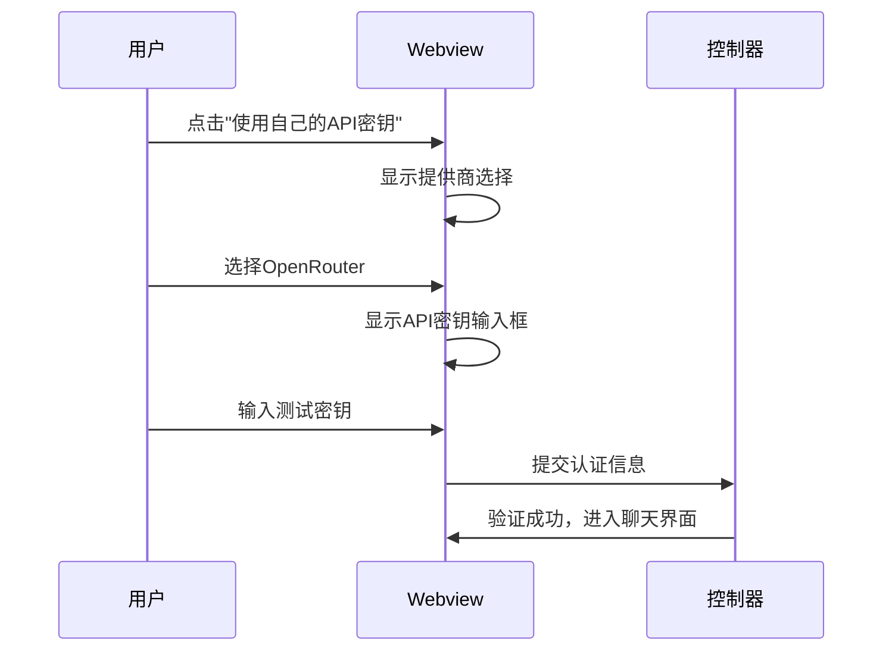

# 自动化测试

<cite>
**本文档中引用的文件**   
- [playwright.config.ts](file://playwright.config.ts)
- [global.setup.ts](file://src/test/e2e/utils/global.setup.ts)
- [helpers.ts](file://src/test/e2e/utils/helpers.ts)
- [auth.test.ts](file://src/test/e2e/auth.test.ts)
- [chat.test.ts](file://src/test/e2e/chat.test.ts)
- [editor.test.ts](file://src/test/e2e/editor.test.ts)
- [diff.test.ts](file://src/test/e2e/diff.test.ts)
- [index.ts](file://src/test/e2e/fixtures/server/index.ts)
</cite>

## 目录
1. [简介](#简介)
2. [单元测试实践](#单元测试实践)
3. [集成测试策略](#集成测试策略)
4. [端到端测试框架](#端到端测试框架)
5. [设置指南与运行命令](#设置指南与运行命令)
6. [最佳实践](#最佳实践)
7. [结论](#结论)

## 简介
本文档旨在建立Cline项目的自动化测试体系，全面覆盖单元测试、集成测试和端到端（E2E）测试三个层面。文档详细阐述了如何为`src/core`中的核心模块编写测试用例，如何测试模块间的交互流程，以及如何基于Playwright框架实现完整的UI自动化测试。通过本指南，开发者可以系统地构建和维护高质量的测试套件，确保Cline扩展的稳定性和可靠性。

## 单元测试实践

本节详细介绍如何使用Jest为Cline核心模块编写单元测试。测试重点包括控制器逻辑、任务状态机和工具执行器等关键组件。

### 模拟gRPC服务
在单元测试中，通过模拟gRPC服务来隔离外部依赖。测试文件`grpc-handler.test.ts`展示了如何创建gRPC服务的模拟实例，验证请求和响应的正确性。通过`jest.fn()`创建模拟函数，可以精确控制服务行为并验证调用参数。

### 测试控制器逻辑
控制器模块（如`accountLoginClicked.ts`、`newTask.ts`）的测试主要验证其业务逻辑的正确性。测试用例应覆盖各种输入条件和边界情况，确保控制器能正确处理用户操作并触发相应的状态变更。

### 验证任务状态转换
任务状态机是Cline的核心组件之一。在`TaskState.ts`的测试中，需要验证状态转换的完整性和正确性。测试用例应覆盖所有可能的状态转换路径，包括正常流程和异常处理，确保任务生命周期管理的可靠性。

**Section sources**
- [src/core/controller/account/accountLoginClicked.ts](file://src/core/controller/account/accountLoginClicked.ts)
- [src/core/task/TaskState.ts](file://src/core/task/TaskState.ts)
- [src/test/e2e/utils/helpers.ts](file://src/test/e2e/utils/helpers.ts)

## 集成测试策略

集成测试关注模块间的交互和数据流，确保各个组件能够协同工作。

### Webview到控制器的通信
测试从Webview发送消息到控制器的完整流程。通过模拟用户在Webview中的操作（如点击按钮、输入文本），验证控制器能否正确接收和处理这些消息，并更新相应的状态。

### 任务执行流程
验证从任务创建到执行的完整流程。测试用例应覆盖任务的初始化、参数验证、执行器调用和结果处理等环节，确保整个流程的连贯性和正确性。

### 错误处理和边界情况
集成测试需要特别关注错误处理机制。通过模拟各种异常情况（如网络超时、服务不可用），验证系统能否优雅地处理错误并提供有意义的反馈。

**Section sources**
- [src/core/controller/ui/initializeWebview.ts](file://src/core/controller/ui/initializeWebview.ts)
- [src/core/controller/task/newTask.ts](file://src/core/controller/task/newTask.ts)
- [src/core/task/ToolExecutor.ts](file://src/core/task/ToolExecutor.ts)

## 端到端测试框架

基于Playwright构建的端到端测试框架，用于验证Cline在真实VS Code环境中的完整功能。

### 测试环境配置
`playwright.config.ts`文件定义了E2E测试的基本配置：
- 测试目录：`src/test/e2e`
- 超时设置：CI环境中为40秒，本地为20秒
- 视频录制：测试失败时保留视频记录
- 并行执行：启用完全并行模式以提高测试效率



**Diagram sources**
- [playwright.config.ts](file://playwright.config.ts)
- [src/test/e2e/utils/global.setup.ts](file://src/test/e2e/utils/global.setup.ts)

### 测试场景实现
`src/test/e2e/`目录下的测试文件实现了各种核心场景：

#### 认证测试
`auth.test.ts`验证用户认证流程，包括：
- API密钥设置
- 提供商选择（OpenRouter等）
- 设置页面导航
- 横幅消息处理



**Diagram sources**
- [src/test/e2e/auth.test.ts](file://src/test/e2e/auth.test.ts)
- [src/test/e2e/utils/helpers.ts](file://src/test/e2e/utils/helpers.ts)

#### 聊天测试
`chat.test.ts`测试聊天功能，包括：
- 消息发送和接收
- 模式切换（Act/Plan）
- 斜杠命令处理
- @提及功能

#### 编辑器测试
`editor.test.ts`验证编辑器集成功能：
- 代码选择和添加到Cline
- 编辑器面板打开
- 多根工作区支持

#### Diff测试
`diff.test.ts`测试文件编辑功能：
- 编辑请求处理
- Diff编辑器显示
- 原始与修改内容对比

**Section sources**
- [src/test/e2e/auth.test.ts](file://src/test/e2e/auth.test.ts)
- [src/test/e2e/chat.test.ts](file://src/test/e2e/chat.test.ts)
- [src/test/e2e/editor.test.ts](file://src/test/e2e/editor.test.ts)
- [src/test/e2e/diff.test.ts](file://src/test/e2e/diff.test.ts)

## 设置指南与运行命令

### 环境准备
1. 确保Node.js和npm已安装
2. 安装项目依赖：`npm install`
3. 构建项目：`npm run build`

### 运行测试
```bash
# 运行所有E2E测试
npm run test:e2e

# 运行特定测试文件
npx playwright test src/test/e2e/auth.test.ts

# 在UI模式下运行测试
npx playwright test --ui

# 生成测试报告
npx playwright show-report
```

### 测试配置
`playwright.config.ts`中的关键配置：
- `testDir`: 指定测试目录
- `timeout`: 设置测试超时时间
- `reporter`: 配置测试报告格式
- `projects`: 定义测试项目和依赖关系

**Section sources**
- [playwright.config.ts](file://playwright.config.ts)
- [package.json](file://package.json)

## 最佳实践

### 测试组织
- 按功能模块组织测试文件
- 使用描述性测试名称
- 遵循AAA模式（Arrange-Act-Assert）

### 断言策略
- 使用Playwright的自动等待机制
- 优先使用语义化选择器（如`getByRole`）
- 验证关键UI状态和元素可见性

### 环境管理
- 使用临时目录避免状态污染
- 在测试前后清理资源
- 利用Playwright的fixture系统管理共享状态

### 调试技巧
- 启用视频录制功能
- 使用Playwright UI模式进行交互式调试
- 查看生成的测试报告和截图

**Section sources**
- [src/test/e2e/utils/helpers.ts](file://src/test/e2e/utils/helpers.ts)
- [src/test/e2e/utils/global.setup.ts](file://src/test/e2e/utils/global.setup.ts)

## 结论
Cline的自动化测试体系通过单元测试、集成测试和端到端测试的有机结合，构建了全面的质量保障机制。单元测试确保核心逻辑的正确性，集成测试验证模块间的协作，而端到端测试则在真实环境中验证整体功能。通过遵循本文档的最佳实践，团队可以持续维护高质量的代码库，快速发现和修复问题，为用户提供稳定可靠的开发体验。