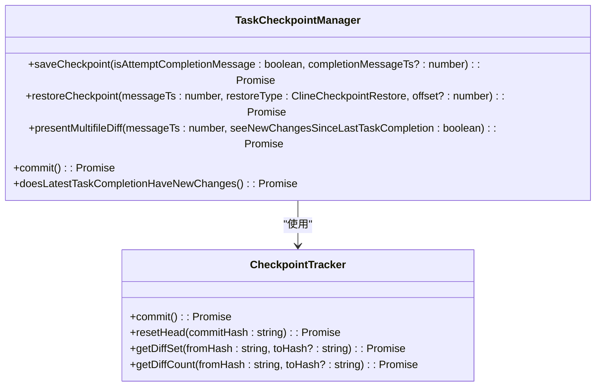
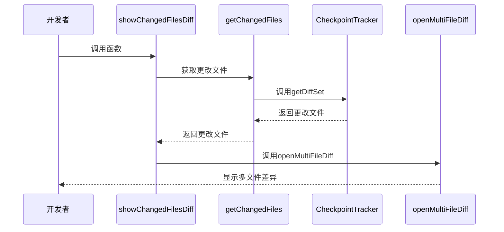

# 代码重构最佳实践

<cite>
**本文档引用的文件**  
- [ContextManager.ts](file://src/core/context/context-management/ContextManager.ts)
- [index.ts](file://src/integrations/checkpoints/index.ts)
- [multifile-diff.ts](file://src/core/task/multifile-diff.ts)
- [commit-message-generator.ts](file://src/integrations/git/commit-message-generator.ts)
- [openMultiFileDiff.ts](file://src/hosts/vscode/hostbridge/diff/openMultiFileDiff.ts)
</cite>

## 目录
1. [引言](#引言)
2. [检查点系统](#检查点系统)
3. [上下文管理](#上下文管理)
4. [多文件差异预览](#多文件差异预览)
5. [提交消息生成](#提交消息生成)
6. [重构工作流](#重构工作流)

## 引言
本文档旨在为使用Cline进行代码重构提供一套完整的最佳实践指南。通过结合检查点（checkpoint）系统、上下文管理、多文件差异预览和智能提交消息生成功能，开发者可以安全、高效地执行复杂的重构任务。本指南将详细介绍如何利用这些功能来分解大型重构任务，精确控制重构范围，并确保重构过程的可追溯性和安全性。

## 检查点系统

Cline的检查点系统为代码重构提供了安全保障。在开始任何重构操作之前，创建检查点可以让开发者在需要时轻松回滚到之前的状态。`TaskCheckpointManager`类负责管理所有与检查点相关的操作，包括创建、恢复和显示差异。

检查点功能通过`CheckpointTracker`类与底层的Git逻辑进行交互。当调用`saveCheckpoint`方法时，系统会在阴影Git仓库中创建一个包含当前工作区状态的提交。这个提交的哈希值会被存储在相应的消息中，以便后续恢复或比较。



**图示来源**
- [index.ts](file://src/integrations/checkpoints/index.ts#L0-L799)
- [CheckpointTracker.ts](file://src/integrations/checkpoints/CheckpointTracker.ts#L128-L168)

**本节来源**
- [index.ts](file://src/integrations/checkpoints/index.ts#L0-L799)

## 上下文管理

上下文管理功能允许开发者精确地将需要重构的文件和相关依赖添加到上下文中，避免信息过载。`ContextManager`类负责管理上下文历史记录的更新和优化，确保在重构过程中只包含必要的信息。

通过`ContextManager`，开发者可以加载、保存和截断上下文历史记录。该类还提供了应用上下文优化的功能，如识别和保存文件读取上下文历史更新。这种精确的上下文控制对于大型重构任务尤为重要，因为它可以防止AI模型被无关的代码分散注意力。

```mermaid
classDiagram
class ContextManager {
+initializeContextHistory(taskDirectory : string) : Promise<void>
+getNewContextMessagesAndMetadata(apiConversationHistory : MessageParam[], clineMessages : ClineMessage[], api : ApiHandler, conversationHistoryDeletedRange : [number, number] | undefined, previousApiReqIndex : number, taskDirectory : string, useAutoCondense : boolean) : Promise<{conversationHistoryDeletedRange : [number, number] | undefined, updatedConversationHistoryDeletedRange : boolean, truncatedConversationHistory : MessageParam[]}>
+truncateContextHistory(timestamp : number, taskDirectory : string) : Promise<void>
+applyContextOptimizations(apiMessages : MessageParam[], startFromIndex : number, timestamp : number) : [boolean, Set<number>]
+triggerApplyStandardContextTruncationNoticeChange(timestamp : number, taskDirectory : string, apiConversationHistory : MessageParam[]) : Promise<void>
}
class ContextUpdate {
+timestamp : number
+updateType : string
+update : MessageContent
+metadata : MessageMetadata
}
ContextManager --> ContextUpdate : "包含"
```

**图示来源**
- [ContextManager.ts](file://src/core/context/context-management/ContextManager.ts#L0-L799)

**本节来源**
- [ContextManager.ts](file://src/core/context/context-management/ContextManager.ts#L0-L799)

## 多文件差异预览

多文件差异功能允许开发者在应用更改之前预览所有修改。`showChangedFilesDiff`函数是这一功能的核心，它接收消息状态处理器、检查点跟踪器、消息时间戳和是否显示自上次任务完成以来的更改等参数。

该功能通过调用`getChangedFiles`函数获取更改的文件列表，然后使用`HostProvider.diff.openMultiFileDiff`方法在多文件差异视图中显示这些更改。这为开发者提供了一个直观的界面来审查和批准所有重构更改，确保只有预期的修改被应用。



**图示来源**
- [multifile-diff.ts](file://src/core/task/multifile-diff.ts#L0-L121)
- [openMultiFileDiff.ts](file://src/hosts/vscode/hostbridge/diff/openMultiFileDiff.ts#L0-L29)

**本节来源**
- [multifile-diff.ts](file://src/core/task/multifile-diff.ts#L0-L121)

## 提交消息生成

提交消息生成功能利用AI模型为重构更改生成清晰、符合规范的Git提交消息。`GitCommitGenerator`模块包含`generate`和`abort`两个主要函数，分别用于生成提交消息和中止生成过程。

`generate`函数首先检查工作区是否有未提交的更改，然后获取Git差异。如果存在更改，它会创建一个提示，要求AI模型基于Git差异生成提交消息。生成的提交消息会自动填充到Git输入框中，供开发者审查和提交。

```mermaid
flowchart TD
A([开始生成提交消息]) --> B{是否有工作区更改?}
B --> |否| C[显示"无更改"消息]
B --> |是| D{Git输入框可用?}
D --> |否| E[显示错误消息]
D --> |是| F[创建AI提示]
F --> G[调用AI API]
G --> H{收到响应?}
H --> |否| I[显示错误消息]
H --> |是| J[提取提交消息]
J --> K[填充Git输入框]
K --> L([完成])
C --> L
E --> L
I --> L
```

**图示来源**
- [commit-message-generator.ts](file://src/integrations/git/commit-message-generator.ts#L0-L132)

**本节来源**
- [commit-message-generator.ts](file://src/integrations/git/commit-message-generator.ts#L0-L132)

## 重构工作流

结合上述功能，可以构建一个安全、高效的代码重构工作流。首先，在开始重构前创建一个检查点，为可能的回滚提供保障。然后，使用上下文管理功能将需要重构的文件和相关依赖精确地添加到上下文中，避免信息过载。

对于大型重构任务，建议将其分解为多个小的、明确的子任务。每个子任务完成后，都可以使用多文件差异功能预览和批准更改。最后，利用提交消息生成功能为每次重构生成清晰、符合规范的Git提交消息，确保重构过程的可追溯性。

这个工作流不仅提高了重构的安全性，还增强了重构过程的可控性和透明度。通过检查点系统，开发者可以放心地进行大胆的重构尝试；通过上下文管理，可以确保重构的精确性；通过多文件差异预览，可以全面审查更改；通过智能提交消息生成，可以保持代码历史的清晰和规范。

**本节来源**
- [index.ts](file://src/integrations/checkpoints/index.ts#L0-L799)
- [ContextManager.ts](file://src/core/context/context-management/ContextManager.ts#L0-L799)
- [multifile-diff.ts](file://src/core/task/multifile-diff.ts#L0-L121)
- [commit-message-generator.ts](file://src/integrations/git/commit-message-generator.ts#L0-L132)