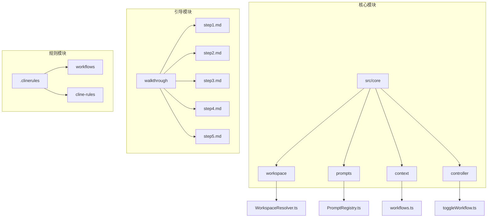
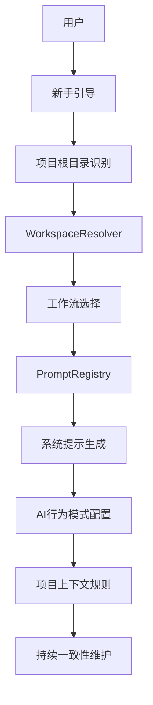
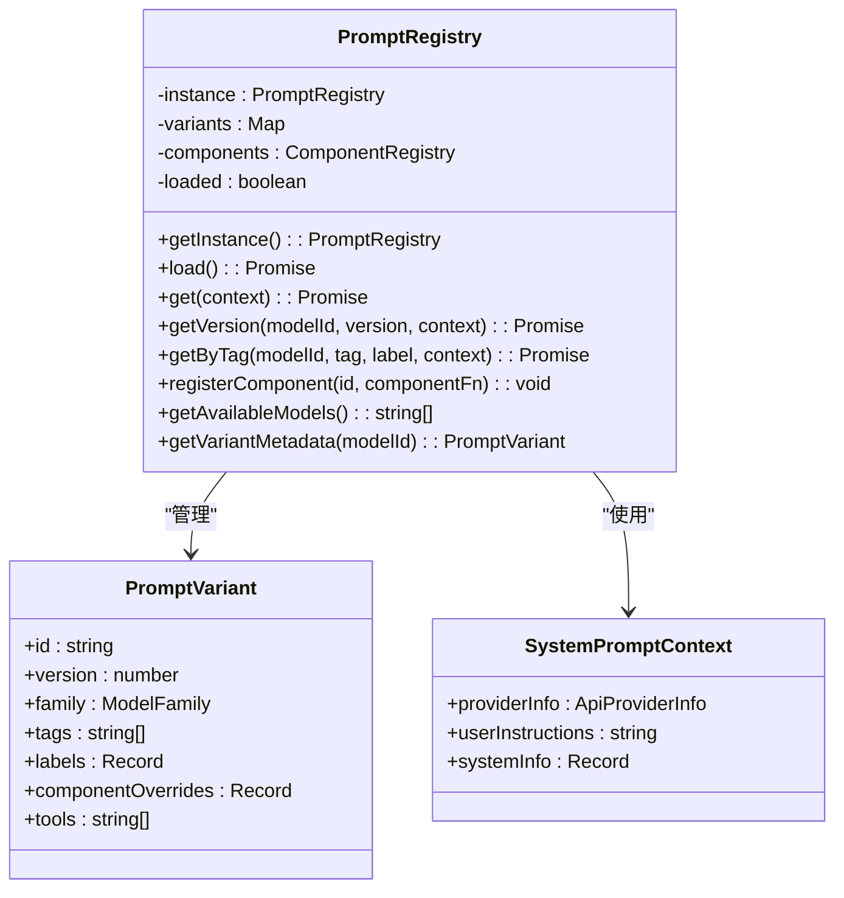
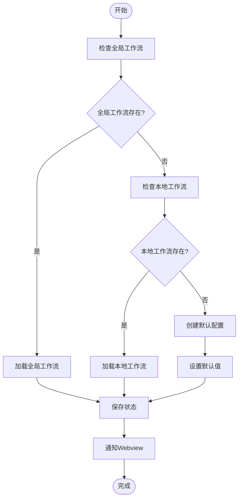
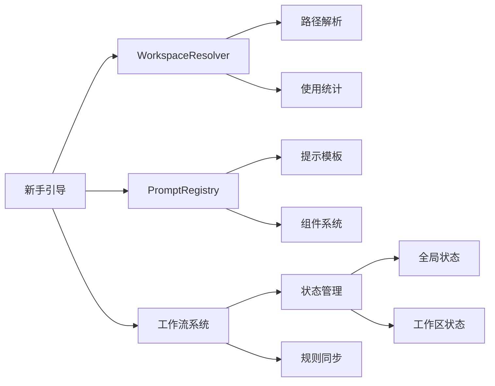

# 新项目启动最佳实践

<cite>
**本文档中引用的文件**  
- [WorkspaceResolver.ts](file://src/core/workspace/WorkspaceResolver.ts)
- [PromptRegistry.ts](file://src/core/prompts/system-prompt/registry/PromptRegistry.ts)
- [workflows.ts](file://src/core/context/instructions/user-instructions/workflows.ts)
- [toggleWorkflow.ts](file://src/core/controller/file/toggleWorkflow.ts)
- [step1.md](file://walkthrough/step1.md)
- [step2.md](file://walkthrough/step2.md)
- [step3.md](file://walkthrough/step3.md)
- [step4.md](file://walkthrough/step4.md)
- [step5.md](file://walkthrough/step5.md)
</cite>

## 目录
1. [简介](#简介)
2. [项目结构](#项目结构)
3. [核心组件](#核心组件)
4. [架构概述](#架构概述)
5. [详细组件分析](#详细组件分析)
6. [依赖分析](#依赖分析)
7. [性能考虑](#性能考虑)
8. [故障排除指南](#故障排除指南)
9. [结论](#结论)
10. [附录](#附录)（如有必要）

## 简介
本文档旨在为新项目启动提供最佳实践指南，重点介绍如何快速配置和初始化Cline以适应新项目。我们将指导用户如何利用预设的工作流（workflows）和系统提示模板（PromptRegistry）来为项目设置合适的AI行为模式，例如选择“快速原型”或“严谨开发”等预设。同时，说明如何通过WorkspaceResolver正确识别项目根目录，并利用新手引导（walkthrough）完成初始设置。最后，分享如何为项目定义一套标准的上下文规则和指令，以确保Cline在整个项目生命周期中保持一致的行为。

## 项目结构
Cline项目采用模块化设计，主要分为以下几个核心目录：
- `src/`：核心源代码目录，包含核心逻辑、控制器、提示系统等
- `walkthrough/`：新手引导文件，指导用户完成初始设置
- `.clinerules/`：工作流和规则定义文件
- `evals/`：评估系统，用于基准测试和性能评估



**Diagram sources**
- [WorkspaceResolver.ts](file://src/core/workspace/WorkspaceResolver.ts#L1-L275)
- [PromptRegistry.ts](file://src/core/prompts/system-prompt/registry/PromptRegistry.ts#L1-L314)
- [workflows.ts](file://src/core/context/instructions/user-instructions/workflows.ts#L1-L33)
- [toggleWorkflow.ts](file://src/core/controller/file/toggleWorkflow.ts#L1-L42)

**Section sources**
- [WorkspaceResolver.ts](file://src/core/workspace/WorkspaceResolver.ts#L1-L275)
- [PromptRegistry.ts](file://src/core/prompts/system-prompt/registry/PromptRegistry.ts#L1-L314)

## 核心组件
新项目启动的核心组件包括：
- **WorkspaceResolver**：负责项目根目录识别和路径解析
- **PromptRegistry**：管理系统的提示模板和工作流预设
- **Workflows系统**：提供可配置的工作流预设，如“快速原型”和“严谨开发”
- **新手引导（Walkthrough）**：指导用户完成初始设置流程

**Section sources**
- [WorkspaceResolver.ts](file://src/core/workspace/WorkspaceResolver.ts#L1-L275)
- [PromptRegistry.ts](file://src/core/prompts/system-prompt/registry/PromptRegistry.ts#L1-L314)
- [workflows.ts](file://src/core/context/instructions/user-instructions/workflows.ts#L1-L33)

## 架构概述
Cline的新项目启动架构采用分层设计，确保配置的灵活性和一致性。



**Diagram sources**
- [WorkspaceResolver.ts](file://src/core/workspace/WorkspaceResolver.ts#L1-L275)
- [PromptRegistry.ts](file://src/core/prompts/system-prompt/registry/PromptRegistry.ts#L1-L314)

## 详细组件分析

### WorkspaceResolver分析
WorkspaceResolver是项目根目录识别的核心组件，负责解析工作区路径并跟踪使用情况。

```mermaid
classDiagram
class WorkspaceResolver {
+usageMap : Map<string, UsageStats>
+traceEnabled : boolean
+resolveWorkspacePath(cwdOrRoots, relativePath, context) : string | { absolutePath, root }
+getMigrationReport() : string
+getUsageStats() : Map<string, UsageStats>
+clearUsageStats() : void
+exportUsageData() : Record<string, UsageStats>
+getBasename(filePath, context) : string
}
class UsageStats {
+count : number
+examples : string[]
+lastUsed : Date
}
class WorkspaceRoot {
+path : string
+name : string
}
WorkspaceResolver --> UsageStats : "包含"
WorkspaceResolver --> WorkspaceRoot : "解析"
```

**Diagram sources**
- [WorkspaceResolver.ts](file://src/core/workspace/WorkspaceResolver.ts#L1-L275)

### PromptRegistry分析
PromptRegistry是系统提示模板的管理中心，负责加载和管理各种提示变体。



**Diagram sources**
- [PromptRegistry.ts](file://src/core/prompts/system-prompt/registry/PromptRegistry.ts#L1-L314)

### 工作流系统分析
工作流系统允许用户通过预设配置AI的行为模式。



**Diagram sources**
- [workflows.ts](file://src/core/context/instructions/user-instructions/workflows.ts#L1-L33)
- [toggleWorkflow.ts](file://src/core/controller/file/toggleWorkflow.ts#L1-L42)

**Section sources**
- [workflows.ts](file://src/core/context/instructions/user-instructions/workflows.ts#L1-L33)
- [toggleWorkflow.ts](file://src/core/controller/file/toggleWorkflow.ts#L1-L42)

## 依赖分析
新项目启动功能的依赖关系如下：



**Diagram sources**
- [WorkspaceResolver.ts](file://src/core/workspace/WorkspaceResolver.ts#L1-L275)
- [PromptRegistry.ts](file://src/core/prompts/system-prompt/registry/PromptRegistry.ts#L1-L314)
- [workflows.ts](file://src/core/context/instructions/user-instructions/workflows.ts#L1-L33)

## 性能考虑
在新项目启动过程中，性能主要受以下因素影响：
- **路径解析效率**：WorkspaceResolver的路径解析操作应尽可能高效
- **提示加载速度**：PromptRegistry的初始化和提示加载应优化
- **状态同步延迟**：工作流状态的同步应快速响应
- **内存使用**：使用统计和缓存应控制内存占用

建议在大型项目中启用MULTI_ROOT_TRACE环境变量以监控性能瓶颈。

## 故障排除指南
### 常见问题及解决方案

| 问题现象 | 可能原因 | 解决方案 |
|---------|---------|---------|
| 无法识别项目根目录 | WorkspaceResolver配置错误 | 检查项目目录结构和配置 |
| 提示模板加载失败 | PromptRegistry初始化异常 | 检查网络连接和文件权限 |
| 工作流切换无效 | 状态同步问题 | 重启Cline或清除缓存 |
| 新手引导无法启动 | 引导文件缺失 | 检查walkthrough目录完整性 |

**Section sources**
- [WorkspaceResolver.ts](file://src/core/workspace/WorkspaceResolver.ts#L1-L275)
- [PromptRegistry.ts](file://src/core/prompts/system-prompt/registry/PromptRegistry.ts#L1-L314)

## 结论
通过合理配置WorkspaceResolver、PromptRegistry和工作流系统，可以实现新项目的快速启动和高效配置。建议用户充分利用预设的工作流和系统提示模板，结合新手引导完成初始设置，为项目建立一致的上下文规则和指令体系。

## 附录
### 新手引导步骤概览
- **step1.md**: 介绍Cline的规划能力
- **step2.md**: 项目初始化流程
- **step3.md**: 工作流选择指南
- **step4.md**: 提示系统配置
- **step5.md**: 项目上下文设置

**Section sources**
- [step1.md](file://walkthrough/step1.md#L1-L7)
- [step2.md](file://walkthrough/step2.md)
- [step3.md](file://walkthrough/step3.md)
- [step4.md](file://walkthrough/step4.md)
- [step5.md](file://walkthrough/step5.md)