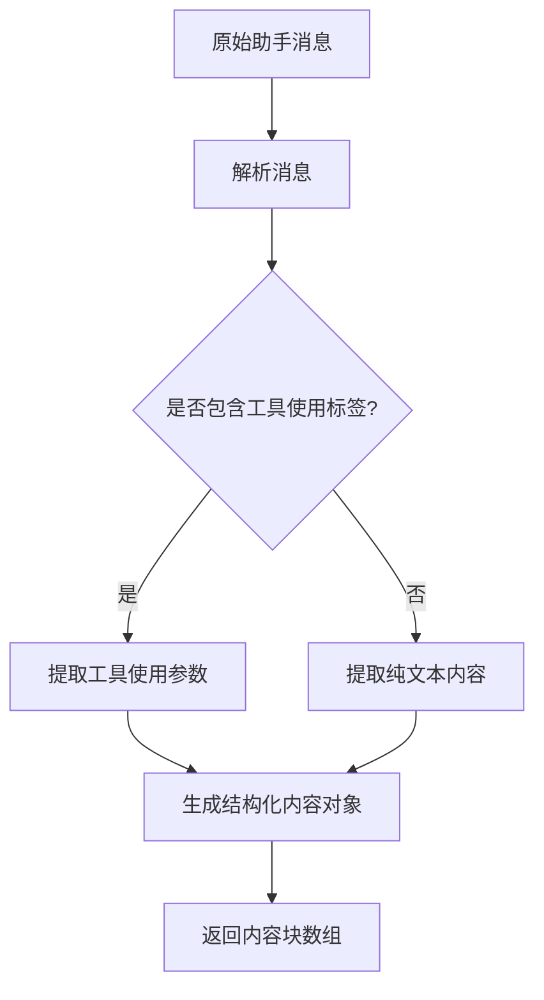
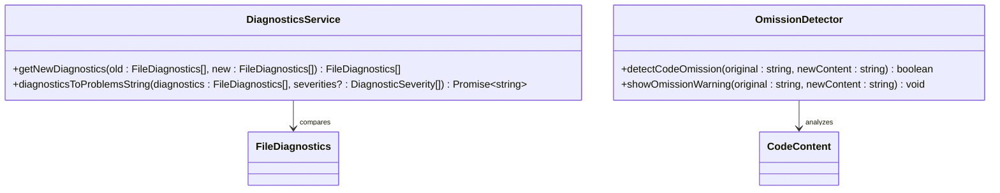

# 调试问题最佳实践

<cite>
**本文档中引用的文件**  
- [parse-assistant-message.ts](file://src/core/assistant-message/parse-assistant-message.ts)
- [diagnostics/index.ts](file://src/integrations/diagnostics/index.ts)
- [detect-omission.ts](file://src/integrations/editor/detect-omission.ts)
</cite>

## 目录
1. [简介](#简介)
2. [提供上下文信息](#提供上下文信息)
3. [提出清晰的问题](#提出清晰的问题)
4. [解析助手响应](#解析助手响应)
5. [验证建议的解决方案](#验证建议的解决方案)
6. [代码审查的重要性](#代码审查的重要性)

## 简介
本文档旨在为用户提供一套系统性的调试问题最佳实践指南。通过结合Cline的多种功能，包括响应解析、诊断服务和编辑器集成，用户可以更高效地诊断和解决代码问题。本指南将详细介绍如何有效利用这些工具来提升调试效率。

## 提供上下文信息
在向Cline提交问题之前，必须提供充分的上下文信息。这包括错误日志、相关的源代码文件、堆栈跟踪信息以及问题的简要描述。完整的上下文有助于Cline准确理解问题的本质并提供有针对性的解决方案。

**Section sources**
- [parse-assistant-message.ts](file://src/core/assistant-message/parse-assistant-message.ts#L23-L33)

## 提出清晰的问题
为了获得最佳的诊断结果，应提出清晰且具体的问题。例如，可以使用“分析以下错误日志并指出最可能的三个原因”这样的表述。明确的问题有助于引导Cline聚焦于关键问题点，从而提高诊断的准确性和效率。

## 解析助手响应
Cline的`parse-assistant-message`功能能够解析助手的消息内容，将其分解为结构化的文本和工具使用块。该功能通过XML-like标签识别不同的内容类型，并生成相应的结构化数据，帮助用户理解助手的诊断思路。

**Diagram sources**
- [parse-assistant-message.ts](file://src/core/assistant-message/parse-assistant-message.ts#L35-L73)

**Section sources**
- [parse-assistant-message.ts](file://src/core/assistant-message/parse-assistant-message.ts#L0-L237)

## 验证建议的解决方案
利用Cline的诊断服务和编辑器集成功能，可以验证建议的解决方案。`diagnostics`模块能够比较新旧诊断信息，识别出新增的问题。同时，`detect-omission`功能可以检测潜在的代码遗漏，确保生成的代码完整性。

**Diagram sources**
- [diagnostics/index.ts](file://src/integrations/diagnostics/index.ts#L0-L40)
- [detect-omission.ts](file://src/integrations/editor/detect-omission.ts#L0-L35)

**Section sources**
- [diagnostics/index.ts](file://src/integrations/diagnostics/index.ts#L0-L76)
- [detect-omission.ts](file://src/integrations/editor/detect-omission.ts#L0-L61)

## 代码审查的重要性
在应用任何修复建议之前，进行彻底的代码审查至关重要。这不仅有助于发现潜在的逻辑错误，还能确保代码风格的一致性。通过结合自动化工具和人工审查，可以最大限度地减少引入新问题的风险。