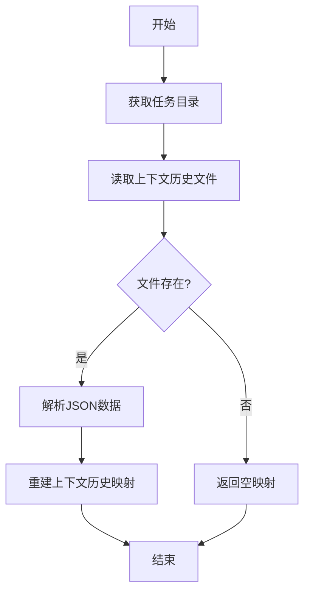
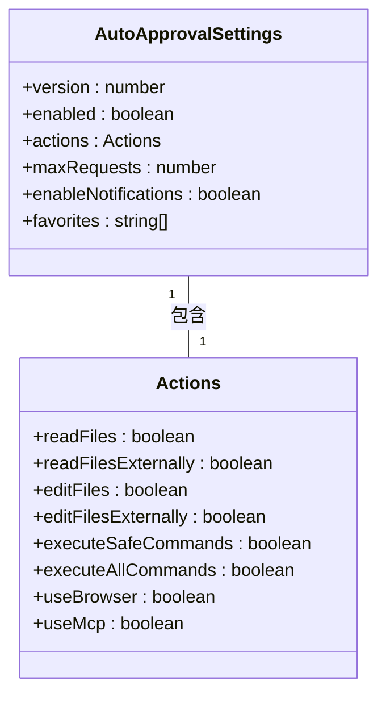
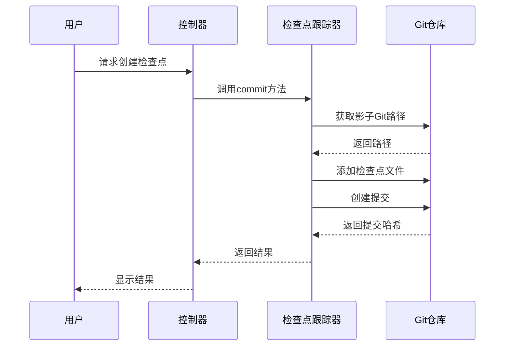
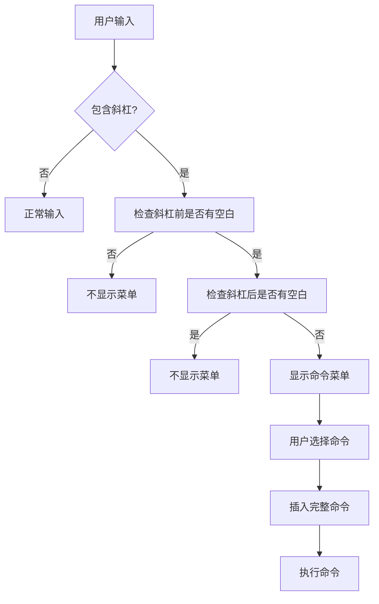
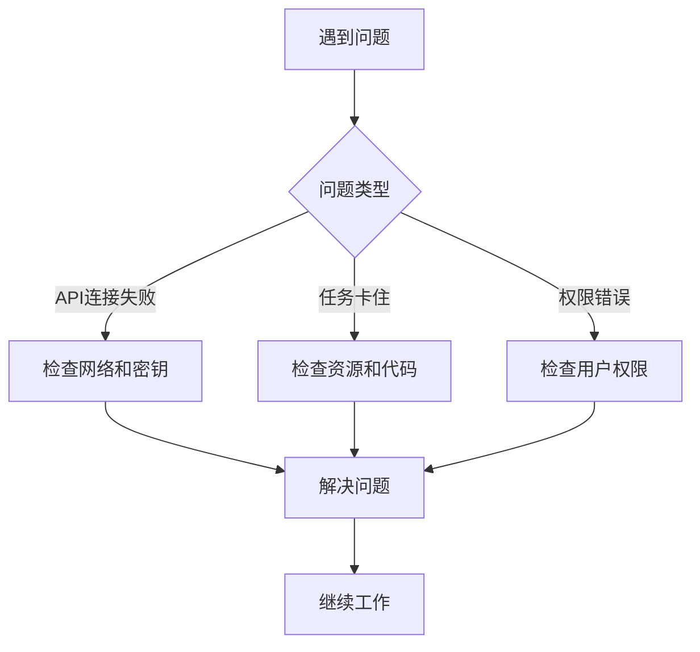

# 用户指南

<cite>
**本文档中引用的文件**  
- [ContextManager.ts](file://src/core/context/context-management/ContextManager.ts)
- [auto-approval-settings-conversion.ts](file://src/shared/proto-conversions/models/auto-approval-settings-conversion.ts)
- [autoApprove.ts](file://src/core/task/tools/autoApprove.ts)
- [checkpointDiff.ts](file://src/core/controller/checkpoints/checkpointDiff.ts)
- [CheckpointTracker.ts](file://src/integrations/checkpoints/CheckpointTracker.ts)
- [slash-commands.ts](file://webview-ui/src/utils/slash-commands.ts)
- [ClineError.ts](file://src/services/error/ClineError.ts)
</cite>

## 目录
1. [简介](#简介)
2. [上下文管理](#上下文管理)
3. [自动审批规则配置](#自动审批规则配置)
4. [检查点系统使用](#检查点系统使用)
5. [斜杠命令（/）操作](#斜杠命令（/）操作)
6. [不同开发场景的最佳实践](#不同开发场景的最佳实践)
7. [故障排除](#故障排除)
8. [结论](#结论)

## 简介
本用户指南旨在为用户提供全面的操作指导，深入探讨Cline平台的各项功能及其高级用法。通过详细解释上下文管理、自动审批规则、检查点系统和斜杠命令的使用方法，帮助用户在日常开发中提高效率。此外，本指南还提供了针对不同开发场景的最佳实践建议，并设立专门的故障排除章节，以解决常见问题。

## 上下文管理
上下文管理是Cline平台的核心功能之一，它允许用户在会话中保持和传递相关信息。通过`ContextManager`类，系统能够存储和检索上下文历史记录，确保在任务执行过程中信息的连续性和完整性。

### 上下文历史记录的保存与加载
`ContextManager`类中的`saveContextHistory`和`getSavedContextHistory`方法分别用于将上下文历史记录保存到磁盘和从磁盘加载。这些方法确保了即使在会话中断后，用户也能恢复之前的上下文状态。

**Diagram sources**
- [ContextManager.ts](file://src/core/context/context-management/ContextManager.ts#L64-L105)

**Section sources**
- [ContextManager.ts](file://src/core/context/context-management/ContextManager.ts#L64-L105)

## 自动审批规则配置
自动审批规则配置允许用户预先设定哪些操作可以自动执行，从而提高工作效率。通过`AutoApprovalSettings`对象，用户可以控制文件读取、编辑、命令执行等操作的自动审批状态。

### 配置自动审批设置
用户可以通过`updateAutoApproveSettings`函数来更新自动审批设置。该函数接收一个`AutoApprovalSettings`对象作为参数，并将其转换为协议缓冲区格式后发送给服务器。

**Diagram sources**
- [auto-approval-settings-conversion.ts](file://src/shared/proto-conversions/models/auto-approval-settings-conversion.ts#L0-L23)
- [autoApprove.ts](file://src/core/task/tools/autoApprove.ts#L8-L47)

**Section sources**
- [auto-approval-settings-conversion.ts](file://src/shared/proto-conversions/models/auto-approval-settings-conversion.ts#L0-L23)
- [autoApprove.ts](file://src/core/task/tools/autoApprove.ts#L8-L47)

## 检查点系统使用
检查点系统允许用户在代码变更过程中创建和恢复检查点，以便于比较和回滚。通过`CheckpointTracker`类，系统能够在影子Git仓库中创建新的检查点提交。

### 创建检查点提交
`CheckpointTracker`类的`commit`方法负责在影子Git仓库中创建新的检查点提交。此方法首先获取影子Git路径，然后使用`simple-git`库进行文件添加和提交操作。

**Diagram sources**
- [CheckpointTracker.ts](file://src/integrations/checkpoints/CheckpointTracker.ts#L128-L168)
- [checkpointDiff.ts](file://src/core/controller/checkpoints/checkpointDiff.ts#L0-L8)

**Section sources**
- [CheckpointTracker.ts](file://src/integrations/checkpoints/CheckpointTracker.ts#L128-L168)
- [checkpointDiff.ts](file://src/core/controller/checkpoints/checkpointDiff.ts#L0-L8)

## 斜杠命令（/）操作
斜杠命令提供了一种快速执行特定操作的方式。用户可以在输入框中键入斜杠后跟命令名称来触发相应的功能。

### 斜杠命令的处理流程
当用户输入斜杠命令时，系统会调用`shouldShowSlashCommandsMenu`函数来判断是否显示命令菜单。如果匹配成功，则调用`insertSlashCommand`函数插入完整的命令。

**Diagram sources**
- [slash-commands.ts](file://webview-ui/src/utils/slash-commands.ts#L93-L135)
- [slash-commands.ts](file://webview-ui/src/utils/slash-commands.ts#L129-L174)

**Section sources**
- [slash-commands.ts](file://webview-ui/src/utils/slash-commands.ts#L93-L135)
- [slash-commands.ts](file://webview-ui/src/utils/slash-commands.ts#L129-L174)

## 不同开发场景的最佳实践
### 代码重构
在进行代码重构时，建议使用检查点系统定期保存当前状态，以便在出现问题时能够快速回滚。同时，利用上下文管理功能记录重构过程中的关键决策点。

### 调试复杂问题
调试复杂问题时，可以启用详细的日志记录，并结合自动审批规则减少重复性操作。使用斜杠命令快速执行常用的调试指令，如查看变量值或调用测试函数。

### 启动新项目
启动新项目时，应首先配置好自动审批规则，以适应项目的特定需求。利用上下文管理功能导入项目相关的文档和代码片段，加快开发速度。

## 故障排除
### API连接失败
如果遇到API连接失败的问题，请检查网络连接是否正常，确认API密钥是否正确无误。还可以尝试重启Cline服务或重新登录账户。

### 任务卡住
当任务长时间无响应时，可能是由于资源不足或代码逻辑错误导致。建议检查系统资源使用情况，查看是否有无限循环或其他性能瓶颈。

### 权限错误
权限错误通常发生在尝试访问受限资源时。请确保当前用户具有足够的权限，并检查相关配置文件中的权限设置。

**Diagram sources**
- [ClineError.ts](file://src/services/error/ClineError.ts#L85-L132)

**Section sources**
- [ClineError.ts](file://src/services/error/ClineError.ts#L85-L132)

## 结论
本用户指南详细介绍了Cline平台的各项功能及其高级用法，包括上下文管理、自动审批规则配置、检查点系统使用和斜杠命令操作。通过遵循最佳实践并利用故障排除指南，用户可以在各种开发场景中更高效地使用Cline平台。