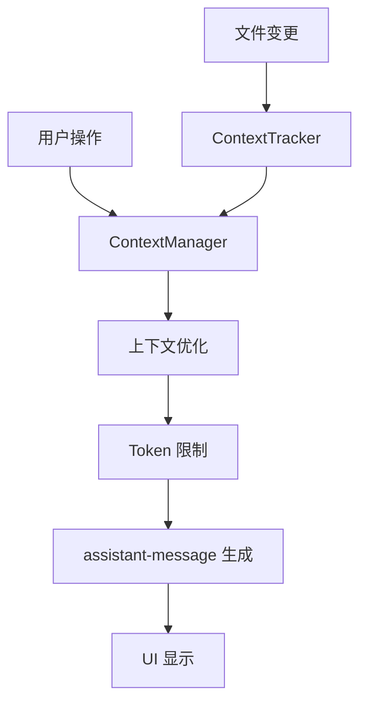
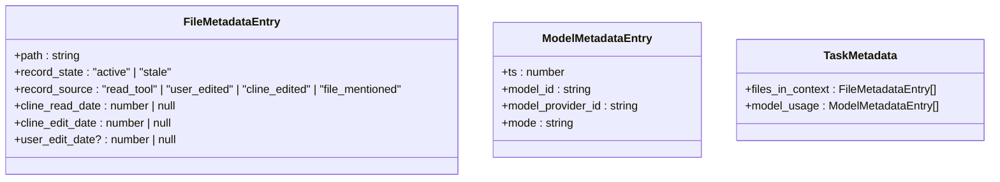
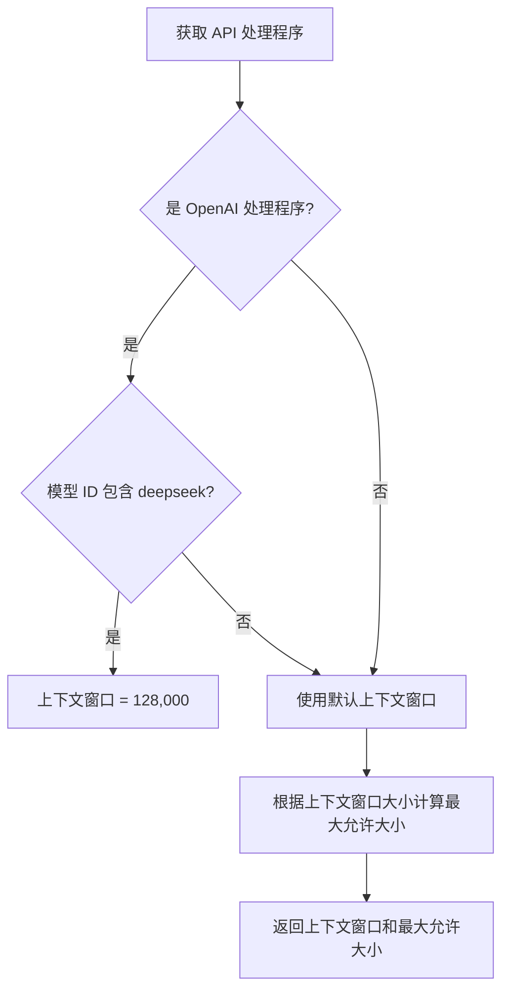
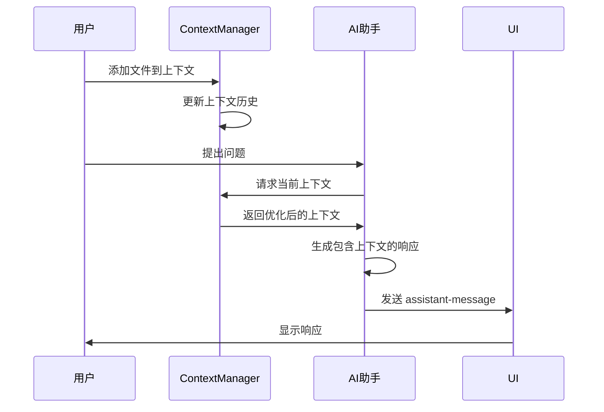

# 上下文管理

<cite>
**本文档中引用的文件**  
- [ContextManager.ts](file://src/core/context/context-management/ContextManager.ts)
- [context-window-utils.ts](file://src/core/context/context-management/context-window-utils.ts)
- [ContextTrackerTypes.ts](file://src/core/context/context-tracking/ContextTrackerTypes.ts)
- [FileContextTracker.ts](file://src/core/context/context-tracking/FileContextTracker.ts)
- [ModelContextTracker.ts](file://src/core/context/context-tracking/ModelContextTracker.ts)
</cite>

## 目录
1. [简介](#简介)
2. [上下文管理架构](#上下文管理架构)
3. [ContextManager 类实现机制](#contextmanager-类实现机制)
4. [上下文跟踪系统](#上下文跟踪系统)
5. [上下文窗口优化策略](#上下文窗口优化策略)
6. [UI 中的上下文管理](#ui-中的上下文管理)
7. [上下文在 assistant-message 生成中的作用](#上下文在-assistant-message-生成中的作用)
8. [总结](#总结)

## 简介
Cline 的上下文管理功能是其核心能力之一，负责高效管理开发过程中的各种上下文信息。该系统通过 `ContextManager` 类和 `ContextTracker` 系统协同工作，确保在模型 token 限制内最大化上下文价值。上下文管理不仅包括文件和代码片段，还涵盖 URL、搜索结果等多种类型，为 AI 助手提供全面的开发环境感知能力。

## 上下文管理架构

**图示来源**  
- [ContextManager.ts](file://src/core/context/context-management/ContextManager.ts)
- [FileContextTracker.ts](file://src/core/context/context-tracking/FileContextTracker.ts)

## ContextManager 类实现机制

`ContextManager` 类是上下文管理的核心，负责协调和管理所有上下文相关的操作。该类通过维护一个复杂的映射结构来跟踪对话历史中的上下文变更。

### 核心数据结构
`ContextManager` 使用 `contextHistoryUpdates` 映射来存储上下文变更历史，其结构为：
- 外层映射：消息索引 → [编辑类型, 内层映射]
- 内层映射：块索引 → 上下文更新数组
- 上下文更新：[时间戳, 更新类型, 更新内容, 元数据]

这种结构设计支持完整的检查点功能，允许在回退到早期对话历史时撤销应用的变更。

### 上下文管理方法
`ContextManager` 提供了多种方法来管理不同类型的上下文：

- `addContext`: 添加文件、代码片段、URL 或搜索结果到上下文
- `removeContext`: 从上下文移除指定内容
- `initializeContextHistory`: 从磁盘加载上下文历史
- `saveContextHistory`: 将上下文历史保存到磁盘
- `truncateContextHistory`: 根据时间戳截断上下文历史

这些方法共同构成了一个完整的上下文生命周期管理机制。

**上下文来源**  
- [ContextManager.ts](file://src/core/context/context-management/ContextManager.ts#L42-L957)

## 上下文跟踪系统

上下文跟踪系统由 `ContextTracker` 组件组成，负责监控文件变更并自动更新上下文状态。

### 文件上下文跟踪
`FileContextTracker` 监控项目中的文件变更，包括：
- 文件读取操作
- 用户编辑操作
- Cline 编辑操作
- 文件提及操作

当检测到文件变更时，跟踪器会更新文件元数据，包括路径、记录状态、记录来源和各种操作的时间戳。

### 模型上下文跟踪
`ModelContextTracker` 跟踪模型使用情况，记录：
- 时间戳
- 模型 ID
- 模型提供商 ID
- 操作模式

这种跟踪机制确保了上下文管理能够适应不同模型的能力和限制。

**图示来源**  
- [ContextTrackerTypes.ts](file://src/core/context/context-tracking/ContextTrackerTypes.ts#L1-L22)

**上下文来源**  
- [FileContextTracker.ts](file://src/core/context/context-tracking/FileContextTracker.ts)
- [ModelContextTracker.ts](file://src/core/context/context-tracking/ModelContextTracker.ts)

## 上下文窗口优化策略

上下文窗口优化是 Cline 高效管理上下文的关键，确保在模型 token 限制内最大化上下文价值。

### 上下文窗口信息获取
`getContextWindowInfo` 函数根据 API 处理程序获取上下文窗口信息：

**图示来源**  
- [context-window-utils.ts](file://src/core/context/context-management/context-window-utils.ts#L1-L36)

### 上下文压缩决策
系统通过以下逻辑决定是否压缩上下文窗口：

1. 检查前一个 API 请求的 token 使用情况
2. 计算总 token 数（输入 + 输出 + 缓存写入 + 缓存读取）
3. 与最大允许大小比较
4. 如果超过阈值，则触发上下文压缩

### 上下文优化方法
`ContextManager` 实现了多种上下文优化方法：

- **文件读取优化**: 识别并替换重复的文件读取操作
- **文本块优化**: 对包含多个文件读取的文本块进行迭代更新
- **智能截断**: 根据模型上下文窗口大小智能选择截断策略

当检测到上下文接近限制时，系统会：
1. 应用上下文优化步骤
2. 计算字符节省百分比
3. 如果节省足够（≥30%），则避免截断
4. 否则执行标准上下文截断

**上下文来源**  
- [ContextManager.ts](file://src/core/context/context-management/ContextManager.ts#L150-L250)
- [context-window-utils.ts](file://src/core/context/context-management/context-window-utils.ts)

## UI 中的上下文管理

在 UI 中，上下文管理通过直观的界面元素实现，使用户能够轻松添加和管理上下文。

### 上下文添加操作
用户可以通过以下方式在 UI 中添加上下文：
- 拖放文件到聊天界面
- 使用命令面板选择文件
- 在代码编辑器中右键选择"添加到 Cline"
- 直接粘贴 URL 或搜索结果

### 上下文可视化
UI 显示当前上下文状态，包括：
- 已添加的文件列表
- 上下文使用百分比
- 即将被截断的警告
- 上下文优化建议

### 实际操作示例
1. 用户在项目中选择一个文件
2. 右键点击并选择"添加到 Cline"
3. 系统调用 `addContext` 方法将文件添加到上下文
4. UI 更新显示新添加的文件
5. 当文件被修改时，`ContextTracker` 自动更新上下文状态

**上下文来源**  
- [ContextManager.ts](file://src/core/context/context-management/ContextManager.ts)
- [FileContextTracker.ts](file://src/core/context/context-tracking/FileContextTracker.ts)

## 上下文在 assistant-message 生成中的作用

上下文管理在 `assistant-message` 生成过程中扮演着关键角色，直接影响 AI 助手的响应质量和相关性。

### 上下文注入机制
当生成 `assistant-message` 时，系统会：
1. 检查当前上下文状态
2. 根据模型 token 限制优化上下文
3. 将优化后的上下文注入到消息生成过程中
4. 生成包含相关上下文信息的响应

### 上下文影响示例

**图示来源**  
- [ContextManager.ts](file://src/core/context/context-management/ContextManager.ts)
- [assistant-message/index.ts](file://src/core/assistant-message/index.ts)

### 上下文优化效果
通过上下文优化，系统能够：
- 减少重复的文件内容
- 保持关键上下文信息
- 提高 token 使用效率
- 增强响应的相关性

当上下文接近限制时，系统会自动应用优化策略，确保 AI 助手始终有足够的上下文来生成高质量的响应。

**上下文来源**  
- [ContextManager.ts](file://src/core/context/context-management/ContextManager.ts)
- [assistant-message/index.ts](file://src/core/assistant-message/index.ts)

## 总结
Cline 的上下文管理功能通过 `ContextManager` 类和 `ContextTracker` 系统的协同工作，实现了高效、智能的上下文管理。该系统不仅能够管理多种类型的上下文信息，还能根据模型的 token 限制智能地优化上下文使用。通过在 UI 中提供直观的上下文管理界面，用户可以轻松地添加和管理上下文，而上下文跟踪系统则确保了上下文状态的实时更新。这种全面的上下文管理机制为 AI 助手提供了强大的环境感知能力，显著提升了开发效率和用户体验。