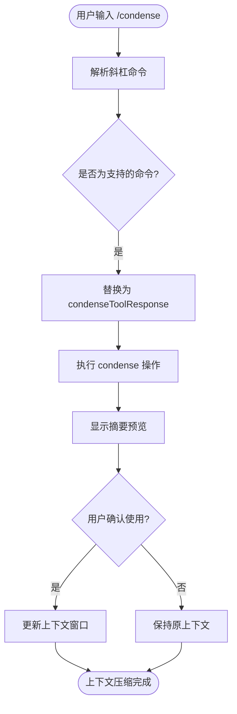
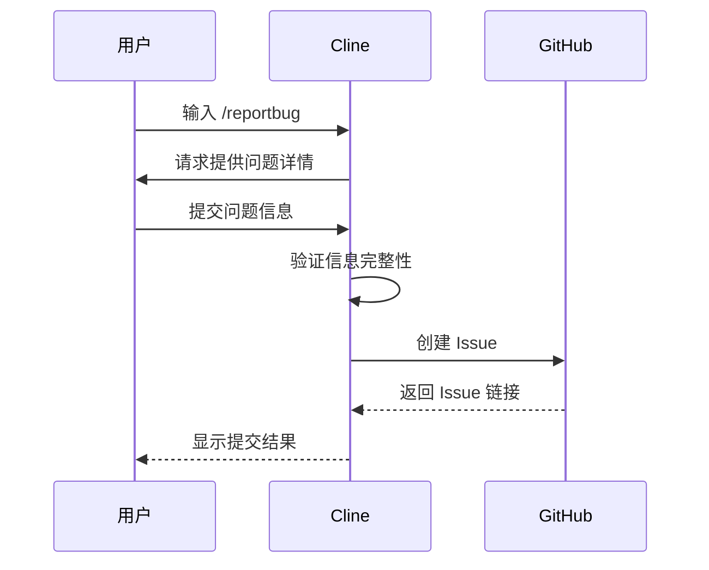

# 斜杠命令

<cite>
**本文档中引用的文件**  
- [index.ts](file://src/core/slash-commands/index.ts)
- [condense.ts](file://src/core/controller/slash/condense.ts)
- [reportBug.ts](file://src/core/controller/slash/reportBug.ts)
- [commands.ts](file://src/core/prompts/commands.ts)
- [slash-commands.ts](file://webview-ui/src/utils/slash-commands.ts)
</cite>

## 目录
1. [简介](#简介)
2. [核心功能](#核心功能)
3. `/condense` 命令详解
4. `/reportBug` 命令详解
5. 斜杠命令系统实现机制
6. 命令语法与使用场景
7. UI 触发与反馈机制

## 简介
斜杠命令是 Cline 提供的一种快捷功能，允许用户通过输入以 `/` 开头的特殊指令来触发特定操作。这些命令简化了复杂任务的执行流程，提升了交互效率。本文档将详细介绍 `/condense` 和 `/reportBug` 两个核心命令的功能、使用方法及底层实现机制。

**Section sources**
- [index.ts](file://src/core/slash-commands/index.ts#L15-L134)

## 核心功能
斜杠命令系统支持多种内置命令和自定义工作流命令。内置命令包括 `newtask`、`smol`（或 `compact`）、`newrule`、`reportbug` 和 `deep-planning`，分别用于创建新任务、压缩上下文、生成规则文件、报告问题和制定详细实施计划。系统优先处理内置命令，若无匹配则尝试调用用户定义的工作流文件。

**Section sources**
- [index.ts](file://src/core/slash-commands/index.ts#L15-L134)
- [slash-commands.ts](file://webview-ui/src/utils/slash-commands.ts#L1-L208)

## `/condense` 命令详解
`/condense` 命令（别名：`/smol`、`/compact`）用于快速总结当前对话或任务历史，帮助用户压缩上下文窗口，保留关键信息。该命令生成一个结构化摘要，涵盖之前的对话概览、当前工作内容、关键技术概念、相关文件与代码、已解决问题及待办事项。

### 使用语法
```
/condense
```

### 参数说明
- **Context**: 必需参数，包含以下子项：
  1. Previous Conversation: 对话的高层级概述。
  2. Current Work: 当前工作的详细描述。
  3. Key Technical Concepts: 讨论的技术概念列表。
  4. Relevant Files and Code: 相关文件及其修改摘要。
  5. Problem Solving: 已解决的问题和正在进行的故障排除。
  6. Pending Tasks and Next Steps: 待办任务和下一步行动。

### 实际应用场景
当对话变得冗长且上下文过载时，用户可使用 `/condense` 命令生成精简版上下文，便于继续后续开发工作，同时避免信息丢失。



**Diagram sources**
- [condense.ts](file://src/core/controller/slash/condense.ts#L1-L11)
- [commands.ts](file://src/core/prompts/commands.ts#L22-L88)

**Section sources**
- [condense.ts](file://src/core/controller/slash/condense.ts#L1-L11)
- [commands.ts](file://src/core/prompts/commands.ts#L22-L88)

## `/reportBug` 命令详解
`/reportBug` 命令用于收集环境信息并提交问题报告至 Cline 的 GitHub 页面。该命令引导用户填写必要的问题描述字段，并通过工具调用生成标准化的 GitHub Issue。

### 使用语法
```
/reportbug
```

### 参数说明
- **title**: 问题的简明标题。
- **what_happened**: 实际发生的情况及预期行为。
- **steps_to_reproduce**: 复现问题的步骤。
- **api_request_output**: 可选，相关的 API 请求输出。
- **additional_context**: 可选，其他未提及的上下文信息。

### 实际应用场景
当用户遇到软件缺陷或异常行为时，可通过 `/reportBug` 命令快速提交详细的错误报告，加速问题排查与修复过程。



**Diagram sources**
- [reportBug.ts](file://src/core/controller/slash/reportBug.ts#L1-L11)
- [commands.ts](file://src/core/prompts/commands.ts#L155-L184)

**Section sources**
- [reportBug.ts](file://src/core/controller/slash/reportBug.ts#L1-L11)
- [commands.ts](file://src/core/prompts/commands.ts#L155-L184)

## 斜杠命令系统实现机制
斜杠命令系统的实现基于 `slash-commands` 模块中的 `parseSlashCommands` 函数。该函数解析用户输入文本，识别并处理斜杠命令。系统首先检查是否为内置命令，若是则应用相应的替换逻辑；否则尝试匹配启用的工作流文件名。

### 注册与处理流程
1. 定义支持的默认命令列表。
2. 构建命令到响应模板的映射表。
3. 使用正则表达式匹配不同标签内的斜杠命令。
4. 根据命令类型执行相应逻辑，优先处理内置命令。
5. 若为工作流命令，则读取对应文件内容并注入指令。

```mermaid
classDiagram
class parseSlashCommands {
+SUPPORTED_DEFAULT_COMMANDS : string[]
+commandReplacements : Record~string, string~
+tagPatterns : {tag : string, regex : RegExp}[]
+parseSlashCommands(text : string, ...) : Promise~{processedText : string, needsClinerulesFileCheck : boolean}~
}
class condense {
+condense(controller : Controller, request : StringRequest) : Promise~Empty~
}
class reportBug {
+reportBug(controller : Controller, request : StringRequest) : Promise~Empty~
}
parseSlashCommands --> condense : 使用
parseSlashCommands --> reportBug : 使用
```

**Diagram sources**
- [index.ts](file://src/core/slash-commands/index.ts#L15-L134)
- [condense.ts](file://src/core/controller/slash/condense.ts#L1-L11)
- [reportBug.ts](file://src/core/controller/slash/reportBug.ts#L1-L11)

**Section sources**
- [index.ts](file://src/core/slash-commands/index.ts#L15-L134)

## 命令语法与使用场景
每个斜杠命令都有明确的语法格式和适用场景。用户需在聊天输入框中键入 `/` 后接命令名称，系统将自动识别并处理。

### 通用语法
```
/<command_name>
```

### 支持的命令
| 命令 | 描述 | 场景 |
|------|------|------|
| `/newtask` | 创建新任务并预加载上下文 | 开启新功能开发 |
| `/smol` 或 `/compact` | 压缩当前上下文 | 管理长对话历史 |
| `/newrule` | 创建新的 Cline 规则文件 | 定义项目规范 |
| `/reportbug` | 提交问题报告 | 报告软件缺陷 |
| `/deep-planning` | 制定详细实施计划 | 复杂功能规划 |

**Section sources**
- [slash-commands.ts](file://webview-ui/src/utils/slash-commands.ts#L1-L208)
- [commands.ts](file://src/core/prompts/commands.ts#L1-L445)

## UI 触发与反馈机制
用户可通过聊天界面的输入框直接触发斜杠命令。系统提供自动补全建议，并在输入 `/` 时显示可用命令列表。命令执行后，系统会生成预览供用户确认，确保操作符合预期。

### 触发条件
- 输入 `/` 后无前置非空白字符。
- 命令名称与内置或启用的工作流文件名匹配。

### 反馈流程
1. 用户输入斜杠命令。
2. 系统解析并验证命令。
3. 执行相应逻辑并生成响应。
4. 显示结果预览供用户确认。
5. 根据用户选择更新上下文或保持原状。

**Section sources**
- [slash-commands.ts](file://webview-ui/src/utils/slash-commands.ts#L1-L208)
- [index.ts](file://src/core/slash-commands/index.ts#L15-L134)