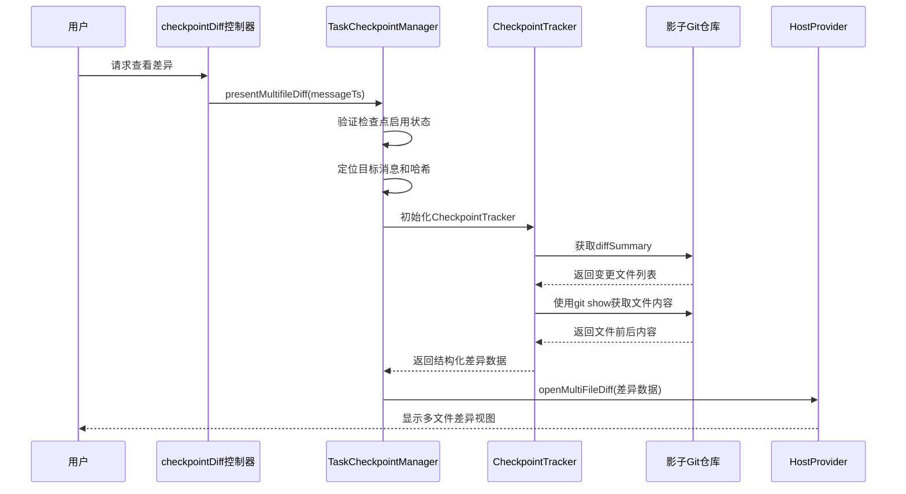
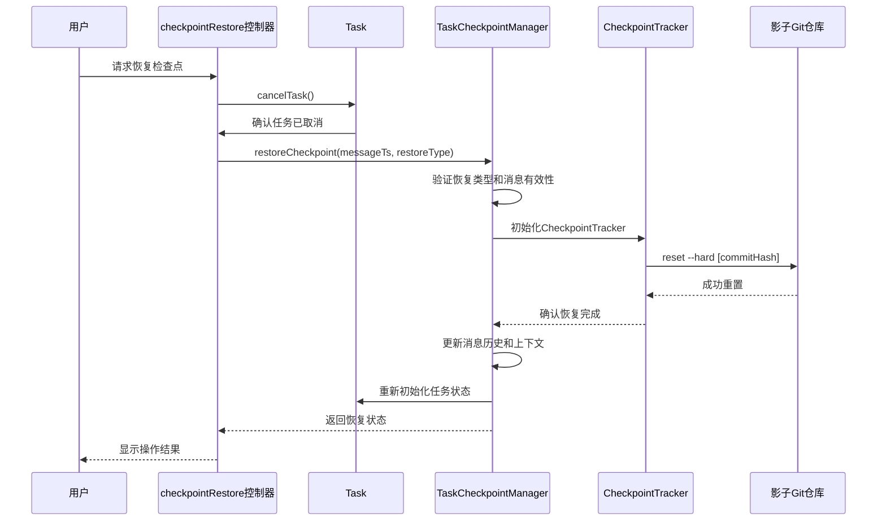
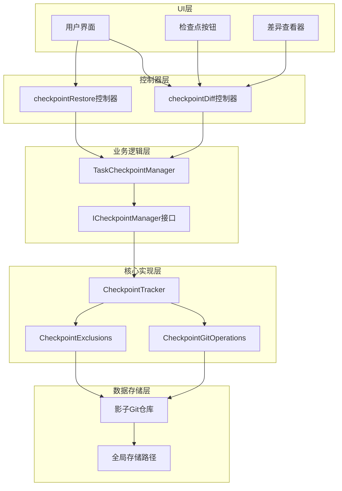
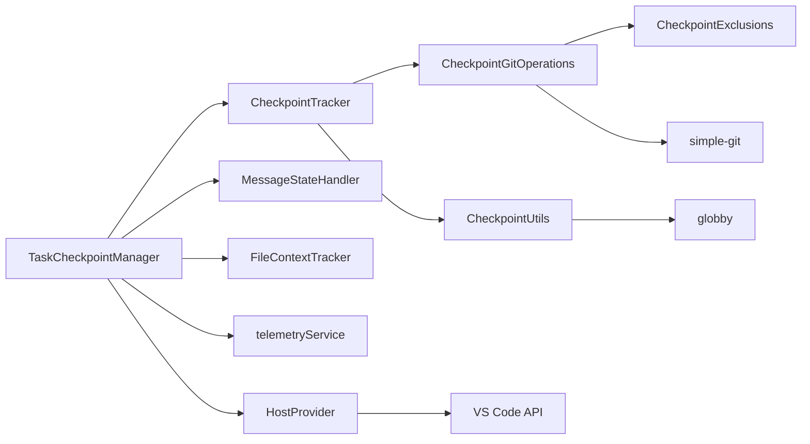

# 检查点

<cite>
**本文档中引用的文件**  
- [index.ts](file://src/integrations/checkpoints/index.ts)
- [CheckpointTracker.ts](file://src/integrations/checkpoints/CheckpointTracker.ts)
- [CheckpointGitOperations.ts](file://src/integrations/checkpoints/CheckpointGitOperations.ts)
- [CheckpointUtils.ts](file://src/integrations/checkpoints/CheckpointUtils.ts)
- [CheckpointExclusions.ts](file://src/integrations/checkpoints/CheckpointExclusions.ts)
- [checkpointDiff.ts](file://src/core/controller/checkpoints/checkpointDiff.ts)
- [checkpointRestore.ts](file://src/core/controller/checkpoints/checkpointRestore.ts)
- [types.ts](file://src/integrations/checkpoints/types.ts)
- [initializer.ts](file://src/integrations/checkpoints/initializer.ts)
</cite>

## 目录
1. [简介](#简介)
2. [检查点创建机制](#检查点创建机制)
3. [差异生成与比较](#差异生成与比较)
4. [代码恢复流程](#代码恢复流程)
5. [任务时间线可视化](#任务时间线可视化)
6. [用户界面比较功能](#用户界面比较功能)
7. [调试与回滚案例](#调试与回滚案例)
8. [架构概览](#架构概览)
9. [依赖分析](#依赖分析)

## 简介
Cline的检查点功能为开发者提供了一种强大的代码状态管理机制。该系统通过创建代码库的特定快照来捕获开发过程中的关键状态，使用户能够安全地探索不同的实现路径，同时保留回退到先前稳定状态的能力。检查点系统基于Git技术构建，但在独立的"影子"Git仓库中运行，避免干扰用户的主版本控制系统。此设计允许在不破坏现有工作流的情况下进行实验性更改，并提供了精确的变更追踪和恢复能力。检查点不仅记录代码变更，还与任务上下文紧密结合，确保代码状态与开发意图的一致性。

## 检查点创建机制
Cline的检查点创建机制通过`TaskCheckpointManager`类中的`saveCheckpoint`方法实现，该方法负责捕获代码库在特定时间点的完整状态。当用户执行相关操作或系统自动触发时，会调用此方法创建新的检查点。检查点的创建过程首先验证系统配置和环境条件，确保检查点功能已启用且工作目录有效。系统会为每个工作区生成唯一的哈希标识，用于组织和管理检查点数据。检查点数据存储在VS Code的全局存储路径下的独立目录中，结构为`globalStorage/checkpoints/{cwdHash}/.git`，其中`cwdHash`是工作目录路径的13位数字哈希。

检查点创建的核心操作由`CheckpointTracker`类的`commit`方法执行，该方法在影子Git仓库中创建一个新的提交。提交消息采用"checkpoint-{cwdHash}-{taskId}"格式，确保每个检查点都有唯一的标识。系统会自动处理文件的添加和提交过程，包括暂存所有变更文件并创建提交。为了提高性能和可靠性，系统实现了承诺（Promise）基础的同步机制，防止并发初始化尝试导致的竞争条件。此外，系统还包含超时保护机制，如果检查点初始化耗时过长，会向用户发出警告并建议重新打开项目或禁用检查点功能。

**Section sources**
- [index.ts](file://src/integrations/checkpoints/index.ts#L200-L300)
- [CheckpointTracker.ts](file://src/integrations/checkpoints/CheckpointTracker.ts#L100-L150)
- [CheckpointUtils.ts](file://src/integrations/checkpoints/CheckpointUtils.ts#L20-L50)

## 差异生成与比较
`checkpointDiff`控制器负责生成当前代码状态与指定检查点之间的差异，其核心功能由`TaskCheckpointManager`类的`presentMultifileDiff`方法实现。当用户请求查看差异时，系统首先验证检查点功能是否启用，然后定位到指定时间戳对应的消息。系统通过`lastCheckpointHash`属性获取目标检查点的提交哈希，并初始化`CheckpointTracker`实例以访问影子Git仓库。差异生成过程利用Git的`diffSummary`命令计算两个状态之间的文件变更，支持两种比较模式：从指定检查点到当前状态的变更，或从上次任务完成到当前状态的新变更。

对于多文件差异，系统会遍历所有变更文件，使用`git show`命令获取每个文件在检查点状态下的内容，并与当前工作目录中的文件内容进行比较。结果以结构化数据形式返回，包含文件的相对路径、绝对路径以及变更前后的完整内容。这些数据随后被传递给UI组件，在多文件差异编辑器中展示。系统还实现了智能优化，当检测到没有变更时会显示相应提示，避免不必要的UI渲染。整个过程通过`HostProvider.diff.openMultiFileDiff`方法与VS Code的差异查看功能集成，提供熟悉的用户体验。

**Diagram sources**
- [checkpointDiff.ts](file://src/core/controller/checkpoints/checkpointDiff.ts#L1-L10)
- [index.ts](file://src/integrations/checkpoints/index.ts#L400-L450)
- [CheckpointTracker.ts](file://src/integrations/checkpoints/CheckpointTracker.ts#L250-L300)

## 代码恢复流程
`checkpointRestore`控制器实现了代码恢复功能，其工作流程由`TaskCheckpointManager`类的`restoreCheckpoint`方法驱动。恢复过程首先取消当前任务，确保在修改消息历史时任务不处于活动状态，避免文件编辑或命令执行与恢复操作发生冲突。系统通过`pWaitFor`工具等待任务状态初始化完成，通常在3秒内超时。恢复操作支持三种模式：仅恢复任务上下文、仅恢复工作区文件，或同时恢复两者。当选择恢复工作区时，系统会使用`CheckpointTracker`的`resetHead`方法将影子Git仓库的HEAD重置到目标检查点的提交哈希，从而恢复文件到指定状态。

恢复过程包含多个安全检查和错误处理机制。系统首先验证目标消息是否存在及其检查点哈希是否有效。如果目标消息没有关联的检查点哈希，系统会回退到最近的有效检查点。在Git操作层面，系统会执行硬重置（`--hard`）以确保工作目录完全恢复到目标状态。恢复成功后，系统会更新消息历史，删除指定检查点之后的所有消息，并重新初始化任务状态。整个过程通过`telemetryService`进行性能监控，记录恢复操作的持续时间，以便后续优化。用户界面会显示相应的成功或错误消息，提供清晰的操作反馈。

**Diagram sources**
- [checkpointRestore.ts](file://src/core/controller/checkpoints/checkpointRestore.ts#L1-L34)
- [index.ts](file://src/integrations/checkpoints/index.ts#L300-L400)
- [CheckpointTracker.ts](file://src/integrations/checkpoints/CheckpointTracker.ts#L200-L250)

## 任务时间线可视化
检查点在任务时间线中以可视化方式表示，为用户提供清晰的历史状态导航。每个检查点在时间线上显示为一个特殊的"checkpoint_created"消息，与其他任务消息并列展示。系统通过`isCheckpointCheckedOut`标志跟踪当前激活的检查点状态，当用户恢复到某个检查点时，该检查点的消息会被标记为已检出，而其他检查点消息则标记为未检出。这种视觉反馈帮助用户快速识别当前代码状态对应的历史节点。

时间线还集成了智能比较功能，通过"See New Changes"按钮让用户轻松查看自上次任务完成以来的新变更。此功能由`doesLatestTaskCompletionHaveNewChanges`方法驱动，该方法计算当前状态与上次完成检查点之间的差异数量。如果存在新变更，按钮会激活并提示用户查看。系统通过分析消息历史中的`completion_result`消息来确定上次完成状态，并使用`getDiffCount`方法高效计算变更文件数量，避免加载完整的差异内容，从而提高响应速度。这种设计使用户能够快速评估近期工作的累积效果，而无需手动比较多个检查点。

**Section sources**
- [index.ts](file://src/integrations/checkpoints/index.ts#L450-L500)
- [index.ts](file://src/integrations/checkpoints/index.ts#L500-L550)

## 用户界面比较功能
Cline的用户界面提供了直观的检查点比较功能，使开发者能够轻松分析不同代码状态之间的差异。当用户选择比较两个检查点时，系统会启动多文件差异查看器，该查看器能够同时展示多个文件的变更。界面设计遵循VS Code的标准差异查看模式，左侧显示检查点状态下的文件内容，右侧显示当前或目标状态的内容，变更部分以颜色高亮显示。用户可以逐个文件导航，查看具体的添加、删除和修改。

比较功能支持两种主要模式：常规检查点比较和"新变更"比较。常规比较显示从指定检查点到当前状态的所有变更，而"新变更"比较则专注于自上次任务完成以来的增量变更。这种灵活性使用户能够根据需要选择合适的比较范围。界面还提供了上下文菜单和快捷操作，允许用户快速跳转到特定文件或在差异视图中直接编辑代码。所有比较操作都通过`HostProvider.diff.openMultiFileDiff`方法与VS Code的原生差异查看功能集成，确保一致的用户体验和高性能的渲染。

**Section sources**
- [index.ts](file://src/integrations/checkpoints/index.ts#L400-L450)
- [index.ts](file://src/integrations/checkpoints/index.ts#L450-L500)

## 调试与回滚案例
检查点功能在实际开发中具有重要的调试和回滚价值。一个典型的应用场景是实验性重构：开发者在进行大规模代码重构前创建一个检查点，然后自由地尝试不同的设计模式。如果重构导致意外的副作用或性能问题，开发者可以立即恢复到检查点状态，而不会丢失原始代码。这种"安全网"机制鼓励大胆的代码改进，同时降低了风险。

另一个常见案例是调试复杂问题：当引入新功能后出现难以追踪的bug时，开发者可以创建一系列检查点来隔离问题。通过在不同检查点之间切换并运行测试，可以快速确定问题引入的具体变更。系统提供的"新变更"比较功能特别有助于这种场景，因为它能精确显示自上次稳定状态以来的所有修改，帮助开发者聚焦于最可能的问题区域。此外，在团队协作中，检查点可用于保存和分享特定的代码状态，便于同行评审或问题复现，而无需依赖外部版本控制系统。

**Section sources**
- [index.ts](file://src/integrations/checkpoints/index.ts#L200-L300)
- [index.ts](file://src/integrations/checkpoints/index.ts#L300-L400)

## 架构概览
Cline的检查点系统采用分层架构设计，核心组件包括`TaskCheckpointManager`、`CheckpointTracker`和底层Git操作模块。`TaskCheckpointManager`作为任务级别的检查点管理器，负责协调检查点操作与任务状态的同步。`CheckpointTracker`是核心实现类，封装了所有与影子Git仓库的交互逻辑，包括提交、重置和差异计算。底层模块如`CheckpointGitOperations`和`CheckpointExclusions`处理具体的Git命令执行和文件过滤规则。

系统通过`ICheckpointManager`接口定义了统一的检查点管理契约，支持单根和多根工作区的不同实现。这种接口抽象使得系统能够灵活适应不同的项目结构。检查点数据存储采用隔离设计，每个工作区有独立的影子Git仓库，避免不同项目之间的状态混淆。整个架构通过`telemetryService`集成性能监控，收集检查点操作的关键指标，为持续优化提供数据支持。错误处理机制贯穿整个架构，确保在Git操作失败或环境问题时能够优雅降级并提供有意义的用户反馈。

**Diagram sources**
- [types.ts](file://src/integrations/checkpoints/types.ts#L1-L22)
- [index.ts](file://src/integrations/checkpoints/index.ts#L1-L200)
- [CheckpointTracker.ts](file://src/integrations/checkpoints/CheckpointTracker.ts#L1-L100)

## 依赖分析
检查点系统依赖于多个核心模块和外部工具。主要依赖包括VS Code的API用于文件系统访问和UI集成，simple-git库用于Git操作执行，以及globby用于文件路径匹配。系统通过`HostProvider`抽象层与VS Code环境交互，确保代码的可测试性和可维护性。`telemetryService`依赖用于性能监控和使用情况分析，为产品改进提供数据支持。

在内部依赖方面，`TaskCheckpointManager`依赖于`MessageStateHandler`来管理消息历史，依赖于`FileContextTracker`来跟踪文件上下文变更。`CheckpointTracker`依赖于`CheckpointGitOperations`执行具体的Git命令，并依赖于`CheckpointUtils`进行路径和哈希计算。`CheckpointExclusions`模块独立管理文件过滤规则，但被`CheckpointGitOperations`在初始化时调用以配置Git排除规则。这种模块化设计确保了各组件的职责分离，同时通过清晰的接口定义维持了系统的整体一致性。

**Diagram sources**
- [index.ts](file://src/integrations/checkpoints/index.ts#L1-L200)
- [CheckpointTracker.ts](file://src/integrations/checkpoints/CheckpointTracker.ts#L1-L100)
- [CheckpointGitOperations.ts](file://src/integrations/checkpoints/CheckpointGitOperations.ts#L1-L50)
- [CheckpointUtils.ts](file://src/integrations/checkpoints/CheckpointUtils.ts#L1-L20)
- [CheckpointExclusions.ts](file://src/integrations/checkpoints/CheckpointExclusions.ts#L1-L50)