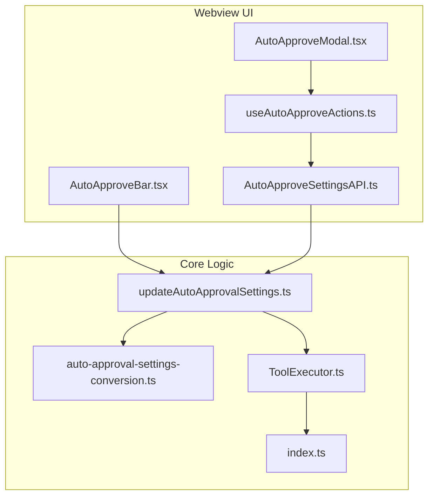
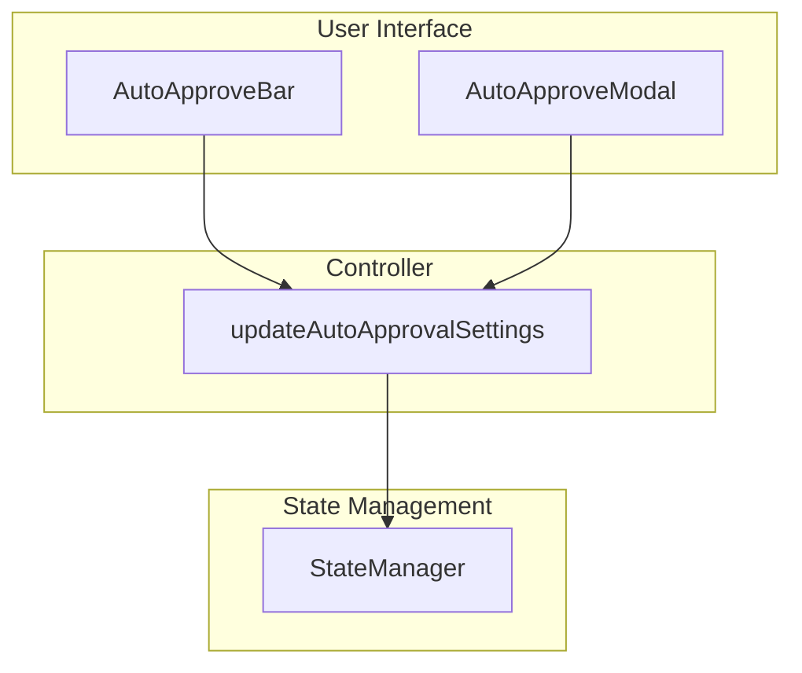
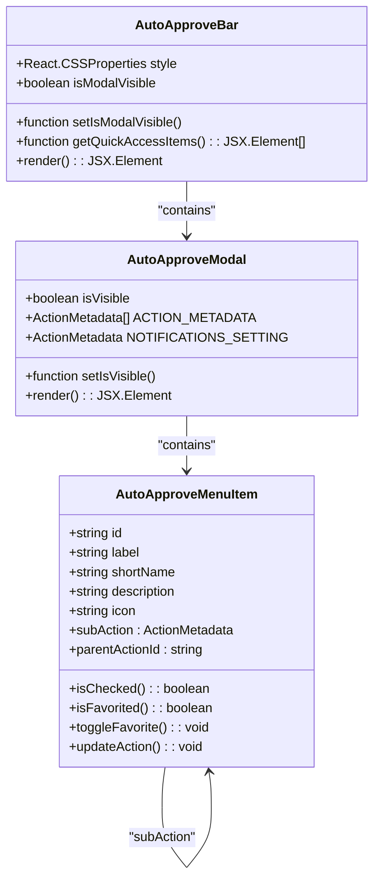
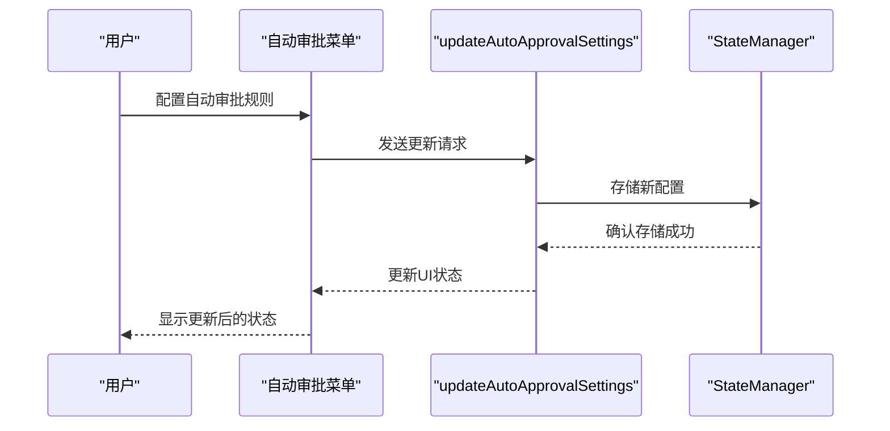
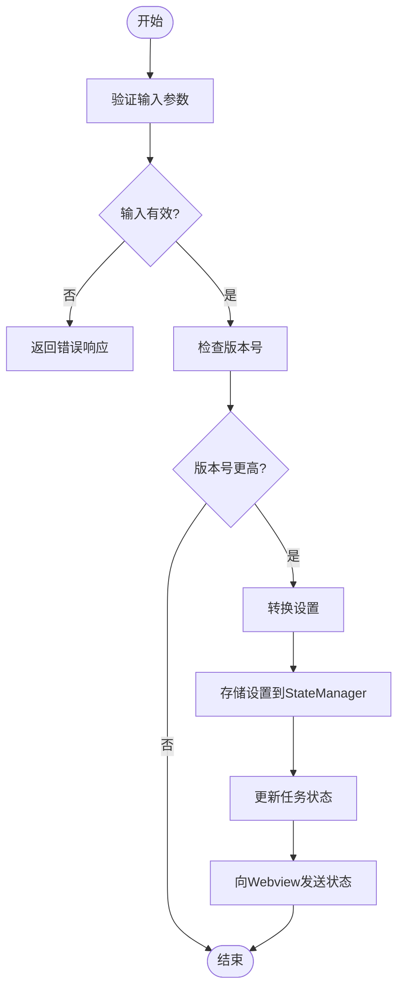
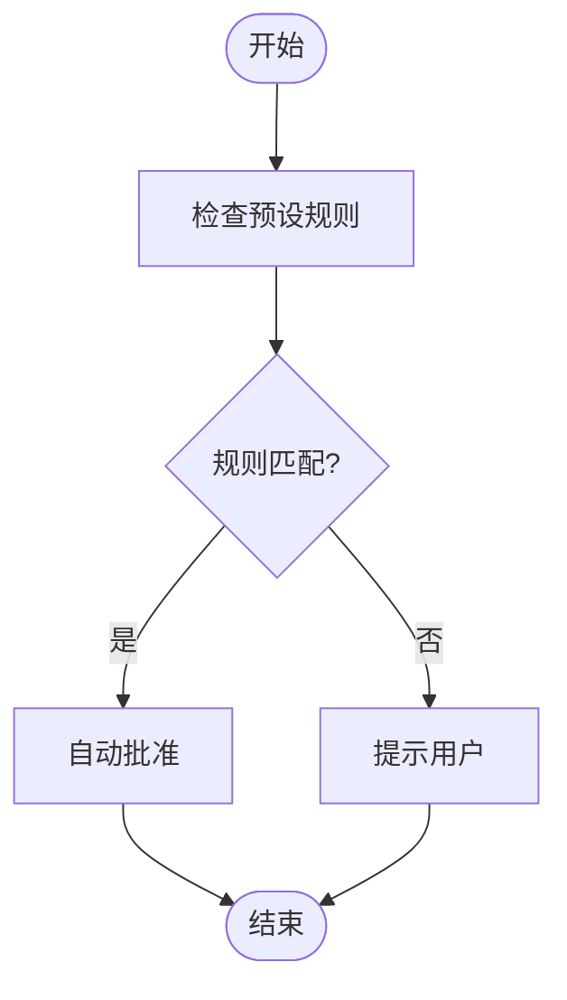
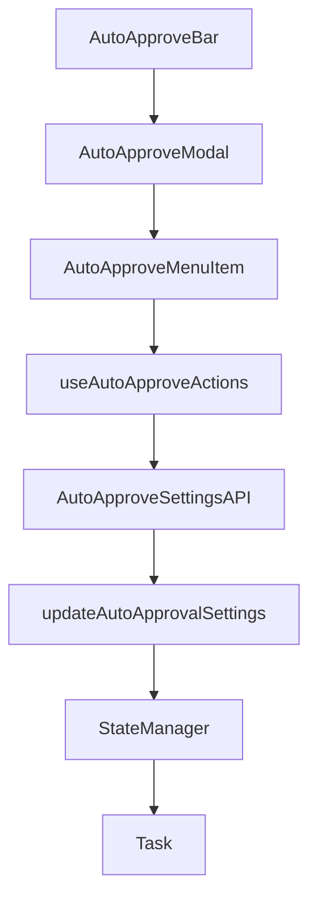

# 自动审批

<cite>
**本文档中引用的文件**   
- [AutoApproveSettingsAPI.ts](file://webview-ui/src/components/chat/auto-approve-menu/AutoApproveSettingsAPI.ts)
- [useAutoApproveActions.ts](file://webview-ui/src/hooks/useAutoApproveActions.ts)
- [AutoApproveModal.tsx](file://webview-ui/src/components/chat/auto-approve-menu/AutoApproveModal.tsx)
- [AutoApproveBar.tsx](file://webview-ui/src/components/chat/auto-approve-menu/AutoApproveBar.tsx)
- [types.ts](file://webview-ui/src/components/chat/auto-approve-menu/types.ts)
- [updateAutoApprovalSettings.ts](file://src/core/controller/state/updateAutoApprovalSettings.ts)
- [auto-approval-settings-conversion.ts](file://src/shared/proto-conversions/models/auto-approval-settings-conversion.ts)
- [ToolExecutor.ts](file://src/core/task/ToolExecutor.ts)
- [index.ts](file://src/core/task/index.ts)
</cite>

## 目录
1. [简介](#简介)
2. [项目结构](#项目结构)
3. [核心组件](#核心组件)
4. [架构概述](#架构概述)
5. [详细组件分析](#详细组件分析)
6. [依赖分析](#依赖分析)
7. [性能考虑](#性能考虑)
8. [故障排除指南](#故障排除指南)
9. [结论](#结论)
10. [附录](#附录)（如有必要）

## 简介
本文档详细介绍了Cline的自动审批功能，包括通过Webview UI中的自动审批菜单配置审批规则的方法。文档解释了`toggleAutoApprovalSettings`和`updateAutoApprovalSettings`控制器如何处理用户配置，并将其持久化到`StateManager`中。此外，还阐述了自动审批的触发机制，即当AI助手提议文件修改或执行终端命令时，系统如何根据预设规则自动批准或提示用户。最后，提供了配置示例和最佳实践，以帮助用户在效率和安全之间取得平衡。

## 项目结构
Cline项目的自动审批功能主要分布在`webview-ui`和`src`目录中。`webview-ui`目录包含用户界面组件，如自动审批菜单和设置面板，而`src`目录则包含核心逻辑和控制器。

**Diagram sources**
- [AutoApproveBar.tsx](file://webview-ui/src/components/chat/auto-approve-menu/AutoApproveBar.tsx)
- [AutoApproveModal.tsx](file://webview-ui/src/components/chat/auto-approve-menu/AutoApproveModal.tsx)
- [useAutoApproveActions.ts](file://webview-ui/src/hooks/useAutoApproveActions.ts)
- [AutoApproveSettingsAPI.ts](file://webview-ui/src/components/chat/auto-approve-menu/AutoApproveSettingsAPI.ts)
- [updateAutoApprovalSettings.ts](file://src/core/controller/state/updateAutoApprovalSettings.ts)
- [auto-approval-settings-conversion.ts](file://src/shared/proto-conversions/models/auto-approval-settings-conversion.ts)
- [ToolExecutor.ts](file://src/core/task/ToolExecutor.ts)
- [index.ts](file://src/core/task/index.ts)

**Section sources**
- [AutoApproveBar.tsx](file://webview-ui/src/components/chat/auto-approve-menu/AutoApproveBar.tsx)
- [AutoApproveModal.tsx](file://webview-ui/src/components/chat/auto-approve-menu/AutoApproveModal.tsx)
- [useAutoApproveActions.ts](file://webview-ui/src/hooks/useAutoApproveActions.ts)
- [AutoApproveSettingsAPI.ts](file://webview-ui/src/components/chat/auto-approve-menu/AutoApproveSettingsAPI.ts)
- [updateAutoApprovalSettings.ts](file://src/core/controller/state/updateAutoApprovalSettings.ts)
- [auto-approval-settings-conversion.ts](file://src/shared/proto-conversions/models/auto-approval-settings-conversion.ts)
- [ToolExecutor.ts](file://src/core/task/ToolExecutor.ts)
- [index.ts](file://src/core/task/index.ts)

## 核心组件
自动审批功能的核心组件包括Webview UI中的自动审批菜单、控制器和状态管理器。这些组件协同工作，确保用户配置能够被正确处理并持久化。

**Section sources**
- [AutoApproveBar.tsx](file://webview-ui/src/components/chat/auto-approve-menu/AutoApproveBar.tsx)
- [AutoApproveModal.tsx](file://webview-ui/src/components/chat/auto-approve-menu/AutoApproveModal.tsx)
- [useAutoApproveActions.ts](file://webview-ui/src/hooks/useAutoApproveActions.ts)
- [AutoApproveSettingsAPI.ts](file://webview-ui/src/components/chat/auto-approve-menu/AutoApproveSettingsAPI.ts)
- [updateAutoApprovalSettings.ts](file://src/core/controller/state/updateAutoApprovalSettings.ts)
- [auto-approval-settings-conversion.ts](file://src/shared/proto-conversions/models/auto-approval-settings-conversion.ts)
- [ToolExecutor.ts](file://src/core/task/ToolExecutor.ts)
- [index.ts](file://src/core/task/index.ts)

## 架构概述
自动审批功能的架构包括用户界面、控制器和状态管理器。用户通过Webview UI中的自动审批菜单配置规则，控制器处理这些配置并将其持久化到`StateManager`中，状态管理器负责存储和管理这些配置。

**Diagram sources**
- [AutoApproveBar.tsx](file://webview-ui/src/components/chat/auto-approve-menu/AutoApproveBar.tsx)
- [AutoApproveModal.tsx](file://webview-ui/src/components/chat/auto-approve-menu/AutoApproveModal.tsx)
- [updateAutoApprovalSettings.ts](file://src/core/controller/state/updateAutoApprovalSettings.ts)
- [StateManager.ts](file://src/core/storage/StateManager.ts)

## 详细组件分析

### 自动审批菜单分析
自动审批菜单允许用户配置基于文件路径、文件类型和变更类型的规则。用户可以通过勾选不同的操作来启用或禁用自动审批。

#### 对于对象导向的组件：

**Diagram sources**
- [AutoApproveMenuItem.tsx](file://webview-ui/src/components/chat/auto-approve-menu/AutoApproveMenuItem.tsx)
- [AutoApproveModal.tsx](file://webview-ui/src/components/chat/auto-approve-menu/AutoApproveModal.tsx)
- [AutoApproveBar.tsx](file://webview-ui/src/components/chat/auto-approve-menu/AutoApproveBar.tsx)

#### 对于API/服务组件：

**Diagram sources**
- [AutoApproveSettingsAPI.ts](file://webview-ui/src/components/chat/auto-approve-menu/AutoApproveSettingsAPI.ts)
- [updateAutoApprovalSettings.ts](file://src/core/controller/state/updateAutoApprovalSettings.ts)
- [StateManager.ts](file://src/core/storage/StateManager.ts)

#### 对于复杂逻辑组件：

**Diagram sources**
- [updateAutoApprovalSettings.ts](file://src/core/controller/state/updateAutoApprovalSettings.ts)
- [auto-approval-settings-conversion.ts](file://src/shared/proto-conversions/models/auto-approval-settings-conversion.ts)
- [StateManager.ts](file://src/core/storage/StateManager.ts)
- [index.ts](file://src/core/task/index.ts)

**Section sources**
- [AutoApproveSettingsAPI.ts](file://webview-ui/src/components/chat/auto-approve-menu/AutoApproveSettingsAPI.ts)
- [updateAutoApprovalSettings.ts](file://src/core/controller/state/updateAutoApprovalSettings.ts)
- [auto-approval-settings-conversion.ts](file://src/shared/proto-conversions/models/auto-approval-settings-conversion.ts)
- [StateManager.ts](file://src/core/storage/StateManager.ts)
- [index.ts](file://src/core/task/index.ts)

### 概念概述
自动审批功能允许用户通过Webview UI中的菜单配置规则，这些规则基于文件路径、文件类型和变更类型。当AI助手提议文件修改或执行终端命令时，系统会根据预设规则自动批准或提示用户。

[无来源，因为此图表显示的是概念性工作流，而非实际代码结构]

[无来源，因为此部分不分析特定文件]

## 依赖分析
自动审批功能依赖于多个组件，包括Webview UI、控制器和状态管理器。这些组件之间的依赖关系确保了用户配置能够被正确处理并持久化。

**Diagram sources**
- [AutoApproveBar.tsx](file://webview-ui/src/components/chat/auto-approve-menu/AutoApproveBar.tsx)
- [AutoApproveModal.tsx](file://webview-ui/src/components/chat/auto-approve-menu/AutoApproveModal.tsx)
- [AutoApproveMenuItem.tsx](file://webview-ui/src/components/chat/auto-approve-menu/AutoApproveMenuItem.tsx)
- [useAutoApproveActions.ts](file://webview-ui/src/hooks/useAutoApproveActions.ts)
- [AutoApproveSettingsAPI.ts](file://webview-ui/src/components/chat/auto-approve-menu/AutoApproveSettingsAPI.ts)
- [updateAutoApprovalSettings.ts](file://src/core/controller/state/updateAutoApprovalSettings.ts)
- [StateManager.ts](file://src/core/storage/StateManager.ts)
- [index.ts](file://src/core/task/index.ts)

**Section sources**
- [AutoApproveBar.tsx](file://webview-ui/src/components/chat/auto-approve-menu/AutoApproveBar.tsx)
- [AutoApproveModal.tsx](file://webview-ui/src/components/chat/auto-approve-menu/AutoApproveModal.tsx)
- [AutoApproveMenuItem.tsx](file://webview-ui/src/components/chat/auto-approve-menu/AutoApproveMenuItem.tsx)
- [useAutoApproveActions.ts](file://webview-ui/src/hooks/useAutoApproveActions.ts)
- [AutoApproveSettingsAPI.ts](file://webview-ui/src/components/chat/auto-approve-menu/AutoApproveSettingsAPI.ts)
- [updateAutoApprovalSettings.ts](file://src/core/controller/state/updateAutoApprovalSettings.ts)
- [StateManager.ts](file://src/core/storage/StateManager.ts)
- [index.ts](file://src/core/task/index.ts)

## 性能考虑
自动审批功能的性能主要取决于配置的复杂性和规则的数量。为了提高性能，建议用户尽量简化规则，并避免过多的嵌套条件。

[无来源，因为此部分提供一般性指导]

## 故障排除指南
如果自动审批功能无法正常工作，请检查以下几点：
- 确保Webview UI中的配置已正确保存。
- 检查`StateManager`中是否正确存储了配置。
- 确认控制器是否正确处理了更新请求。

**Section sources**
- [AutoApproveSettingsAPI.ts](file://webview-ui/src/components/chat/auto-approve-menu/AutoApproveSettingsAPI.ts)
- [updateAutoApprovalSettings.ts](file://src/core/controller/state/updateAutoApprovalSettings.ts)
- [StateManager.ts](file://src/core/storage/StateManager.ts)

## 结论
本文档详细介绍了Cline的自动审批功能，包括配置方法、控制器处理逻辑和触发机制。通过合理配置规则，用户可以在效率和安全之间取得平衡，提高开发效率。

[无来源，因为此部分总结而不分析特定文件]